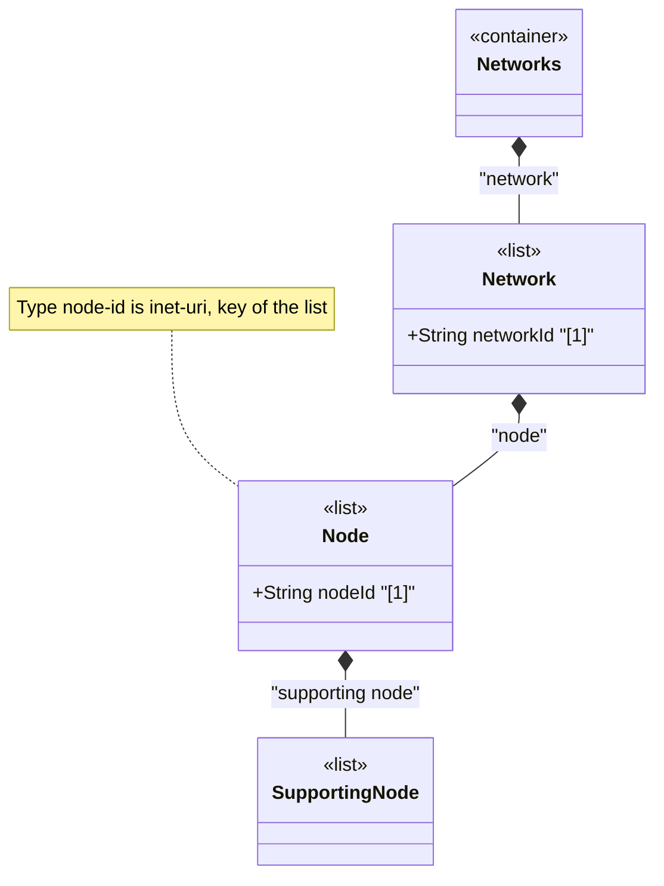

# Feature: Define Node List

## Parent Epic
- [ ] #124 - [ietf-network: Base Network Data Model](https://github.com/gintatkinson/3dgs-033/blob/main/docs/epics/epic-08-ietf-network.md) (inventory of nodes within a network, clause 4.1)

## Description
Defines the `node` list, keyed by `node-id`, representing the inventory of abstract nodes contained within a network. Each node is identified relative to its containing network through a unique `node-id` of type `node-id` (which is `inet:uri`). A node does not exist independently of its network — it is an abstraction of a device or entity for the particular network of which it is a part. The same physical device participating in multiple networks or at multiple layers of a networking stack is represented by multiple distinct node instances, one per network.

Nodes may be augmented with termination points via the `ietf-network-topology` module and may carry underlay relationships through the `supporting-node` list. The node represents a graph vertex within the topology model when topology augmentation is applied.

## UML Class Diagram


## Interface Requirements

### 1. Payload Schema
```json
{
  "network": {
    "network-id": "urn:example:network:core-l3",
    "node": [
      {
        "node-id": "urn:example:node:router-chicago-01",
        "supporting-node": []
      }
    ]
  }
}
```

### 2. Validation & Constraints
- `node-id`: type `node-id` (derived from `inet:uri`), mandatory as list key, MUST be unique within the containing network
- `node-id` SHOULD be chosen such that the same node in a real network topology will always be identified through the same identifier across datastore instantiations
- The list is config true, supporting both configured overlay nodes and system-discovered nodes
- A node may have zero or more `supporting-node` entries — a node with no supporting nodes is a standalone node at its network layer
- Node identity is scoped to the containing network — the same device participating in multiple networks is represented by separate nodes with possibly different node-ids

### 3. Logical Operations & Interface Messages
- **Add node**: `POST /networks/network/{network-id}/node` — create a new node within a network
- **Read node**: `GET /networks/network/{network-id}/node/{node-id}` — retrieve a specific node
- **Update node**: `PATCH /networks/network/{network-id}/node/{node-id}` — modify node attributes (including augmented data)
- **Delete node**: `DELETE /networks/network/{network-id}/node/{node-id}` — remove a node and its associated termination points and supporting-node entries

### 4. Logical Exception States & Validation Failures
- **Duplicate node-id within same network**: Creation with an existing node-id within the same network MUST be rejected with a data-exists error
- **Same node-id across different networks**: Permitted — node identity is scoped to the containing network
- **Dangling supporting-node reference**: If a supporting-node refers to a non-existent underlay node, the entry is excluded from operational state

## Given-When-Then Acceptance Criteria
- **Given** a network exists, **When** a client creates a node with a unique node-id, **Then** the node entry appears in the network's node list
- **Given** a node exists within a network, **When** the containing network is deleted, **Then** the node and all its dependent data are removed
- **Given** a node exists, **When** an augmentation module adds termination points to this node, **Then** the node supports link termination through the augmented termination points
- **Given** the same physical device participates in two networks, **When** each network instantiates a node for that device, **Then** the two node instances are independently identified and managed within their respective networks

## Specification Context (Verbatim)
From the IETF Network Topologies YANG Data Model specification, Section 4.1 (Base Network Model):

"Furthermore, a network contains an inventory of nodes that are part of the network. The nodes of a network are captured in their own list. Each node is identified relative to its containing network by a node-id."

"It should be noted that a node does not exist independently of a network; instead, it is a part of the network that contains it. In cases where the same device or entity takes part in multiple networks, or at multiple layers of a networking stack, the same device or entity will be represented by multiple nodes, one for each network. In other words, the node represents an abstraction of the device for the particular network of which it is a part."

"Similar to a network, a node can be supported by other nodes and map onto one or more other nodes in an underlay network. This is captured in the list 'supporting-node'."

## Source References
Structural Schema: [ietf-network@2018-02-26.yang](https://github.com/YangModels/yang/blob/main/standard/ietf/RFC/ietf-network%402018-02-26.yang) (Clause: 6.1, lines 155-189)
Normative Specification: [the IETF Network Topologies YANG Data Model specification](https://datatracker.ietf.org/doc/rfc8345/) (Clause: 4.1, 4.4.9)

## Logical UI & Layout Bindings
- **Target LUI Component:** TableView
- **Target Layout Container ID:** elements_view
- **Data Source Bindings:** `/nw:networks/nw:network/nw:node`
