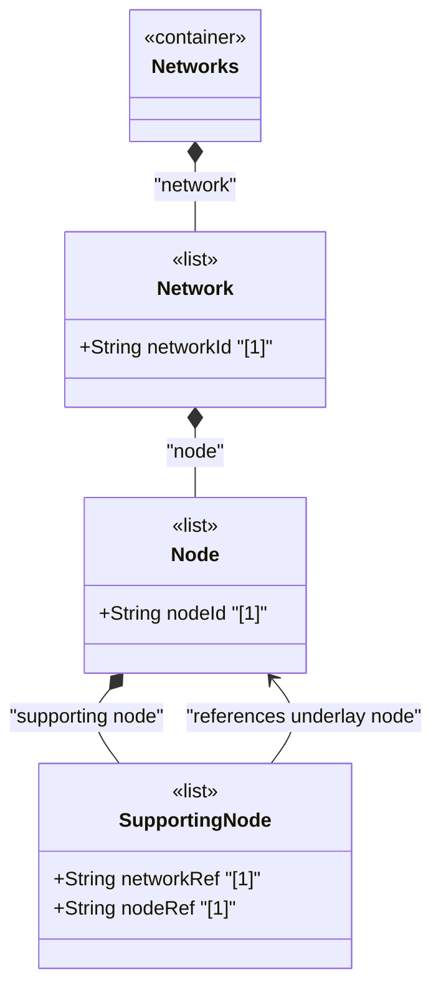

# Feature: Define Supporting Node List

## Parent Epic
- [ ] #124 - [ietf-network: Base Network Data Model](https://github.com/gintatkinson/3dgs-033/blob/main/docs/epics/epic-08-ietf-network.md) (underlay node mapping hierarchy, clause 4.1)

## Description
Defines the `supporting-node` list, keyed by the composite key `network-ref` and `node-ref`, which captures hierarchical mapping relationships between nodes across network layers. Each entry identifies an underlay node that supports (or hosts) the containing node. This enables representation of device stacks where, for example, a virtual router node is supported by a physical device node, or a "router" node is supported by separate nodes for its route processor and line cards.

The `network-ref` leaf references the underlay network through `../../../nw:supporting-network/nw:network-ref`, establishing the network context for the supporting node. The `node-ref` leaf references the specific underlay node via `/nw:networks/nw:network/nw:node/nw:node-id`. Both leafrefs use `require-instance false` to accommodate churn in underlay networks.

## UML Class Diagram


## Interface Requirements

### 1. Payload Schema
```json
{
  "network": {
    "network-id": "urn:example:network:vpn-overlay",
    "node": [
      {
        "node-id": "urn:example:node:virtual-router-01",
        "supporting-node": [
          {
            "network-ref": "urn:example:network:physical-device-net",
            "node-ref": "urn:example:node:baremetal-server-07"
          }
        ]
      }
    ]
  }
}
```

### 2. Validation & Constraints
- Composite key: `network-ref` + `node-ref`, both mandatory and jointly unique within the list
- `network-ref`: type `leafref` with path `../../../nw:supporting-network/nw:network-ref`, `require-instance false`
- `node-ref`: type `leafref` with path `/nw:networks/nw:network/nw:node/nw:node-id`, `require-instance false`
- The list is config true, supporting explicit configuration of node-level layering
- Multiple supporting-node entries are permitted — a node may map onto multiple underlay nodes (e.g., a virtual router spanning multiple physical servers)
- The `network-ref` leafref is relative to the containing network's own `supporting-network` list, ensuring the underlay node belongs to a network already declared as an underlay

### 3. Logical Operations & Interface Messages
- **Add supporting node**: `POST /networks/network/{network-id}/node/{node-id}/supporting-node` — declare a new underlay node dependency
- **Read supporting nodes**: `GET /networks/network/{network-id}/node/{node-id}/supporting-node` — retrieve all underlay node mappings
- **Remove supporting node**: `DELETE /networks/network/{network-id}/node/{node-id}/supporting-node/{network-ref}/{node-ref}` — remove a node-level layering dependency

### 4. Logical Exception States & Validation Failures
- **Duplicate composite key**: Creating a supporting-node entry with an existing network-ref + node-ref pair MUST be rejected
- **Dangling reference**: If either the supporting network or the supporting node is deleted from the underlay, the entry is removed from operational state
- **Inconsistent underlay**: If the network-ref does not match a supporting-network already declared at the network level, the reference chain is broken

## Given-When-Then Acceptance Criteria
- **Given** a network with a declared supporting-network and a node within that network, **When** a client adds a supporting-node entry referencing a node in the underlay network, **Then** the node-level layering relationship is established
- **Given** a node with a supporting-node reference, **When** the referenced underlay node is deleted, **Then** the supporting-node entry is removed from the operational state datastore
- **Given** a node with multiple supporting-node entries, **When** a client queries the node, **Then** all underlay node mappings are returned, representing the device stack hierarchy
- **Given** a node with no supporting-node entries, **When** queried, **Then** the node is identified as a standalone node at its network layer with no device-stack decomposition

## Specification Context (Verbatim)
From the IETF Network Topologies YANG Data Model specification, Section 4.1 (Base Network Model):

"Similar to a network, a node can be supported by other nodes and map onto one or more other nodes in an underlay network. This is captured in the list 'supporting-node'. The resulting hierarchy of nodes also allows for the representation of device stacks, where a node at one level is supported by a set of nodes at an underlying level. For example: a 'router' node might be supported by a node representing a route processor and separate nodes for various line cards and service modules, a virtual router might be supported or hosted on a physical device represented by a separate node, and so on."

From the IETF Network Topologies YANG Data Model specification, Section 4.4.3 (Dealing with Changes in Underlay Networks):

"A dangling leafref of a configured object leaves the corresponding instance in a state in which it lacks referential integrity, effectively rendering it nonoperational. Any corresponding object instance is therefore removed from the operational state datastore until the situation has been resolved."

## Source References
Structural Schema: [ietf-network@2018-02-26.yang](https://github.com/YangModels/yang/blob/main/standard/ietf/RFC/ietf-network%402018-02-26.yang) (Clause: 6.1, lines 165-188)
Normative Specification: [the IETF Network Topologies YANG Data Model specification](https://datatracker.ietf.org/doc/rfc8345/) (Clause: 4.1, 4.4.3)

## Logical UI & Layout Bindings
- **Target LUI Component:** TableView
- **Target Layout Container ID:** elements_view
- **Data Source Bindings:** `/nw:networks/nw:network/nw:node/nw:supporting-node`
