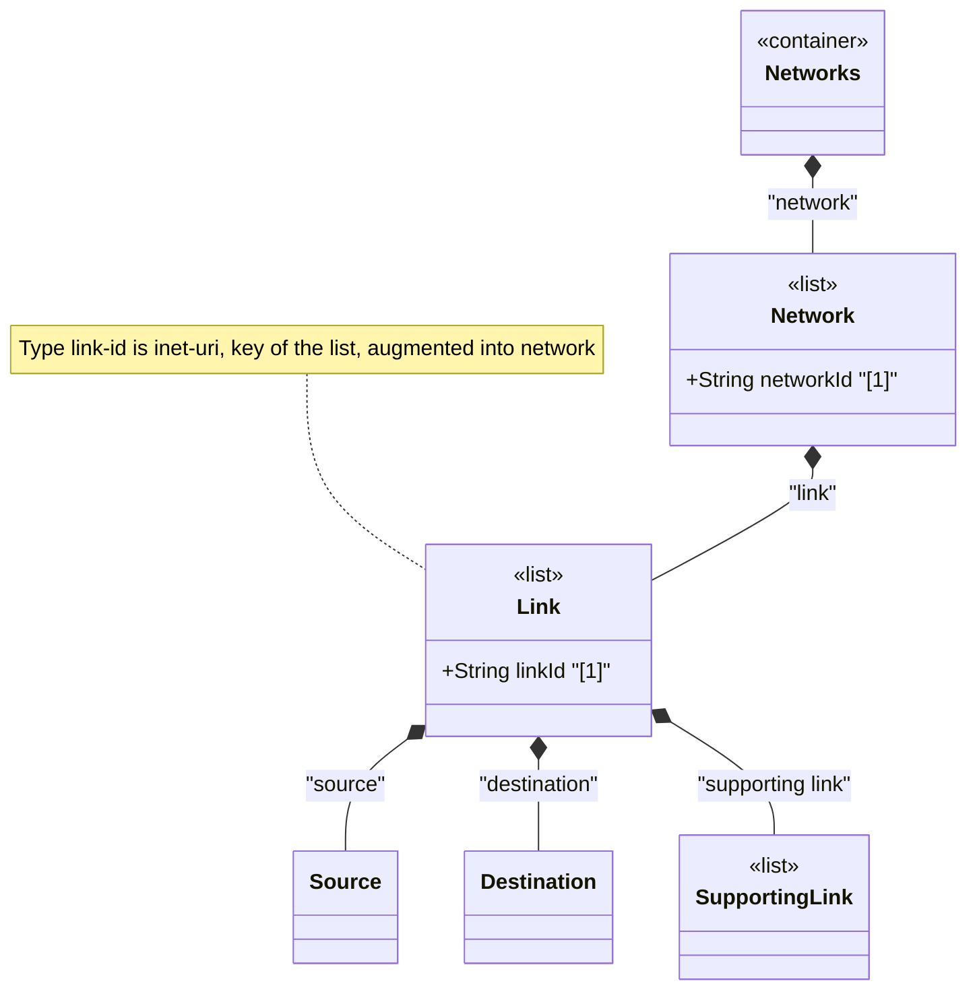

# Feature: Define Link List

## Parent Epic
- [ ] #125 - [ietf-network-topology: Base Network Topology Augmentation](https://github.com/gintatkinson/3dgs-033/blob/main/docs/epics/epic-09-ietf-network-topology.md) (augmented topology link list keyed by link-id, clause 4.2)

## Description
Defines the `link` list augmented into `/nw:networks/nw:network` from the `ietf-network-topology` module. Each link is identified by a unique `link-id` of type `link-id` (which is `inet:uri`) and represents a point-to-point, unidirectional connection between a source node and a destination node within the same network. Links function as graph edges in the topology model, connecting graph vertices (nodes) via termination points that serve as the anchoring points for link endpoints.

Links support hierarchical layering through the `supporting-link` list, enabling representation of overlay links (e.g., a VPN tunnel) that map onto one or more links in an underlay topology (e.g., a chain of IP links constituting the physical path). Links are keyed within the topology scope — the link-id is unique relative to the containing network.

## UML Class Diagram


## Interface Requirements

### 1. Payload Schema
```json
{
  "network": {
    "network-id": "urn:example:network:l3-topo",
    "link": [
      {
        "link-id": "urn:example:link:chi-nyc-01",
        "source": {
          "source-node": "urn:example:node:router-chicago-01",
          "source-tp": "urn:example:tp:eth0-1"
        },
        "destination": {
          "dest-node": "urn:example:node:router-nyc-01",
          "dest-tp": "urn:example:tp:eth0-2"
        },
        "supporting-link": []
      }
    ]
  }
}
```

### 2. Validation & Constraints
- `link-id`: type `link-id` (derived from `inet:uri`), mandatory as list key, MUST be unique within the containing network
- `link-id` SHOULD be chosen such that the same link in a real network topology will always be identified through the same identifier across datastore instantiations
- The list is config true, augmented into the `network` list via YANG augment
- Links are point-to-point and unidirectional — bidirectional connections require a pair of unidirectional links
- Each link MUST reference a source node and destination node within the same network (no cross-network links at this level)
- Multipoint connections are not directly supported — they should be represented through pseudonodes and hierarchical node mapping

### 3. Logical Operations & Interface Messages
- **Add link**: `POST /networks/network/{network-id}/link` — create a new link within a network topology
- **Read link**: `GET /networks/network/{network-id}/link/{link-id}` — retrieve a specific link and its endpoints
- **Update link**: `PATCH /networks/network/{network-id}/link/{link-id}` — modify link properties including source and destination
- **Delete link**: `DELETE /networks/network/{network-id}/link/{link-id}` — remove a link and its supporting-link entries

### 4. Logical Exception States & Validation Failures
- **Duplicate link-id**: Creating a link with an existing link-id within the same network MUST be rejected
- **Missing source or destination**: A link without both source and destination containers is structurally incomplete
- **Cross-network node reference**: Source or destination nodes that reference nodes in a different network create an unresolvable leafref
- **Re-homing**: Links can be re-homed between termination points by updating source-tp or dest-tp references

## Given-When-Then Acceptance Criteria
- **Given** a network with at least two nodes, **When** a client creates a link connecting a source node's termination point to a destination node's termination point, **Then** the link is established and appears in the network's link list
- **Given** a link exists between two nodes, **When** a client updates the source termination point to a different termination point on the same source node, **Then** the link is re-homed and the new endpoint binding is reflected
- **Given** a link exists, **When** the destination node is deleted from the network, **Then** the link entry is removed from operational state due to a dangling destination reference
- **Given** a bidirectional connection between two nodes, **When** modeled as a pair of unidirectional links, **Then** each direction is independently identifiable and manageable

## Specification Context (Verbatim)
From the IETF Network Topologies YANG Data Model specification, Section 4.2 (Base Network Topology Data Model):

"It builds on the network data model defined in the 'ietf-network' module, augmenting it with links (defining how nodes are connected) and termination points (which anchor the links and are contained in nodes)."

From the IETF Network Topologies YANG Data Model specification, Section 4.4.5 (Cardinality and Directionality of Links):

"The topology data model includes links that are point-to-point and unidirectional. It does not directly support multipoint and bidirectional links. Although this may appear as a limitation, the decision to do so keeps the data model simple and generic, and it allows it to be very easily subjected to applications that make use of graph algorithms. Bidirectional connections can be represented through pairs of unidirectional links."

From the IETF Network Topologies YANG Data Model specification, Section 4.2:

"A link is identified by a link-id that uniquely identifies the link within a given topology. Links are point-to-point and unidirectional. Accordingly, a link contains a source and a destination. Both source and destination reference a corresponding node, as well as a termination point on that node."

## Source References
Structural Schema: [ietf-network-topology@2018-02-26.yang](https://github.com/YangModels/yang/blob/main/standard/ietf/RFC/ietf-network-topology%402018-02-26.yang) (Clause: 6.2, lines 136-233)
Normative Specification: [the IETF Network Topologies YANG Data Model specification](https://datatracker.ietf.org/doc/rfc8345/) (Clause: 4.2, 4.4.5)

## Logical UI & Layout Bindings
- **Target LUI Component:** TopologyMap
- **Target Layout Container ID:** topology_pane
- **Data Source Bindings:** `/nw:networks/nw:network/nt:link`
