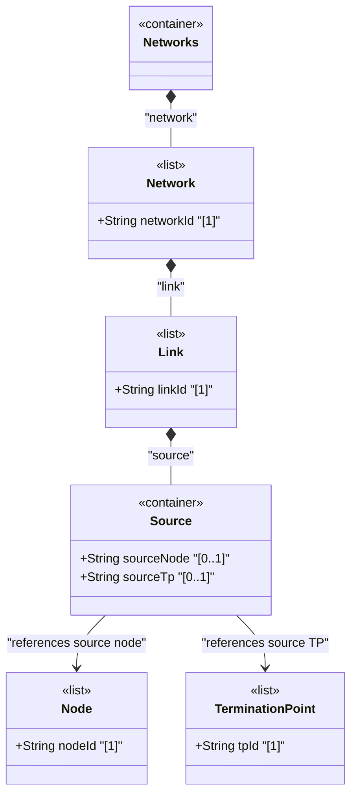

# Feature: Define Link Source Container

## Parent Epic
- [ ] #125 - [ietf-network-topology: Base Network Topology Augmentation](https://github.com/gintatkinson/3dgs-033/blob/main/docs/epics/epic-09-ietf-network-topology.md) (source endpoint of a point-to-point link, clause 4.2)

## Description
Defines the `source` container within each `link`, representing the logical source endpoint of a unidirectional link. The container holds two leafref attributes: `source-node` identifies the source node within the same network, and `source-tp` identifies the specific termination point on that source node from which the link originates. Together, these two references pinpoint the exact origin of the link within the topology graph.

Both leafrefs use `require-instance false` to tolerate churn in the underlying network topology. The `source-tp` reference path includes a relative constraint ensuring the termination point resides on the specified `source-node`.

## UML Class Diagram


## Interface Requirements

### 1. Payload Schema
```json
{
  "link": {
    "link-id": "urn:example:link:chi-nyc-01",
    "source": {
      "source-node": "urn:example:node:router-chicago-01",
      "source-tp": "urn:example:tp:eth0-ge-0-0-1"
    }
  }
}
```

### 2. Validation & Constraints
- `source-node`: type `leafref` with path `../../../nw:node/nw:node-id`, `require-instance false`, optional leaf, MUST reference a node within the same network
- `source-tp`: type `leafref` with path `../../../nw:node[nw:node-id=current()/../source-node]/termination-point/tp-id`, `require-instance false`, optional leaf, MUST reference a termination point on the specified source-node
- Both leaves are optional (`?`) — a link may be configured with partial endpoint information that is resolved when the referenced objects become available
- The `source-tp` path expression constrains the termination point to reside on the node identified by `source-node`

### 3. Logical Operations & Interface Messages
- **Set source**: `PATCH /networks/network/{network-id}/link/{link-id}/source` — configure or update the link's source endpoint
- **Read source**: `GET /networks/network/{network-id}/link/{link-id}/source` — retrieve the source endpoint configuration
- **Clear source**: Removing source-node and source-tp values disassociates the link from its source endpoint

### 4. Logical Exception States & Validation Failures
- **Dangling source-node**: If the referenced source node does not exist in the operational state datastore, the link is excluded from operational state
- **Invalid source-tp chain**: If source-tp references a termination point that does not belong to the specified source-node, the reference cannot resolve
- **Missing source-tp with valid source-node**: The link has a source node but no specific termination point — valid per schema but semantically ambiguous

## Given-When-Then Acceptance Criteria
- **Given** a link exists, **When** a client sets source-node to a valid node and source-tp to a termination point on that node, **Then** the link's source endpoint is fully resolved
- **Given** a link with a configured source-node, **When** the source node is deleted from the network, **Then** the link is removed from the operational state datastore due to a dangling reference
- **Given** a link with source-node set, **When** a client sets source-tp to a termination point that belongs to a different node, **Then** the reference cannot resolve and the link is nonoperational
- **Given** a link with no source configured, **When** source-node and source-tp are subsequently populated, **Then** the link becomes operational once referential integrity is satisfied

## Specification Context (Verbatim)
From the IETF Network Topologies YANG Data Model specification, Section 4.2 (Base Network Topology Data Model):

"Both source and destination reference a corresponding node, as well as a termination point on that node."

From the ietf-network-topology YANG module, line 158-159:

"This container holds the logical source of a particular link."

From the source-node description (line 167): "Source node identifier. Must be in the same topology." From the source-tp description (line 178): "This termination point is located within the source node and terminates the link."

## Source References
Structural Schema: [ietf-network-topology@2018-02-26.yang](https://github.com/YangModels/yang/blob/main/standard/ietf/RFC/ietf-network-topology%402018-02-26.yang) (Clause: 6.2, lines 157-179)
Normative Specification: [the IETF Network Topologies YANG Data Model specification](https://datatracker.ietf.org/doc/rfc8345/) (Clause: 4.2)

## Logical UI & Layout Bindings
- **Target LUI Component:** PropertyGrid
- **Target Layout Container ID:** properties_view
- **Data Source Bindings:** `/nw:networks/nw:network/nt:link/nt:source`
