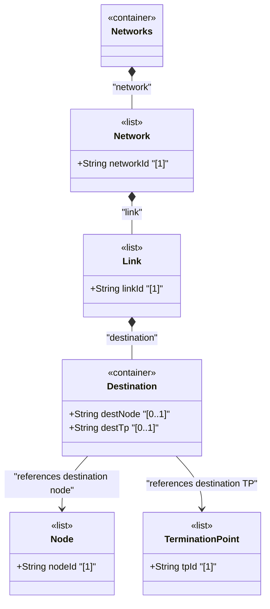

# Feature: Define Link Destination Container

## Parent Epic
- [ ] #125 - [ietf-network-topology: Base Network Topology Augmentation](https://github.com/gintatkinson/3dgs-033/blob/main/docs/epics/epic-09-ietf-network-topology.md) (destination endpoint of a point-to-point link, clause 4.2)

## Description
Defines the `destination` container within each `link`, representing the logical destination endpoint of a unidirectional link. The container holds two leafref attributes: `dest-node` identifies the destination node within the same network, and `dest-tp` identifies the specific termination point on that destination node where the link terminates. Together with the `source` container, these form the complete endpoint specification for a point-to-point unidirectional link.

Both leafrefs use `require-instance false` to tolerate churn in the underlying network topology. The `dest-tp` reference path includes a relative constraint ensuring the termination point resides on the specified `dest-node`.

## UML Class Diagram


## Interface Requirements

### 1. Payload Schema
```json
{
  "link": {
    "link-id": "urn:example:link:chi-nyc-01",
    "destination": {
      "dest-node": "urn:example:node:router-nyc-01",
      "dest-tp": "urn:example:tp:eth0-ge-0-0-2"
    }
  }
}
```

### 2. Validation & Constraints
- `dest-node`: type `leafref` with path `../../../nw:node/nw:node-id`, `require-instance false`, optional leaf, MUST reference a node within the same network
- `dest-tp`: type `leafref` with path `../../../nw:node[nw:node-id=current()/../dest-node]/termination-point/tp-id`, `require-instance false`, optional leaf, MUST reference a termination point on the specified dest-node
- Both leaves are optional (`?`) — a link may be configured with partial destination information
- The `dest-tp` path expression constrains the termination point to reside on the node identified by `dest-node`

### 3. Logical Operations & Interface Messages
- **Set destination**: `PATCH /networks/network/{network-id}/link/{link-id}/destination` — configure or update the link's destination endpoint
- **Read destination**: `GET /networks/network/{network-id}/link/{link-id}/destination` — retrieve the destination endpoint configuration
- **Re-home destination**: Updating dest-node or dest-tp changes the topological destination of the link

### 4. Logical Exception States & Validation Failures
- **Dangling dest-node**: If the referenced destination node does not exist in operational state, the link is excluded from operational state
- **Self-loop**: Configuring source-node equal to dest-node with source-tp equal to dest-tp creates a self-looping link — logically permitted but topologically degenerate
- **Identical source and destination**: A link where both source and destination reference the same node and termination point represents a self-loop

## Given-When-Then Acceptance Criteria
- **Given** a link exists, **When** a client sets both source and destination endpoints referencing valid nodes and termination points within the same network, **Then** the link is fully operational
- **Given** a link with configured destination, **When** the destination node is deleted, **Then** the link is removed from operational state due to dangling reference
- **Given** a link connecting two distinct nodes, **When** the destination is re-homed to a different node's termination point, **Then** the topology reflects the new connectivity
- **Given** a link with no destination configured, **When** destination is subsequently populated, **Then** the link becomes operational once referential integrity is satisfied

## Specification Context (Verbatim)
From the IETF Network Topologies YANG Data Model specification, Section 4.2 (Base Network Topology Data Model):

"Both source and destination reference a corresponding node, as well as a termination point on that node."

From the ietf-network-topology YANG module, line 181-183:

"This container holds the logical destination of a particular link." From the dest-node description (line 191): "Destination node identifier. Must be in the same network." From the dest-tp description (line 203): "This termination point is located within the destination node and terminates the link."

## Source References
Structural Schema: [ietf-network-topology@2018-02-26.yang](https://github.com/YangModels/yang/blob/main/standard/ietf/RFC/ietf-network-topology%402018-02-26.yang) (Clause: 6.2, lines 181-204)
Normative Specification: [the IETF Network Topologies YANG Data Model specification](https://datatracker.ietf.org/doc/rfc8345/) (Clause: 4.2)

## Logical UI & Layout Bindings
- **Target LUI Component:** PropertyGrid
- **Target Layout Container ID:** properties_view
- **Data Source Bindings:** `/nw:networks/nw:network/nt:link/nt:destination`
