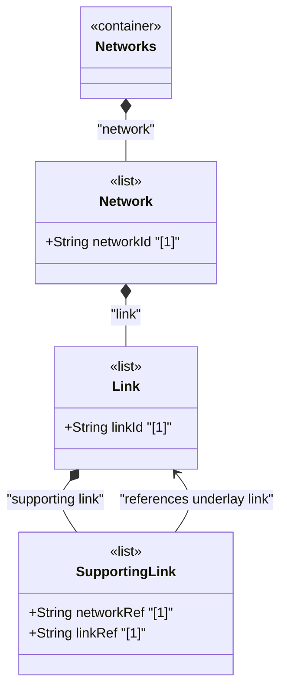

# Feature: Define Supporting Link List

## Parent Epic
- [ ] #125 - [ietf-network-topology: Base Network Topology Augmentation](https://github.com/gintatkinson/3dgs-033/blob/main/docs/epics/epic-09-ietf-network-topology.md) (underlay link dependencies for overlay links, clause 4.2)

## Description
Defines the `supporting-link` list within each `link`, keyed by the composite key `network-ref` and `link-ref`, which captures the dependency of a link on one or more links in an underlay topology. This enables representation of overlay links (e.g., a VPN tunnel link) that are carried over a chain of underlying links in the underlay topology. It is possible for a link at one level to map to multiple links at another level.

The `network-ref` leaf identifies the underlay network through a relative leafref to `../../../nw:supporting-network/nw:network-ref`, connecting the supporting link to the network-level underlay declaration. The `link-ref` leaf references the specific underlay link via an absolute path expression. Reference loops where a link identifies itself as its own underlay (directly or transitively) are not allowed but are not enforced by the YANG schema at this level.

## UML Class Diagram


## Interface Requirements

### 1. Payload Schema
```json
{
  "link": {
    "link-id": "urn:example:link:vpn-tunnel-nyc-sfo",
    "supporting-link": [
      {
        "network-ref": "urn:example:network:l3-underlay",
        "link-ref": "urn:example:link:nyc-chi"
      },
      {
        "network-ref": "urn:example:network:l3-underlay",
        "link-ref": "urn:example:link:chi-sfo"
      }
    ]
  }
}
```

### 2. Validation & Constraints
- Composite key: `network-ref` + `link-ref`, both mandatory and jointly unique within the list
- `network-ref`: type `leafref` with path `../../../nw:supporting-network/nw:network-ref`, `require-instance false` — identifies the underlay network context
- `link-ref`: type `leafref` with path `/nw:networks/nw:network[nw:network-id=current()/../network-ref]/link/link-id`, `require-instance false` — identifies the specific underlay link
- Multiple supporting-link entries are permitted — an overlay link may map onto a chain of underlay links
- Reference loops (a link identifying itself as its own underlay, directly or transitively) are prohibited by the schema description but not by YANG constraint enforcement
- The list is config true, supporting explicit configuration of link-level layering

### 3. Logical Operations & Interface Messages
- **Add supporting link**: `POST /networks/network/{network-id}/link/{link-id}/supporting-link` — declare a new underlay link dependency
- **Read supporting links**: `GET /networks/network/{network-id}/link/{link-id}/supporting-link` — retrieve all underlay link mappings
- **Remove supporting link**: `DELETE /networks/network/{network-id}/link/{link-id}/supporting-link/{network-ref}/{link-ref}` — remove a link-level layering dependency

### 4. Logical Exception States & Validation Failures
- **Duplicate composite key**: Creating a supporting-link entry with an existing network-ref + link-ref pair MUST be rejected
- **Dangling reference**: If either the underlay network or the underlay link is deleted, the entry is excluded from operational state
- **Self-reference loop**: A link identifying itself as its own supporting link creates a logical inconsistency

## Given-When-Then Acceptance Criteria
- **Given** a link exists and an underlay link chain exists in a supporting network, **When** a client adds the underlay link references to the overlay link's `supporting-link` list, **Then** the layering relationship is established
- **Given** a link with supporting-link entries, **When** one of the underlay links is deleted, **Then** that supporting-link entry is removed from operational state
- **Given** an overlay link mapping onto a chain of three underlay links, **When** a client queries the supporting-link list, **Then** all three underlay link references are returned in the configured order
- **Given** a link with no supporting-link entries, **When** queried, **Then** the link has no underlay link dependencies

## Specification Context (Verbatim)
From the IETF Network Topologies YANG Data Model specification, Section 4.2 (Base Network Topology Data Model):

"Similar to a node, a link can map onto one or more links (which are terminated by the corresponding underlay termination points) in an underlay topology. This is captured in the list 'supporting-link'."

From the IETF Network Topologies YANG Data Model specification, Section 4.4.2 (Underlay Hierarchies and Mappings):

"It is possible for links at one level of a hierarchy to map to multiple links at another level of the hierarchy. For example, a VPN topology might model VPN tunnels as links. Where a VPN tunnel maps to a path that is composed of a chain of several links, the link will contain a list of those supporting links. Likewise, it is possible for a link at one level of a hierarchy to aggregate a bundle of links at another level of the hierarchy."

From the link-ref description (line 229): "Reference loops in which a link identifies itself as its underlay, either directly or transitively, are not allowed."

## Source References
Structural Schema: [ietf-network-topology@2018-02-26.yang](https://github.com/YangModels/yang/blob/main/standard/ietf/RFC/ietf-network-topology%402018-02-26.yang) (Clause: 6.2, lines 205-231)
Normative Specification: [the IETF Network Topologies YANG Data Model specification](https://datatracker.ietf.org/doc/rfc8345/) (Clause: 4.2, 4.4.2)

## Logical UI & Layout Bindings
- **Target LUI Component:** TableView
- **Target Layout Container ID:** elements_view
- **Data Source Bindings:** `/nw:networks/nw:network/nt:link/nt:supporting-link`
