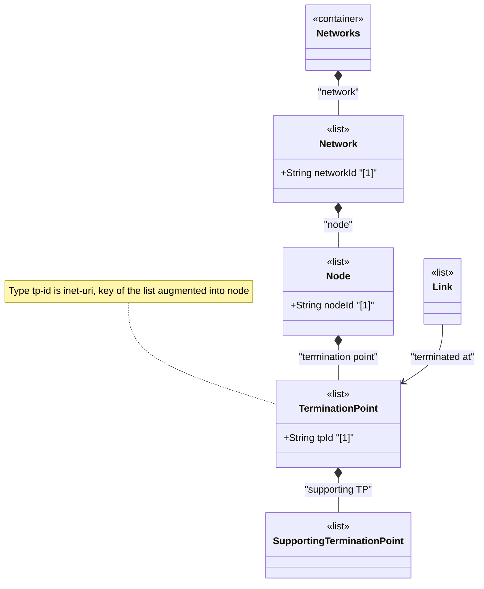

# Feature: Define Termination Point List

## Parent Epic
- [ ] #125 - [ietf-network-topology: Base Network Topology Augmentation](https://github.com/gintatkinson/3dgs-033/blob/main/docs/epics/epic-09-ietf-network-topology.md) (augmented node termination points for link anchoring, clause 4.2)

## Description
Defines the `termination-point` list augmented into `/nw:networks/nw:network/nw:node` from the `ietf-network-topology` module. Each termination point is identified by a unique `tp-id` of type `tp-id` (which is `inet:uri`) and represents a point on a node where links can be terminated. A termination point could correspond to a physical port, a logical interface, or more generally any point of connectivity on a node that can anchor a link endpoint.

Termination points are contained within nodes and are scoped to the containing node. They support hierarchical layering through the `supporting-termination-point` list, allowing a termination point in an overlay topology to map onto supporting termination points in an underlay topology. The tp-id SHOULD be chosen for stable identity across datastore instantiations.

## UML Class Diagram


## Interface Requirements

### 1. Payload Schema
```json
{
  "network": {
    "network-id": "urn:example:network:core-l3",
    "node": [
      {
        "node-id": "urn:example:node:router-chicago-01",
        "termination-point": [
          {
            "tp-id": "urn:example:tp:ge-0-0-1",
            "supporting-termination-point": []
          },
          {
            "tp-id": "urn:example:tp:ge-0-0-2",
            "supporting-termination-point": []
          }
        ]
      }
    ]
  }
}
```

### 2. Validation & Constraints
- `tp-id`: type `tp-id` (derived from `inet:uri`), mandatory as list key, MUST be unique within the containing node
- `tp-id` SHOULD be chosen such that the same termination point in a real network topology will always be identified through the same identifier
- The list is config true, augmented into the `node` list via YANG augment
- A termination point maps conceptually to a port, interface, or any connectivity endpoint on the node — the exact semantics are provided by augmenting modules
- A termination point may have zero or more `supporting-termination-point` entries
- Termination points anchor links — source-tp and dest-tp leafrefs in links reference termination-point tp-ids

### 3. Logical Operations & Interface Messages
- **Add termination point**: `POST /networks/network/{network-id}/node/{node-id}/termination-point` — create a new termination point on a node
- **Read termination point**: `GET /networks/network/{network-id}/node/{node-id}/termination-point/{tp-id}` — retrieve a specific termination point
- **Delete termination point**: `DELETE /networks/network/{network-id}/node/{node-id}/termination-point/{tp-id}` — remove a termination point; any links referencing it will have dangling source-tp or dest-tp references

### 4. Logical Exception States & Validation Failures
- **Duplicate tp-id within same node**: Creating a termination point with an existing tp-id within the same node MUST be rejected
- **Same tp-id across different nodes**: Permitted — termination point identity is scoped to the containing node
- **Deletion with active links**: Deleting a termination point that is referenced by one or more links creates dangling leafrefs; the affected links are excluded from operational state

## Given-When-Then Acceptance Criteria
- **Given** a node exists, **When** a client creates a termination point with a unique tp-id, **Then** the termination point appears on the node's termination-point list
- **Given** a termination point exists, **When** a link references it as a source-tp or dest-tp, **Then** the link is anchored to that termination point
- **Given** a termination point is referenced by links, **When** the termination point is deleted, **Then** the referencing links are removed from the operational state datastore
- **Given** a node with multiple termination points, **When** queried, **Then** all termination points are listed independently

## Specification Context (Verbatim)
From the IETF Network Topologies YANG Data Model specification, Section 4.2 (Base Network Topology Data Model):

"A node has a list of termination points that are used to terminate links. An example of a termination point might be a physical or logical port or, more generally, an interface."

"Like a node, a termination point can in turn be supported by an underlying termination point, contained in the supporting node of the underlay network."

From the ietf-network-topology YANG module (lines 239-243): "A termination point can terminate a link. Depending on the type of topology, a termination point could, for example, refer to a port or an interface."

From the IETF Network Topologies YANG Data Model specification, Section 4.4.2 (Underlay Hierarchies and Mappings):

"Where additional specifics about mappings between upper and lower layers are required, the information can be captured in augmenting modules. For example, to express that a termination point in a particular network type maps to an interface, an augmenting module can introduce an augmentation to the termination point."

## Source References
Structural Schema: [ietf-network-topology@2018-02-26.yang](https://github.com/YangModels/yang/blob/main/standard/ietf/RFC/ietf-network-topology%402018-02-26.yang) (Clause: 6.2, lines 234-293)
Normative Specification: [the IETF Network Topologies YANG Data Model specification](https://datatracker.ietf.org/doc/rfc8345/) (Clause: 4.2, 4.4.2)

## Logical UI & Layout Bindings
- **Target LUI Component:** TableView
- **Target Layout Container ID:** elements_view
- **Data Source Bindings:** `/nw:networks/nw:network/nw:node/nt:termination-point`
