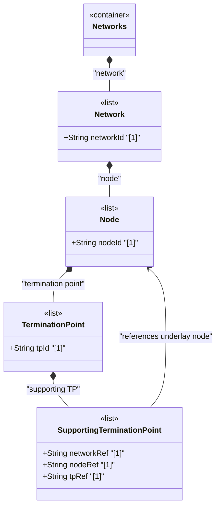

# Feature: Define Supporting Termination Point List

## Parent Epic
- [ ] #125 - [ietf-network-topology: Base Network Topology Augmentation](https://github.com/gintatkinson/3dgs-033/blob/main/docs/epics/epic-09-ietf-network-topology.md) (underlay termination point dependency mapping, clause 4.2)

## Description
Defines the `supporting-termination-point` list within each `termination-point`, keyed by the composite key `network-ref`, `node-ref`, and `tp-ref`, which captures the dependency of a termination point on one or more termination points in an underlay topology. Each entry identifies an underlay termination point (in a supporting node of an underlay network) upon which the containing termination point depends or onto which it maps.

This dependency information can, in principle, be inferred from the dependencies between links via transitive closure. However, the data model provides the option to configure it explicitly to avoid constraining which mappings applications must configure versus derive. The dependency information is not separately configurable at this level — the data is simply provided by the implementing system.

## UML Class Diagram


## Interface Requirements

### 1. Payload Schema
```json
{
  "termination-point": {
    "tp-id": "urn:example:tp:vpn-tunnel-endpoint-01",
    "supporting-termination-point": [
      {
        "network-ref": "urn:example:network:l3-underlay",
        "node-ref": "urn:example:node:router-chicago-01",
        "tp-ref": "urn:example:tp:ge-0-0-1"
      }
    ]
  }
}
```

### 2. Validation & Constraints
- Composite key: `network-ref` + `node-ref` + `tp-ref`, all mandatory and jointly unique within the list
- `network-ref`: type `leafref` with path `../../../nw:supporting-node/nw:network-ref`, `require-instance false` — identifies the underlay network context through the node-level supporting-node chain
- `node-ref`: type `leafref` with path `../../../nw:supporting-node/nw:node-ref`, `require-instance false` — identifies the underlay node
- `tp-ref`: type `leafref` with path `/nw:networks/nw:network[nw:network-id=current()/../network-ref]/nw:node[nw:node-id=current()/../node-ref]/termination-point/tp-id`, `require-instance false` — identifies the underlay termination point
- The list is config true but the schema description states this data "is simply provided by the implementing system" rather than separately configured
- Mappings can be inferred transitively from link-level dependencies but are explicitly represented for completeness

### 3. Logical Operations & Interface Messages
- **Read supporting termination points**: `GET /networks/network/{network-id}/node/{node-id}/termination-point/{tp-id}/supporting-termination-point` — retrieve all underlay TP mappings
- The supporting-termination-point data is provided by the system based on the resolved link and node-level underlay dependencies
- Explicit configuration of supporting-termination-point entries is permitted per the schema's config true designation

### 4. Logical Exception States & Validation Failures
- **Duplicate composite key**: Creating a supporting-termination-point entry with an existing network-ref + node-ref + tp-ref triplet MUST be rejected
- **Dangling reference**: If any of the referenced underlay entities (network, node, or termination point) is deleted, the entry is excluded from operational state
- **Inconsistent mapping**: A supporting-termination-point whose network-ref and node-ref do not resolve through the node-level supporting-node chain creates a broken reference hierarchy

## Given-When-Then Acceptance Criteria
- **Given** a termination point exists with supporting-node entries at the node level, **When** the system resolves the underlay topology, **Then** the supporting-termination-point list is populated with the corresponding underlay termination point references
- **Given** a termination point with supporting-termination-point entries, **When** the underlay termination point is deleted, **Then** the entry is removed from the operational state datastore
- **Given** a termination point with no underlay dependencies, **When** queried, **Then** the supporting-termination-point list is empty
- **Given** a link exists between two overlay nodes with underlay link chain mappings, **When** the transitive closure is computed, **Then** the supporting-termination-point mappings at each endpoint are consistent with the link-level supporting-link entries

## Specification Context (Verbatim)
From the IETF Network Topologies YANG Data Model specification, Section 4.2 (Base Network Topology Data Model):

"Like a node, a termination point can in turn be supported by an underlying termination point, contained in the supporting node of the underlay network."

From the ietf-network-topology YANG module, lines 249-260:

"This list identifies any termination points on which a given termination point depends or onto which it maps. Those termination points will themselves be contained in a supporting node. This dependency information can be inferred from the dependencies between links. Therefore, this item is not separately configurable. Hence, no corresponding constraint needs to be articulated. The corresponding information is simply provided by the implementing system."

From the IETF Network Topologies YANG Data Model specification, Section 4.4.7 (Mapping Redundancy):

"In a hierarchy of networks, there are nodes mapping to nodes, links mapping to links, and termination points mapping to termination points. Some of this information is redundant. Specifically, if the mapping of a link to one or more other links is known and the termination points of each link are known, the mapping information for the termination points can be derived via transitive closure and does not have to be explicitly configured."

## Source References
Structural Schema: [ietf-network-topology@2018-02-26.yang](https://github.com/YangModels/yang/blob/main/standard/ietf/RFC/ietf-network-topology%402018-02-26.yang) (Clause: 6.2, lines 249-291)
Normative Specification: [the IETF Network Topologies YANG Data Model specification](https://datatracker.ietf.org/doc/rfc8345/) (Clause: 4.2, 4.4.7)

## Logical UI & Layout Bindings
- **Target LUI Component:** TableView
- **Target Layout Container ID:** elements_view
- **Data Source Bindings:** `/nw:networks/nw:network/nw:node/nt:termination-point/nt:supporting-termination-point`
