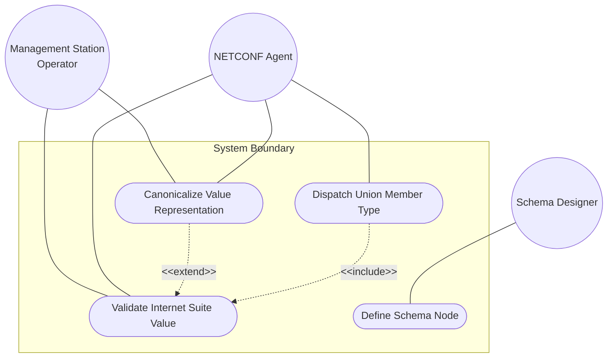
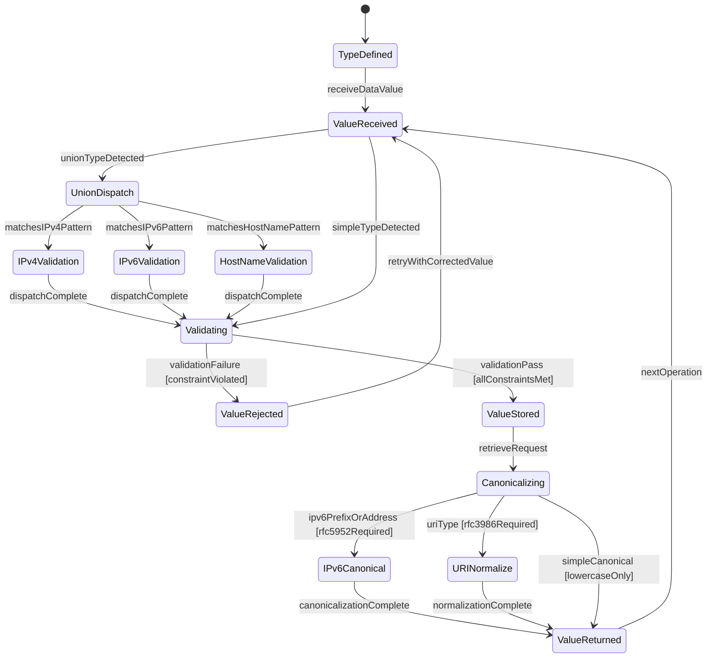

# Use Case: Validate and Retrieve Internet Protocol Suite Type Values

## Parent Epic
- [ ] #12 - [ietf-inet-types: Internet Protocol Suite Data Types](https://github.com/gintatkinson/3dgs-033/blob/main/docs/epics/epic-02-ietf-inet-types.md) (the ietf-inet-types module defines the IP suite type registry for protocol fields, IP addresses, prefixes, domain names, URIs, and email addresses)

## 1. Actors
- **Primary Actor:** Management Station Operator
- **Secondary Actors:** NETCONF Agent, Schema Designer

## 2. Preconditions
- The `ietf-inet-types` YANG module is loaded and available as a schema dependency.
- A NETCONF-capable management agent is running on the target device.
- Schema nodes using types from this module are defined and instantiated in the data tree.
- For IP address canonicalization, the device has access to RFC 5952 normalization logic.

## 3. Trigger
A Management Station Operator issues a request to validate, store, or retrieve a data value that uses a derived type from the `ietf-inet-types` module.

## 4. Main Success Scenario (Basic Flow)
1. The Schema Designer defines a YANG schema node referencing a type from `ietf-inet-types` with its validation constraints.
2. The NETCONF Agent receives a data value intended for a schema node using one of the internet suite types.
3. The NETCONF Agent validates the received value against the type's pattern, range, enumeration, and union dispatch constraints.
4. Upon successful validation, the NETCONF Agent stores the accepted value in the device's data tree.
5. The Management Station Operator requests retrieval of the stored value.
6. The NETCONF Agent canonicalizes the value according to the type's canonical representation rules (lowercase, RFC 5952 for IPv6, RFC 3986 for URIs).
7. The NETCONF Agent returns the canonicalized value to the Management Station Operator.

## 5. Alternate and Exception Flows

### Protocol Field Constraints (branching from Basic Flow step 3)

- **5a. ip-version receives value outside enumeration {0,1,2} (branches from step 3):**
  1. The NETCONF Agent receives an integer value other than 0, 1, or 2 for an ip-version schema node.
  2. The NETCONF Agent rejects the value with an enumeration-violation error; only unknown(0), ipv4(1), and ipv6(2) are valid.

- **5b. dscp receives value >63 (branches from step 3):**
  1. The NETCONF Agent receives a DSCP value of 64 or greater.
  2. The NETCONF Agent rejects the value with a range-violation error; DSCP is a 6-bit field restricted to 0-63.

- **5c. ipv6-flow-label receives value >1048575 (branches from step 3):**
  1. The NETCONF Agent receives a flow label value exceeding 1048575 (the 20-bit maximum).
  2. The NETCONF Agent rejects the value with a range-violation error; the IPv6 flow label is limited to 0-1048575.

- **5d. port-number receives value >65535 (branches from step 3):**
  1. The NETCONF Agent receives a port number value exceeding 65535.
  2. The NETCONF Agent rejects the value with a range-violation error; port numbers are 16-bit, restricted to 0-65535.

- **5e. port-number uses reserved value 0 where excluded (branches from step 3):**
  1. A port-number subtyped with zero excluded (`range '1..65535'`) receives the value 0.
  2. The NETCONF Agent rejects the value with a range-violation error; port 0 is reserved by IANA and excluded by the subtype restriction.

- **5f. protocol-number receives value >255 (branches from step 3):**
  1. The NETCONF Agent receives a protocol number value exceeding 255.
  2. The NETCONF Agent rejects the value with a range-violation error; protocol numbers are 8-bit, restricted to 0-255.

- **5g. upper-layer-protocol-number with IPv6 extension header chain (branches from step 3):**
  1. The NETCONF Agent processes an IPv6 packet with extension headers where the last next-header field is 17 (UDP).
  2. The upper-layer-protocol-number is correctly extracted as 17, representing the final protocol after traversing the extension header chain. The value is stored.

- **5h. as-number exceeds uint32 range (branches from step 3):**
  1. The NETCONF Agent receives an AS number value exceeding uint32 maximum.
  2. The NETCONF Agent rejects the value with a range-violation error. The uint32 base type has no additional range restriction to support the 32-bit AS number space per RFC 6793.

- **5i. upper-layer-protocol-number receives value >255 (branches from step 3):**
  1. The NETCONF Agent receives an upper-layer protocol number value exceeding 255.
  2. The NETCONF Agent rejects the value with a range-violation error; derived from protocol-number, restricted to 0-255.

- **5j. ip-version receives negative value (branches from step 3):**
  1. The NETCONF Agent receives a negative integer for an ip-version schema node.
  2. The NETCONF Agent rejects the value because the enumeration type requires non-negative integer values mapped to {unknown=0, ipv4=1, ipv6=2}.

- **5k. dscp receives negative value (branches from step 3):**
  1. The NETCONF Agent receives a negative DSCP value.
  2. The NETCONF Agent rejects the value with a range-violation error; DSCP is a uint8 restricted to non-negative values in the range 0-63.

- **5l. ipv6-flow-label receives negative value (branches from step 3):**
  1. The NETCONF Agent receives a negative flow label value.
  2. The NETCONF Agent rejects the value with a range-violation error; the IPv6 flow label is a uint32 restricted to non-negative values in the range 0-1048575.

### IP Address Constraints (branching from Basic Flow step 3)

- **5m. ipv4-address has octet exceeding 255 (branches from step 3):**
  1. The NETCONF Agent receives an IPv4 address with an octet value greater than 255 (e.g., "192.0.2.256").
  2. The NETCONF Agent rejects the value with a pattern-violation error; each dotted-quad octet must be 0-255.

- **5k. ipv4-address has fewer or more than 4 octets (branches from step 3):**
  1. The NETCONF Agent receives an IPv4 address string with an incorrect number of octets.
  2. The NETCONF Agent rejects the value with a pattern-violation error; exactly four decimal octets are required.

- **5l. ipv4-address zone index format (branches from step 3):**
  1. The NETCONF Agent receives an IPv4 address with a zone index following the % sign.
  2. The canonical format for the zone index is the numerical format. The zone index disambiguates identical address values, typically an interface index for link-local addresses.

- **5m. ipv6-address malformed colon-hex notation (branches from step 3):**
  1. The NETCONF Agent receives an IPv6 address with too many colon-separated groups (more than 8 non-compressed groups).
  2. The NETCONF Agent rejects the value with a pattern-violation error.

- **5n. ipv6-address invalid mixed notation (branches from step 3):**
  1. The NETCONF Agent receives an IPv6 address with inconsistent mixed IPv4/IPv6 notation.
  2. The NETCONF Agent rejects the value with a pattern-violation error.

- **5o. ipv6-address canonical representation per RFC 5952 (branches from step 6):**
  1. The NETCONF Agent retrieves an IPv6 address with uppercase hex digits and non-canonical zero compression.
  2. The canonical representation uses lowercase hex, shortest zero-compressed form, and the canonical representation rules defined in Section 4 of RFC 5952.

- **5p. ipv4-address-no-zone receives value with zone identifier (branches from step 3):**
  1. The NETCONF Agent receives an IPv4 address with a %zone suffix for an ipv4-address-no-zone type.
  2. The NETCONF Agent rejects the value with a pattern-violation error; zone identifiers are not permitted for address-no-zone types.

- **5q. ipv6-address-no-zone receives value with zone identifier (branches from step 3):**
  1. The NETCONF Agent receives an IPv6 address with a %zone suffix for an ipv6-address-no-zone type.
  2. The NETCONF Agent rejects the value with a pattern-violation error; zone identifiers are not permitted for address-no-zone types.

- **5r. ip-address union dispatch resolves to correct member (branches from step 3):**
  1. The NETCONF Agent receives an IP address in dotted-quad notation (e.g., "192.0.2.1").
  2. The union dispatches to the ipv4-address member type for validation. If the value matches both member patterns, the first matching member (ipv4-address) takes precedence.

- **5s. ipv4-address-link-local outside 169.254.0.0/16 prefix (branches from step 3):**
  1. The NETCONF Agent receives an IPv4 address (e.g., "192.0.2.1") for an ipv4-address-link-local type.
  2. The NETCONF Agent rejects the value with a pattern-violation error; the address must be within the 169.254.0.0/16 link-local prefix per RFC 3927.

- **5t. ipv6-address-link-local outside fe80::/10 prefix (branches from step 3):**
  1. The NETCONF Agent receives an IPv6 address outside the fe80::/10 prefix for an ipv6-address-link-local type.
  2. The NETCONF Agent rejects the value with a pattern-violation error; the address must be within the fe80::/10 link-local prefix per RFC 4291.

- **5u. ip-address-link-local union dispatch (branches from step 3):**
  1. The NETCONF Agent receives a link-local IP address.
  2. The union dispatches to either ipv4-address-link-local or ipv6-address-link-local based on the format of the textual representation.

- **5v. ipv4-address zone index contains invalid characters (branches from step 3):**
  1. The NETCONF Agent receives an IPv4 address with a zone index containing non-UTF-8 or prohibited characters after the % sign.
  2. The NETCONF Agent rejects the value with a pattern-violation error. If the system uses zone names not in UTF-8, the implementation must transform the local name into UTF-8 using a mechanism defined outside this specification.

- **5w. ipv4-address canonical zone index is numerical (branches from step 6):**
  1. The NETCONF Agent retrieves an IPv4 address with a non-numerical zone index.
  2. The canonical format for the zone index is the numerical format as described in RFC 4007. The zone index used for link-local addresses is typically the interface index number.

- **5x. ipv6-address canonical zone index per RFC 4007 (branches from step 6):**
  1. The NETCONF Agent retrieves an IPv6 address with a non-numerical zone index.
  2. The canonical format for the zone index is the numerical format as described in Section 11.2 of RFC 4007. The zone index disambiguates identical address values for link-local scoped addresses.

### IP Prefix Constraints (branching from Basic Flow step 3)

- **5v. ipv4-prefix length >32 (branches from step 3):**
  1. The NETCONF Agent receives an IPv4 prefix with prefix length 33 or greater (e.g., "192.0.2.0/33").
  2. The NETCONF Agent rejects the value with a pattern-violation error; the prefix length must be 0-32.

- **5w. ipv6-prefix length >128 (branches from step 3):**
  1. The NETCONF Agent receives an IPv6 prefix with prefix length 129 or greater (e.g., "2001:db8::/129").
  2. The NETCONF Agent rejects the value with a pattern-violation error; the prefix length must be 0-128.

- **5x. ipv4-prefix negative prefix length (branches from step 3):**
  1. The NETCONF Agent receives an IPv4 prefix with a negative prefix length.
  2. The NETCONF Agent rejects the value with a pattern-violation error; prefix length must be non-negative.

- **5y. ipv4-prefix canonicalization: non-prefix bits zeroed (branches from step 6):**
  1. The NETCONF Agent retrieves an IPv4 prefix stored as "192.0.2.1/24".
  2. The canonical output zeroes host bits by applying the /24 network mask, producing "192.0.2.0/24". The original non-canonical input was accepted on write.

- **5z. ipv6-prefix canonicalization: RFC 5952 and non-prefix bits zeroed (branches from step 6):**
  1. The NETCONF Agent retrieves an IPv6 prefix stored as "2001:db8::1/64".
  2. The canonical output first applies RFC 5952 canonical address format, then zeroes host bits with the /64 prefix mask, producing "2001:db8::/64".

- **5aa. ipv4-prefix accepts non-canonical input (branches from step 3):**
  1. A configuration tool writes an IPv4 prefix value "192.0.2.1/24" (with host bits set).
  2. The NETCONF Agent accepts the non-canonical value on input; canonicalization is applied only on output retrieval.

- **5ab. ipv6-prefix accepts non-canonical input (branches from step 3):**
  1. A configuration tool writes an IPv6 prefix value "2001:0db8:0000:0000:0000:0000:0000:0001/64".
  2. The NETCONF Agent accepts the non-canonical value on input; canonicalization to RFC 5952 and host-bit zeroing are applied only on output retrieval.

- **5ac. ipv4-address-and-prefix preserves host bits (branches from step 6):**
  1. The NETCONF Agent retrieves an IPv4 address-and-prefix value "192.0.2.1/24".
  2. Host bits are NOT zeroed on output; address-and-prefix types represent a specific host address with its associated prefix. The value "192.0.2.1/24" is preserved as written.

- **5ad. ipv6-address-and-prefix preserves host bits (branches from step 6):**
  1. The NETCONF Agent retrieves an IPv6 address-and-prefix value "2001:db8::1/64".
  2. Host bits are NOT zeroed on output; address-and-prefix types represent a specific host address. The value "2001:db8::1/64" is preserved with RFC 5952 canonical address format.

- **5ae. ip-prefix union dispatch to correct member (branches from step 3):**
  1. The NETCONF Agent receives an IP prefix string (e.g., "10.0.0.0/8").
  2. The union dispatches to the ipv4-prefix member type based on the dotted-quad format. If the value matches both member patterns, the first matching member (ipv4-prefix) takes precedence.

- **5af. ip-address-and-prefix union dispatch (branches from step 3):**
  1. The NETCONF Agent receives an IP address-and-prefix string.
  2. The union dispatches to either ipv4-address-and-prefix or ipv6-address-and-prefix based on the format of the textual representation.

- **5ag. ipv4-prefix has malformed address portion (branches from step 3):**
  1. The NETCONF Agent receives an IPv4 prefix with an invalid IP address portion (e.g., non-numeric characters in octets).
  2. The NETCONF Agent rejects the value with a pattern-violation error.

- **5ah. ipv6-prefix has malformed address portion (branches from step 3):**
  1. The NETCONF Agent receives an IPv6 prefix with an invalid IPv6 address portion.
  2. The NETCONF Agent rejects the value with a pattern-violation error.

### Domain, Host, URI, and Email Constraints (branching from Basic Flow step 3)

- **5ai. domain-name exceeds 253 character length limit (branches from step 3):**
  1. The NETCONF Agent receives a domain name string exceeding 253 characters.
  2. The NETCONF Agent rejects the value with a length-constraint error; the DNS protocol encoding supports up to 255 characters total, with a maximum of 253 in textual dotted notation.

- **5aj. domain-name label exceeds 63 characters (branches from step 3):**
  1. The NETCONF Agent receives a domain name with a single label exceeding 63 characters (e.g., a 64-character label).
  2. The NETCONF Agent rejects the value with a pattern-violation error; DNS labels are limited to 63 characters.

- **5ak. domain-name contains invalid characters (branches from step 3):**
  1. The NETCONF Agent receives a domain name containing characters outside the allowed set [a-zA-Z0-9\\-_] within labels.
  2. The NETCONF Agent rejects the value with a pattern-violation error.

- **5al. domain-name canonical representation (branches from step 6):**
  1. The NETCONF Agent retrieves a domain name with uppercase ASCII characters (e.g., "EXAMPLE.COM").
  2. The canonical representation uses lowercase ASCII characters. Internationalized domain names MUST be A-labels per RFC 5890.

- **5am. domain-name schema node missing resolution description (branches from step 1):**
  1. A Schema Designer defines a schema node using the domain-name type without describing the resolution process to IP addresses.
  2. The schema is accepted syntactically but flagged as incomplete; the description clause MUST describe when and how names are resolved.

- **5an. host-name shorter than 2 characters (branches from step 3):**
  1. The NETCONF Agent receives a host name string of length 1 (e.g., "a").
  2. The NETCONF Agent rejects the value with a length-constraint error; host names must be at least 2 characters per RFC 952.

- **5ao. host-name contains invalid characters (branches from step 3):**
  1. The NETCONF Agent receives a host name containing characters outside [a-zA-Z0-9\\-\\.].
  2. The NETCONF Agent rejects the value with a pattern-violation error; labels consist of letters, digits, and hyphens separated by dots.

- **5ap. host union dispatch to correct member (branches from step 3):**
  1. The NETCONF Agent receives a host value in dotted-quad format (e.g., "192.0.2.1").
  2. The union dispatches to the ip-address member type for IP address validation. A fully qualified host name (e.g., "example.com") dispatches to the host-name member type.

- **5aq. uri missing scheme prefix (branches from step 3):**
  1. The NETCONF Agent receives a URI string without a scheme prefix (e.g., "example.com/path").
  2. The NETCONF Agent rejects the value with a pattern-violation error; the pattern requires `[a-z][a-z0-9+.-]*:.*`.

- **5ar. uri scheme does not start with alphabetic character (branches from step 3):**
  1. The NETCONF Agent receives a URI with a scheme starting with a digit (e.g., "3foo://example.com").
  2. The NETCONF Agent rejects the value with a pattern-violation error; the scheme must start with a lowercase alphabetic character.

- **5as. uri canonical normalization per RFC 3986 (branches from step 6):**
  1. The NETCONF Agent retrieves a URI with mixed-case scheme and host (e.g., "HTTPS://Example.COM:443/Path").
  2. The canonical output lowercases the scheme to "https", lowercases the host to "example.com", removes the default port 443 for https, and preserves the case-sensitive path, producing "https://example.com/Path".

- **5at. uri percent-encoded hex digits uppercased (branches from step 6):**
  1. The NETCONF Agent retrieves a URI with percent-encoded triplets containing lowercase hex (e.g., "%3f").
  2. The canonical output uppercases hex digits within percent-encoded triplets to "%3F" per RFC 3986 Section 6.2.2.1.

- **5au. uri unnecessary percent-encoding decoded (branches from step 6):**
  1. The NETCONF Agent retrieves a URI where characters that can be represented without encoding are percent-encoded (e.g., "%7E" for tilde).
  2. The canonical output decodes the unnecessary percent-encoding, producing "~user" instead of "%7Euser". Only characters requiring encoding remain percent-encoded.

- **5av. uri zero-length string expresses absent URI (branches from step 3):**
  1. The NETCONF Agent receives a zero-length string for an optional URI field.
  2. The value is accepted and interpreted as "URI absent." It is not treated as a valid URI for normalization purposes.

- **5aw. email-address missing @ separator (branches from step 3):**
  1. The NETCONF Agent receives an email address string without the @ separator (e.g., "userexample.com").
  2. The NETCONF Agent rejects the value with a pattern-violation error; the pattern requires at least one @ character separating local-part and domain.

- **5ax. email-address canonical domain representation (branches from step 6):**
  1. The NETCONF Agent retrieves an email address with uppercase domain characters (e.g., "User@Example.COM").
  2. The canonical output lowercases the domain part. The domain part supports both A-labels and U-labels per RFC 5890, with U-labels used where applicable.

- **5ay. email-address internationalization support required (branches from step 3):**
  1. The NETCONF Agent receives an internationalized email address per RFC 6532 (e.g., with non-ASCII local-part characters).
  2. Implementations MUST support the internationalization extensions of RFC 6532. Support for obsolete obs-local-part and obs-domain syntax from RFC 5322 is not required.

- **5az. domain-name contains non-ASCII characters without A-label encoding (branches from step 3):**
  1. The NETCONF Agent receives a domain name with raw non-ASCII characters that have not been converted to A-labels.
  2. The domain MUST be represented as an A-label per RFC 5890. The NETCONF Agent may reject or transform the value into an A-label.

- **5ba. host-name short length at boundary (branches from step 3):**
  1. The NETCONF Agent receives a host name string of exactly 2 characters that meets the pattern constraints.
  2. The value is accepted because host-name has length constraint 2..max. The minimum host name length per RFC 952 is 2 characters.

- **5bb. host union accepts fully qualified host name (branches from step 3):**
  1. The NETCONF Agent receives a host value that is a fully qualified domain name (e.g., "host.example.com").
  2. The union dispatches to the host-name member type. The host union represents either an IP address or a fully qualified host name, and the format of the input determines which member type validates the value.

- **5bc. domain-name canonical A-label conversion for international names (branches from step 6):**
  1. The NETCONF Agent retrieves a domain name with internationalized characters.
  2. The canonical output represents the name as an A-label per RFC 5890. The canonical format uses lowercase ASCII characters throughout, with internationalized names converted to their ASCII-compatible representation.

- **5bd. host-name accepts valid host names with hyphens and dots (branches from step 3):**
  1. The NETCONF Agent receives a host name string such as "host-1.example.com" containing labels with letters, digits, and hyphens separated by dots.
  2. The NETCONF Agent accepts the value because the pattern `[a-zA-Z0-9\\-\\.]+` permits labels consisting of letters, digits, and hyphens per RFCs 1123 and 952.

## 6. Postconditions (Guarantees)
- **Success Guarantee:** The data value is validated against all internet suite type constraints, stored in canonical form, and returned to the Management Station Operator with all normalization rules (RFC 5952 for IPv6, RFC 3986 Sections 6.2.1/6.2.2.1/6.2.2.2 for URIs, lowercase for domain names, host names, and hex digits) applied. Union types dispatch to the correct member type for validation and storage.
- **Failure Guarantee:** The invalid value is rejected at the validation step. The device's data tree is unchanged. The Management Station Operator receives a descriptive error message indicating the specific constraint violated (range, pattern, enumeration, length, or union member dispatch failure). No partial or corrupted data is stored.

## UML Diagrams

### Use Case Diagram


### State Machine Diagram


## 7. Operational Context
> The "ietf-inet-types" module defines data types relevant for the Internet Protocol suite such as types related to IP addresses, types for domain name, host name, URI, and email, and types for values in common protocol fields (e.g., port numbers). (RFC 9911, Section 1)

> Objects using the uri type MUST be in ASCII encoding and MUST be normalized as described in Sections 6.2.1, 6.2.2.1, and 6.2.2.2 of RFC 3986. Characters that can be represented without using percent-encoding are represented as characters (without percent-encoding), and all case-insensitive characters are set to lowercase except for hexadecimal digits within a percent-encoded triplet, which are normalized to uppercase as described in Section 6.2.2.1 of RFC 3986. (RFC 9911, Section 4)

> The canonical format of an IPv4 prefix has all bits of the IPv4 address set to zero that are not part of the IPv4 prefix. The definition of ipv4-prefix does not require that bits that are not part of the prefix be set to zero. However, implementations have to return values in canonical format, which requires non-prefix bits to be set to zero. (RFC 9911, Section 4)

## 8. Realization Matrix

### Required User Stories
- [ ] #19 - [IP Prefix Host-Bit Zeroing and Canonical Normalization on Output](https://github.com/gintatkinson/3dgs-033/blob/main/docs/user-stories/us-07-ip-prefix-canonical-normalization.md) (IP prefix host-bit zeroing and RFC 5952 canonical format enforcement during value retrieval)
- [ ] #20 - [URI Normalization to RFC 3986 Canonical Representation](https://github.com/gintatkinson/3dgs-033/blob/main/docs/user-stories/us-08-uri-canonical-normalization.md) (URI normalization, percent-encoding, and scheme/host lowercasing during value canonicalization)

### Required Features
- [ ] #7 - [Define Protocol Field and AS Number Types](https://github.com/gintatkinson/3dgs-033/blob/main/docs/features/feat-07-protocol-field-types.md) (provides ip-version, dscp, ipv6-flow-label, port-number, protocol-number, upper-layer-protocol-number, and as-number type definitions)
- [ ] #8 - [Define IP Address Representation Types](https://github.com/gintatkinson/3dgs-033/blob/main/docs/features/feat-08-ip-address-types.md) (provides ip-address, ipv4-address, ipv6-address, address-no-zone variants, link-local variants, and RFC 5952 canonicalization rules)
- [ ] #9 - [Define IP Prefix Representation Types](https://github.com/gintatkinson/3dgs-033/blob/main/docs/features/feat-09-ip-prefix-types.md) (provides ip-prefix, ipv4-prefix, ipv6-prefix, ip-address-and-prefix type definitions with host-bit zeroing and canonical format rules)
- [ ] #10 - [Define Domain Name, Host, URI, and Email Types](https://github.com/gintatkinson/3dgs-033/blob/main/docs/features/feat-10-domain-host-types.md) (provides domain-name, host-name, host, uri, and email-address type definitions with RFC 3986 URI normalization, RFC 5890 A-label requirements, and RFC 6532 internationalization)

## Source References
Structural Schema: [ietf-inet-types@2025-12-22.yang](https://github.com/YangModels/yang/blob/main/standard/ietf/RFC/ietf-inet-types%402025-12-22.yang)
Normative Specification: [RFC 9911](https://datatracker.ietf.org/doc/rfc9911/) (Sections 1-2, 4)

> [!WARNING]
> **Mermaid Block Closing Constraints & Code Fence Integrity:**
> - Every Mermaid diagram MUST be strictly closed with ` ``` ` on a new line. Leaking Mermaid blocks (e.g. having headings like `##` inside an unclosed diagram) or stray/unclosed code fences will fail downstream validation checks.
> - Ensure there are no stray backticks or unmatched code fences in the document.
> - **All Mermaid syntax constraints are defined in `rules/platform-independence.md` and MUST be observed in full** -- including the prohibition on semicolons in `Note` and message text, colons in class members and note strings, stereotypes on relationship lines, and curly braces in class member lines. Do not maintain a local subset here; subsets drift (issue #289).

> **Container Traceability:** Every Use Case MUST declare its schema container in `schema_containers` with exactly one entry containing the container path and `node_type` (e.g. `- path: "module/ellipsoid", node_type: container`). Multi-container Use Cases are forbidden -- the linter gate will reject files with `len(schema_containers) != 1`.
