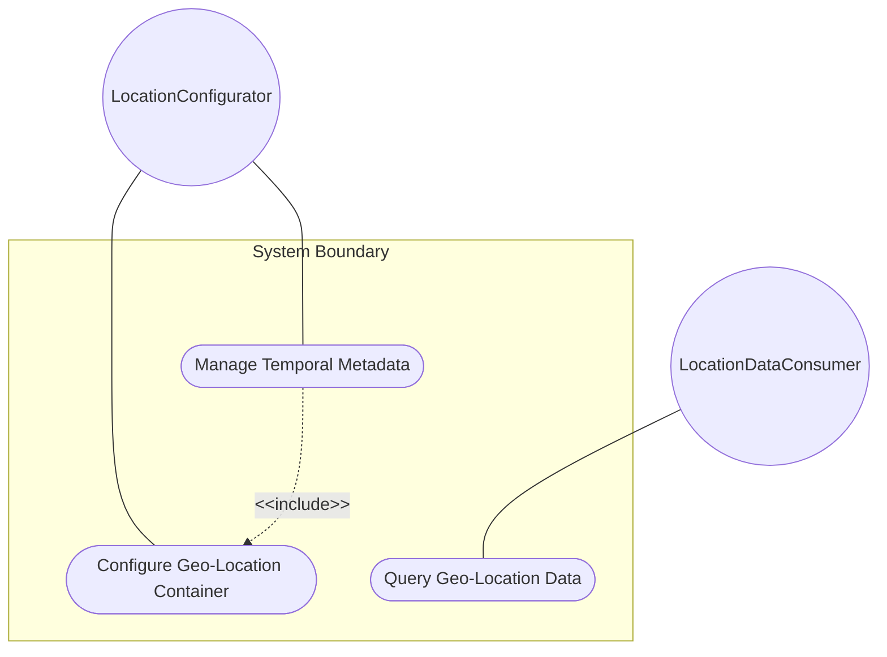
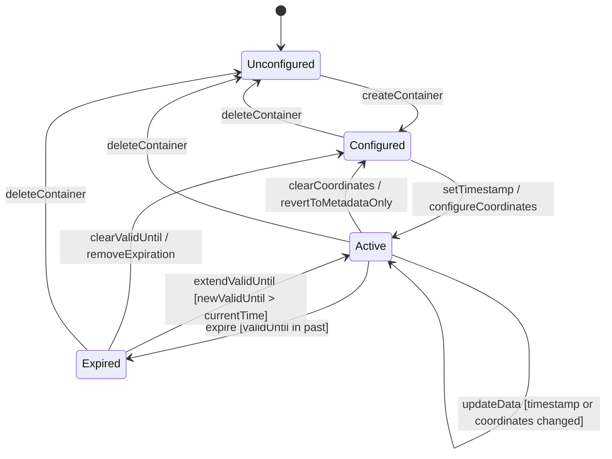

# Use Case: Configure and Manage Geo-Location Container

## Parent Epic
- [ ] #30 - [ietf-geo-location: Geographic Location Data Model](https://github.com/gintatkinson/3dgs-033/blob/main/docs/epics/epic-03-ietf-geo-location.md) (the root geo-location container anchors the entire geolocation data hierarchy and houses all sub-containers)

## 1. Actors
- **Primary Actor:** LocationConfigurator — the operator or system configuring geolocation data for network infrastructure entities
- **Secondary Actors:** GeoLocationContainer — the geo-location container instance that stores and manages temporal metadata and sub-container references

## 2. Preconditions
- The `ietf-geo-location` YANG grouping is imported by a host module via `uses geo:geo-location`.
- A parent data node exists in the host module's data tree to contain the geo-location instance.
- The host module has appropriate access rights (NETCONF/RESTCONF) to write configuration data.

## 3. Trigger
A LocationConfigurator issues a request to create, update, or query a geo-location record for a network entity (e.g., a data center rack, a device, or a fiber endpoint).

## 4. Main Success Scenario (Basic Flow)
1. The LocationConfigurator creates or selects the target geo-location container instance within the host data tree.
2. The LocationConfigurator configures a timestamp recording the capture time of the location data.
3. The LocationConfigurator optionally configures a valid-until expiration timestamp.
4. The GeoLocationContainer validates both temporal values against the `yang:date-and-time` ISO 8601 format constraints.
5. The LocationConfigurator configures sub-containers (reference-frame, location coordinates, velocity) as needed.
6. The GeoLocationContainer stores the complete geo-location record with all configured children.
7. A consumer queries the geo-location data and receives the stored values including both temporal metadata fields.

## 5. Alternate and Exception Flows

- **5a. Timestamp value fails ISO 8601 format validation (branches from Basic Flow step 4):**
  1. The GeoLocationContainer receives a malformed timestamp string such as "invalid-date-string".
  2. The GeoLocationContainer rejects the write operation with a pattern-validation error indicating the value does not conform to the `yang:date-and-time` type. The LocationConfigurator is notified.

- **5b. valid-until value set before the timestamp (branches from Basic Flow step 4):**
  1. The GeoLocationContainer receives a valid-until timestamp of "2025-01-01T00:00:00Z" while the timestamp is "2025-06-01T12:00:00Z".
  2. No cross-field temporal ordering constraint exists in the schema, so the GeoLocationContainer accepts the value. The record is immediately expired because the valid-until precedes the capture time.

- **5c. Geo-location container creation without timestamp (branches from Basic Flow step 2):**
  1. The LocationConfigurator creates a geo-location container and configures coordinates without setting a timestamp.
  2. The GeoLocationContainer stores the location data with an absent timestamp leaf. Consumers retrieving the record receive no timestamp and must treat the capture time as unknown.

- **5d. Geo-location container creation without valid-until (branches from Basic Flow step 3):**
  1. The LocationConfigurator configures a geo-location record with coordinates but omits the valid-until field.
  2. The GeoLocationContainer stores the record with an absent valid-until leaf. The location data has no expiration and is considered valid indefinitely.

## 6. Postconditions (Guarantees)
- **Success Guarantee:** The geo-location container is created or updated in the data tree with all configured temporal leaves, sub-containers, and coordinate data stored. Consumers can retrieve the full location record. Temporal metadata fields (timestamp, valid-until) carry their exact configured values or remain absent when not configured.
- **Failure Guarantee:** Any validation failure (malformed timestamp, schema constraint violation) causes the entire write operation to be rejected. The data tree remains unchanged. The LocationConfigurator receives a descriptive error indicating the specific constraint violated.

## UML Diagrams

### Use Case Diagram


### State Machine Diagram


## 7. Operational Context
> This document defines a 'geo-location' YANG grouping that allows for all the above data to be captured. The geographical location grouping is intended to be used in YANG data models for specifying a location on or in reference to Earth or any other astronomical object. (RFC 9179, Section 1)

> All the data nodes defined in this YANG module are writable/creatable/deletable (i.e., "config true", which is the default). (RFC 9179, Section 7)

## 8. Realization Matrix

### Required User Stories
- [ ] #32 - [Expire Geo-Location Data at valid-until Temporal Boundary](https://github.com/gintatkinson/3dgs-033/blob/main/docs/user-stories/us-10-expire-geo-location-valid-until.md) (the valid-until leaf defined by this container governs expiry transitions, making the container the lifecycle owner for location data expiration)
- [ ] #37 - [Compute Geo-Location Validity Window from Timestamp and valid-until](https://github.com/gintatkinson/3dgs-033/blob/main/docs/user-stories/us-15-compute-location-validity-window.md) (both timestamp and valid-until leaves belong to this container, and together define the temporal validity window for the entire geo-location record)
- [ ] #33 - [Inherit Reference Frame from Parent Container in Nested Location Hierarchies](https://github.com/gintatkinson/3dgs-033/blob/main/docs/user-stories/us-11-inherit-reference-frame-nested-locations.md) (the geo-location container is the unit of nesting; parent-child container hierarchy enables reference-frame inheritance propagation)

### Required Features
- [ ] #23 - [Define Geo-Location Container](https://github.com/gintatkinson/3dgs-033/blob/main/docs/features/feat-11-geo-location-container.md) (defines the root geo-location container itself with timestamp and valid-until leaf nodes of type yang:date-and-time, anchoring the entire geolocation data hierarchy)

## Source References
Structural Schema: [ietf-geo-location@2022-02-11.yang](https://github.com/YangModels/yang/blob/main/standard/ietf/RFC/ietf-geo-location%402022-02-11.yang) (Clause: container geo-location)
Normative Specification: [RFC 9179](https://datatracker.ietf.org/doc/rfc9179/) (Clause: Section 2, The Geolocation Object; Section 2.6, Tree)

> [!WARNING]
> **Mermaid Block Closing Constraints & Code Fence Integrity:**
> - Every Mermaid diagram MUST be strictly closed with ``` ``` ``` on a new line. Leaking Mermaid blocks or stray/unclosed code fences will fail downstream validation checks.
> - **All Mermaid syntax constraints are defined in `rules/platform-independence.md` and MUST be observed in full** — including the prohibition on semicolons in `Note` and message text, colons in class members and note strings, stereotypes on relationship lines, and curly braces in class member lines. Do not maintain a local subset here; subsets drift (issue #289).

> **Container Traceability:** Every Use Case MUST declare its schema container in `schema_containers` with exactly one entry containing the container path and `node_type` (e.g. `- path: "module/ellipsoid", node_type: container`). Multi-container Use Cases are forbidden — the linter gate will reject files with `len(schema_containers) != 1`.
