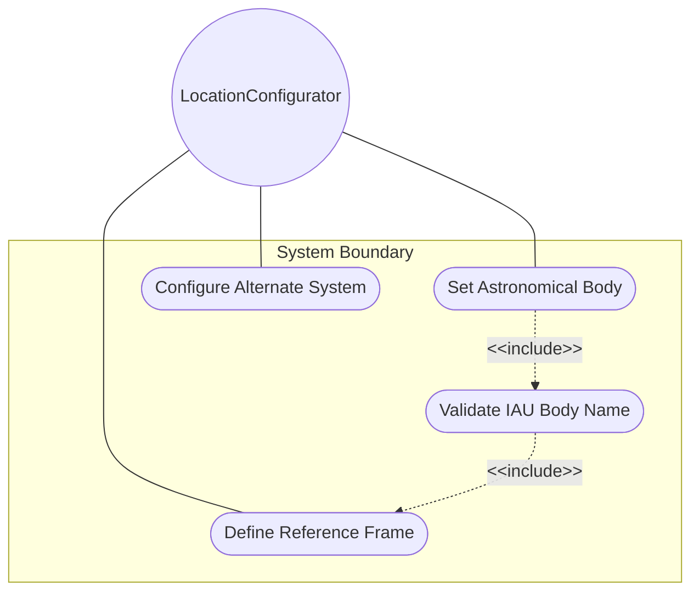
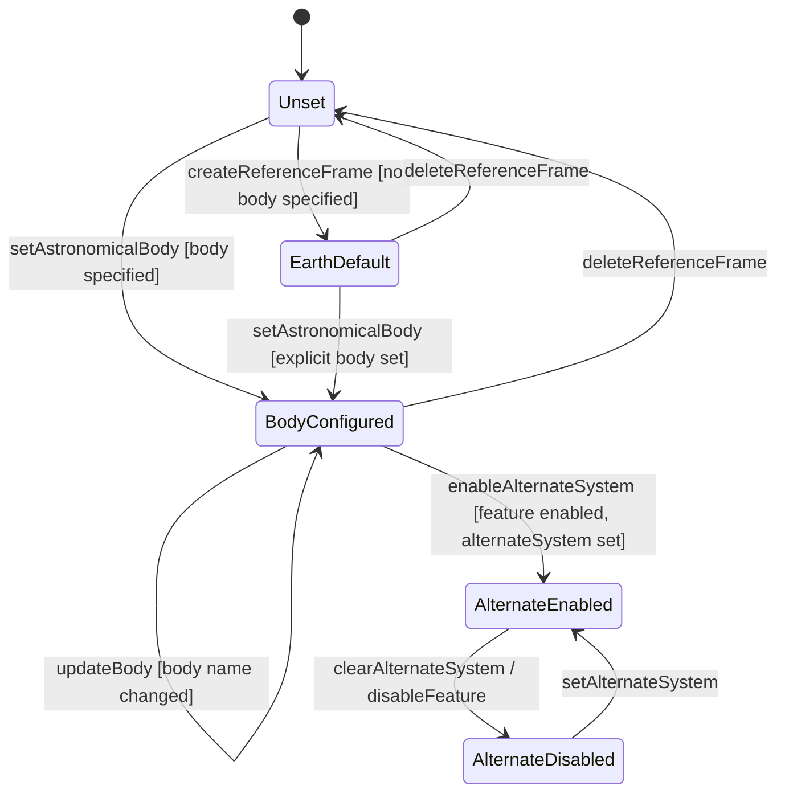

# Use Case: Define and Validate Reference Frame for Geo-Location

## Parent Epic
- [ ] #30 - [ietf-geo-location: Geographic Location Data Model](https://github.com/gintatkinson/3dgs-033/blob/main/docs/epics/epic-03-ietf-geo-location.md) (the reference-frame container establishes the astronomical body and coordinate system context for all location values)

## 1. Actors
- **Primary Actor:** LocationConfigurator — the operator deploying network infrastructure that requires geo-location data on a specific astronomical body
- **Secondary Actors:** ReferenceFrameContainer, IauNameNormalizer, GeodeticSystemContainer

## 2. Preconditions
- A geo-location container instance exists in the data tree.
- The host module has write access to the reference-frame sub-container.
- The IANA "Geodetic System Values" registry is available for datum value validation.

## 3. Trigger
A LocationConfigurator initiates configuration of a reference frame for a geo-location record, specifying the astronomical body on or around which the location is defined.

## 4. Main Success Scenario (Basic Flow)
1. The LocationConfigurator selects or creates the reference-frame container within the parent geo-location.
2. The LocationConfigurator specifies an astronomical-body value using IAU naming conventions.
3. The IauNameNormalizer converts the body name to lowercase, strips any leading article "the", and validates the string against the ASCII pattern constraint.
4. The LocationConfigurator optionally specifies an alternate-system identifier when the alternate-systems feature is enabled.
5. The LocationConfigurator optionally configures the nested geodetic-system sub-container with a datum and accuracy parameters.
6. The ReferenceFrameContainer stores the validated reference-frame record.
7. Downstream coordinate interpretation components query the reference-frame to determine the correct coordinate system context.

## 5. Alternate and Exception Flows

- **5a. Astronomical body name contains control characters (branches from Basic Flow step 3):**
  1. The ReferenceFrameContainer receives an astronomical-body value with byte values outside the allowed ASCII pattern range [ -@\[-\^_-~]* (e.g., containing a newline character).
  2. The ReferenceFrameContainer rejects the value with a pattern-validation error. The LocationConfigurator is notified of the specific character that violated the constraint.

- **5b. Astronomical body name uses uppercase characters (branches from Basic Flow step 3):**
  1. The LocationConfigurator submits an astronomical-body value of "Earth" with uppercase initial letter.
  2. The IauNameNormalizer accepts the value per the SHOULD guidance (the pattern does not forbid uppercase) but normalizes it to lowercase "earth" for canonical storage. No error is raised.

- **5c. Alternate-system field hidden when feature is disabled (branches from Basic Flow step 4):**
  1. The host device does not support the alternate-systems YANG feature flag.
  2. The ReferenceFrameContainer rejects any attempt to write the alternate-system leaf. A schema-mount error indicates that the leaf is not available on this device. The field is not present in the data tree.

## 6. Postconditions (Guarantees)
- **Success Guarantee:** The reference-frame container is stored in the data tree with a validated astronomical-body value (defaulting to "earth" when unspecified) and an optional alternate-system identifier when the feature is enabled. The geodetic-system sub-container may be present or absent. All downstream coordinate interpretation uses this reference frame as its authoritative source for body and coordinate system context.
- **Failure Guarantee:** If validation fails (pattern violation on astronomical-body, or feature-gate violation on alternate-system), the write operation is rejected. The reference-frame data tree is unchanged. The LocationConfigurator receives a descriptive error message.

## UML Diagrams

### Use Case Diagram


### State Machine Diagram


## 7. Operational Context
> The frame of reference ('reference-frame') defines what the location values refer to and their meaning. The referred-to object can be any astronomical body. It could be a planet such as Earth or Mars, a moon such as Enceladus, an asteroid such as Ceres, or even a comet such as 1P/Halley. This value is specified in 'astronomical-body' and is defined by the International Astronomical Union. The default 'astronomical-body' value is 'earth'. (RFC 9179, Section 2.1)

> We define an optional feature that allows for changing the system for which the above values are defined. This optional feature adds an 'alternate-system' value to the reference frame. This value is normally not present, which implies the natural universe is the system. (RFC 9179, Section 2.1)

## 8. Realization Matrix

### Required User Stories
- [ ] #35 - [Configure Geo-Location on a Non-Earth Astronomical Body](https://github.com/gintatkinson/3dgs-033/blob/main/docs/user-stories/us-13-configure-non-earth-astronomical-body.md) (the astronomical-body leaf within this container is the mechanism for specifying locations on bodies other than Earth, including IAU name validation, patten constraints, and normalization)
- [ ] #33 - [Inherit Reference Frame from Parent Container in Nested Location Hierarchies](https://github.com/gintatkinson/3dgs-033/blob/main/docs/user-stories/us-11-inherit-reference-frame-nested-locations.md) (the reference-frame container is the object inherited across nested geo-location hierarchies when child locations omit their own reference-frame)
- [ ] #31 - [Derive Speed and Heading from Velocity Vector Components](https://github.com/gintatkinson/3dgs-033/blob/main/docs/user-stories/us-09-derive-speed-heading-velocity.md) (the astronomical body selection in reference-frame determines the physical meaning of true north for heading and directional velocity computation)

### Required Features
- [ ] #24 - [Define Reference Frame](https://github.com/gintatkinson/3dgs-033/blob/main/docs/features/feat-12-reference-frame.md) (defines the reference-frame container with astronomical-body and alternate-system leaves, including IAU naming conventions, ASCII pattern constraint, default "earth", and alternatesystems feature gating)

## Source References
Structural Schema: [ietf-geo-location@2022-02-11.yang](https://github.com/YangModels/yang/blob/main/standard/ietf/RFC/ietf-geo-location%402022-02-11.yang) (Clause: container reference-frame, leaf astronomical-body, leaf alternate-system)
Normative Specification: [RFC 9179](https://datatracker.ietf.org/doc/rfc9179/) (Clause: Section 2.1, Frame of Reference)

> [!WARNING]
> **Mermaid Block Closing Constraints & Code Fence Integrity:**
> - Every Mermaid diagram MUST be strictly closed with ``` ``` ``` on a new line. Leaking Mermaid blocks or stray/unclosed code fences will fail downstream validation checks.
> - **All Mermaid syntax constraints are defined in `rules/platform-independence.md` and MUST be observed in full** — including the prohibition on semicolons in `Note` and message text, colons in class members and note strings, stereotypes on relationship lines, and curly braces in class member lines. Do not maintain a local subset here; subsets drift (issue #289).

> **Container Traceability:** Every Use Case MUST declare its schema container in `schema_containers` with exactly one entry containing the container path and `node_type` (e.g. `- path: "module/ellipsoid", node_type: container`). Multi-container Use Cases are forbidden — the linter gate will reject files with `len(schema_containers) != 1`.
