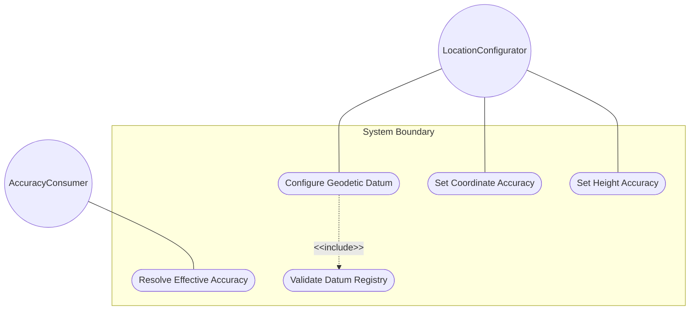
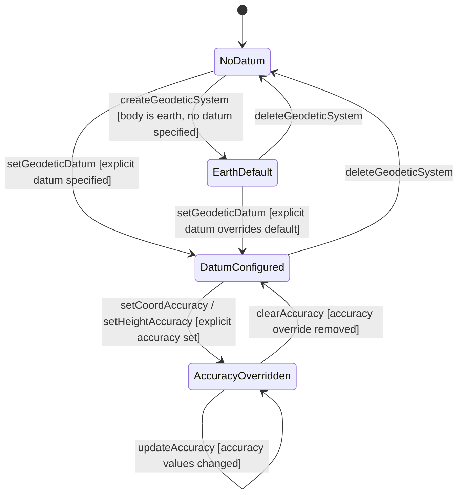

# Use Case: Configure Geodetic System with Datum and Accuracy Parameters

## Parent Epic
- [ ] #30 - [ietf-geo-location: Geographic Location Data Model](https://github.com/gintatkinson/3dgs-033/blob/main/docs/epics/epic-03-ietf-geo-location.md) (the geodetic-system container defines the coordinate reference system and accuracy metadata within the reference-frame)

## 1. Actors
- **Primary Actor:** LocationConfigurator — the operator configuring a geodetic datum and accuracy parameters for precise coordinate interpretation
- **Secondary Actors:** GeodeticSystemContainer, DatumAccuracyRegistry, AccuracyResolver

## 2. Preconditions
- A reference-frame container exists in the data tree with an astronomical-body value configured.
- The IANA "Geodetic System Values" registry is available for datum value lookup.
- The host module has write access to the geodetic-system sub-container.

## 3. Trigger
A LocationConfigurator needs to specify which geodetic datum defines the coordinate system for a geo-location, or override the default accuracy implied by the selected datum.

## 4. Main Success Scenario (Basic Flow)
1. The LocationConfigurator opens the geodetic-system container nested within the reference-frame.
2. The LocationConfigurator selects a geodetic-datum value from the IANA "Geodetic System Values" registry or enters a recognized datum identifier.
3. The GeodeticSystemContainer validates the datum string against the ASCII pattern constraint and normalizes it to lowercase with spaces converted to dashes.
4. The LocationConfigurator optionally configures a coord-accuracy value to override the horizontal accuracy implied by the datum.
5. The GeodeticSystemContainer validates coord-accuracy against the decimal64 6-fraction-digit type constraint.
6. The LocationConfigurator optionally configures a height-accuracy value in meters to override the vertical accuracy implied by the datum.
7. The GeodeticSystemContainer validates height-accuracy against the decimal64 6-fraction-digit type constraint.
8. The complete geodetic-system configuration is stored as part of the reference-frame.

## 5. Alternate and Exception Flows

- **5a. Geodetic datum contains control characters (branches from Basic Flow step 3):**
  1. The GeodeticSystemContainer receives a geodetic-datum value with a byte value outside the allowed pattern range [ -@\[-\^_-~]*.
  2. The GeodeticSystemContainer rejects the value with a pattern-validation error. The LocationConfigurator is notified of the invalid character.

- **5b. coord-accuracy exceeds 6 fraction-digit limit (branches from Basic Flow step 5):**
  1. The GeodeticSystemContainer receives a coord-accuracy value of 0.0000001 (7 decimal places).
  2. The GeodeticSystemContainer rejects the value with a fraction-digits constraint violation. The LocationConfigurator is notified that the value must not exceed 6 decimal places.

- **5c. height-accuracy exceeds 6 fraction-digit limit (branches from Basic Flow step 7):**
  1. The GeodeticSystemContainer receives a height-accuracy value with 7 or more decimal places.
  2. The GeodeticSystemContainer rejects the value with a fraction-digits constraint violation. The LocationConfigurator is notified.

- **5d. Geodetic datum unrecognized by IANA registry (branches from Basic Flow step 3):**
  1. The LocationConfigurator enters a geodetic-datum value not present in the IANA "Geodetic System Values" registry.
  2. The GeodeticSystemContainer accepts the value syntactically (it passes the pattern constraint) but flags a warning that the datum is unrecognized. Downstream accuracy resolution will be unable to determine datum-implied defaults, requiring explicit accuracy overrides.

## 6. Postconditions (Guarantees)
- **Success Guarantee:** The geodetic-system container is stored with a validated geodetic-datum (normalized to lowercase), optional coord-accuracy, and optional height-accuracy values, all compliant with their respective type constraints. The datum-implied default accuracy values serve as fallbacks when no explicit accuracy overrides are set. Coordinate interpretation components can query this container to determine the precision and coordinate system for the location data.
- **Failure Guarantee:** Any validation failure (pattern violation on datum, fraction-digit overflow on accuracy values) causes the entire geodetic-system write operation to be rejected. The container state is unchanged. The LocationConfigurator receives a descriptive error.

## UML Diagrams

### Use Case Diagram


### State Machine Diagram


## 7. Operational Context
> In addition to identifying the astronomical body, we also need to define the meaning of the coordinates (e.g., latitude and longitude) and the definition of 0-height. This is done with a 'geodetic-datum' value. The default value for 'geodetic-datum' is 'wgs-84' (i.e., the World Geodetic System), which is used by the Global Positioning System (GPS) among many others. We define an IANA registry for specifying standard values for the 'geodetic-datum'. (RFC 9179, Section 2.1)

> In addition to the 'geodetic-datum' value, we allow overriding the coordinate and height accuracy using 'coord-accuracy' and 'height-accuracy', respectively. When specified, these values override the defaults implied by the 'geodetic-datum' value. (RFC 9179, Section 2.1)

## 8. Realization Matrix

### Required User Stories
- [ ] #36 - [Resolve Effective Coordinate Accuracy from Datum Defaults and Explicit Overrides](https://github.com/gintatkinson/3dgs-033/blob/main/docs/user-stories/us-14-resolve-coordinate-accuracy-override.md) (the coord-accuracy and height-accuracy leaves in this container are the override values whose presence determines whether datum defaults or explicit accuracy values take effect)
- [ ] #34 - [Transform Between Ellipsoidal and Cartesian Coordinate Representations](https://github.com/gintatkinson/3dgs-033/blob/main/docs/user-stories/us-12-transform-ellipsoidal-cartesian-coordinates.md) (the geodetic-datum value selects the ellipsoid parameters required as mathematical inputs to coordinate transformation formulas)
- [ ] #35 - [Configure Geo-Location on a Non-Earth Astronomical Body](https://github.com/gintatkinson/3dgs-033/blob/main/docs/user-stories/us-13-configure-non-earth-astronomical-body.md) (the geodetic-datum leaf supports non-Earth datum values such as "me" for lunar coordinate systems alongside the astronomical-body selection)
- [ ] #31 - [Derive Speed and Heading from Velocity Vector Components](https://github.com/gintatkinson/3dgs-033/blob/main/docs/user-stories/us-09-derive-speed-heading-velocity.md) (the geodetic datum defines true north orientation used by the heading derivation and provides reference frame context for interpreting north/east directions)

### Required Features
- [ ] #25 - [Define Geodetic System](https://github.com/gintatkinson/3dgs-033/blob/main/docs/features/feat-13-geodetic-system.md) (defines the geodetic-system container with geodetic-datum, coord-accuracy, and height-accuracy leaf definitions, including ASCII pattern constraints, 6-fraction-digit precision, IANA registry integration, and accuracy override semantics)

## Source References
Structural Schema: [ietf-geo-location@2022-02-11.yang](https://github.com/YangModels/yang/blob/main/standard/ietf/RFC/ietf-geo-location%402022-02-11.yang) (Clause: container geodetic-system, leaf geodetic-datum, leaf coord-accuracy, leaf height-accuracy)
Normative Specification: [RFC 9179](https://datatracker.ietf.org/doc/rfc9179/) (Clause: Section 2.1, Frame of Reference; Section 6.1, Geodetic System Values Registry)

> [!WARNING]
> **Mermaid Block Closing Constraints & Code Fence Integrity:**
> - Every Mermaid diagram MUST be strictly closed with ``` ``` ``` on a new line. Leaking Mermaid blocks or stray/unclosed code fences will fail downstream validation checks.
> - **All Mermaid syntax constraints are defined in `rules/platform-independence.md` and MUST be observed in full** — including the prohibition on semicolons in `Note` and message text, colons in class members and note strings, stereotypes on relationship lines, and curly braces in class member lines. Do not maintain a local subset here; subsets drift (issue #289).

> **Container Traceability:** Every Use Case MUST declare its schema container in `schema_containers` with exactly one entry containing the container path and `node_type` (e.g. `- path: "module/ellipsoid", node_type: container`). Multi-container Use Cases are forbidden — the linter gate will reject files with `len(schema_containers) != 1`.
