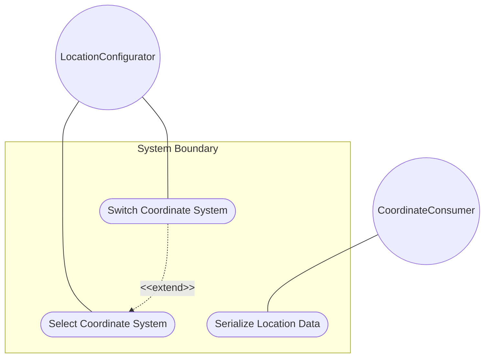
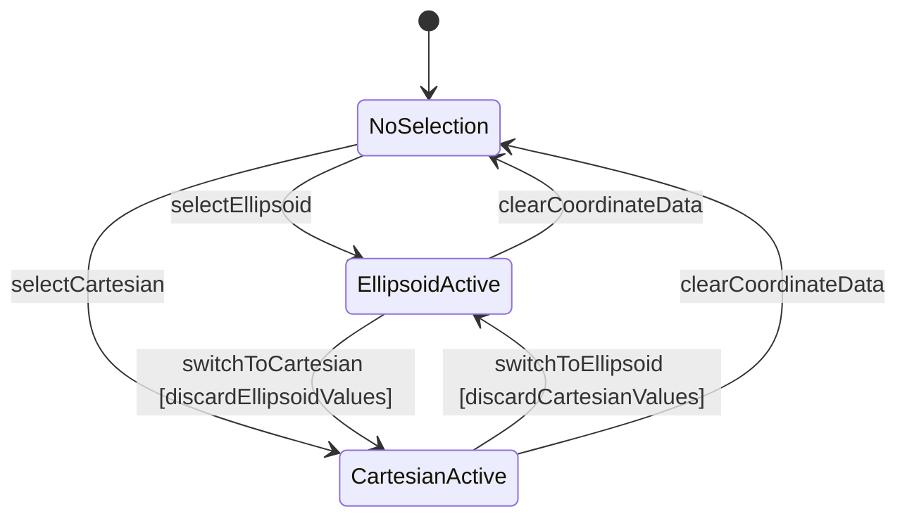

# Use Case: Select and Switch Between Location Coordinate Systems

## Parent Epic
- [ ] #30 - [ietf-geo-location: Geographic Location Data Model](https://github.com/gintatkinson/3dgs-033/blob/main/docs/epics/epic-03-ietf-geo-location.md) (the location choice node provides mutual exclusivity between ellipsoidal and Cartesian coordinate representations, allowing the geo-location to use exactly one coordinate system at a time)

## 1. Actors
- **Primary Actor:** LocationConfigurator — the operator selecting or toggling between ellipsoidal and Cartesian coordinate representations for a geo-location
- **Secondary Actors:** LocationChoiceDispatcher, CoordinateConsumer

## 2. Preconditions
- A geo-location container exists in the data tree.
- The reference-frame container is configured with an astronomical body and optionally a geodetic datum.
- The host module has write access to the location choice and its case leaves.

## 3. Trigger
A LocationConfigurator needs to specify the coordinate data for a geo-location and selects between ellipsoidal (latitude/longitude/height) and Cartesian (x/y/z) representation.

## 4. Main Success Scenario (Basic Flow)
1. The LocationConfigurator selects the location choice node within the geo-location container.
2. The LocationConfigurator selects the desired coordinate system: ellipsoidal (latitude, longitude, height) or Cartesian (x, y, z).
3. The LocationChoiceDispatcher activates the selected case and makes its leaf nodes available for configuration.
4. The LocationConfigurator enters coordinate values appropriate for the selected system.
5. The LocationChoiceDispatcher validates each entered value against the respective leaf type constraints.
6. The LocationChoiceDispatcher stores the coordinate data. Only the selected case's leaves are present in the data tree; the alternative case's leaves are absent.
7. A CoordinateConsumer queries the location data and receives the active coordinate representation.

## 5. Alternate and Exception Flows

- **5a. Geo-location without any coordinate choice selection (branches from Basic Flow step 2):**
  1. The LocationConfigurator creates a geo-location with reference-frame configured but leaves the location choice unselected.
  2. The LocationChoiceDispatcher stores the geo-location with no coordinate data. The location choice is optional — a geo-location may have no coordinate data at all.

- **5b. Switch from ellipsoidal to Cartesian discards ellipsoid values (branches from Basic Flow step 3):**
  1. The LocationConfigurator has an active ellipsoidal coordinate set (latitude=40.73, longitude=-74.01, height=35) and switches to Cartesian.
  2. The LocationChoiceDispatcher invalidates all ellipsoid case leaves. The ellipsoid values are discarded. The Cartesian leaf slots (x, y, z) appear empty and ready for new values.

- **5c. Switch from Cartesian to ellipsoidal discards Cartesian values (branches from Basic Flow step 3):**
  1. The LocationConfigurator has active Cartesian coordinates (x=1335832.5, y=-4652426.0, z=4138321.5) and switches to ellipsoidal.
  2. The LocationChoiceDispatcher invalidates all Cartesian case leaves. The Cartesian values are discarded. The ellipsoid leaf slots appear empty.

- **5d. Serialization enforces exclusive case membership (branches from Basic Flow step 6):**
  1. A data serialization operation is performed on a geo-location with ellipsoidal coordinates active.
  2. The LocationChoiceDispatcher ensures only the ellipsoid case leaves (latitude, longitude, height) appear in the serialized output. Cartesian leaves (x, y, z) are absent from the data tree, confirming the mutual exclusivity enforced by the YANG choice construct.

- **5e. Serialization with Cartesian active (branches from Basic Flow step 6):**
  1. A data serialization operation is performed on a geo-location with Cartesian coordinates active.
  2. The LocationChoiceDispatcher ensures only Cartesian leaves (x, y, z) are present. Ellipsoid leaves are absent from the serialized output.

## 6. Postconditions (Guarantees)
- **Success Guarantee:** The location choice stores exactly one active coordinate system with its corresponding leaf values. The alternative case is absent from the data tree. Consumers receive unambiguous coordinate data in a single representation. The mutual exclusivity enforced by the YANG choice construct prevents conflicting coordinate representations from coexisting.
- **Failure Guarantee:** If a switch between alternatives is aborted (e.g., the user cancels the confirmation prompt before discarding the previous case's values), the location choice remains in its prior state with the previously active case's data intact. No partial data loss occurs.

## UML Diagrams

### Use Case Diagram


### State Machine Diagram


## 7. Operational Context
> This is the location on, or relative to, the astronomical object. It is specified using two or three coordinate values. These values are given either as 'latitude', 'longitude', and an optional 'height', or as Cartesian coordinates of 'x', 'y', and 'z'. For the standard location choice, 'latitude' and 'longitude' are specified as decimal degrees, and the 'height' value is in fractions of meters. For the Cartesian choice, 'x', 'y', and 'z' are in fractions of meters. In both choices, the exact meanings of all the values are defined by the 'geodetic-datum' value in Section 2.1. (RFC 9179, Section 2.2)

## 8. Realization Matrix

### Required User Stories
- [ ] #34 - [Transform Between Ellipsoidal and Cartesian Coordinate Representations](https://github.com/gintatkinson/3dgs-033/blob/main/docs/user-stories/us-12-transform-ellipsoidal-cartesian-coordinates.md) (the location choice is the YANG choice node that enforces mutual exclusivity between the two coordinate representations, defining which system is active for a given transformation operation)

### Required Features
- [ ] #26 - [Define Location Coordinate Choice](https://github.com/gintatkinson/3dgs-033/blob/main/docs/features/feat-14-location-choice.md) (defines the location YANG choice node with its ellipsoid and cartesian cases, establishing the mutual exclusivity between coordinate alternatives and the optional nature of the choice)

## Source References
Structural Schema: [ietf-geo-location@2022-02-11.yang](https://github.com/YangModels/yang/blob/main/standard/ietf/RFC/ietf-geo-location%402022-02-11.yang) (Clause: choice location, case ellipsoid, case cartesian)
Normative Specification: [RFC 9179](https://datatracker.ietf.org/doc/rfc9179/) (Clause: Section 2.2, Location)

> [!WARNING]
> **Mermaid Block Closing Constraints & Code Fence Integrity:**
> - Every Mermaid diagram MUST be strictly closed with ``` ``` ``` on a new line. Leaking Mermaid blocks or stray/unclosed code fences will fail downstream validation checks.
> - **All Mermaid syntax constraints are defined in `rules/platform-independence.md` and MUST be observed in full** — including the prohibition on semicolons in `Note` and message text, colons in class members and note strings, stereotypes on relationship lines, and curly braces in class member lines. Do not maintain a local subset here; subsets drift (issue #289).

> **Container Traceability:** Every Use Case MUST declare its schema container in `schema_containers` with exactly one entry containing the container path and `node_type` (e.g. `- path: "module/ellipsoid", node_type: container`). Multi-container Use Cases are forbidden — the linter gate will reject files with `len(schema_containers) != 1`.
