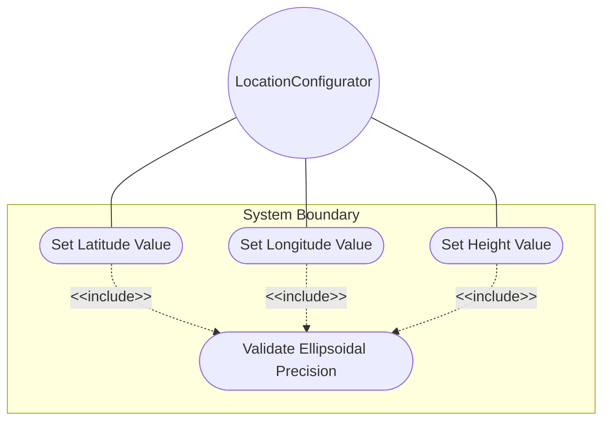
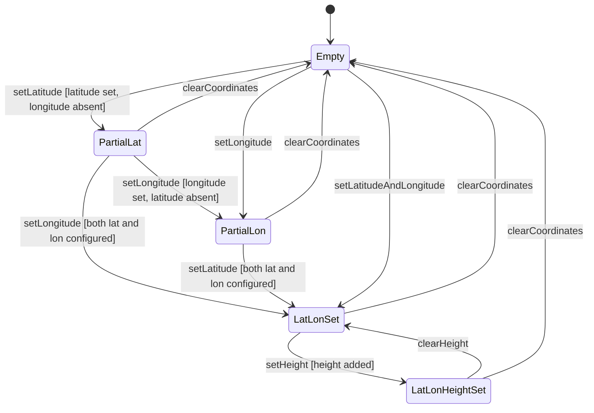

# Use Case: Configure Ellipsoidal Latitude-Longitude-Height Coordinates

## Parent Epic
- [ ] #30 - [ietf-geo-location: Geographic Location Data Model](https://github.com/gintatkinson/3dgs-033/blob/main/docs/epics/epic-03-ietf-geo-location.md) (the ellipsoid case within the location choice provides the latitude-longitude-height coordinate representation conforming to ISO 6709:2008)

## 1. Actors
- **Primary Actor:** LocationConfigurator — the operator entering geographic coordinates in latitude/longitude/height format for a geo-location
- **Secondary Actors:** EllipsoidCoordinatesValidator, CoordinateConsumer

## 2. Preconditions
- A geo-location container exists in the data tree with a configured reference-frame.
- The ellipsoid case is selected as the active alternative within the location choice.
- The host module has write access to the ellipsoid case leaves.

## 3. Trigger
A LocationConfigurator needs to specify a geographic point using latitude, longitude, and optional height coordinates expressed in decimal degrees and meters.

## 4. Main Success Scenario (Basic Flow)
1. The LocationConfigurator activates the ellipsoid case of the location choice.
2. The LocationConfigurator enters a latitude value in decimal degrees.
3. The EllipsoidCoordinatesValidator validates the latitude against the decimal64 16-fraction-digit type constraint.
4. The LocationConfigurator enters a longitude value in decimal degrees.
5. The EllipsoidCoordinatesValidator validates the longitude against the decimal64 16-fraction-digit type constraint.
6. The LocationConfigurator optionally enters a height value in meters.
7. The EllipsoidCoordinatesValidator validates the height against the decimal64 6-fraction-digit type constraint.
8. The validated ellipsoidal coordinates are stored as part of the geo-location. The precise meaning of the values is defined by the reference-frame's geodetic datum.

## 5. Alternate and Exception Flows

- **5a. Latitude value exceeds 16 fraction-digit limit (branches from Basic Flow step 3):**
  1. The EllipsoidCoordinatesValidator receives a latitude value with 17 or more decimal places.
  2. The EllipsoidCoordinatesValidator rejects the value with a fraction-digits constraint violation. The LocationConfigurator is notified that latitude must not exceed 16 decimal places.

- **5b. Longitude value exceeds 16 fraction-digit limit (branches from Basic Flow step 5):**
  1. The EllipsoidCoordinatesValidator receives a longitude value with 17 or more decimal places.
  2. The EllipsoidCoordinatesValidator rejects the value with a fraction-digits constraint violation. The LocationConfigurator is notified.

- **5c. Height value exceeds 6 fraction-digit limit (branches from Basic Flow step 7):**
  1. The EllipsoidCoordinatesValidator receives a height value with 7 or more decimal places.
  2. The EllipsoidCoordinatesValidator rejects the value with a fraction-digits constraint violation. The LocationConfigurator is notified.

- **5d. Latitude configured without longitude (branches from Basic Flow steps 3-4):**
  1. The LocationConfigurator sets latitude to 40.73297 but does not provide a longitude value.
  2. The EllipsoidCoordinatesValidator accepts latitude (individual leaves are optional) but flags a warning that the coordinate pair is incomplete for geographic positioning per ISO 6709:2008. The latitude is stored alone.

- **5e. Negative latitude for southern hemisphere (branches from Basic Flow step 3):**
  1. The LocationConfigurator enters a latitude of -33.8688 representing a location south of the equator.
  2. The EllipsoidCoordinatesValidator accepts the negative value. The range constraint (approximately -90 to +90 for Earth) is implied by the geodetic datum, not structurally enforced by the YANG type.

- **5f. Height set to zero at reference level (branches from Basic Flow step 7):**
  1. The LocationConfigurator sets height to 0.0, representing exactly at the reference zero level defined by the geodetic datum.
  2. The EllipsoidCoordinatesValidator accepts the value. The meaning of height 0.0 is entirely determined by the reference-frame's geodetic datum and astronomical body.

## 6. Postconditions (Guarantees)
- **Success Guarantee:** The ellipsoidal coordinate values (latitude, longitude, and optional height) are stored with their full configured precision. Latitude and longitude carry up to 16 fraction digits; height carries up to 6 fraction digits. The coordinate data is interpreted in the context of the parent reference-frame and geodetic datum. Consumers receive the coordinates in their stored precision.
- **Failure Guarantee:** Any validation failure (fraction-digit overflow for any leaf) causes the entire ellipsoid coordinate write operation to be rejected. The coordinate data tree is unchanged. The LocationConfigurator receives a descriptive error indicating which leaf violated its constraint.

## UML Diagrams

### Use Case Diagram


### State Machine Diagram


## 7. Operational Context
> This is the location on, or relative to, the astronomical object. It is specified using two or three coordinate values. These values are given either as 'latitude', 'longitude', and an optional 'height' ... For the standard location choice, 'latitude' and 'longitude' are specified as decimal degrees, and the 'height' value is in fractions of meters. (RFC 9179, Section 2.2)

> This specification conforms to [ISO.6709.2008]. (RFC 9179, Section 4)

## 8. Realization Matrix

### Required User Stories
- [ ] #34 - [Transform Between Ellipsoidal and Cartesian Coordinate Representations](https://github.com/gintatkinson/3dgs-033/blob/main/docs/user-stories/us-12-transform-ellipsoidal-cartesian-coordinates.md) (the ellipsoid case provides the latitude, longitude, and height values that serve as the source endpoint when transforming from ellipsoidal to Cartesian coordinates)
- [ ] #33 - [Inherit Reference Frame from Parent Container in Nested Location Hierarchies](https://github.com/gintatkinson/3dgs-033/blob/main/docs/user-stories/us-11-inherit-reference-frame-nested-locations.md) (ellipsoidal coordinate interpretation depends on the inherited reference-frame; the geodetic datum and astronomical body from the reference-frame define the semantic meaning of latitude and longitude)

### Required Features
- [ ] #27 - [Define Ellipsoid Coordinates](https://github.com/gintatkinson/3dgs-033/blob/main/docs/features/feat-15-ellipsoid-coordinates.md) (defines the ellipsoid case with latitude, longitude, and height leaf definitions at 16 and 6 fraction digits of precision respectively, in decimal degrees and meters, conforming to ISO 6709:2008)

## Source References
Structural Schema: [ietf-geo-location@2022-02-11.yang](https://github.com/YangModels/yang/blob/main/standard/ietf/RFC/ietf-geo-location%402022-02-11.yang) (Clause: case ellipsoid, leaf latitude, leaf longitude, leaf height)
Normative Specification: [RFC 9179](https://datatracker.ietf.org/doc/rfc9179/) (Clause: Section 2.2, Location; Section 4, ISO 6709:2008 Conformance)

> [!WARNING]
> **Mermaid Block Closing Constraints & Code Fence Integrity:**
> - Every Mermaid diagram MUST be strictly closed with ``` ``` ``` on a new line. Leaking Mermaid blocks or stray/unclosed code fences will fail downstream validation checks.
> - **All Mermaid syntax constraints are defined in `rules/platform-independence.md` and MUST be observed in full** — including the prohibition on semicolons in `Note` and message text, colons in class members and note strings, stereotypes on relationship lines, and curly braces in class member lines. Do not maintain a local subset here; subsets drift (issue #289).

> **Container Traceability:** Every Use Case MUST declare its schema container in `schema_containers` with exactly one entry containing the container path and `node_type` (e.g. `- path: "module/ellipsoid", node_type: container`). Multi-container Use Cases are forbidden — the linter gate will reject files with `len(schema_containers) != 1`.
