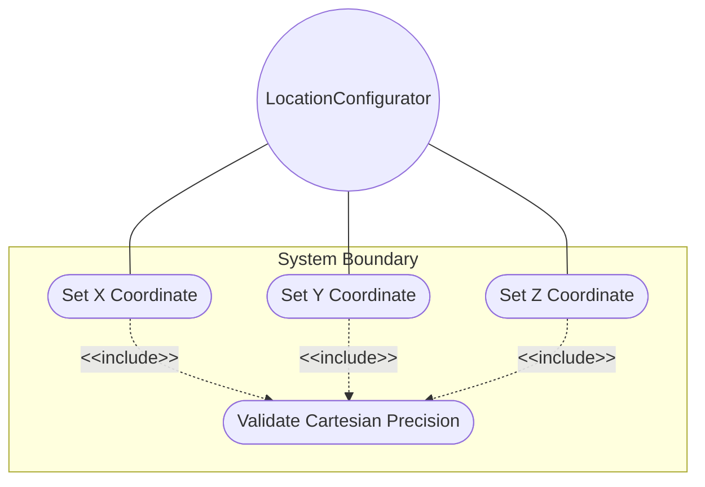
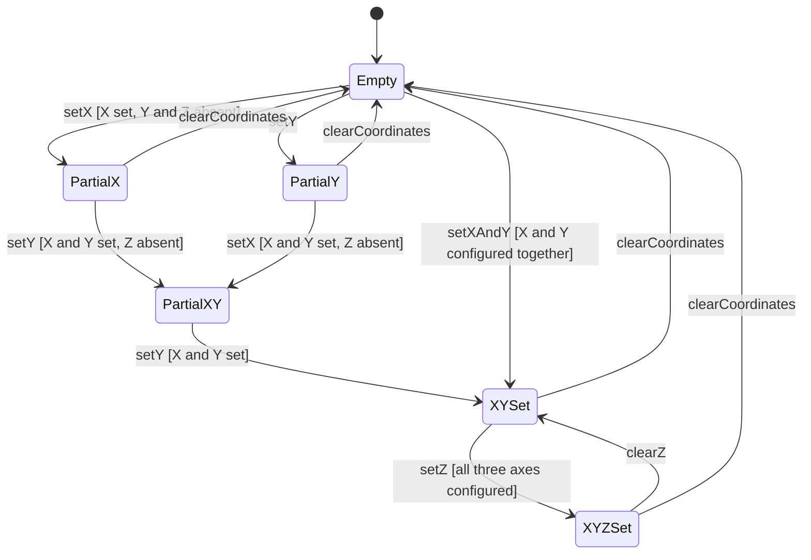

# Use Case: Configure Cartesian X-Y-Z Coordinates

## Parent Epic
- [ ] #30 - [ietf-geo-location: Geographic Location Data Model](https://github.com/gintatkinson/3dgs-033/blob/main/docs/epics/epic-03-ietf-geo-location.md) (the cartesian case within the location choice provides the X-Y-Z Cartesian coordinate representation for non-Earth bodies and coordinate transformations)

## 1. Actors
- **Primary Actor:** LocationConfigurator — the operator entering three-dimensional Cartesian coordinates (X, Y, Z) in meters for a geo-location
- **Secondary Actors:** CartesianCoordinatesValidator, CoordinateConsumer

## 2. Preconditions
- A geo-location container exists in the data tree with a configured reference-frame.
- The cartesian case is selected as the active alternative within the location choice.
- The host module has write access to the cartesian case leaves.

## 3. Trigger
A LocationConfigurator needs to specify a geographic point using three-dimensional Cartesian coordinates (X, Y, Z) measured in meters relative to the coordinate origin defined by the geodetic datum.

## 4. Main Success Scenario (Basic Flow)
1. The LocationConfigurator activates the cartesian case of the location choice.
2. The LocationConfigurator enters an X coordinate value in meters.
3. The CartesianCoordinatesValidator validates the X value against the decimal64 6-fraction-digit type constraint.
4. The LocationConfigurator enters a Y coordinate value in meters.
5. The CartesianCoordinatesValidator validates the Y value against the decimal64 6-fraction-digit type constraint.
6. The LocationConfigurator optionally enters a Z coordinate value in meters.
7. The CartesianCoordinatesValidator validates the Z value against the decimal64 6-fraction-digit type constraint.
8. The validated Cartesian coordinates are stored. The exact meaning of each axis and the coordinate origin are defined by the reference-frame's geodetic datum.

## 5. Alternate and Exception Flows

- **5a. X value exceeds 6 fraction-digit limit (branches from Basic Flow step 3):**
  1. The CartesianCoordinatesValidator receives an X value with 7 or more decimal places (e.g., 100.0000001).
  2. The CartesianCoordinatesValidator rejects the value with a fraction-digits constraint violation. The LocationConfigurator is notified.

- **5b. Y value exceeds 6 fraction-digit limit (branches from Basic Flow step 5):**
  1. The CartesianCoordinatesValidator receives a Y value with 7 or more decimal places.
  2. The CartesianCoordinatesValidator rejects the value with a fraction-digits constraint violation. The LocationConfigurator is notified.

- **5c. Z value exceeds 6 fraction-digit limit (branches from Basic Flow step 7):**
  1. The CartesianCoordinatesValidator receives a Z value with 7 or more decimal places.
  2. The CartesianCoordinatesValidator rejects the value with a fraction-digits constraint violation. The LocationConfigurator is notified.

- **5d. Partial Cartesian coordinate set (branches from Basic Flow steps 2-7):**
  1. The LocationConfigurator configures X and Y values but omits Z.
  2. The CartesianCoordinatesValidator accepts the partial set (all leaves are individually optional). The Z coordinate remains absent. Consumers receive only the configured axes.

- **5e. Height-accuracy not used with Cartesian coordinates (branches from Basic Flow step 8):**
  1. The geodetic-system container has height-accuracy set to 0.01 meters, but the location uses Cartesian coordinates.
  2. The CartesianCoordinatesValidator notes the height-accuracy value is present but semantically not applied to Cartesian X/Y/Z values per the specification. The height-accuracy applies only to ellipsoidal height coordinates.

- **5f. Zero coordinate at origin (branches from Basic Flow step 2):**
  1. The LocationConfigurator configures X=0.0, Y=0.0, Z=0.0 for a Cartesian location.
  2. The CartesianCoordinatesValidator accepts the values. They represent the coordinate origin as defined by the reference-frame and geodetic datum, which is meaningful (e.g., Earth-Centered Earth-Fixed origin for WGS-84).

- **5g. Attempt to write read-only Cartesian coordinates (branches from Basic Flow step 2):**
  1. The host module has declared the Cartesian coordinate leaves as config false in a specific usage context.
  2. The CartesianCoordinatesValidator rejects the write operation. The LocationConfigurator is notified that the coordinate leaves are read-only in this data instance and cannot be modified.

## 6. Postconditions (Guarantees)
- **Success Guarantee:** The Cartesian coordinate values (X, Y, Z) are stored with up to 6 fraction digits of precision in meters. The coordinate data is interpreted in the context of the parent reference-frame's geodetic datum, which defines the meaning of each axis and the coordinate origin. Consumers receive the coordinates in their stored precision.
- **Failure Guarantee:** Any validation failure (fraction-digit overflow for any leaf) causes the entire Cartesian coordinate write operation to be rejected. The coordinate data tree is unchanged. The LocationConfigurator receives a descriptive error.

## UML Diagrams

### Use Case Diagram


### State Machine Diagram


## 7. Operational Context
> This is the location on, or relative to, the astronomical object. It is specified using two or three coordinate values. These values are given ... as Cartesian coordinates of 'x', 'y', and 'z'. ... For the Cartesian choice, 'x', 'y', and 'z' are in fractions of meters. In both choices, the exact meanings of all the values are defined by the 'geodetic-datum' value in Section 2.1. (RFC 9179, Section 2.2)

> The accuracy of the latitude/longitude pair for ellipsoidal coordinates, or the X, Y, and Z components for Cartesian coordinates. When coord-accuracy is specified, it indicates how precisely the coordinates in the associated list of locations have been determined with respect to the coordinate system defined by the geodetic-datum. (RFC 9179, YANG schema — leaf coord-accuracy)

> The accuracy of the height value for ellipsoidal coordinates; this value is not used with Cartesian coordinates. (RFC 9179, YANG schema — leaf height-accuracy)

## 8. Realization Matrix

### Required User Stories
- [ ] #34 - [Transform Between Ellipsoidal and Cartesian Coordinate Representations](https://github.com/gintatkinson/3dgs-033/blob/main/docs/user-stories/us-12-transform-ellipsoidal-cartesian-coordinates.md) (the cartesian case provides the X, Y, Z values that serve as the source endpoint when transforming from Cartesian to ellipsoidal coordinates)

### Required Features
- [ ] #28 - [Define Cartesian Coordinates](https://github.com/gintatkinson/3dgs-033/blob/main/docs/features/feat-16-cartesian-coordinates.md) (defines the cartesian case with X, Y, and Z leaf definitions at 6 fraction digits of precision in meters, with axis meanings defined by the geodetic datum)

## Source References
Structural Schema: [ietf-geo-location@2022-02-11.yang](https://github.com/YangModels/yang/blob/main/standard/ietf/RFC/ietf-geo-location%402022-02-11.yang) (Clause: case cartesian, leaf x, leaf y, leaf z)
Normative Specification: [RFC 9179](https://datatracker.ietf.org/doc/rfc9179/) (Clause: Section 2.2, Location)

> [!WARNING]
> **Mermaid Block Closing Constraints & Code Fence Integrity:**
> - Every Mermaid diagram MUST be strictly closed with ``` ``` ``` on a new line. Leaking Mermaid blocks or stray/unclosed code fences will fail downstream validation checks.
> - **All Mermaid syntax constraints are defined in `rules/platform-independence.md` and MUST be observed in full** — including the prohibition on semicolons in `Note` and message text, colons in class members and note strings, stereotypes on relationship lines, and curly braces in class member lines. Do not maintain a local subset here; subsets drift (issue #289).

> **Container Traceability:** Every Use Case MUST declare its schema container in `schema_containers` with exactly one entry containing the container path and `node_type` (e.g. `- path: "module/ellipsoid", node_type: container`). Multi-container Use Cases are forbidden — the linter gate will reject files with `len(schema_containers) != 1`.
