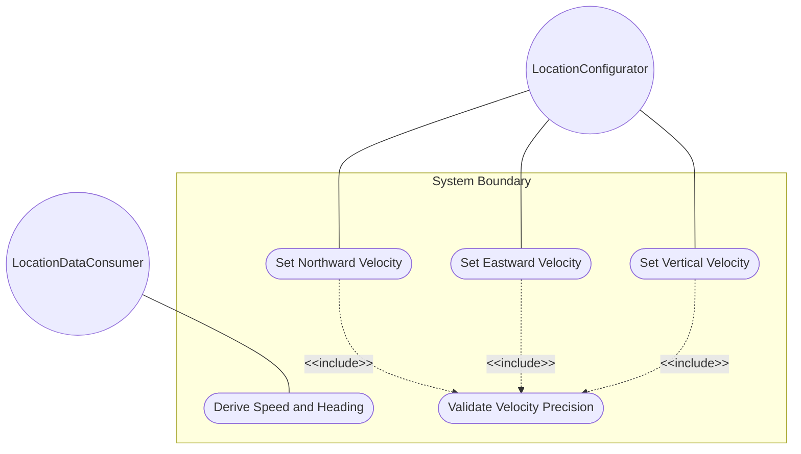
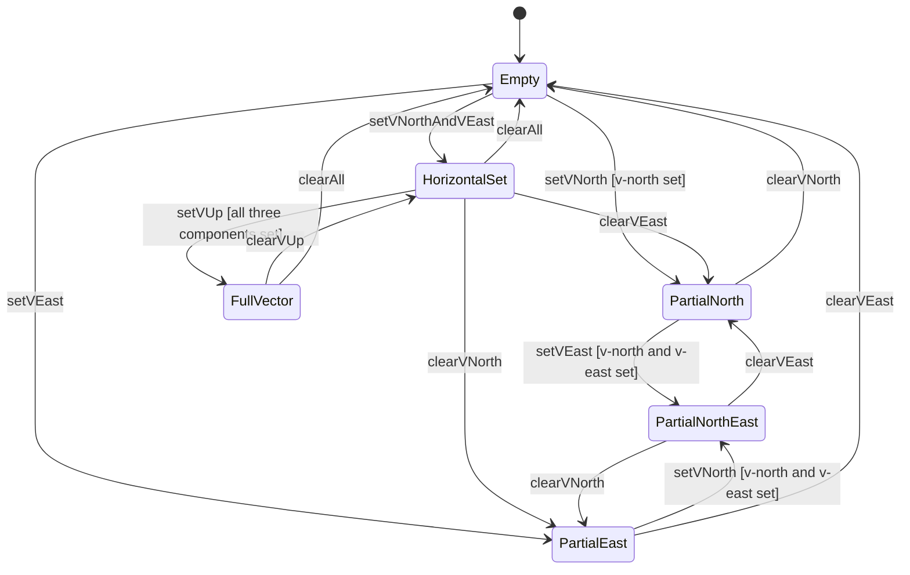

# Use Case: Configure and Derive Velocity Vector for Motion Tracking

## Parent Epic
- [ ] #30 - [ietf-geo-location: Geographic Location Data Model](https://github.com/gintatkinson/3dgs-033/blob/main/docs/epics/epic-03-ietf-geo-location.md) (the velocity container provides the three-dimensional motion vector for objects in relatively stable motion)

## 1. Actors
- **Primary Actor:** LocationConfigurator — the operator entering velocity component values to track the motion of a geo-located object
- **Secondary Actors:** VelocityContainer, SpeedHeadingCalculator, QuadrantResolver, LocationDataConsumer

## 2. Preconditions
- A geo-location container exists in the data tree with a configured reference-frame (providing true north reference for directional interpretation).
- A timestamp is recorded in the geo-location container to serve as the time reference for the velocity measurement.
- The host module has write access to the velocity sub-container.

## 3. Trigger
A LocationConfigurator needs to record the velocity of a geo-located object at the time given by the timestamp, specifying the three components of its motion vector (v-north, v-east, v-up) in meters per second.

## 4. Main Success Scenario (Basic Flow)
1. The LocationConfigurator opens the velocity container within the geo-location.
2. The LocationConfigurator enters a v-north value in meters per second representing northward speed.
3. The VelocityContainer validates v-north against the decimal64 12-fraction-digit type constraint.
4. The LocationConfigurator enters a v-east value in meters per second representing eastward speed.
5. The VelocityContainer validates v-east against the decimal64 12-fraction-digit type constraint.
6. The LocationConfigurator optionally enters a v-up value in meters per second representing vertical speed away from the center of mass.
7. The VelocityContainer validates v-up against the decimal64 12-fraction-digit type constraint.
8. The validated velocity vector is stored. A consumer may request derived speed and heading from the horizontal components.

## 5. Alternate and Exception Flows

- **5a. v-north value exceeds 12 fraction-digit limit (branches from Basic Flow step 3):**
  1. The VelocityContainer receives a v-north value with 13 or more decimal places.
  2. The VelocityContainer rejects the value with a fraction-digits constraint violation. The LocationConfigurator is notified.

- **5b. v-east value exceeds 12 fraction-digit limit (branches from Basic Flow step 5):**
  1. The VelocityContainer receives a v-east value with 13 or more decimal places.
  2. The VelocityContainer rejects the value with a fraction-digits constraint violation. The LocationConfigurator is notified.

- **5c. v-up value exceeds 12 fraction-digit limit (branches from Basic Flow step 7):**
  1. The VelocityContainer receives a v-up value with 13 or more decimal places.
  2. The VelocityContainer rejects the value with a fraction-digits constraint violation. The LocationConfigurator is notified.

- **5d. Negative velocity component (branches from Basic Flow step 2):**
  1. The LocationConfigurator enters a v-north value of -2.0 meters per second.
  2. The VelocityContainer accepts the negative value, representing motion toward true south. The SpeedHeadingCalculator correctly resolves the heading quadrant from the sign combination of the horizontal components.

- **5e. Velocity configured without timestamp (branches from Basic Flow step 8):**
  1. The LocationConfigurator stores velocity values without the parent geo-location having a timestamp configured.
  2. The VelocityContainer stores the velocity data but the time reference for the motion is semantically undefined. Consumers querying the velocity must independently assess whether the data is meaningful without a timestamp.

- **5f. Partial velocity vector with missing horizontal components (branches from Basic Flow steps 2-7):**
  1. The LocationConfigurator configures v-up but omits v-north and v-east.
  2. The VelocityContainer accepts the partial set (all leaves are individually optional), but a consumer requesting two-dimensional speed and heading receives a computation error: both horizontal components are required, and heading is not computable from vertical-only data.

- **5g. Derived speed and heading computed from high-precision components (branches from Basic Flow step 8):**
  1. A consumer queries velocity data with v-north=0.123456789012 and v-east=0.123456789012 at 12-fraction-digit precision.
  2. The SpeedHeadingCalculator computes speed = sqrt(v_north^2 + v_east^2) and heading = arctan(v_east / v_north) using the full 12-digit precision of the source components. The results are accurate within the precision limits of the decimal64 type without introducing unnecessary rounding errors upstream of the final display.

## 6. Postconditions (Guarantees)
- **Success Guarantee:** The velocity vector components (v-north, v-east, v-up) are stored in meters per second with up to 12 fraction digits of precision. Derived speed and heading values are computable from the horizontal components using the standard formulas speed = sqrt(v_north^2 + v_east^2) and heading = arctan(v_east / v_north). The velocity data is associated with the parent geo-location's timestamp as its time reference.
- **Failure Guarantee:** Any validation failure (fraction-digit overflow) causes the entire velocity write operation to be rejected. The velocity data tree is unchanged. The LocationConfigurator receives a descriptive error.

## UML Diagrams

### Use Case Diagram


### State Machine Diagram


## 7. Operational Context
> Support is added for objects in relatively stable motion. For objects in relatively stable motion, the grouping provides a three-dimensional vector value. The components of the vector are 'v-north', 'v-east', and 'v-up', which are all given in fractional meters per second. The values 'v-north' and 'v-east' are relative to true north as defined by the reference frame for the astronomical body; 'v-up' is perpendicular to the plane defined by 'v-north' and 'v-east', and is pointed away from the center of mass. (RFC 9179, Section 2.3)

> To derive the two-dimensional heading and speed, one would use the following formulas: speed = sqrt(v_north^2 + v_east^2), heading = arctan(v_east / v_north). (RFC 9179, Section 2.3)

> For some applications that demand high accuracy and where the data is infrequently updated, this velocity vector can track very slow movement such as continental drift. (RFC 9179, Section 2.3)

## 8. Realization Matrix

### Required User Stories
- [ ] #31 - [Derive Speed and Heading from Velocity Vector Components](https://github.com/gintatkinson/3dgs-033/blob/main/docs/user-stories/us-09-derive-speed-heading-velocity.md) (the v-north, v-east, and v-up leaves defined by this container serve as the source components for the speed and heading derivation formulas, including quadrant resolution for negative component values)
- [ ] #35 - [Configure Geo-Location on a Non-Earth Astronomical Body](https://github.com/gintatkinson/3dgs-033/blob/main/docs/user-stories/us-13-configure-non-earth-astronomical-body.md) (the reference-frame's astronomical body selection and geodetic datum determine true north orientation against which v-north, v-east directional velocity and derived heading are measured)

### Required Features
- [ ] #29 - [Define Velocity Vector](https://github.com/gintatkinson/3dgs-033/blob/main/docs/features/feat-17-velocity.md) (defines the velocity container with v-north, v-east, and v-up leaf definitions at 12 fraction digits in meters per second, providing the motion vector for objects in stable motion)

## Source References
Structural Schema: [ietf-geo-location@2022-02-11.yang](https://github.com/YangModels/yang/blob/main/standard/ietf/RFC/ietf-geo-location%402022-02-11.yang) (Clause: container velocity, leaf v-north, leaf v-east, leaf v-up)
Normative Specification: [RFC 9179](https://datatracker.ietf.org/doc/rfc9179/) (Clause: Section 2.3, Motion)

> [!WARNING]
> **Mermaid Block Closing Constraints & Code Fence Integrity:**
> - Every Mermaid diagram MUST be strictly closed with ``` ``` ``` on a new line. Leaking Mermaid blocks or stray/unclosed code fences will fail downstream validation checks.
> - **All Mermaid syntax constraints are defined in `rules/platform-independence.md` and MUST be observed in full** — including the prohibition on semicolons in `Note` and message text, colons in class members and note strings, stereotypes on relationship lines, and curly braces in class member lines. Do not maintain a local subset here; subsets drift (issue #289).

> **Container Traceability:** Every Use Case MUST declare its schema container in `schema_containers` with exactly one entry containing the container path and `node_type` (e.g. `- path: "module/ellipsoid", node_type: container`). Multi-container Use Cases are forbidden — the linter gate will reject files with `len(schema_containers) != 1`.
