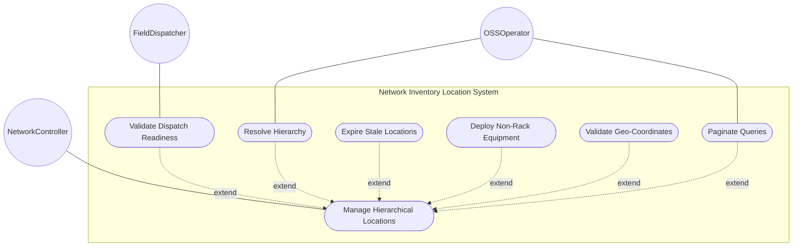
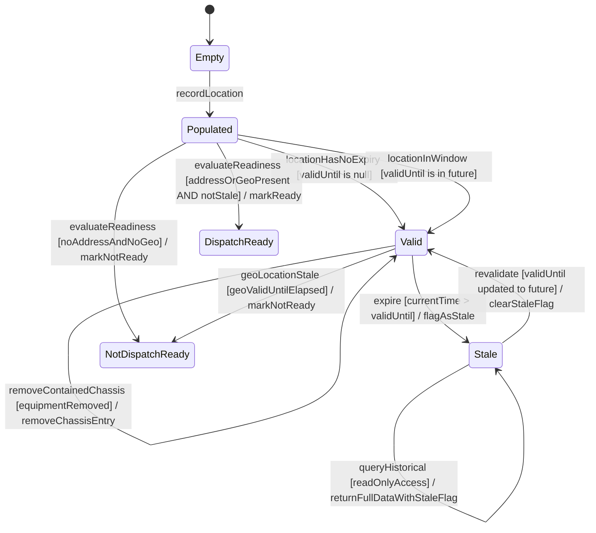

# Use Case: Manage Hierarchical Network Inventory Locations

## Parent Epic
- [ ] #49 - [ietf-ni-location: Network Inventory Location](https://github.com/gintatkinson/3dgs-033/blob/main/docs/epics/epic-04-ietf-ni-location.md) (the locations container is the top-level augment point anchoring all location data under the network inventory)

## 1. Actors
- **Primary Actor:** NetworkController — the controller system that maintains authoritative location data through automated tooling and serves as the data source for all location information
- **Secondary Actors:** OSSOperator — the operations support system that consumes read-only location data via YANG retrieval operations (NETCONF, RESTCONF); FieldDispatcher — the operational planning component that uses location data for field dispatch and planning decisions

## 2. Preconditions
- The base network inventory model (`ietf-network-inventory`) is loaded and accessible at `/nwi:network-inventory`
- The `ietf-ni-location` module has augmented `/nwi:network-inventory` with the `locations` container
- The `locations` container is in read-only (`config false`) operational state, populated with zero or more location entries
- Each location entry carries at minimum a unique `id` (list key) of type `string`

## 3. Trigger
A request is issued to the network controller to query, record, or validate location entries — initiated by automated tooling (RFID, geolocation services, manual controller entry) for data population, or by an OSS system for retrieval of location hierarchies, dispatch readiness evaluation, or equipment-to-location association queries.

## 4. Main Success Scenario (Basic Flow)
1. The NetworkController receives a location management request (query by id, query by hierarchy, record new location, or validate a location for operational readiness)
2. The NetworkController reads the `locations` container and locates the target location entry by its `id` key in the `location` list
3. The NetworkController resolves the location's `type` (e.g., "site", "building", "equipment room", "floor", "corridor", "pole", "roof") from the free-form string field and all optional common entity attributes (`uuid`, `name`, `alias`, `description`)
4. The NetworkController resolves the hierarchical parent-child chain by traversing the `parent` leafref from the location entry upward, following each level's `parent` reference until reaching a root location with no `parent` set
5. The NetworkController reads the `physical-address` sub-container to obtain the postal address fields (`address`, `postal-code`, `state`, `city`, `country-code`) for the location
6. The NetworkController reads the `geo-location` sub-container (imported via `geo:geo-location` grouping) to obtain geodetic coordinates, reference frame, and velocity data for the location
7. The NetworkController reads the `contained-chassis` list to enumerate chassis directly deployed at this location without a rack enclosure, resolving each `ne-ref` to the referenced network element and each `component-ref` to the specific chassis component
8. The NetworkController evaluates the `valid-until` timestamp against the current system time and determines whether the location is currently valid or stale
9. The NetworkController evaluates dispatch readiness by verifying that at least one of `physical-address` or `geo-location` data is present AND the `valid-until` is either absent or indicates a future time
10. The NetworkController returns the resolved location data to the requesting actor, including the full hierarchical path, associated chassis, temporal validity status, and dispatch readiness boolean

## 5. Alternate and Exception Flows
- **5a. Duplicate Location Identifier (Branches from Basic Flow step 1):**
  1. The NetworkController detects that the proposed `id` value for a new location entry already exists in the `location` list and violates the list key uniqueness constraint
  2. The NetworkController rejects the duplicate key, preserves the existing location data unchanged, and notifies the requesting actor with the conflicting id value and the existing location's name for disambiguation

- **5b. Invalid Parent Leafref (Branches from Basic Flow step 4):**
  1. The NetworkController encounters a `parent` leafref value that does not resolve to any existing `location/id` in the location list
  2. The NetworkController halts the hierarchy traversal at the current location, marks the parent reference as a dangling leafref, and returns the partial path with a warning status indicating the broken chain — the location data itself is preserved but the parent reference is flagged for operator attention

- **5c. Circular Parent Reference Detected (Branches from Basic Flow step 4):**
  1. During upward chain traversal, the NetworkController detects that a location's parent references an ancestor that has already been visited in the current traversal path, indicating a cycle (e.g., A → B → A)
  2. The NetworkController terminates traversal immediately to prevent infinite recursion, records the cycle with the ids of the involved locations, and returns the locations traversed up to the cycle entry point with a cycle-detected error status

- **5d. Maximum Hierarchy Depth Exceeded (Branches from Basic Flow step 4):**
  1. During upward chain traversal, the NetworkController counts the number of levels traversed and detects that it exceeds the configured maximum depth limit
  2. The NetworkController terminates traversal at the configured limit, returns the partial path up to the limit, and reports a depth-exceeded warning so that operators can investigate whether an excessively deep or pathological hierarchy has been created

- **5e. Location Validity Expired (Branches from Basic Flow step 8):**
  1. The NetworkController compares the `valid-until` timestamp against the current system time and finds that `valid-until` is in the past
  2. The NetworkController transitions the location record to the Stale state, marks it with a stale status flag, and returns the full location data (still readable for historical and forensic purposes) alongside the Stale indicator — the location MUST NOT be used for operational dispatch or planning

- **5f. Location Record Re-validated After Extension (Branches from Basic Flow step 8):**
  1. The NetworkController detects that a previously stale location's `valid-until` has been updated to a future timestamp
  2. The NetworkController transitions the location from Stale back to the Valid state, clears the stale status flag, and returns the location as current and operationally usable

- **5g. Dispatch Readiness Failed — No Spatial Addressing Data (Branches from Basic Flow step 9):**
  1. The NetworkController evaluates the readiness conditions and finds that neither `physical-address` nor `geo-location` data is present for the location
  2. The NetworkController marks the location as NOT dispatch-ready, returns a detailed readiness failure with the reason "no spatial addressing data available" (regardless of the `valid-until` value), and the location is excluded from dispatch and planning result sets

- **5h. Dispatch Readiness Failed — Geo-Location Data Stale (Branches from Basic Flow step 9):**
  1. The NetworkController finds that `physical-address` is absent and `geo-location` is present, but the geo-location sub-container's own `valid-until` timestamp has elapsed while the location-level `valid-until` is still in the future
  2. The NetworkController marks the location as NOT dispatch-ready because the geo-location data is stale — even though the location-level validity window remains open — and returns the composite readiness failure with both the location and geo-location validity statuses

- **5i. Contained-Chassis ne-ref Unresolved (Branches from Basic Flow step 7):**
  1. The NetworkController attempts to resolve a `contained-chassis` entry's `ne-ref` leafref against the network elements list and finds that the referenced `ne-id` does not exist
  2. The NetworkController marks the chassis entry with a dangling-reference flag, preserves the chassis-id and component-ref data, and returns the location's full contained-chassis list with the broken reference highlighted for operator remediation

- **5j. Contained-Chassis component-ref Invalid (Branches from Basic Flow step 7):**
  1. The NetworkController resolves the `ne-ref` successfully but finds that the `component-ref` leafref does not match any `component-id` within that network element's components list
  2. The NetworkController marks the chassis entry with a component-reference-error flag, preserves the chassis-id and ne-ref data, and returns the location's contained-chassis list with the invalid component reference highlighted

- **5k. Geographic Coordinate Range Violated (Branches from Basic Flow step 6):**
  1. The NetworkController reads the geo-location sub-container and validates ellipsoid coordinates: latitude must be in [-90.0, 90.0], longitude must be in [-180.0, 180.0], and the ellipsoid height must not exceed the configured maximum altitude for the astronomical body
   2. The NetworkController rejects the coordinate set with a range-violation error specifying which coordinate is out of bounds (latitude, longitude, or height) and its actual value versus the permitted range — the location entry remains in the inventory but the invalid geo-location is flagged

- **5l. Location Not Found — Nonexistent Identifier (Branches from Basic Flow step 2):**
  1. The NetworkController receives a query or update request for a location `id` that does not exist in the `location` list
  2. The NetworkController returns a location-not-found error specifying the requested id, and the request is terminated — no location data is created or modified

- **5m. Invalid UUID Format (Branches from Basic Flow step 3):**
  1. The NetworkController reads the `uuid` leaf and finds a value that does not conform to the `yang:uuid` type format (e.g., not a valid RFC 4122 UUID string)
  2. The NetworkController rejects the malformed UUID value, preserves any previously valid UUID unchanged, and returns a type-format violation error specifying the invalid value and the expected yang:uuid format

- **5n. Invalid Timestamp Format (Branches from Basic Flow step 3):**
  1. The NetworkController reads the `timestamp` leaf and finds a value that does not conform to the `yang:date-and-time` type format (e.g., missing timezone offset or invalid date components)
  2. The NetworkController rejects the malformed timestamp, preserves the previously recorded timestamp (if any) unchanged, and returns a format violation error

- **5o. Attempt to Write Read-Only Location Data (Branches from Basic Flow step 1):**
  1. An OSS system or external actor attempts to modify a location entry (e.g., change the `type`, update `physical-address`, or alter `contained-chassis`) despite the `config false` read-only constraint on the `locations` container
  2. The NetworkController (via the YANG datastore) rejects the write operation with a read-only violation error — the location data is not modified and the controller's authoritative data remains intact

- **5p. Chassis-ID Type Constraint Violation (Branches from Basic Flow step 7):**
  1. The NetworkController receives a `chassis-id` value for a `contained-chassis` entry that exceeds the uint32 maximum (4294967295) or is negative
  2. The NetworkController rejects the value with a type range violation error specifying the invalid chassis-id, the expected uint32 range (0 to 4294967295), and the affected location — the chassis entry is not created

## 6. Postconditions (Guarantees)
- **Success Guarantee:** The requested location data is returned with a fully resolved hierarchical path from the leaf location to the root, all contained-chassis entries resolved to their network elements and components, the temporal validity status determined (Valid or Stale based on `valid-until` comparison to current time), and the dispatch readiness boolean computed from the composite address/geo-location presence and validity-window conditions
- **Failure Guarantee:** If any critical constraint violation prevents completion (duplicate id, circular reference, or all contained-chassis references broken), the system rolls back to the state prior to the request, preserves all existing location data unchanged, and returns a structured error report enumerating each failed constraint with the specific location id, constraint type, and diagnostic detail

## UML Diagrams
### Use Case Diagram


### State Machine Diagram


## 7. Operational Context
> The "location" list is generalized to support a variety of geographic location, such as sites, rooms, buildings. (draft-ietf-ivy-network-inventory-location-06, Section 2)

> A site represents a general geographic location to group a set of NEs and corresponding inventory components. NEs, racks, equipment rooms, and buildings can be grouped within a site. (draft-ietf-ivy-network-inventory-location-06, Section 2)

> Locations can be nested to form a hierarchy. For example, buildings may be within a site, and a room may be within a building. (draft-ietf-ivy-network-inventory-location-06, Section 2)

> This model serves as a complement to the base inventory, providing a read-only perspective of network inventory location information known to the controller. It reports the physical locations of network elements and components installed in the network, enabling queries for site, rack, and other location-related information associated with network elements and components. (draft-ietf-ivy-network-inventory-location-06, Section 6)

> Before using a location for field dispatch or planning, verification is required to ensure at least one of physical-address or geo-location is present, and that the valid-until leaf is either not present or indicates a future time. Once the valid-until time has passed, the location MUST be considered stale and MUST NOT be used for operational purposes. (draft-ietf-ivy-network-inventory-location-06, Section 6)

> Data quality is indicated through timestamps recording the last update time, as well as an optional expiration time for location validity. (draft-ietf-ivy-network-inventory-location-06, Section 6)

> The model is designed based on the controller maintaining authoritative location data through automated tooling, while OSS systems consume this data as read-only operational state. Sources of controller location data may include RFID (Radio Frequency IDentification) tooling, geolocation services, as well as manual entry via controller interfaces. (draft-ietf-ivy-network-inventory-location-06, Section 6)

## 8. Realization Matrix
### Required User Stories
- [ ] #58 - [Validate Location Dispatch Readiness from Address, Geo-Location, and Validity Data](https://github.com/gintatkinson/3dgs-033/blob/main/docs/user-stories/us-16-validate-location-dispatch-readiness.md) (provides the composite dispatch readiness calculation: at least one of physical-address or geo-location present AND valid-until not elapsed)
- [ ] #50 - [Expire Location Record at valid-until Temporal Boundary](https://github.com/gintatkinson/3dgs-033/blob/main/docs/user-stories/us-17-expire-location-valid-until.md) (provides the temporal lifecycle management: Valid-to-Stale transition when valid-until elapses, and re-validation when validity is extended)
- [ ] #53 - [Resolve Hierarchical Location Parent-Child Chain to Root](https://github.com/gintatkinson/3dgs-033/blob/main/docs/user-stories/us-20-traverse-hierarchical-location-tree.md) (provides the parent leafref chain traversal with cycle detection, depth limiting, and dangling reference handling)
- [ ] #54 - [Deploy Distributed Network Element Across Multiple Physical Locations](https://github.com/gintatkinson/3dgs-033/blob/main/docs/user-stories/us-22-deploy-distributed-multi-chassis-ne.md) (provides the contained-chassis list recording with ne-ref and component-ref linking for distributed multi-location NEs)
- [ ] #55 - [Paginate Large Inventory Location Query Results](https://github.com/gintatkinson/3dgs-033/blob/main/docs/user-stories/us-23-paginate-large-inventory-queries.md) (provides the paginated retrieval mechanism for large location list result sets to avoid server overload)
- [ ] #56 - [Deploy Non-Rack Equipment Directly at a Location](https://github.com/gintatkinson/3dgs-033/blob/main/docs/user-stories/us-24-deploy-non-rack-equipment-at-location.md) (provides the non-rack equipment deployment recording via the contained-chassis list with chassis-id key, supporting ceiling-mounted and wall-mounted devices)
- [ ] #52 - [Validate Geographic Coordinate Ranges Against Bounded Constraints](https://github.com/gintatkinson/3dgs-033/blob/main/docs/user-stories/us-19-validate-geo-coordinate-ranges.md) (provides the ellipsoid and cartesian coordinate range validation for the geo:geo-location grouping used by the location entry)

### Required Features
- [ ] #45 - [Define Locations Container](https://github.com/gintatkinson/3dgs-033/blob/main/docs/features/feat-18-locations-container.md) (provides the locations container schema — the structural root with the location list, id key, parent leafref, type field, timestamp, valid-until, contained-chassis list, and the uses physical-address and uses geo:geo-location imports)

## Source References
Structural Schema: [ietf-ni-location.yang](https://github.com/ietf-ivy-wg/network-inventory-location/blob/main/ietf-ni-location.yang) (Clause: container locations, list location)
Normative Specification: [draft-ietf-ivy-network-inventory-location-06](https://datatracker.ietf.org/doc/html/draft-ietf-ivy-network-inventory-location) (Clause: Section 2, Hierarchical Locations of Network Inventory; Section 6, Operational Considerations)

> [!WARNING]
> **Mermaid Block Closing Constraints & Code Fence Integrity:**
> - Every Mermaid diagram MUST be strictly closed with ``` ``` ``` on a new line. Leaking Mermaid blocks (e.g. having headings like `##` inside an unclosed diagram) or stray/unclosed code fences will fail downstream validation checks.
> - Ensure there are no stray backticks or unmatched code fences in the document.
> - **All Mermaid syntax constraints are defined in `rules/platform-independence.md` and MUST be observed in full** — including the prohibition on semicolons in `Note` and message text, colons in class members and note strings, stereotypes on relationship lines, and curly braces in class member lines. Do not maintain a local subset here; subsets drift (issue #289).
