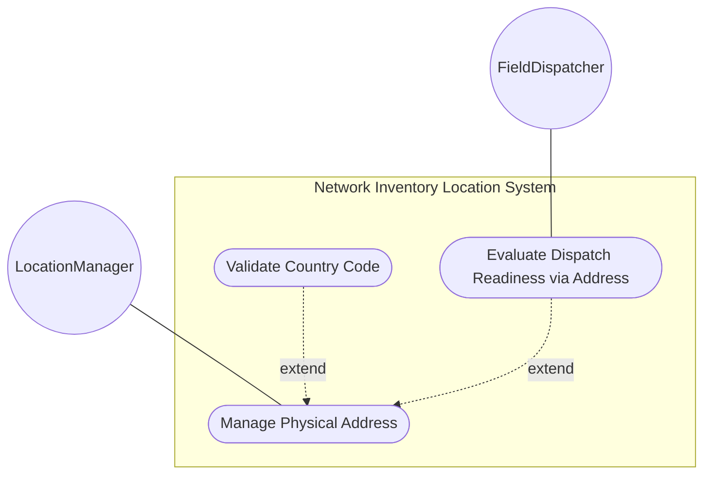
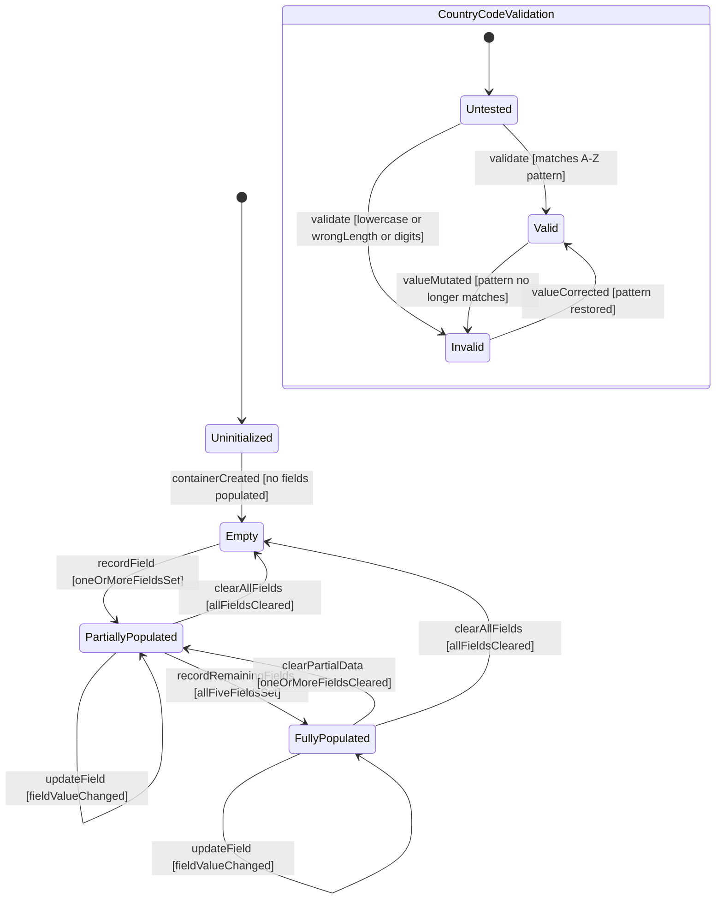

# Use Case: Manage Physical Address for Network Inventory Locations

## Parent Epic
- [ ] #49 - [ietf-ni-location: Network Inventory Location](https://github.com/gintatkinson/3dgs-033/blob/main/docs/epics/epic-04-ietf-ni-location.md) (the physical-address container is nested within each location entry and provides postal address details required for dispatch readiness evaluation)

## 1. Actors
- **Primary Actor:** LocationManager — the system component that manages physical address data for location entries, recording and retrieving postal address information
- **Secondary Actors:** FieldDispatcher — the operational planning component that reads physical address data to determine whether a location is dispatch-ready and to provide address context for field technicians

## 2. Preconditions
- A location entry exists in the `location` list with a valid unique `id`
- The `physical-address` container is available as a nested sub-container of the location entry (imported via the `physical-address` grouping)
- All five leaf nodes (`address`, `postal-code`, `state`, `city`, `country-code`) are individually optional — the container supports partial address recording
- The container and all its leafs are read-only (`config false`) as inherited from the parent location

## 3. Trigger
A request to record, query, or validate physical address data for a specific location entry — triggered by the controller during automated location data population, or by an OSS operator querying address information for dispatch and planning purposes.

## 4. Main Success Scenario (Basic Flow)
1. The LocationManager receives a physical address management request targeting a specific location entry by its `id`
2. The LocationManager reads the target location entry and navigates to its `physical-address` sub-container
3. The LocationManager retrieves or records each of the five postal address leafs: `address` (street address and number), `postal-code` (postal or ZIP code), `state` (state, province, or region descriptor), `city` (city or municipality name), and `country-code` (ISO ALPHA-2 two-letter uppercase country code)
4. The LocationManager validates the `country-code` leaf against the `[A-Z]{2}` pattern constraint — verifying the value consists of exactly two uppercase alphabetic characters
5. The LocationManager determines which of the five leafs are populated (enabling partial address support where only some fields are known) and which are absent
6. The LocationManager returns the physical address data to the requesting actor with each leaf's value (or a null indicator for unpopulated fields), the country-code validation result, and a completeness indicator noting which of the five fields are populated

## 5. Alternate and Exception Flows
- **5a. Country Code Rejected — Lowercase Characters (Branches from Basic Flow step 4):**
  1. The LocationManager reads the `country-code` leaf and finds a value such as "fr" containing lowercase alphabetic characters
  2. The LocationManager rejects the value because it does not match the `[A-Z]{2}` uppercase-only pattern constraint, returns a validation error specifying the actual value and the expected format "two uppercase alphabetic characters", and preserves any previously valid country-code value unchanged

- **5b. Country Code Rejected — Length Exceeds Two Characters (Branches from Basic Flow step 4):**
  1. The LocationManager reads the `country-code` leaf and finds a three-character value such as "USA" or a single-character value such as "U"
  2. The LocationManager rejects the value because the pattern constraint `[A-Z]{2}` requires exactly two characters — the length mismatch is detected and reported with the actual length versus the required length of two

- **5c. Country Code Rejected — Non-Alphabetic Characters (Branches from Basic Flow step 4):**
  1. The LocationManager reads the `country-code` leaf and finds a value such as "12" or "A1" containing numeric or special characters
  2. The LocationManager rejects the value because the pattern `[A-Z]{2}` exclusively permits uppercase alphabetic characters — the validation error specifies which characters in the value are non-conforming

- **5d. All Physical Address Fields Empty (Branches from Basic Flow step 5):**
  1. The LocationManager determines that none of the five physical-address leafs are populated — the container exists structurally but all fields carry null values
  2. The LocationManager returns the empty physical address container with an empty-state indicator, and notes that this location cannot satisfy the dispatch readiness "at least one of physical-address or geo-location is present" condition via the physical-address path, requiring the geo-location path to be evaluated as an alternative

- **5e. Physical Address Combined with Geo-Location for Dispatch Readiness (Branches from Basic Flow step 6):**
  1. The LocationManager evaluates the readiness conditions and finds that physical-address data is present AND the `valid-until` timestamp is either absent or in the future
  2. The LocationManager marks the location as dispatch-ready via the physical-address path and short-circuits further geo-location evaluation — the dispatch readiness boolean is set to true based on physical-address presence alone

- **5f. Partial Address with Only City and Country-Code (Branches from Basic Flow step 3):**
  1. The LocationManager finds that only `city` and `country-code` are populated while `address`, `postal-code`, and `state` are null
   2. The LocationManager accepts the partial address without requiring all fields, marks the container as partially populated, and returns the populated fields alongside null indicators for the absent fields — the presence of any physical-address data satisfies the "at least one" condition for dispatch readiness

- **5g. State Field Used as Region Descriptor for Countries Without States (Branches from Basic Flow step 3):**
  1. The LocationManager processes a location in a country that does not have formal state or province subdivisions — the `state` leaf is populated with a region name (e.g., "Bavaria", "Tuscany") instead of a political state
  2. The LocationManager stores the region descriptor in the `state` leaf without performing semantic validation of state subdivisions — the value is accepted as a valid string in the optional state field and returned as part of the physical address data

## 6. Postconditions (Guarantees)
- **Success Guarantee:** The physical address container for the target location is populated (fully or partially) with validated postal address data, the country-code has passed the `[A-Z]{2}` pattern constraint check, and the populated-fields mask indicates which of the five leafs carry valid data — the location's dispatch readiness status is updated to reflect the presence of physical address as a spatial addressing data source
- **Failure Guarantee:** If any country-code validation failure occurs (lowercase, wrong length, non-alphabetic), the invalid value is rejected, the previously valid country-code (if any) is preserved unchanged, and a structured validation error is returned — all other valid address fields remain unaffected and the location's dispatch readiness status is re-evaluated based on the remaining valid fields

## UML Diagrams
### Use Case Diagram


### State Machine Diagram


## 7. Operational Context
> The Network Inventory location model is to record physical locations, such as sites, building, equipment rooms, racks, and so on. Additionally, it includes provisions for physical addresses or geo-location data (geographic coordinates). The location model augments the base network inventory to enrich NEs with location information. (draft-ietf-ivy-network-inventory-location-06, Section 1)

> Before using a location for field dispatch or planning, verification is required to ensure at least one of physical-address or geo-location is present, and that the valid-until leaf is either not present or indicates a future time. (draft-ietf-ivy-network-inventory-location-06, Section 6)

> Specifies a country. Expressed as ISO ALPHA-2 code. (ietf-ni-location.yang — leaf country-code)

## 8. Realization Matrix
### Required User Stories
- [ ] #58 - [Validate Location Dispatch Readiness from Address, Geo-Location, and Validity Data](https://github.com/gintatkinson/3dgs-033/blob/main/docs/user-stories/us-16-validate-location-dispatch-readiness.md) (the physical-address container is one of the two spatial addressing data sources checked in the "at least one of physical-address or geo-location is present" readiness condition, and partial addresses with any populated field satisfy this condition)

### Required Features
- [ ] #46 - [Define Physical Address](https://github.com/gintatkinson/3dgs-033/blob/main/docs/features/feat-19-physical-address.md) (provides the physical-address container schema with five optional string leafs — address, postal-code, state, city, and country-code with the [A-Z]{2} pattern constraint — nested within each location entry)

## Source References
Structural Schema: [ietf-ni-location.yang](https://github.com/ietf-ivy-wg/network-inventory-location/blob/main/ietf-ni-location.yang) (Clause: grouping physical-address, container physical-address, leafs address postcode state city country-code)
Normative Specification: [draft-ietf-ivy-network-inventory-location-06](https://datatracker.ietf.org/doc/html/draft-ietf-ivy-network-inventory-location) (Clause: Section 2, Hierarchical Locations of Network Inventory; Section 6, Operational Considerations)

> [!WARNING]
> **Mermaid Block Closing Constraints & Code Fence Integrity:**
> - Every Mermaid diagram MUST be strictly closed with ``` ``` ``` on a new line. Leaking Mermaid blocks (e.g. having headings like `##` inside an unclosed diagram) or stray/unclosed code fences will fail downstream validation checks.
> - Ensure there are no stray backticks or unmatched code fences in the document.
> - **All Mermaid syntax constraints are defined in `rules/platform-independence.md` and MUST be observed in full** — including the prohibition on semicolons in `Note` and message text, colons in class members and note strings, stereotypes on relationship lines, and curly braces in class member lines. Do not maintain a local subset here; subsets drift (issue #289).
