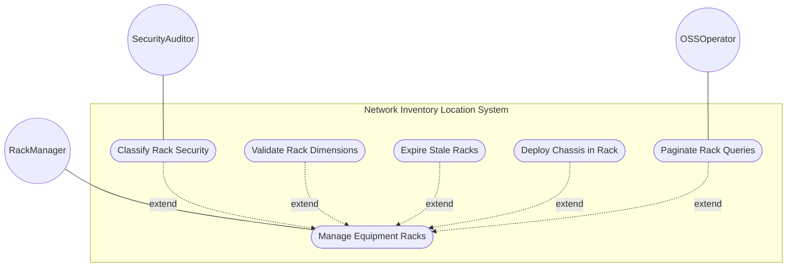
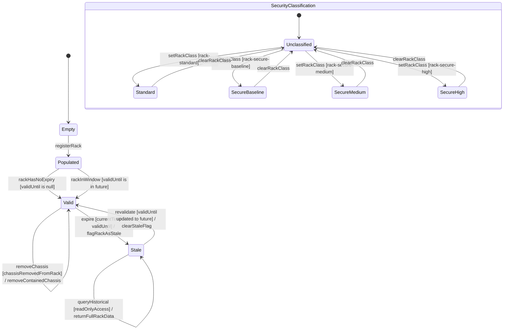

# Use Case: Manage Physical Equipment Racks in Network Inventory

## Parent Epic
- [ ] #49 - [ietf-ni-location: Network Inventory Location](https://github.com/gintatkinson/3dgs-033/blob/main/docs/epics/epic-04-ietf-ni-location.md) (the racks container is a top-level sibling of the location list inside the locations container and holds all physical equipment rack records)

## 1. Actors
- **Primary Actor:** RackManager — the system component that manages physical equipment rack inventory data, including rack registration, dimensional and electrical specifications, security classification, and contained-chassis tracking
- **Secondary Actors:** OSSOperator — the operations support system that consumes read-only rack data via YANG retrieval for equipment placement and capacity planning; SecurityAuditor — the security governance component that queries rack security classifications to assess physical protection levels

## 2. Preconditions
- The `locations` container is loaded and available with the `racks` sub-container accessible
- The `racks` container is in read-only (`config false`) operational state, populated with zero or more rack entries
- Each rack entry carries at minimum a unique `id` (list key) of type `string`
- The `rack-class-type` identity hierarchy is defined with four standard derived identities: `rack-standard`, `rack-secure-baseline`, `rack-secure-medium`, `rack-secure-high`
- The `ni-location-ref` typedef is available for rack-location referential integrity

## 3. Trigger
A request is issued to register a new rack, query rack specifications, assign a security classification, record chassis installation within a rack, or evaluate rack data validity — initiated by automated tooling, controller provisioning, or an OSS operator querying rack inventory.

## 4. Main Success Scenario (Basic Flow)
1. The RackManager receives a rack management request targeting the `racks` container — the request may be a query by rack id, a new rack registration, a security classification assignment, or a contained-chassis update
2. The RackManager locates the target rack entry by its `id` key in the `rack` list, or allocates a new unique id for a rack registration
3. The RackManager reads or populates the rack's optional common entity attributes (`uuid`, `name`, `alias`, `description`) via the base inventory model's `basic-common-entity-attributes` grouping
4. The RackManager resolves the rack's `rack-class` identityref value against the `rack-class-type` base identity hierarchy, mapping it to one of the four standard security classifications or a vendor extension
5. The RackManager reads the rack's physical dimensions — `height`, `width`, `depth` — in millimeters (uint16, units "millimeter") and electrical specifications — `max-voltage` in volts (uint16, units "volt") and `max-allocated-power` in watts (uint16, units "watts")
6. The RackManager reads the rack's `rack-location` sub-container to obtain `location-ref` (leafref to a location id), `row-number`, and `column-number` for grid-based positioning
7. The RackManager reads the `contained-chassis` list, keyed by `relative-position` (uint8 representing the U-slot), resolving each `ne-ref` to the referenced network element and each `component-ref` to the specific chassis component within that element
8. The RackManager evaluates the `valid-until` timestamp against the current system time and determines whether the rack data is Valid or Stale
9. The RackManager reads the `timestamp` leaf to report when the rack information was last captured
10. The RackManager returns the resolved rack data to the requesting actor, including all dimensional and electrical specifications with unit annotations, the security classification label, the resolved contained-chassis entries, and the temporal validity status

## 5. Alternate and Exception Flows
- **5a. Duplicate Rack Identifier (Branches from Basic Flow step 2):**
  1. The RackManager detects that the proposed `id` value for a new rack entry already exists in the `rack` list and violates the list key uniqueness constraint
  2. The RackManager rejects the duplicate key, preserves the existing rack data unchanged, and notifies the requesting actor with the conflicting id value and the existing rack's name for disambiguation

- **5b. Rack Dimension Exceeds uint16 Maximum (Branches from Basic Flow step 5):**
  1. The RackManager receives a rack dimensional value (height, width, or depth) greater than 65535 (e.g., 70000 millimeters for height)
  2. The RackManager rejects the value with a type range violation error specifying the offending field name, the actual value, and the uint16 maximum of 65535 — the value is not stored and the previously valid dimension (if any) is preserved

- **5c. Electrical Specification Exceeds uint16 Maximum (Branches from Basic Flow step 5):**
  1. The RackManager receives a `max-voltage` or `max-allocated-power` value exceeding the uint16 maximum of 65535
  2. The RackManager rejects the value with a type range violation error specifying the offending field name (max-voltage or max-allocated-power), the actual value, and the uint16 maximum — the previously valid value is preserved unchanged

- **5d. Rack Security Classification — Invalid Identity (Branches from Basic Flow step 4):**
  1. The RackManager receives a `rack-class` identityref value that is not derived from the `rack-class-type` base identity hierarchy
  2. The YANG datastore rejects the value because the identityref base constraint (`base rack-class-type`) restricts valid values to identities inheriting from rack-class-type — the RackManager returns a classification error specifying the invalid identity and the required base identity

- **5e. Rack Validity Expired (Branches from Basic Flow step 8):**
  1. The RackManager compares the `valid-until` timestamp against the current system time and finds that it has elapsed
  2. The RackManager transitions the rack record to the Stale state, marks it with a stale status flag, and returns the full rack data (still readable for historical inventory reporting) alongside the Stale indicator — the rack's dimensional, electrical, and location data is preserved but marked as no longer current for operational placement decisions

- **5f. Rack Record Re-validated After Extension (Branches from Basic Flow step 8):**
  1. The RackManager detects that a previously stale rack's `valid-until` has been updated to a future timestamp
  2. The RackManager transitions the rack from Stale back to the Valid state, clears the stale status flag, and returns the rack data as current — dimensional specifications, power capacity, and placement data are once again considered operationally valid

- **5g. Rack Contained-Chassis relative-position Exceeds uint8 Maximum (Branches from Basic Flow step 7):**
  1. The RackManager receives a `relative-position` value greater than 255 for a contained-chassis entry (uint8 maximum)
  2. The RackManager rejects the value with a type range violation error specifying the actual value and the uint8 maximum of 255 — the chassis entry is not created and the rack's contained-chassis list is preserved unchanged

- **5h. Rack Contained-Chassis ne-ref Unresolved (Branches from Basic Flow step 7):**
  1. The RackManager attempts to resolve a contained-chassis entry's `ne-ref` leafref against the network elements list and finds that the referenced `ne-id` does not exist
  2. The RackManager marks the contained-chassis entry with a dangling-reference flag, preserves the relative-position and component-ref data, and returns the rack's full contained-chassis list with the broken ne-ref highlighted for operator remediation

- **5i. Rack Contained-Chassis component-ref Invalid (Branches from Basic Flow step 7):**
  1. The RackManager resolves the `ne-ref` successfully but finds that the `component-ref` leafref does not match any `component-id` within that network element's components list
  2. The RackManager marks the contained-chassis entry with a component-reference-error flag, preserves the relative-position and ne-ref data, and returns the rack's contained-chassis list with the invalid component reference highlighted

- **5j. Negative Value for Unsigned Integer Fields (Branches from Basic Flow step 5):**
  1. The RackManager receives a negative value for any uint16 field (height, width, depth, max-voltage, max-allocated-power) or a negative value for the uint8 relative-position field
  2. The RackManager rejects the negative value because unsigned integer types do not permit negative values — the type violation error specifies the field name, the negative value, and the expected unsigned integer range

- **5k. Rack With No Security Classification (Branches from Basic Flow step 4):**
  1. The RackManager finds that a rack entry has no `rack-class` value configured
   2. The RackManager returns the rack with an Unclassified security status — no default classification is assumed, and the rack-location, dimensions, and power specifications remain independently valid

- **5l. Rack Not Found — Nonexistent Identifier (Branches from Basic Flow step 2):**
  1. The RackManager receives a query or update request for a rack `id` that does not exist in the `rack` list
  2. The RackManager returns a rack-not-found error specifying the requested id and terminates the request — no rack data is created or modified

- **5m. Invalid UUID Format (Branches from Basic Flow step 3):**
  1. The RackManager reads the `uuid` leaf and finds a value that does not conform to the `yang:uuid` type format (not a valid RFC 4122 UUID)
  2. The RackManager rejects the malformed UUID value, preserves any previously valid UUID unchanged, and returns a type-format violation error

- **5n. Invalid Timestamp Format (Branches from Basic Flow step 9):**
  1. The RackManager reads the `timestamp` leaf and finds a value that does not conform to the `yang:date-and-time` type format (missing timezone offset or invalid date components)
  2. The RackManager rejects the malformed timestamp, preserves the previously recorded timestamp unchanged, and returns a format violation error

- **5o. Invalid Valid-Until Timestamp Format (Branches from Basic Flow step 8):**
  1. The RackManager reads the `valid-until` leaf and finds a value that does not conform to the `yang:date-and-time` type format
  2. The RackManager rejects the malformed value — since the validity boundary cannot be reliably determined from a malformed timestamp, the rack is flagged with a ValidityUndetermined status until the value is corrected

- **5p. Vendor-Extended Rack Class Identity Accepted (Branches from Basic Flow step 4):**
  1. The RackManager receives a `rack-class` identityref value referencing a vendor-specific identity (e.g., `rack-secure-vendor-bio`) that is derived from the `rack-class-type` base identity
  2. The RackManager recognizes the vendor extension as a valid derivative of rack-class-type, accepts the classification without requiring core model modification, and returns the vendor-specific classification label in the rack data

- **5q. Rack With Empty Name and Alias Fields (Branches from Basic Flow step 3):**
  1. The RackManager finds that a rack entry has no `name` or `alias` populated — only the mandatory `id` string identifies the rack
  2. The RackManager returns the rack data with the name and alias fields carrying null indicators — the rack is identified solely by its id, which is sufficient for inventory operations

- **5r. Rack Description Exceeds Practical Length Limit (Branches from Basic Flow step 3):**
  1. The RackManager reads the `description` leaf and finds a string value exceeding the practical rendering or system-imposed length limit for free-text fields
  2. The RackManager truncates the description to the allowed maximum length and returns the truncated value alongside a warning indicating the original length was reduced — the rack remains fully functional

- **5s. Query Returns Empty Rack List (Branches from Basic Flow step 1):**
  1. The RackManager receives a query for all racks but the `rack` list contains zero entries — no racks have been registered in the inventory
  2. The RackManager returns an empty result set with a status indicator confirming that the query executed successfully but no rack data is available for retrieval

- **5t. Height Dimension Set to Zero (Branches from Basic Flow step 5):**
  1. The RackManager receives a `height` value of 0 millimeters for a rack — while 0 is a valid uint16 value, it represents a physically impossible rack dimension
  2. The RackManager accepts the value per the schema (uint16 permits 0) but flags the rack with a suspicious-dimension warning so that operators can review and correct the physical specification

## 6. Postconditions (Guarantees)
- **Success Guarantee:** The rack data is returned with all physical dimensions (millimeters) and electrical specifications (volts, watts) resolved with their unit annotations, the security classification mapped from the identityref to a human-readable label (or Unclassified), all contained-chassis entries resolved to their network elements and components with U-slot positions, and the temporal validity status determined (Valid or Stale) — the rack is available for equipment placement, capacity planning, and security audit queries
- **Failure Guarantee:** If any type range violation (uint16/uint8 overflow, negative value) or identityref resolution failure occurs, the invalid value is rejected, the previously valid data for the affected field is preserved, and a structured error report is returned — all other valid rack fields remain intact and the rack continues to be queryable with its valid subset of data

## UML Diagrams
### Use Case Diagram


### State Machine Diagram


## 7. Operational Context
> "racks" represent physical equipment racks in which NEs can be installed, which facilitate device maintenance. Through "rack-location", each rack can be assigned to a site or a specific location within a site, such as an equipment room. (draft-ietf-ivy-network-inventory-location-06, Section 3)

> Each rack is assigned a unique ID and a name in the context of a facility, e.g. a site. A rack may have some specific attributes, such as appearance-related attributes and electricity-related attributes. The height, depth and width are described by Figure 2 (please consider that the door of the rack is facing the user). (draft-ietf-ivy-network-inventory-location-06, Section 3)

> Max-voltage: the maximum voltage supported by the rack. (draft-ietf-ivy-network-inventory-location-06, Section 3)

> Note: Further discussion is needed to decide whether to separate "racks" from the list of "location". (draft-ietf-ivy-network-inventory-location-06, Section 3)

> The model is designed based on the controller maintaining authoritative location data through automated tooling, while OSS systems consume this data as read-only operational state. (draft-ietf-ivy-network-inventory-location-06, Section 6)

## 8. Realization Matrix
### Required User Stories
- [ ] #51 - [Expire Rack Record at valid-until Temporal Boundary](https://github.com/gintatkinson/3dgs-033/blob/main/docs/user-stories/us-18-expire-rack-valid-until.md) (provides the rack temporal lifecycle management: Valid-to-Stale transition when rack valid-until elapses, and re-validation when rack validity is extended to a future time)
- [ ] #54 - [Deploy Distributed Network Element Across Multiple Physical Locations](https://github.com/gintatkinson/3dgs-033/blob/main/docs/user-stories/us-22-deploy-distributed-multi-chassis-ne.md) (provides the rack-side of distributed NE deployment — recording chassis in rack contained-chassis lists across multiple rooms, with relative-position U-slot tracking)
- [ ] #55 - [Paginate Large Inventory Location Query Results](https://github.com/gintatkinson/3dgs-033/blob/main/docs/user-stories/us-23-paginate-large-inventory-queries.md) (provides paginated retrieval for the rack list in large-scale data center deployments with hundreds of racks)
- [ ] #57 - [Resolve Rack Security Classification from Extensible Identity Hierarchy](https://github.com/gintatkinson/3dgs-033/blob/main/docs/user-stories/us-25-resolve-rack-security-classification.md) (provides the identityref resolution and security classification mapping from the rack-class-type hierarchy to operational security postures)

### Required Features
- [ ] #47 - [Define Racks Container](https://github.com/gintatkinson/3dgs-033/blob/main/docs/features/feat-20-racks-container.md) (provides the racks container schema with the rack list, id key, rack-class identityref, physical dimensions, electrical specifications, contained-chassis list, and temporal metadata)

## Source References
Structural Schema: [ietf-ni-location.yang](https://github.com/ietf-ivy-wg/network-inventory-location/blob/main/ietf-ni-location.yang) (Clause: grouping racks, container racks, list rack, identities rack-class-type rack-standard rack-secure-baseline rack-secure-medium rack-secure-high)
Normative Specification: [draft-ietf-ivy-network-inventory-location-06](https://datatracker.ietf.org/doc/html/draft-ietf-ivy-network-inventory-location) (Clause: Section 3, Rack; Section 6, Operational Considerations)

> [!WARNING]
> **Mermaid Block Closing Constraints & Code Fence Integrity:**
> - Every Mermaid diagram MUST be strictly closed with ``` ``` ``` on a new line. Leaking Mermaid blocks (e.g. having headings like `##` inside an unclosed diagram) or stray/unclosed code fences will fail downstream validation checks.
> - Ensure there are no stray backticks or unmatched code fences in the document.
> - **All Mermaid syntax constraints are defined in `rules/platform-independence.md` and MUST be observed in full** — including the prohibition on semicolons in `Note` and message text, colons in class members and note strings, stereotypes on relationship lines, and curly braces in class member lines. Do not maintain a local subset here; subsets drift (issue #289).
