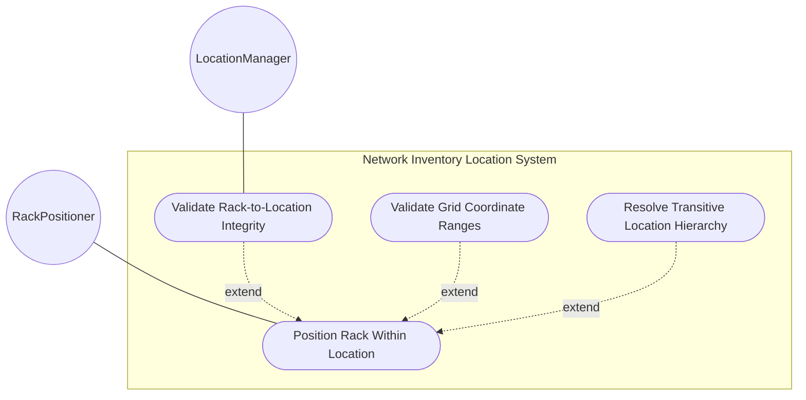
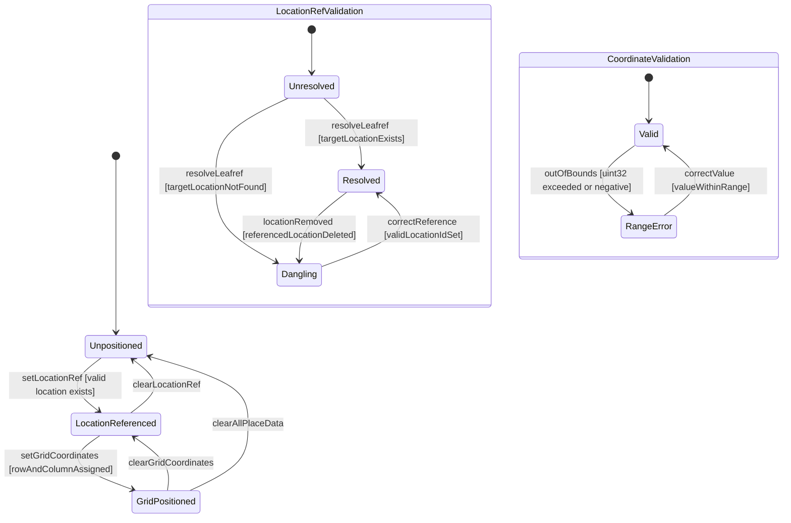

# Use Case: Position Equipment Rack Within a Network Inventory Location

## Parent Epic
- [ ] #49 - [ietf-ni-location: Network Inventory Location](https://github.com/gintatkinson/3dgs-033/blob/main/docs/epics/epic-04-ietf-ni-location.md) (the rack-location container is nested within each rack entry and specifies the physical position of the rack within a location via leafref and grid coordinates)

## 1. Actors
- **Primary Actor:** RackPositioner — the system component that assigns and queries rack positioning data, establishing the physical placement of racks within facility locations
- **Secondary Actors:** LocationManager — the location management component that maintains the location list against which rack-location leafrefs are validated for referential integrity

## 2. Preconditions
- A rack entry exists in the `rack` list with a valid unique `id`
- The `rack-location` container is available as a nested sub-container of the rack entry
- The `ni-location-ref` typedef is defined as a leafref resolving to `/nwi:network-inventory/nil:locations/nil:location/nil:id`
- If a `location-ref` value is to be set, the referenced location entry must exist in the `location` list at the expected schema path
- All three leaf nodes (`location-ref`, `row-number`, `column-number`) are independently optional — a rack may exist without any rack-location data

## 3. Trigger
A request to assign, query, or validate the physical position of a rack within a location — triggered during rack registration, site reconfiguration, or when an OSS operator queries rack positioning data for facility layout and equipment location planning.

## 4. Main Success Scenario (Basic Flow)
1. The RackPositioner receives a rack positioning request targeting a specific rack entry by its `id`
2. The RackPositioner reads the target rack entry and navigates to its `rack-location` sub-container
3. The RackPositioner reads or assigns the `location-ref` leaf — a leafref of type `ni-location-ref` that references a location id in the location list via the full schema path `/nwi:network-inventory/nil:locations/nil:location/nil:id`
4. The RackPositioner validates that the referenced location exists at the expected path — the YANG leafref constraint enforces referential integrity so only existing location ids are accepted
5. The RackPositioner reads or assigns the `row-number` and `column-number` — uint32 values representing the rack's grid coordinates within the referenced location for precise positioning in equipment rooms or data centers
6. The RackPositioner resolves the rack's transitive location hierarchy by following the referenced location's parent leafref chain upward to the root, establishing the full physical containment context for the rack (e.g., Rack-A → Room-101 → Building-A → Foo-DC)
7. The RackPositioner returns the rack-location data to the requesting actor, including the resolved location reference with the location's name, the grid row and column coordinates, and the full transitive location hierarchy path

## 5. Alternate and Exception Flows
- **5a. Location Reference Unresolved — Dangling Leafref (Branches from Basic Flow step 4):**
  1. The RackPositioner encounters a `location-ref` value that does not resolve to any existing location id in the location list — the leafref constraint is violated because the target does not exist at the expected path
  2. The RackPositioner rejects the unresolved location-ref value, preserves any previously valid location-ref unchanged, and returns a referential integrity violation error specifying the non-existent location id and the expected resolution path

- **5b. Row Number Exceeds uint32 Maximum (Branches from Basic Flow step 5):**
  1. The RackPositioner receives a `row-number` value greater than 4294967295 (the uint32 maximum)
  2. The RackPositioner rejects the value with a type range violation error specifying the actual value, the uint32 maximum of 4294967295, and the field name — the previously valid row-number (if any) is preserved unchanged

- **5c. Column Number Exceeds uint32 Maximum (Branches from Basic Flow step 5):**
  1. The RackPositioner receives a `column-number` value greater than 4294967295 (the uint32 maximum)
  2. The RackPositioner rejects the value with a type range violation error specifying the actual value, the uint32 maximum, and the field name — the previously valid column-number (if any) is preserved unchanged

- **5d. Negative Row Number Rejected (Branches from Basic Flow step 5):**
  1. The RackPositioner receives a negative value (e.g., -1) for the `row-number` leaf which is of type uint32
  2. The RackPositioner rejects the negative value because unsigned integer types (uint32) do not permit negative numbers — the type violation error specifies the negative value, the expected unsigned range starting at 0, and the field name

- **5e. Negative Column Number Rejected (Branches from Basic Flow step 5):**
  1. The RackPositioner receives a negative value for the `column-number` leaf which is of type uint32
  2. The RackPositioner rejects the negative value with the same unsigned integer type violation — the previously valid column-number is preserved and the rejection error is returned

- **5f. Rack With Location Reference But No Grid Coordinates (Branches from Basic Flow step 5):**
  1. The RackPositioner finds that a rack has `location-ref` set to a valid location but both `row-number` and `column-number` are absent (null)
  2. The RackPositioner returns the rack-location data with the resolved location reference and its name, but with empty grid coordinate indicators — the rack is associated with the location but its precise grid position is unspecified, which is a valid configuration where coarse room-level placement is sufficient

- **5g. Rack-Location Container Entirely Absent (Branches from Basic Flow step 2):**
  1. The RackPositioner determines that the target rack entry has no `rack-location` container configured — all three leafs (location-ref, row-number, column-number) are absent
  2. The RackPositioner returns an empty rack-location indicator for the rack, noting that the rack has no assigned physical placement — the rack remains valid and queryable but has no location dependency to validate

- **5h. Location Reference Chains Through Parent Hierarchy (Branches from Basic Flow step 6):**
  1. During transitive hierarchy resolution, the RackPositioner follows the referenced location's parent chain and discovers that the top-level location itself is a child of another location (e.g., Room-101 has parent Building-A, Building-A has parent Foo-DC)
  2. The RackPositioner returns the fully resolved chain: Rack → Room-101 → Building-A → Foo-DC, enabling queries for "all racks in Building-A" to transitively include racks in descendant rooms through the location hierarchy

## 6. Postconditions (Guarantees)
- **Success Guarantee:** The rack-location container for the target rack is populated with a validated location-ref that resolves to an existing location entry, the grid coordinates (row-number and column-number) are within the uint32 valid range, and the full transitive location hierarchy from the rack to the site root is resolved — consumers can query racks by associated location name and grid position, and can traverse upward to group racks by facility, building, or site
- **Failure Guarantee:** If the location-ref fails leafref resolution (non-existent target location), or any coordinate value violates the uint32 type range (overflow or negative), the invalid value is rejected entirely, the previously valid value for the affected field is preserved unchanged, and a structured validation error is returned — all other valid fields in the rack-location container and the parent rack remain intact

## UML Diagrams
### Use Case Diagram


### State Machine Diagram


## 7. Operational Context
> Through "rack-location", each rack can be assigned to a site or a specific location within a site, such as an equipment room. (draft-ietf-ivy-network-inventory-location-06, Section 3)

> Each rack is assigned a unique ID and a name in the context of a facility, e.g. a site. (draft-ietf-ivy-network-inventory-location-06, Section 3)

> The location information of the rack, which comprises the location reference, row number, and column number. (ietf-ni-location.yang — description of container rack-location)

> This model serves as a complement to the base inventory, providing a read-only perspective of network inventory location information known to the controller. It reports the physical locations of network elements and components installed in the network, enabling queries for site, rack, and other location-related information associated with network elements and components. (draft-ietf-ivy-network-inventory-location-06, Section 6)

## 8. Realization Matrix
### Required User Stories
- [ ] #59 - [Validate Rack-to-Location Referential Integrity](https://github.com/gintatkinson/3dgs-033/blob/main/docs/user-stories/us-21-validate-rack-location-referential-integrity.md) (provides the rack-to-location leafref validation — verifying that every rack's location-ref resolves to an existing location entry, detecting dangling references when locations are removed, and performing bulk integrity scans)

### Required Features
- [ ] #48 - [Define Rack Location](https://github.com/gintatkinson/3dgs-033/blob/main/docs/features/feat-21-rack-location.md) (provides the rack-location container schema with the location-ref leaf using the ni-location-ref typedef, and the row-number and column-number uint32 leaves for grid-based positioning within a location)

## Source References
Structural Schema: [ietf-ni-location.yang](https://github.com/ietf-ivy-wg/network-inventory-location/blob/main/ietf-ni-location.yang) (Clause: typedef ni-location-ref, container rack-location, leafs location-ref row-number column-number)
Normative Specification: [draft-ietf-ivy-network-inventory-location-06](https://datatracker.ietf.org/doc/html/draft-ietf-ivy-network-inventory-location) (Clause: Section 3, Rack; Section 4, Network Inventory Location Tree)

> [!WARNING]
> **Mermaid Block Closing Constraints & Code Fence Integrity:**
> - Every Mermaid diagram MUST be strictly closed with ``` ``` ``` on a new line. Leaking Mermaid blocks (e.g. having headings like `##` inside an unclosed diagram) or stray/unclosed code fences will fail downstream validation checks.
> - Ensure there are no stray backticks or unmatched code fences in the document.
> - **All Mermaid syntax constraints are defined in `rules/platform-independence.md` and MUST be observed in full** — including the prohibition on semicolons in `Note` and message text, colons in class members and note strings, stereotypes on relationship lines, and curly braces in class member lines. Do not maintain a local subset here; subsets drift (issue #289).
