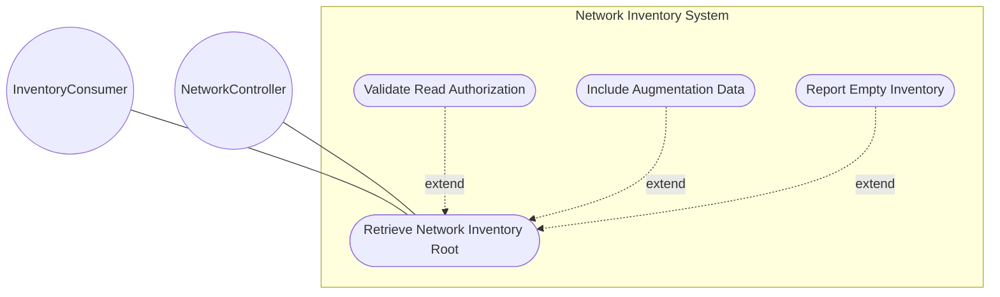
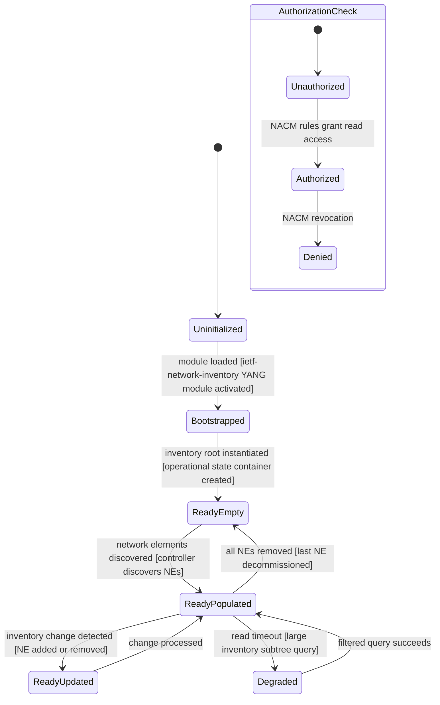

# Use Case: Retrieve Network Inventory Root Structure

## Parent Epic
- [ ] #67 - [ietf-network-inventory: Base Network Inventory Data Model](https://github.com/gintatkinson/3dgs-033/blob/main/docs/epics/epic-05-ietf-network-inventory.md) (the network-inventory container is the top-level read-only root anchoring all inventory data, Section 3)

## 1. Actors
- **Primary Actor:** InventoryConsumer — the application or operator that queries the network inventory data tree to retrieve network elements and their components in a read-only fashion
- **Secondary Actors:** NetworkController — the server that populates the read-only operational state data tree through discovery of network elements

## 2. Preconditions
- The network controller has bootstrapped the `ietf-network-inventory` YANG module and exposes the `/nwi:network-inventory` subtree
- The server conforms to the Network Management Datastore Architecture (NMDA, RFC 8342)
- The `network-inventory` container is instantiated as operational state data (`config false`) and is present at the root of the module's data tree
- The client is authorized via NACM (RFC 8341) to read inventory operational state data

## 3. Trigger
A request to retrieve network inventory data from the `/nwi:network-inventory` subtree — triggered when an OSS application, hierarchical controller, or inventory management tool issues a NETCONF `<get>` or RESTCONF GET operation targeting the inventory namespace.

## 4. Main Success Scenario (Basic Flow)
1. The InventoryConsumer sends a read request to retrieve the `/nwi:network-inventory` subtree from the server
2. The NetworkController receives the request and validates that the InventoryConsumer holds read authorization for the operational state inventory data
3. The NetworkController navigates to the `network-inventory` operational state container, which is present because the module is bootstrapped and conforming to NMDA
4. The NetworkController reads the `network-inventory` container — it is a pure structural wrapper with no direct leaf attributes, all data is housed in child containers and lists
5. The NetworkController reads the `network-elements` child container and its `network-element` list entries, returning all discovered network elements with their identifying attributes
6. The NetworkController recursively reads each network element's `components` container and `component` list, returning the full component inventory per network element
7. The NetworkController returns the complete read-only operational state data tree rooted at `network-inventory` to the InventoryConsumer, including any augmented child containers from companion modules (e.g., `nil:locations`)

## 5. Alternate and Exception Flows
- **5a. Network Inventory Container Not Present — Module Not Bootstrapped (Branches from Basic Flow step 3):**
  1. The NetworkController processes the read request but finds that the `ietf-network-inventory` module has not been loaded or bootstrapped in the operational datastore
  2. The NetworkController returns an error response indicating that the target data node `/nwi:network-inventory` does not exist in the operational datastore, with a diagnostic message that the module may not be properly enabled on the server

- **5b. Client Lacks Read Authorization for Inventory Data (Branches from Basic Flow step 2):**
  1. The NetworkController evaluates the InventoryConsumer's NACM access rules and finds that the client does not hold the required read permission for the `/nwi:network-inventory` subtree
  2. The NetworkController denies the request with an access-denied error, logging the unauthorized access attempt with the client identity and target subtree — no inventory data is returned

- **5c. Empty Network Inventory — No Network Elements Discovered (Branches from Basic Flow step 5):**
  1. The NetworkController navigates to the `network-elements` container and finds that the `network-element` list is empty — the controller has not yet discovered any network elements in the network
  2. The NetworkController returns the `network-inventory` container with an empty `network-elements` container and empty `network-element` list — this is a valid per-schema state indicating an undiscovered or empty network

- **5d. Augmentation Module Data Not Available (Branches from Basic Flow step 7):**
  1. The NetworkController encounters an augmentation module (e.g., `ietf-ni-location`) that targets `/nwi:network-inventory` with additional child containers
  2. If the augmentation module's data is not yet populated (e.g., locations have not been configured), the NetworkController returns the base inventory data without the augmented containers — the augmentation data node is simply absent, which is valid per YANG optional node semantics

- **5e. Read-Only Constraint Violation — Attempted Write to Network Inventory (Branches from Basic Flow step 1):**
  1. The NetworkController receives a write attempt (e.g., NETCONF `<edit-config>` or RESTCONF PUT/POST) targeting any node under `/nwi:network-inventory`
  2. The NetworkController rejects the write operation because the entire `network-inventory` subtree is flagged `config false` — all descendant nodes are read-only operational state data that cannot be modified through the management interface, and the server returns a protocol-level access violation error

- **5f. Large Inventory Causes Timeout During Full Subtree Retrieval (Branches from Basic Flow step 6):**
  1. The NetworkController attempts to recursively read all components across all network elements for a large-scale network (thousands of NEs with hundreds of components each) exceeding the protocol timeout
  2. The NetworkController returns a partial-result error or advises the InventoryConsumer to use subtree filtering, NACM slicing, or pagination mechanisms to reduce the response payload — the full data tree remains intact on the server for subsequent filtered queries

## 6. Postconditions (Guarantees)
- **Success Guarantee:** The InventoryConsumer receives a complete, read-only snapshot of the network inventory data tree rooted at `network-inventory`, including all discovered network elements and their components, with all attributes populated according to the schema — the data conforms to NMDA operational state semantics and includes any companion module augmentation data that is currently populated
- **Failure Guarantee:** If the retrieval fails due to authorization denial, module unavailability, or read timeouts, no partial inventory data is returned to an unauthorized client — the server's operational state data remains unchanged and consistent, and the error response specifies the exact failure reason (access-denied, data-missing, partial-result) for the InventoryConsumer to take corrective action

## UML Diagrams
### Use Case Diagram


### State Machine Diagram


## 7. Operational Context
From draft-ietf-ivy-network-inventory-yang-18, Section 3:

> The base network inventory model, defined in this document, provides a list of network elements and of network element components.
>
> The network-inventory top level container has been defined to support reporting other types of network inventory objects, besides the network elements and network element components.

From the YANG module description statement:

> This module defines a base model for retrieving network inventory. The model fully conforms to the Network Management Datastore Architecture (NMDA).

From Section 6:

> As outlined in Section 6, the network inventory provides a read-only perspective of the actual inventory data that a network controller knows of what it is actually installed within the network. Therefore, other inventory data (e.g., spare or inactive assets) are outside the scope of this model.

## 8. Realization Matrix
### Required User Stories
- [ ] #73 - [Aggregate Network Inventory Across Hierarchical Controllers](https://github.com/gintatkinson/3dgs-033/blob/main/docs/user-stories/us-31-hierarchical-controller-inventory-aggregation.md) (the root container anchors the aggregated inventory data tree at the MDSC level, providing the unified entry point for hierarchical controller inventory aggregation)

### Required Features
- [ ] #64 - [Define Network Inventory Root Container](https://github.com/gintatkinson/3dgs-033/blob/main/docs/features/feat-22-network-inventory-root.md) (defines the network-inventory container as the top-level read-only root anchoring the entire network inventory data model, with config false inherited across the subtree and NMDA conformance)

## Source References
Structural Schema: [ietf-network-inventory.yang](https://github.com/ietf-ivy-wg/network-inventory-yang/blob/main/yang/ietf-network-inventory.yang) (Clause: container network-inventory, lines 385-388)
Normative Specification: [draft-ietf-ivy-network-inventory-yang-18](https://datatracker.ietf.org/doc/html/draft-ietf-ivy-network-inventory-yang) (Section 3, Section 6, Section 1)

> [!WARNING]
> **Mermaid Block Closing Constraints & Code Fence Integrity:**
> - Every Mermaid diagram MUST be strictly closed with ```` ``` ```` on a new line. Leaking Mermaid blocks (e.g. having headings like `##` inside an unclosed diagram) or stray/unclosed code fences will fail downstream validation checks.
> - Ensure there are no stray backticks or unmatched code fences in the document.
> - **All Mermaid syntax constraints are defined in `rules/platform-independence.md` and MUST be observed in full** — including the prohibition on semicolons in `Note` and message text, colons in class members and note strings, stereotypes on relationship lines, and curly braces in class member lines. Do not maintain a local subset here; subsets drift (issue #289).
