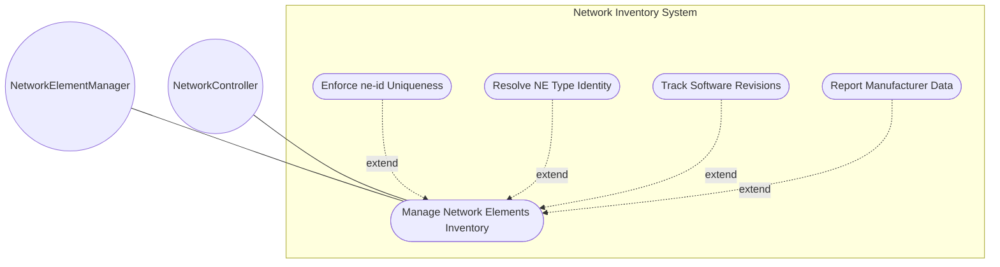
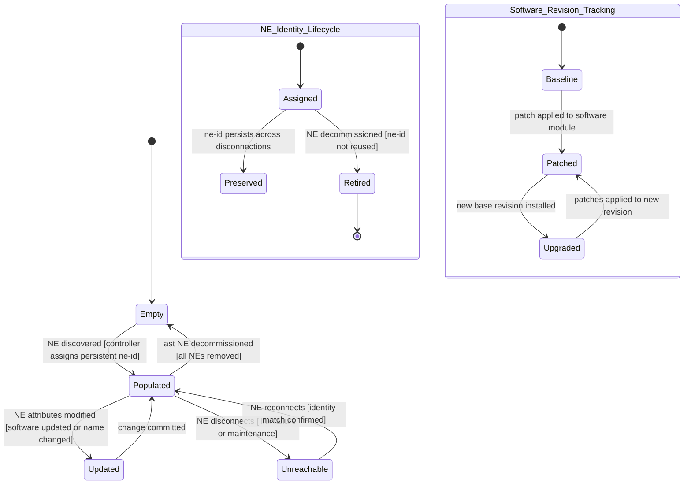

# Use Case: Manage Network Elements Inventory

## Parent Epic
- [ ] #67 - [ietf-network-inventory: Base Network Inventory Data Model](https://github.com/gintatkinson/3dgs-033/blob/main/docs/epics/epic-05-ietf-network-inventory.md) (the network-elements container and network-element list form the core of the inventory, Section 3.2)

## 1. Actors
- **Primary Actor:** NetworkElementManager — the operator or application that queries, lists, and inspects network elements registered in the inventory
- **Secondary Actors:** NetworkController — the server that discovers network elements on the network, assigns persistent ne-id values, and populates the network-element list with operational state data

## 2. Preconditions
- The `/nwi:network-inventory` root container is instantiated and accessible in the operational datastore
- The `network-elements` container exists as a child of `network-inventory` and wraps the `network-element` list
- The NetworkController has a discovery mechanism running that can detect network elements in its domain
- The client holds read authorization for the `/nwi:network-inventory/nwi:network-elements` subtree

## 3. Trigger
A request to retrieve the list of network elements, query a specific network element by its `ne-id`, or inspect the identity, software, and manufacturing attributes of network elements — triggered when an OSS operator needs to audit the network, when a hierarchical controller aggregates inventory from domain controllers, or when an inventory management application performs periodic synchronization.

## 4. Main Success Scenario (Basic Flow)
1. The NetworkElementManager submits a query to retrieve the `network-elements` container or a specific `network-element` entry from the operational datastore
2. The NetworkController receives the query and navigates to the `network-elements` container within the `network-inventory` operational state data tree
3. The NetworkController reads the `network-element` list entries, each uniquely identified by the `ne-id` key — a persistent server-assigned identifier that survives NE disconnection and reconnection
4. For each network element, the NetworkController reads the `ne-type` identity leaf (defaulting to `nwi:ne-physical` for physical network elements) that classifies the NE type
5. The NetworkController reads the common entity attributes: `uuid` (globally unique identifier), `name` (operator-assigned human-interpretable label), `alias` (alternative label), and `description` (free-text description)
6. The NetworkController reads the `software-rev` list — keyed by `name` — containing the software images intended to be running on the NE, each with a vendor-specific `revision` string and optional nested `patch` list keyed by patch revision
7. The NetworkController reads the manufacturer and product attributes: `mfg-name` (vendor manufacturing name, omitted if unknown), `product-name` (vendor-specific product type), and `product-rev` (vendor-specific product revision string)
8. The NetworkController returns the complete network element data to the NetworkElementManager

## 5. Alternate and Exception Flows
- **5a. Network Element Not Found — Non-existent ne-id (Branches from Basic Flow step 3):**
  1. The NetworkElementManager queries for a specific `network-element[ne-id="NE-999"]` that does not exist in the operational datastore
  2. The NetworkController returns an empty result set or a data-missing response — the `ne-id` key lookup yields no matching entry because no network element with that identifier has been discovered

- **5b. Duplicate ne-id Assignment Detected (Branches from Basic Flow step 3):**
  1. During automated ne-id assignment, the NetworkController detects that a proposed `ne-id` value collides with an existing entry in the `network-element` list, violating the list key uniqueness constraint
  2. The NetworkController rejects the duplicate key assignment, retains the existing network element with its original `ne-id`, and generates a new unique `ne-id` for the newly discovered element using its implementation-specific identity resolution mechanism

- **5c. Missing Mandatory ne-id — Malformed Network Element Entry (Branches from Basic Flow step 3):**
  1. The NetworkController receives a network element entry proposal (or parses discovery data) where the `ne-id` leaf — the mandatory list key — is absent or null
  2. The NetworkController rejects the entry because the `ne-id` is required as the list key — the network element cannot be created in the datastore without a valid non-null string identifier

- **5d. Invalid ne-type Identity — Unrecognized NE Type (Branches from Basic Flow step 4):**
  1. The NetworkController encounters a `ne-type` identity value that does not derive from the `nwi:ne-type` base identity hierarchy (e.g., an identity from an unknown module or a string that is not a valid identityref)
  2. The NetworkController rejects the value and defaults the `ne-type` leaf to `nwi:ne-physical` — the base physical network element type, logging a warning that an unrecognized NE type identity was encountered

- **5e. NE Type Not Specified — Default to Physical NE (Branches from Basic Flow step 4):**
  1. The NetworkElementManager retrieves a network element that has no explicit `ne-type` value set
  2. The NetworkController returns the network element with `ne-type` defaulted to `nwi:ne-physical` per the schema default value — no error is raised and the NE is treated as a physical network element

- **5f. Invalid UUID Format — Non-conforming UUID Value (Branches from Basic Flow step 5):**
  1. The NetworkController reads the `uuid` leaf of a network element and finds a value that does not conform to the `yang:uuid` type format (not a valid RFC 4122 UUID string)
  2. The NetworkController rejects the malformed UUID value, does not instantiate the `uuid` leaf for that entry, and logs a type-format violation — the network element remains valid with `uuid` absent

- **5g. Operator Changes Name During Entity Lifetime (Branches from Basic Flow step 5):**
  1. A network operator updates the `name` leaf of a network element to a new human-interpretable label via an implementation-specific administrative interface
  2. The NetworkController accepts the new name value and stores it — the `name` leaf is a non-volatile handle that can be changed at any time during the entity lifetime, and the change does not affect the `ne-id` key identity

- **5h. Duplicate Software Module Name in software-rev List (Branches from Basic Flow step 6):**
  1. The NetworkController processes discovery data containing two software-rev entries with the same `name` key (e.g., two entries both named "IOS-XR")
  2. The NetworkController rejects the duplicate key because `software-rev` is a list keyed by `name` — only the first entry with that name is retained, and the duplicate is discarded with a warning log

- **5i. Missing Mandatory software-rev/name (Branches from Basic Flow step 6):**
  1. The NetworkController encounters a software-rev list entry where the `name` leaf — the mandatory list key — is absent
  2. The NetworkController rejects the software-rev entry because the `name` key is required — the entry cannot be added to the `software-rev` list, and the remainder of the network element data is unaffected

- **5j. Duplicate Patch Revision in software-rev/patch List (Branches from Basic Flow step 6):**
  1. Within a software module entry named "IOS-XR", the NetworkController discovers two patch entries with the same `revision` key (e.g., both "7.9.2-p1")
  2. The NetworkController rejects the duplicate patch revision because `patch` is keyed by `revision` — the duplicate is discarded and only the first patch entry with that revision is retained

- **5k. Missing Mandatory software-rev/patch/revision (Branches from Basic Flow step 6):**
  1. The NetworkController encounters a patch list entry where the `revision` leaf — the mandatory list key — is absent
  2. The NetworkController rejects the patch entry because the `revision` key is mandatory — the entry is discarded and the parent software-rev module entry remains valid

- **5l. Manufacturer Name Unknown — mfg-name Leaf Omitted (Branches from Basic Flow step 7):**
  1. The NetworkController processes a network element whose manufacturer name cannot be determined from the discovery data — the `mfg-name` value is unknown to the server
  2. The NetworkController does not instantiate the `mfg-name` leaf for that network element per the schema definition — the leaf is simply absent from the operational data tree, and the network element entry remains valid with all other fields populated

- **5m. Network Controller Processes Large List of Network Elements (Branches from Basic Flow step 3):**
  1. The NetworkElementManager queries the full `network-element` list in a large-scale deployment with thousands of network elements across multiple domains
  2. The NetworkController returns all matching entries but may append a response-size warning — the NetworkElementManager is advised to apply subtree or XPath filtering to scope the query, such as retrieving only elements with a specific `ne-type` or `mfg-name`

- **5n. NE Disconnection — Identity Preservation (Branches from Basic Flow step 3):**
  1. A network element temporarily disconnects from the controller (link failure or maintenance reboot)
  2. The NetworkController preserves the network element entry with its original `ne-id` — the entry remains in the list, and upon reconnection the controller uses implementation-specific matching (mfg-name, product-name, management IP, physical location) to re-identify the same NE and restore its reachability status

- **5o. Invalid Yang Date-and-Time Format for Future Fields (Branches from Basic Flow step 5):**
  1. The NetworkController encounters a timestamp field in the network element discovery data that does not conform to the `yang:date-and-time` format (RFC 3339 with required timezone offset)
  2. The NetworkController rejects the malformed timestamp — the leaf is not instantiated, and a type-format violation is logged for operator review

- **5p. Software-Revision String Exceeds Reasonable Length (Branches from Basic Flow step 6):**
  1. The NetworkController receives a `software-rev/revision` string that is excessively long or contains non-printable characters incompatible with the `string` type definition
  2. The NetworkController truncates or rejects the anomalous revision string based on implementation policy — the software module entry remains present but its revision is flagged as potentially malformed for operator validation

## 6. Postconditions (Guarantees)
- **Success Guarantee:** The NetworkElementManager receives the complete list of network elements with all instantiated attributes — each entry has a unique `ne-id` key, a resolved `ne-type` (defaulting to `nwi:ne-physical`), the software-rev list with patch hierarchy reflecting the software images intended to run on each NE, and the manufacturer and product identification attributes populated where available
- **Failure Guarantee:** If the query targets a non-existent `ne-id`, the NetworkController returns an empty result — no spurious data is fabricated, list key uniqueness is preserved, and any data-type violations (invalid UUID, duplicate keys, missing mandatory fields) are rejected with the existing valid data unchanged while the invalid input is discarded with a diagnostic log message

## UML Diagrams
### Use Case Diagram


### State Machine Diagram


## 7. Operational Context
From draft-ietf-ivy-network-inventory-yang-18, Section 3.2:

> In addition to the common attributes defined for network elements and components in Section 3.1, the following attributes are defined for the network elements:
>
> **ne-id:** The identifier that uniquely identifies the network element (NE) within the network, assigned by the server since the network elements cannot guarantee that their local identifier is unique within the network.
>
> The ne-id should be assigned such that the same network element will always be identified through the same identifier, even if the network elements get disconnected from the network controller. Mechanisms to ensure this (e.g., checking the mfg-name, product-name, management IP address, physical location) are implementation specific and outside the scope of standardization.
>
> **ne-type:** The type of network element (e.g., physical network element). See Section 3 for the definition of NE types.
>
> **product-rev:** A vendor-specific product revision string for the network-element.

From Section 3:

> The network element definition is generalized to support physical network elements and other types of components' groups that can be managed as physical network elements from an inventory perspective.

## 8. Realization Matrix
### Required User Stories
- [ ] #75 - [Preserve Network Element Identity Across Disconnection Events](https://github.com/gintatkinson/3dgs-033/blob/main/docs/user-stories/us-33-ne-identity-persistence-disconnection.md) (ne-id persistence across disconnections is the defining operational contract of the network-element list — the server must assign stable identifiers that survive disconnection and reconnection cycles)
- [ ] #72 - [Report Non-Modular Pizza Box Network Element Inventory](https://github.com/gintatkinson/3dgs-033/blob/main/docs/user-stories/us-30-non-modular-pizza-box-ne-inventory.md) (pizza box NEs are modelled as single network element entries in the list, validating the generalized NE definition that supports non-modular devices)
- [ ] #68 - [Identify Main Chassis in Multi-Chassis Network Element](https://github.com/gintatkinson/3dgs-033/blob/main/docs/user-stories/us-26-multi-chassis-ne-main-identification.md) (multi-chassis assemblies are modelled as single network element entries with multiple chassis components, relying on the NE list to represent logical units composed of stacked physical switches)

### Required Features
- [ ] #65 - [Define Network Elements Container and List](https://github.com/gintatkinson/3dgs-033/blob/main/docs/features/feat-23-network-elements-list.md) (defines the network-elements container and network-element list with ne-id key, ne-type identity hierarchy, software-rev tracking with patch nesting, and common entity attributes — the structural schema underlying all network element management)

## Source References
Structural Schema: [ietf-network-inventory.yang](https://github.com/ietf-ivy-wg/network-inventory-yang/blob/main/yang/ietf-network-inventory.yang) (Clause: container network-elements and list network-element, lines 389-420)
Normative Specification: [draft-ietf-ivy-network-inventory-yang-18](https://datatracker.ietf.org/doc/html/draft-ietf-ivy-network-inventory-yang) (Section 3, Section 3.2, Section 3.3.2)

> [!WARNING]
> **Mermaid Block Closing Constraints & Code Fence Integrity:**
> - Every Mermaid diagram MUST be strictly closed with ```` ``` ```` on a new line. Leaking Mermaid blocks (e.g. having headings like `##` inside an unclosed diagram) or stray/unclosed code fences will fail downstream validation checks.
> - Ensure there are no stray backticks or unmatched code fences in the document.
> - **All Mermaid syntax constraints are defined in `rules/platform-independence.md` and MUST be observed in full** — including the prohibition on semicolons in `Note` and message text, colons in class members and note strings, stereotypes on relationship lines, and curly braces in class member lines. Do not maintain a local subset here; subsets drift (issue #289).
