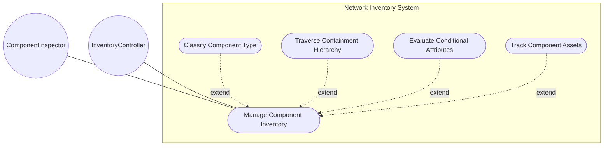
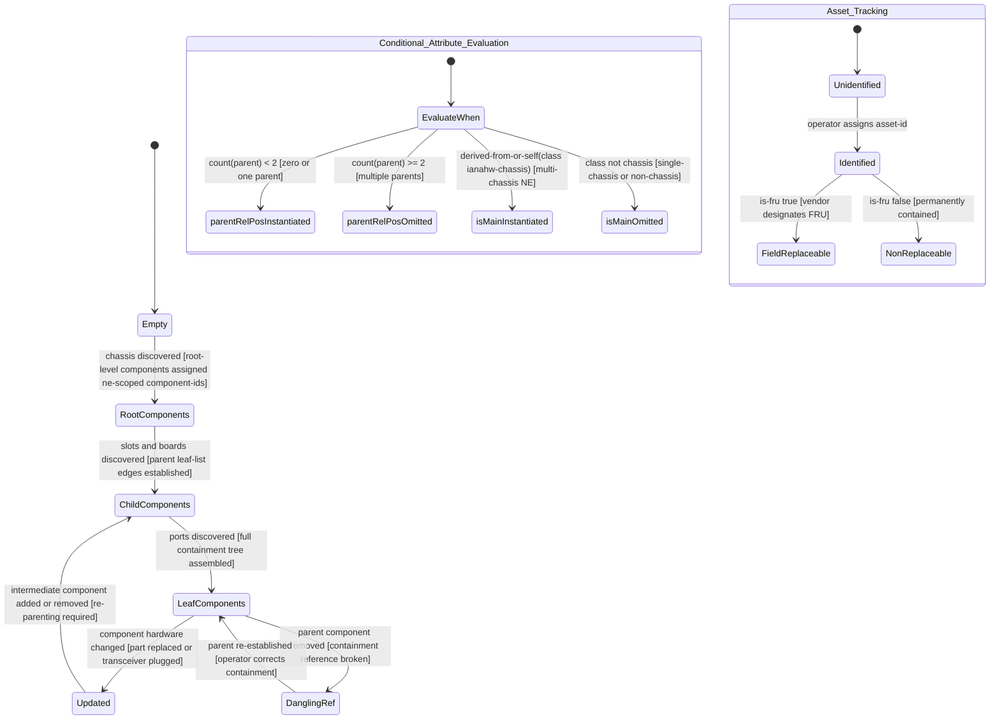

# Use Case: Manage Component Inventory Within Network Elements

## Parent Epic
- [ ] #67 - [ietf-network-inventory: Base Network Inventory Data Model](https://github.com/gintatkinson/3dgs-033/blob/main/docs/epics/epic-05-ietf-network-inventory.md) (the components container and component list hold the physical inventory of each network element, Section 3.3)

## 1. Actors
- **Primary Actor:** ComponentInspector — the operator, application, or audit tool that queries and traverses the component inventory within a network element to understand the physical hardware composition, containment hierarchy, and asset tracking details
- **Secondary Actors:** InventoryController — the server that discovers components from each network element's management agent, evaluates conditional schema constraints (`when` statements), and populates the component list with operational state data

## 2. Preconditions
- A network element entry exists in the `network-element` list with a valid `ne-id` key
- The `components` container exists as a child of the specific `network-element` entry
- The InventoryController has access to the relevant component classes from the `iana-hardware` identity module and the `nwi:non-hardware-component-class` base identity
- Component discovery has populated the `component` list with at least the root-level components (e.g., chassis)
- The client holds read authorization for the components subtree within the target network element

## 3. Trigger
A request to retrieve the component list for a specific network element, traverse the physical containment hierarchy from chassis to port level, inspect conditional attributes (parent relative position, main chassis flag), or validate asset tracking and FRU status — triggered when a network operator audits the physical layout of a network element, when an OSS correlates hardware revisions across the network, or when a field technician needs to identify which components are field-replaceable units.

## 4. Main Success Scenario (Basic Flow)
1. The ComponentInspector issues a query targeting the `components` container of a specific network element, requesting the `component` list
2. The InventoryController navigates to the `components` container within the target `network-element` entry and reads the `component` list, each entry keyed by a unique `component-id`
3. The InventoryController reads the mandatory `class` leaf for each component — a union of hardware class identity (from `iana-hardware`) and non-hardware component identity (from `nwi:non-hardware-component-class`) — which determines the component type (e.g., chassis, slot, board, port, CPU, fan)
4. The InventoryController reads the common entity attributes for each component: `component-id` (unique within the NE), `uuid` (globally unique), `name`, `alias`, and `description`
5. The InventoryController reads the software revision list (`software-rev` keyed by `name`) for each component, including the nested `patch` list keyed by patch revision, representing the software images intended to run on the component
6. The InventoryController reads the manufacturing attributes: `mfg-name` (omitted if unknown, comparisons only meaningful for components sharing the same mfg-name), `product-name`, `hardware-rev` (preferred value printed on the component), `mfg-date` (manufacturing date in yang:date-and-time format), `part-number` (vendor-specific component type identifier), `serial-number` (unique within part-number scope), `asset-id` (operator-assigned tracking identifier), `is-fru` (field-replaceable unit flag from the vendor), and `uri` leaf-list (component identification URLs)
7. The InventoryController reads the structural containment attributes: the `parent` leaf-list of leafrefs referencing sibling component-ids — an empty list means the component is directly contained in the network element
8. The InventoryController evaluates the conditional schema constraints: for `parent-rel-pos`, it checks `count(../parent) < 2` — if true, the leaf is instantiated with an implementation-specific relative position string; for `is-main`, it evaluates `derived-from-or-self(class, 'ianahw:chassis')` — if true, the boolean leaf is instantiated indicating whether this chassis takes the main role
9. The InventoryController assembles and returns the complete component list with all instantiated attributes, conditional fields resolved per schema, and containment edges established via the parent leaf-list

## 5. Alternate and Exception Flows
- **5a. Component Not Found — Non-existent component-id (Branches from Basic Flow step 2):**
  1. The ComponentInspector queries for a specific component entry `component[component-id="Slot-99"]` within a network element where no such component exists
  2. The InventoryController returns an empty result or data-missing response — the `component-id` key lookup yields no match, and no component data is fabricated

- **5b. Duplicate component-id — Key Uniqueness Violation (Branches from Basic Flow step 2):**
  1. During component discovery, the InventoryController detects that a proposed `component-id` value already exists in the component list for this network element, violating the list key uniqueness constraint
  2. The InventoryController rejects the duplicate key, retains the existing component entry unchanged, and assigns a new unique `component-id` (potentially with a suffix discriminator) to the newly discovered component

- **5c. Missing Mandatory component-id (Branches from Basic Flow step 2):**
  1. The InventoryController parses component discovery data and encounters a component entry where the `component-id` — the mandatory list key — is absent or null
  2. The InventoryController rejects the entry because the key is required — the component cannot be added to the list without a unique non-null string identifier, and the remaining valid components in the list are unaffected

- **5d. Missing Mandatory class — Component Type Unknown (Branches from Basic Flow step 3):**
  1. The InventoryController encounters a component entry where the `class` leaf — a mandatory union type with no default — is absent
  2. The InventoryController rejects the component entry because `class` is mandatory per schema — the component cannot be classified without knowing whether it is a hardware class (e.g., chassis, port) or a non-hardware class (e.g., software component)

- **5e. Unrecognized Component Class Identity — Out-of-Union Value (Branches from Basic Flow step 3):**
  1. The InventoryController encounters a `class` value that is not a valid identity derived from either `ianahw:hardware-class` or `nwi:non-hardware-component-class`
  2. The InventoryController rejects the value as a union type violation — the component entry cannot be validated because its class identity falls outside both arms of the schema union, and the entry is discarded with a classification error log

- **5f. Invalid UUID Format in Component (Branches from Basic Flow step 4):**
  1. The InventoryController reads the `uuid` leaf of a component and finds a value not conforming to `yang:uuid` format (not a valid RFC 4122 UUID)
  2. The InventoryController rejects the malformed UUID, does not instantiate the `uuid` leaf, and logs a type-format violation — the component remains valid with `uuid` absent

- **5g. Duplicate Software Module Name in Component software-rev (Branches from Basic Flow step 5):**
  1. The InventoryController discovers two software-rev entries for a component with the same `name` key (e.g., two entries both named "Firmware")
  2. The InventoryController rejects the duplicate because `software-rev` is keyed by `name` — only the first entry with that name is retained, and the duplicate is discarded with a warning

- **5h. Missing software-rev/name in Component (Branches from Basic Flow step 5):**
  1. The InventoryController encounters a software-rev entry for a component where the `name` leaf — the mandatory list key — is absent
  2. The InventoryController rejects the entry because the `name` key is mandatory — the software-rev entry is discarded and the component's other attributes are not affected

- **5i. Duplicate Patch Revision in Component software-rev/patch (Branches from Basic Flow step 5):**
  1. Within a component's software module entry, the InventoryController discovers two patch entries with the same `revision` key
  2. The InventoryController rejects the duplicate patch revision because `patch` is keyed by `revision` — the duplicate is discarded and only the first patch entry is retained

- **5j. Missing software-rev/patch/revision in Component (Branches from Basic Flow step 5):**
  1. The InventoryController encounters a patch entry where the `revision` leaf — the mandatory list key — is absent
  2. The InventoryController rejects the patch entry — the `revision` key is mandatory per schema and the entry cannot be added

- **5k. Manufacturer Name Unknown — Component mfg-name Omitted (Branches from Basic Flow step 6):**
  1. The InventoryController processes a component whose manufacturer name cannot be determined — the `mfg-name` value is unknown to the server
  2. The InventoryController does not instantiate the `mfg-name` leaf per schema refinement — the leaf is simply absent, and any comparisons of part-number, serial-number, or software-rev with another component become semantically unreliable without a shared manufacturer context

- **5l. Invalid mfg-date Format — Non-conforming Date-Time (Branches from Basic Flow step 6):**
  1. The InventoryController encounters a `mfg-date` value that does not conform to the `yang:date-and-time` format (e.g., missing timezone offset or invalid date components)
  2. The InventoryController rejects the malformed date-time, does not instantiate the `mfg-date` leaf, and logs a type-format violation — the component's other manufacturing attributes are preserved

- **5m. Invalid URI Format in Component uri Leaf-List (Branches from Basic Flow step 6):**
  1. The InventoryController encounters a `uri` leaf-list entry that does not conform to the `inet:uri` type (e.g., an unparseable or non-absolute URI string)
  2. The InventoryController rejects the malformed URI entry from the leaf-list, retains the remaining valid URI entries, and logs the violation — the component's other attributes are not affected

- **5n. is-fru Flag with Non-Boolean Value (Branches from Basic Flow step 6):**
  1. The InventoryController processes an `is-fru` value that is not a valid boolean (`true` or `false`) — e.g., a non-boolean string or numeric value
  2. The InventoryController rejects the value as a type violation because `is-fru` is of type `boolean` — the leaf is not instantiated, and the component's other attributes are preserved

- **5o. Dangling Parent Reference — Leafref Target Not Found (Branches from Basic Flow step 7):**
  1. The InventoryController processes the `parent` leaf-list and finds a leafref value referencing a `component-id` that does not exist in the current component list for this network element
  2. The InventoryController preserves the dangling reference because `require-instance` is `false` on the leafref path — referential integrity is deliberately relaxed at the schema level, and the component remains in the list with a dangling parent flag for operator review

- **5p. Component Has Empty Parent List — Directly in NE (Branches from Basic Flow step 7):**
  1. The InventoryController processes a component whose `parent` leaf-list is empty — e.g., a chassis component that is the top-level container within the network element
  2. The InventoryController identifies this component as directly contained in the network element, not within any sibling component — it serves as a root node in the containment tree, and no error or warning is generated

- **5q. parent-rel-pos Conditionally Omitted — Multiple Parents (Branches from Basic Flow step 8):**
  1. The InventoryController evaluates the `when` constraint `count(../parent) < 2` for a component that has two or more parent references (count >= 2)
  2. The InventoryController does not instantiate the `parent-rel-pos` leaf because the `when` condition evaluates to false — relative position is undefined when a component has multiple physical containers, and the omission is by design per schema

- **5r. parent-rel-pos Conditionally Instantiated — Zero or One Parent (Branches from Basic Flow step 8):**
  1. The InventoryController evaluates the `when` constraint for a component with exactly one parent reference, where `count(../parent) < 2` evaluates to true
  2. The InventoryController instantiates the `parent-rel-pos` leaf with an implementation-specific position string — when mapping from RFC 6933 entPhysicalParentRelPos, the integer value is encoded as an integer string

- **5s. is-main Conditionally Omitted — Class Not Derived from Chassis (Branches from Basic Flow step 8):**
  1. The InventoryController evaluates the `when` constraint `derived-from-or-self(class, 'ianahw:chassis')` for a component whose class is `ianahw:port` (not derived from chassis)
  2. The InventoryController does not instantiate the `is-main` leaf because the `when` condition evaluates to false — the main role concept is not applicable to non-chassis components, and the omission is by design

- **5t. is-main Conditionally Instantiated — Class Is Chassis (Branches from Basic Flow step 8):**
  1. The InventoryController evaluates the `when` constraint for a multi-chassis NE component whose class identity is `ianahw:chassis` — the `derived-from-or-self` check returns true
  2. The InventoryController instantiates the `is-main` boolean leaf and populates it from the stacking/cascading protocol's main election result — exactly one chassis in a multi-chassis NE should have `is-main` = true

- **5u. is-main in Single-Chassis NE — Omitted Per Description (Branches from Basic Flow step 8):**
  1. The InventoryController processes a single-chassis network element (pizza box) whose chassis component satisfies the `derived-from-or-self` check but the NE does not contain chassis components that can take or not take the main role
  2. The InventoryController omits the `is-main` leaf per the schema description — the `when` constraint is satisfied but the operational semantics of single-chassis NEs make the main-role distinction meaningless

- **5v. Cross-Manufacturer Component Comparison — Semantically Unreliable (Branches from Basic Flow step 6):**
  1. The ComponentInspector compares `part-number` or `serial-number` values between two components that have different `mfg-name` values (e.g., "Cisco Systems" vs. "Juniper Networks")
  2. The InventoryController flags the comparison as not meaningful — per schema refinement, comparisons of part-number, software-rev, and serial-number are only meaningful amongst components with the same `mfg-name` value

- **5w. Component with Unknown mfg-name — Comparison Scope Indeterminate (Branches from Basic Flow step 6):**
  1. The ComponentInspector attempts to compare attributes of a component whose `mfg-name` is unknown (leaf not instantiated) with another component
  2. The InventoryController flags the comparison as unreliable because the manufacturer scope cannot be established — without a known `mfg-name`, the semantic boundaries for part-number and serial-number uniqueness are undefined

- **5x. Resource Exhaustion — Excessive URI Entries or Component List Size (Branches from Basic Flow step 2):**
  1. The InventoryController encounters a component with an unusually large number of `uri` leaf-list entries or a network element with an exceptionally large component list exceeding reasonable operational boundaries
  2. The InventoryController accepts the data but may enforce implementation-specific resource limits — excess entries beyond the limit are truncated, and a resource warning is logged for the operator

- **5y. Hardware Revision Format Anomaly (Branches from Basic Flow step 6):**
  1. The InventoryController encounters a `hardware-rev` value that is an empty string or contains only whitespace characters — while `string` type permits empty values, the semantic intent is a vendor-specific revision identifier
  2. The InventoryController accepts the value per `string` type rules but logs a data-quality advisory — the preferred value per schema is the hardware revision identifier printed on the component itself

## 6. Postconditions (Guarantees)
- **Success Guarantee:** The ComponentInspector receives the complete component list for the target network element — each component has a unique `component-id`, a mandatory resolved `class` identity, the full suite of common entity attributes, manufacturing and asset tracking data populated where available, the software revision list with patch hierarchy, and the structural containment attributes with conditional fields (`parent-rel-pos`, `is-main`) resolved according to their `when` constraint evaluations — the parent leaf-list establishes the physical containment graph enabling tree traversal from chassis root to port leaf
- **Failure Guarantee:** If any component entry fails validation — missing mandatory `component-id` or `class`, invalid UUID/URI formats, type-range violations — the specific invalid entry is rejected while all valid component entries and their attributes are preserved intact — the conditional fields (`parent-rel-pos`, `is-main`) are omitted when their `when` constraints evaluate to false, which is expected schema behavior and not an error condition — dangling parent references are tolerated due to `require-instance false` and flagged for operator review without discarding the component

## UML Diagrams
### Use Case Diagram


### State Machine Diagram


## 7. Operational Context
From draft-ietf-ivy-network-inventory-yang-18, Section 3.3:

> The YANG data model for network inventory mainly follows the same approach of [RFC8348] and reports the network hardware inventory as a list of components with different types (e.g., chassis, module, and port).
>
> In addition to the common attributes defined for network elements and components in Section 3.1, the following attributes are defined for the components: component-id, class, hardware-rev, mfg-date, part-number, serial-number, asset-id, is-fru.
>
> For state data like "admin-state", "oper-state", and so on, this document considers that they are related to device hardware management, not network inventory. Therefore, they are outside of the scope of this document.

From Section 3.3.1:

> Figure 1 describes the relationship between typical inventory objects in a physical network element: network element -> 1:M chassis -> 1:N slot/board -> 1:N port.

From Section 3.4.3:

> There are some use cases where the parent relative position is not reported as an integer but as a string. In order to support these use cases and allowing a straightforward match between the relative position definition in the device and in the network inventory, this model is defining the 'parent-rel-pos' data node as a string instead of as an integer.

## 8. Realization Matrix
### Required User Stories
- [ ] #68 - [Identify Main Chassis in Multi-Chassis Network Element](https://github.com/gintatkinson/3dgs-033/blob/main/docs/user-stories/us-26-multi-chassis-ne-main-identification.md) (the is-main leaf on chassis components and the derived-from-or-self when constraint govern multi-chassis NE topology within the component list)
- [ ] #69 - [Traverse Component Parent Containment Hierarchy Within a Network Element](https://github.com/gintatkinson/3dgs-033/blob/main/docs/user-stories/us-27-component-parent-containment-traversal.md) (the parent leaf-list establishes the containment graph across sibling components, enabling traversal from NE root to leaf components)
- [ ] #70 - [Compute Conditional Applicability of Parent Relative Position](https://github.com/gintatkinson/3dgs-033/blob/main/docs/user-stories/us-28-conditional-parent-rel-pos-computation.md) (parent-rel-pos is conditionally instantiated based on the when constraint count of parent references being less than two)
- [ ] #71 - [Compute Conditional Applicability of is-main Flag for Chassis Components](https://github.com/gintatkinson/3dgs-033/blob/main/docs/user-stories/us-29-conditional-is-main-chassis-computation.md) (is-main is conditionally instantiated based on derived-from-or-self class identity traversal)
- [ ] #74 - [Model Pluggable Transceiver Module Component Nesting](https://github.com/gintatkinson/3dgs-033/blob/main/docs/user-stories/us-32-pluggable-transceiver-component-nesting.md) (port and transceiver module are both modelled as components with component-id keys and parent leaf-lists establishing containment)
- [ ] #76 - [Assemble Component Containment Tree from Parent References](https://github.com/gintatkinson/3dgs-033/blob/main/docs/user-stories/us-34-component-containment-tree-assembly.md) (the flat component list is assembled into a tree by resolving parent leaf-list references, detecting dangling references)
- [ ] #77 - [Validate Component Comparison Scope Within Manufacturer Boundaries](https://github.com/gintatkinson/3dgs-033/blob/main/docs/user-stories/us-35-mfg-scoped-part-serial-comparison.md) (mfg-name scoping constraint determines whether part-number, serial-number, and software-rev comparisons are semantically meaningful)

### Required Features
- [ ] #66 - [Define Components Container and List](https://github.com/gintatkinson/3dgs-033/blob/main/docs/features/feat-24-components-list.md) (defines the components container and component list with component-id key, mandatory class union, hardware and asset tracking attributes, parent containment hierarchy, and conditional chassis/main flag evaluation via XPath when constraints)

## Source References
Structural Schema: [ietf-network-inventory.yang](https://github.com/ietf-ivy-wg/network-inventory-yang/blob/main/yang/ietf-network-inventory.yang) (Clause: container components and list component, lines 421-487)
Normative Specification: [draft-ietf-ivy-network-inventory-yang-18](https://datatracker.ietf.org/doc/html/draft-ietf-ivy-network-inventory-yang) (Section 3.3, Section 3.3.1, Section 3.3.2, Section 3.4.2, Section 3.4.3, Appendix D, Appendix E, Appendix F)

> [!WARNING]
> **Mermaid Block Closing Constraints & Code Fence Integrity:**
> - Every Mermaid diagram MUST be strictly closed with ```` ``` ```` on a new line. Leaking Mermaid blocks (e.g. having headings like `##` inside an unclosed diagram) or stray/unclosed code fences will fail downstream validation checks.
> - Ensure there are no stray backticks or unmatched code fences in the document.
> - **All Mermaid syntax constraints are defined in `rules/platform-independence.md` and MUST be observed in full** — including the prohibition on semicolons in `Note` and message text, colons in class members and note strings, stereotypes on relationship lines, and curly braces in class member lines. Do not maintain a local subset here; subsets drift (issue #289).
