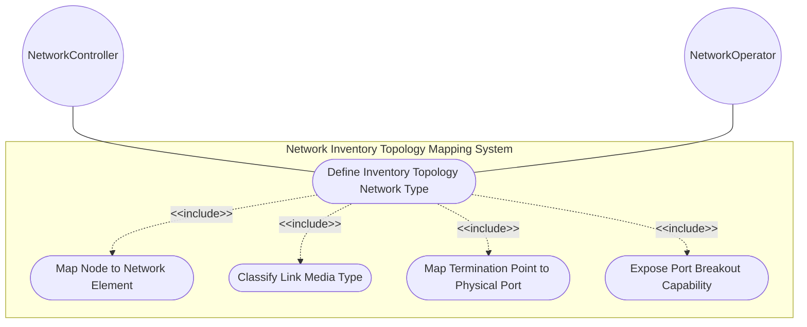
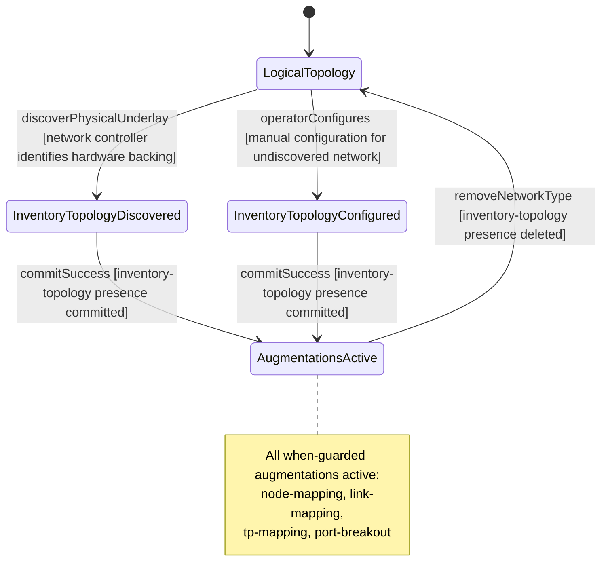

# Use Case: Define Inventory Topology Network Type

## Parent Epic
- [ ] #86 - [ietf-network-inventory-topology: Network Inventory Topology Mapping](https://github.com/gintatkinson/3dgs-033/blob/main/docs/epics/epic-06-ietf-network-inventory-topology.md) (presence container defining the inventory-topology network type identifier that gates all other augmentations, draft Section 5)

## 1. Actors
- **Primary Actor:** NetworkController — the network controller that discovers physical underlay networks and sets the inventory-topology network type on identified physical networks
- **Secondary Actors:** NetworkOperator — the human operator who manually configures the inventory-topology network type when automatic discovery is not feasible (CPE, leased lines, planned resources)

## 2. Preconditions
- A network topology instance exists under `/nw:networks/nw:network` with a `network-id` assigned
- The `ietf-network-inventory-topology` YANG module is loaded and its schema is available to the management plane
- The network does not already have `nwit:inventory-topology` present under its `network-types`

## 3. Trigger
A network controller discovers a physical underlay network whose nodes, links, and termination points correspond to physical hardware inventory, or an operator manually identifies a network as a physical underlay requiring inventory correlation.

## 4. Main Success Scenario (Basic Flow)
1. The NetworkController identifies a network as a physical underlay with hardware inventory backing.
2. The NetworkController instantiates the `nwit:inventory-topology` presence container under the network's `/nw:network-types`.
3. The management plane validates that the container is a bare presence container — no leaf attributes, no keys, no child data nodes — and commits the configuration.
4. The `when` guard expressions on all other `nwit` augmentations (node, link, termination-point inventory-mapping-attributes and port-breakout) evaluate to true.
5. The network is now identified as an inventory topology, and downstream systems can query inventory-mapping attributes on its nodes, links, and termination points.

## 5. Alternate and Exception Flows
- **5a. Network type placed on incorrect augmentation target (Branches from Basic Flow step 2):**
  1. The NetworkController attempts to instantiate `inventory-topology` outside the `/nw:networks/nw:network/nw:network-types` path.
  2. The management plane rejects the operation with a schema-mount violation, because the augment target is rigidly bound to `nw:network-types`, and the error message identifies the allowed target path.

- **5b. Container instantiated with illegal leaf attributes (Branches from Basic Flow step 2):**
  1. The NetworkController or operator attempts to set a leaf value or key inside the `inventory-topology` presence container.
  2. The management plane rejects the operation because the container is defined as a bare presence container with no children — its semantic value is its existence alone, and any child data is schema-invalid.

- **5c. Network already classified with conflicting underlay type (Branches from Basic Flow step 2):**
  1. The network already carries another physical-underlay network type that is semantically incompatible with `nwit:inventory-topology`.
  2. The management plane warns the operator of the potential conflict and requires confirmation before committing both types simultaneously, although coexistence is technically permissible per schema.

- **5d. When-guard fails to activate on dependent augmentations (Branches from Basic Flow step 4):**
  1. After `inventory-topology` is committed, a downstream augmentation's `when` condition evaluates to false due to a schema namespace resolution error or XPath context mismatch.
  2. The management plane surfaces the augmentation deactivation as a diagnostic event, listing each augment that failed its `when` guard and the resolved XPath context for operator investigation.

- **5e. Manual operator configuration for undiscovered network (Branches from Basic Flow step 1):**
  1. The automatic discovery system cannot reach the network (e.g., CPE outside management domain, third-party transport).
  2. The NetworkOperator manually adds the `nwit:inventory-topology` container to the network's `network-types` via edit-config.
  3. The management plane persists the manual configuration and activates all when-guarded augmentations, treating the manually-typed network identically to a discovered network for downstream queries.

## 6. Postconditions (Guarantees)
- **Success Guarantee:** The `nwit:inventory-topology` container is present under the network's `network-types`. All `when`-guarded augmentations on nodes (inventory-mapping-attributes), links (inventory-mapping-attributes), and termination points (inventory-mapping-attributes and port-breakout) are active for that network. Downstream systems can traverse and query inventory correlation data.
- **Failure Guarantee:** The `nwit:inventory-topology` container is either absent or rejected. No when-guarded augmentations are active. The network remains classified as a purely logical topology with no inventory-mapping overhead. Any partial write that fails mid-operation is rolled back atomically by the YANG datastore transaction.

## UML Diagrams
### Use Case Diagram

### State Machine Diagram

## 7. Operational Context

From draft-ietf-ivy-network-inventory-topology-08, Section 4 (Module Tree Structure):

> The module augments the "ietf-network-topology" module as follows: Inventory mapping attributes for nodes, and termination points: The corresponding containers augments the topology module with the references to the base network inventory.

From the YANG module inventory-topology container description:

> "Introduces a new network type for inventory topology mapping."
>
> "When present, it signals that the network contains physical-layer augmentations as defined in this module. This network type is intended to serve as the underlay for logical network topologies (Layer 2, Layer 3, Traffic Engineering (TE), etc.)."

From draft-ietf-ivy-network-inventory-topology-08, Section 6 (Operational Considerations):

> "This model enables a network controller to report discovered network topology and inventory information. Automatic discovery serves as the primary mechanism, with selective configuration capabilities provided for scenarios where discovery is not feasible."

## 8. Realization Matrix
### Required User Stories
- [ ] #87 - [Resolve Service Attachment Point to Physical Port via Inventory Topology](https://github.com/gintatkinson/3dgs-033/blob/main/docs/user-stories/us-36-resolve-sap-to-physical-port.md) (the inventory-topology network type must be present for the TP inventory mapping augment to be active, gate for SAP-to-port resolution)
- [ ] #88 - [Navigate Multi-Layer Network Topology to Underlying Physical Inventory](https://github.com/gintatkinson/3dgs-033/blob/main/docs/user-stories/us-37-multilayer-topology-to-inventory-navigation.md) (the inventory-topology network type discriminates physical-underlay networks from purely logical networks during layer traversal)
- [ ] #89 - [Execute What-If Scenario Analysis Using Topology-to-Inventory Mapping](https://github.com/gintatkinson/3dgs-033/blob/main/docs/user-stories/us-38-whatif-scenario-analysis.md) (identifies which networks carry physical underlay mapping data for what-if dependency tracing)
- [ ] #90 - [Configure Manual Inventory-Topology Mapping for Undiscovered Resources](https://github.com/gintatkinson/3dgs-033/blob/main/docs/user-stories/us-39-manual-inventory-topology-mapping.md) (the inventory-topology network type may be manually configured when discovery identifies a physical underlay network)
- [ ] #91 - [Classify Link Media Type with Distinct Unknown-Versus-Unassessed Semantics](https://github.com/gintatkinson/3dgs-033/blob/main/docs/user-stories/us-40-link-type-unknown-vs-unassessed.md) (the inventory-topology network type must be present for the link inventory mapping augment to be active)

### Required Features
- [ ] #81 - [Define Inventory Topology Network Type](https://github.com/gintatkinson/3dgs-033/blob/main/docs/features/feat-25-inventory-topology-network-type.md) (the presence container that defines the inventory-topology network type identifier and serves as the when-guard for all other augmentations)

## Source References
Structural Schema: [ietf-network-inventory-topology.yang](https://github.com/ietf-ivy-wg/network-inventory-topology/blob/main/yang/ietf-network-inventory-topology.yang) (Clause: augment /nw:networks/nw:network/nw:network-types, lines 132-152)
Normative Specification: [draft-ietf-ivy-network-inventory-topology-08](https://datatracker.ietf.org/doc/html/draft-ietf-ivy-network-inventory-topology) (Section 4, Section 5, Section 6)
