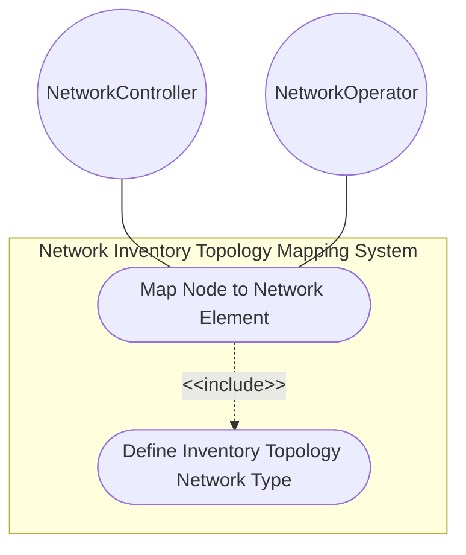
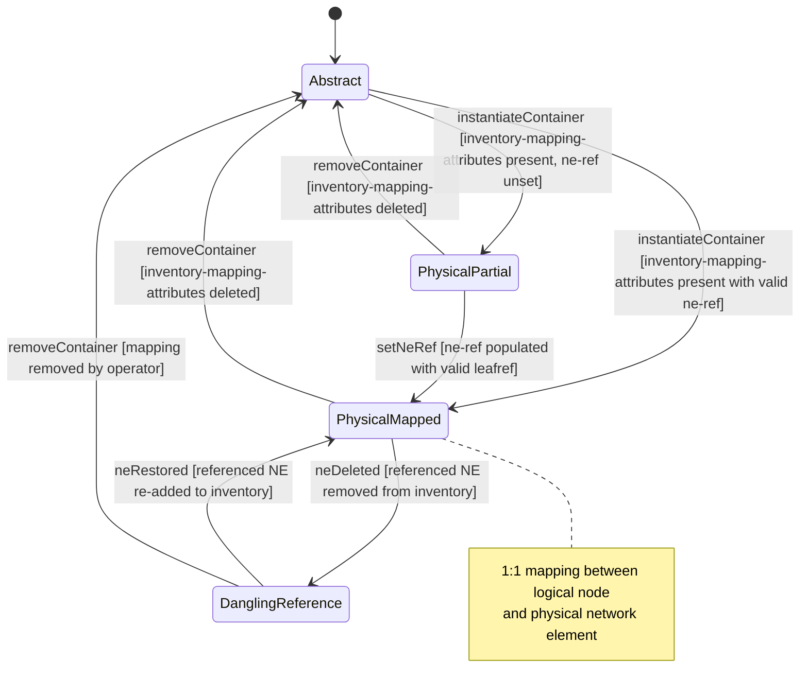

# Use Case: Map Topology Node to Network Element Inventory

## Parent Epic
- [ ] #86 - [ietf-network-inventory-topology: Network Inventory Topology Mapping](https://github.com/gintatkinson/3dgs-033/blob/main/docs/epics/epic-06-ietf-network-inventory-topology.md) (presence container augmenting node with ne-ref leafref for 1:1 logical-node-to-physical-NE correlation, draft Section 5)

## 1. Actors
- **Primary Actor:** NetworkController — the network controller that discovers topology nodes and resolves their physical network element mapping via the NE inventory
- **Secondary Actors:** NetworkOperator — the human operator who manually populates ne-ref for nodes outside the automated discovery domain

## 2. Preconditions
- The parent network carries `nwit:inventory-topology` under its `network-types` (the when-guard is satisfied)
- The target network element identified by the ne-ref leafref exists in `/nwi:network-inventory/nwi:network-elements` with a valid `ne-id`
- The topology node exists under `/nw:networks/nw:network/nw:node` with an assigned `node-id`

## 3. Trigger
A network controller discovers a topology node that corresponds to a physical network element in the inventory, or an operator designates a node as requiring manual inventory correlation.

## 4. Main Success Scenario (Basic Flow)
1. The NetworkController queries the base network inventory to obtain the `ne-id` of the network element associated with the discovered topology node.
2. The NetworkController instantiates the `nwit:inventory-mapping-attributes` presence container under the target node.
3. The NetworkController sets the `ne-ref` leaf to the resolved `nwi:ne-ref` value pointing to the network element's `ne-id`.
4. The management plane validates the leafref constraint — the referenced `ne-id` must exist in the inventory's network-elements list — and commits the mapping.
5. The node transitions from Abstract state to Physical state. Downstream systems can navigate from the logical topology node to the physical network element via the resolved ne-ref.

## 5. Alternate and Exception Flows
- **5a. When-guard fails — inventory-topology network type absent (Branches from Basic Flow step 2):**
  1. The parent network does not carry `nwit:inventory-topology` under its `network-types`.
  2. The management plane rejects the instantiation of `nwit:inventory-mapping-attributes` because the `when '../nw:network-types/nwit:inventory-topology'` condition evaluates to false.
  3. The operation is rejected and the node remains in Abstract state; an error message identifies the missing network-type precondition.

- **5b. Container duplicated on the same node (Branches from Basic Flow step 2):**
  1. The NetworkController or operator attempts to instantiate a second `inventory-mapping-attributes` container under a node that already has one.
  2. The management plane rejects the operation because container cardinality is exactly 1 — a node cannot carry multiple inventory-mapping-attributes containers.

- **5c. ne-ref leafref resolves against a dangling or deleted NE (Branches from Basic Flow step 4):**
  1. The `ne-ref` leafref targets a `ne-id` that does not exist in the network inventory or has been removed since the mapping was last validated.
  2. The leafref constraint fails at validation time and the operation is rejected.
  3. The management plane surfaces the dangling reference as a referential integrity error, identifying the specific node `node-id`, the unresolvable `ne-ref` value, and the inventory list path where resolution was attempted.

- **5d. Node is abstract with no inventory-mapping-attributes container (Branches from Basic Flow step 1):**
  1. The NetworkController or operator queries a node that has no `inventory-mapping-attributes` container present.
  2. The node is classified as Abstract/Logical — it has no physical NE correlation and is treated as a purely logical topology construct.
  3. Downstream systems treat the abstract node differently: no inventory navigation is available, no physical resource constraints apply, and the node participates only in logical-layer operations.

- **5e. Manual NE mapping for undiscovered node (Branches from Basic Flow step 1):**
  1. The automatic discovery system cannot determine the physical NE behind a topology node (e.g., CPE outside management domain, pre-provisioned planned resource).
  2. The NetworkOperator manually instantiates `inventory-mapping-attributes` and sets `ne-ref` to a manually-registered or pre-provisioned NE inventory entry.
  3. The management plane validates the leafref (the manual NE must already exist in the inventory), commits the mapping, and the node transitions to Physical state — the manual mapping is semantically indistinguishable from a discovered mapping.

- **5f. ne-ref left unset within present container (Branches from Basic Flow step 3):**
  1. The `inventory-mapping-attributes` container is present but the `ne-ref` leaf is omitted.
  2. The container signals the node is intended to be physical but has no specific NE correlated yet. The node is in a Partial state — classified as physical but without an active NE reference.
  3. Downstream systems treat the partial mapping as valid but unresolved; inventory navigation is not available until `ne-ref` is populated.

## 6. Postconditions (Guarantees)
- **Success Guarantee:** The `nwit:inventory-mapping-attributes` container is present under the node with a valid `ne-ref` leafref resolving to an existing network element in the inventory. The node is classified as Physical (Mapped) with a 1:1 correlation to its NE. Downstream multi-layer navigation, what-if analysis, and service provisioning can traverse from the logical node to the physical NE.
- **Failure Guarantee:** The node retains its prior state — either Abstract (container absent) or Partial (container present but ne-ref unset or dangling). The failed write operation is rolled back atomically. No incomplete or invalid mapping is committed.

## UML Diagrams
### Use Case Diagram

### State Machine Diagram

## 7. Operational Context

From draft-ietf-ivy-network-inventory-topology-08, Section 4 (Module Tree Structure):

> The module augments the "ietf-network-topology" module as follows: Inventory mapping attributes for nodes, and termination points: The corresponding containers augments the topology module with the references to the base network inventory.

From the YANG module node augment description:

> "Augments the network topology node with inventory mapping attributes. This enables correlation between the logical node and its physical network element."

From the YANG module presence statement:

> "If present, it indicates this is a physical node, which maps to a network element. If not present, it indicates it is an abstract node."

From the YANG module ne-ref description:

> "Reference to the NE in the inventory that corresponds to this topology node. This reference establishes a 1:1 mapping between the logical node and its physical NE."

From draft-ietf-ivy-network-inventory-topology-08, Section 6 (Operational Considerations):

> "The inventory-mapping-attributes containers are defined as read-write (config true) to accommodate cases where automatic discovery is not possible, including: Customer-premises equipment (CPE) outside the operator's management domain; Leased lines and third-party transport resources; Planned or hypothetical resources for future deployment."

## 8. Realization Matrix
### Required User Stories
- [ ] #87 - [Resolve Service Attachment Point to Physical Port via Inventory Topology](https://github.com/gintatkinson/3dgs-033/blob/main/docs/user-stories/us-36-resolve-sap-to-physical-port.md) (ne-ref on the parent node identifies the network element hosting the resolved port, required for SAP-to-port navigation)
- [ ] #88 - [Navigate Multi-Layer Network Topology to Underlying Physical Inventory](https://github.com/gintatkinson/3dgs-033/blob/main/docs/user-stories/us-37-multilayer-topology-to-inventory-navigation.md) (ne-ref provides the mapping from physical topology node to network element for layer-crossing inventory correlation)
- [ ] #89 - [Execute What-If Scenario Analysis Using Topology-to-Inventory Mapping](https://github.com/gintatkinson/3dgs-033/blob/main/docs/user-stories/us-38-whatif-scenario-analysis.md) (ne-ref enables forward tracing from physical NE to dependent logical topology nodes for EoL impact analysis)
- [ ] #90 - [Configure Manual Inventory-Topology Mapping for Undiscovered Resources](https://github.com/gintatkinson/3dgs-033/blob/main/docs/user-stories/us-39-manual-inventory-topology-mapping.md) (read-write ne-ref mapping enables manual operator configuration of node-to-NE correlation)
- [ ] #94 - [Validate Chained Leafref Referential Integrity from TP to Port Component](https://github.com/gintatkinson/3dgs-033/blob/main/docs/user-stories/us-43-chained-leafref-referential-integrity.md) (the same ne-ref leafref type and resolution semantics apply to node-level mapping, sharing the validation logic)

### Required Features
- [ ] #82 - [Define Node Inventory Mapping Attributes](https://github.com/gintatkinson/3dgs-033/blob/main/docs/features/feat-26-node-inventory-mapping.md) (the inventory-mapping-attributes presence container with ne-ref leafref that establishes the 1:1 node-to-NE mapping)

## Source References
Structural Schema: [ietf-network-inventory-topology.yang](https://github.com/ietf-ivy-wg/network-inventory-topology/blob/main/yang/ietf-network-inventory-topology.yang) (Clause: augment /nw:networks/nw:network/nw:node, lines 154-177)
Normative Specification: [draft-ietf-ivy-network-inventory-topology-08](https://datatracker.ietf.org/doc/html/draft-ietf-ivy-network-inventory-topology) (Section 4, Section 5, Section 6)
