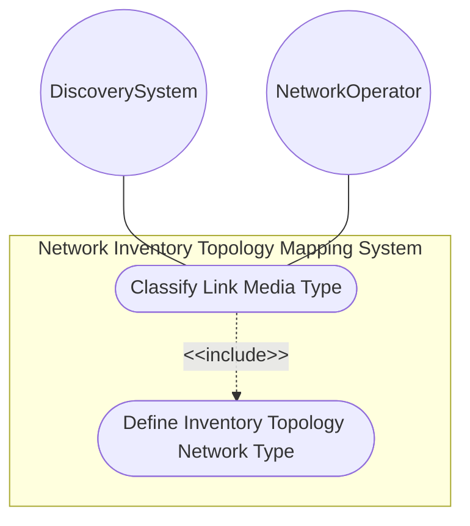
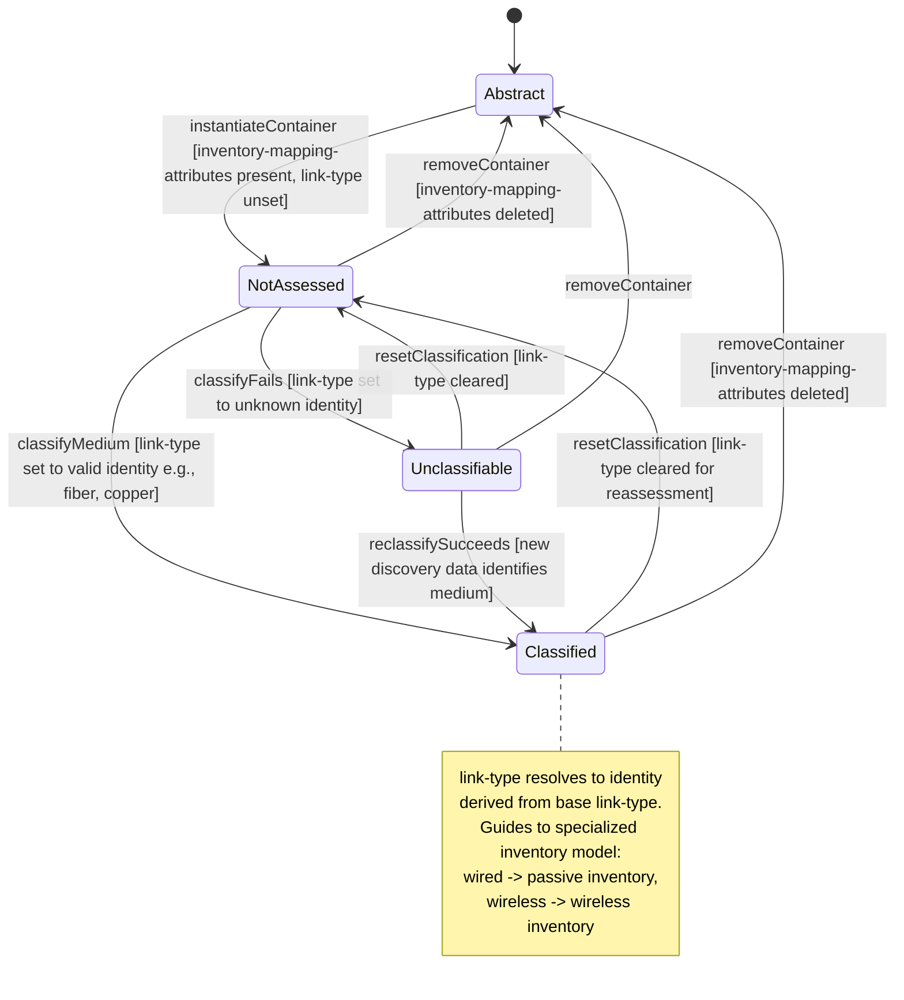

# Use Case: Classify Link Media Type in Inventory Topology

## Parent Epic
- [ ] #86 - [ietf-network-inventory-topology: Network Inventory Topology Mapping](https://github.com/gintatkinson/3dgs-033/blob/main/docs/epics/epic-06-ietf-network-inventory-topology.md) (presence container augmenting link with link-type identityref for physical media classification, draft Section 4.1)

## 1. Actors
- **Primary Actor:** DiscoverySystem — the automated topology discovery service that assesses link physical media and classifies it into the extensible link-type identity hierarchy
- **Secondary Actors:** NetworkOperator — the human operator who manually classifies link media for undiscovered or third-party transport links

## 2. Preconditions
- The parent network carries `nwit:inventory-topology` under its `network-types` (the when-guard is satisfied)
- A topology link exists under `/nw:networks/nw:network/nt:link` with a `link-id`, `source`, and `destination` assigned
- The `ietf-network-inventory-topology` module's identity hierarchy (`link-type`, `copper`, `fiber`, `coax`, `microwave`, `wlan`, `unknown`, `leased-fiber`) is loaded

## 3. Trigger
A discovery system performs a media assessment pass on a physical underlay link and identifies the link medium, or an operator designates a link for manual media classification.

## 4. Main Success Scenario (Basic Flow)
1. The DiscoverySystem performs a physical medium assessment on an underlay link between two topology nodes.
2. The DiscoverySystem instantiates the `nwit:inventory-mapping-attributes` presence container under the target link.
3. The DiscoverySystem sets the `link-type` leaf to the resolved identityref value (e.g., `fiber`, `copper`, `microwave`) matching the assessed medium.
4. The management plane validates the identityref constraint — the value must resolve to an identity derived from the base `link-type` — and commits the classification.
5. The link is now classified with its physical media type. Downstream systems can navigate to the appropriate specialized inventory model: passive network inventory for wired media, wireless-specific inventory for microwave/wlan links.

## 5. Alternate and Exception Flows
- **5a. When-guard fails — inventory-topology network type absent (Branches from Basic Flow step 2):**
  1. The parent network does not carry `nwit:inventory-topology` under its `network-types`.
  2. The management plane rejects the instantiation of `nwit:inventory-mapping-attributes` on the link because the `when '../nw:network-types/nwit:inventory-topology'` condition evaluates to false.
  3. The link remains as an Abstract/Logical link with no media classification; an error message identifies the missing network-type precondition.

- **5b. Discovery system cannot classify the medium — link-type set to unknown (Branches from Basic Flow step 3):**
  1. The DiscoverySystem exhausts all classification methods without identifying the medium.
  2. The DiscoverySystem explicitly sets `link-type` to the `unknown` identity rather than leaving the leaf unset.
  3. The link transitions to Unclassifiable state — downstream systems can distinguish this from Not Assessed (leaf unset) and may trigger reclassification passes.
  4. The link participates in topology navigation with an explicit "unknown medium" classification, informing capacity and path feasibility checks.

- **5c. Link medium has not yet been assessed — link-type left unset (Branches from Basic Flow step 2):**
  1. The `inventory-mapping-attributes` container is present but the `link-type` leaf is not set.
  2. The link is in the Not Assessed state — semantically distinct from Unclassifiable (unknown) and from Abstract (container absent).
  3. Downstream systems interpret the unset leaf as requiring a future discovery pass and may schedule the link for re-assessment.

- **5d. Invalid identityref value assigned (Branches from Basic Flow step 4):**
  1. The DiscoverySystem or operator attempts to set `link-type` to a value that does not derive from the base `link-type` identity.
  2. The management plane rejects the operation with an identityref validation error, listing the valid derived identities and the invalid value attempted.

- **5e. Link is abstract/logical with no inventory-mapping-attributes container (Branches from Basic Flow step 1):**
  1. The DiscoverySystem or operator queries a link that has no `inventory-mapping-attributes` container present.
  2. The link is classified as Abstract/Logical — it has no physical medium correlation and is treated as a purely logical topology construct (e.g., a Layer 3 adjacency).
  3. No media classification is available, and the link is excluded from physical resource capacity assessments.

- **5f. Leased fiber link classified as fiber with limited visibility (Branches from Basic Flow step 3):**
  1. The link medium is fiber but the physical infrastructure is provided by a third-party operator — detailed physical attributes are not visible to the lessee.
  2. The NetworkOperator sets `link-type` to the `leased-fiber` identity (derived from `fiber`).
  3. The management plane validates the identityref (leased-fiber is a valid descendant of `link-type`) and commits. Downstream systems recognize the leased-fiber classification and do not attempt to query detailed passive inventoried attributes.

- **5g. Microwave link-type guides to specialized microwave topology model (Branches from Basic Flow step 5):**
  1. The `link-type` is set to `microwave` — this module provides only the lightweight classification identity.
  2. Downstream systems that require detailed microwave radio attributes (frequency, modulation, capacity, radio signal propagation) navigate to the microwave topology data model for the full attribute set.
  3. If the microwave topology data model is not deployed or not available at the query target, the system falls back to the lightweight `microwave` classification with a warning that detailed attributes are unavailable — the link still participates in inventory topology navigation with its media classification intact.

## 6. Postconditions (Guarantees)
- **Success Guarantee:** The `nwit:inventory-mapping-attributes` container is present under the link with a valid `link-type` identityref value classifying the physical medium. The link is in a Classified state. Downstream systems can navigate to the appropriate specialized inventory model (passive network inventory for wired, wireless-specific for microwave/wlan).
- **Failure Guarantee:** The link retains its prior classification state — either Abstract (container absent), Not Assessed (container present but link-type unset), or a previously valid classification. The failed write operation is rolled back atomically. No invalid or partial classification is committed.

## UML Diagrams
### Use Case Diagram

### State Machine Diagram

## 7. Operational Context

From draft-ietf-ivy-network-inventory-topology-08, Section 4.1 (Link Extensions):

> This document adds a lightweight "link-type" leaf to the topology link mapping to enable basic physical media classification.
>
> "link-type": An identityref indicating the link media type. Examples of wired link types are "copper", "fiber", or "coax". For wireless media, values such as "microwave", or "wlan" may be used.
>
> The "link-type" serves as a lightweight discriminator that guides to the appropriate specialized inventory model for detailed resource information. For example, wired media ("fiber" or "copper") typically references a passive network inventory model.

From the YANG module unknown identity description:

> "The link media type is unknown or could not be determined. This identity is used as a fallback when the physical medium cannot be classified into any of the other defined types. When a discovery system is unable to determine the media type, it should set this identity rather than leaving the leaf unset. An unset leaf indicates that the link type has not been assessed, whereas unknown explicitly records that the medium could not be classified."

From the YANG module link container description:

> "Container for inventory-related attributes of a link. This container provides lightweight media classification. The link-type indicates which specialized inventory model contains detailed resource information."

## 8. Realization Matrix
### Required User Stories
- [ ] #88 - [Navigate Multi-Layer Network Topology to Underlying Physical Inventory](https://github.com/gintatkinson/3dgs-033/blob/main/docs/user-stories/us-37-multilayer-topology-to-inventory-navigation.md) (link-type provides physical media classification for links at the underlay layer during multi-layer traversal)
- [ ] #89 - [Execute What-If Scenario Analysis Using Topology-to-Inventory Mapping](https://github.com/gintatkinson/3dgs-033/blob/main/docs/user-stories/us-38-whatif-scenario-analysis.md) (link-type classification filters feasible paths and excludes unclassifiable media during alternative path evaluation)
- [ ] #90 - [Configure Manual Inventory-Topology Mapping for Undiscovered Resources](https://github.com/gintatkinson/3dgs-033/blob/main/docs/user-stories/us-39-manual-inventory-topology-mapping.md) (read-write link-type enables manual media classification including leased-fiber for third-party links)
- [ ] #91 - [Classify Link Media Type with Distinct Unknown-Versus-Unassessed Semantics](https://github.com/gintatkinson/3dgs-033/blob/main/docs/user-stories/us-40-link-type-unknown-vs-unassessed.md) (the link-type identityref and its identity hierarchy including unknown are the classification mechanism and the unknown fallback identity)

### Required Features
- [ ] #83 - [Define Link Inventory Media Classification](https://github.com/gintatkinson/3dgs-033/blob/main/docs/features/feat-27-link-inventory-media-classification.md) (the inventory-mapping-attributes presence container with link-type identityref and extensible identity hierarchy for physical media classification)

## Source References
Structural Schema: [ietf-network-inventory-topology.yang](https://github.com/ietf-ivy-wg/network-inventory-topology/blob/main/yang/ietf-network-inventory-topology.yang) (Clauses: identities link-type through leased-fiber, lines 68-128; augment /nw:networks/nw:network/nt:link, lines 179-220)
Normative Specification: [draft-ietf-ivy-network-inventory-topology-08](https://datatracker.ietf.org/doc/html/draft-ietf-ivy-network-inventory-topology) (Section 4.1, Section 5, Appendix A)
