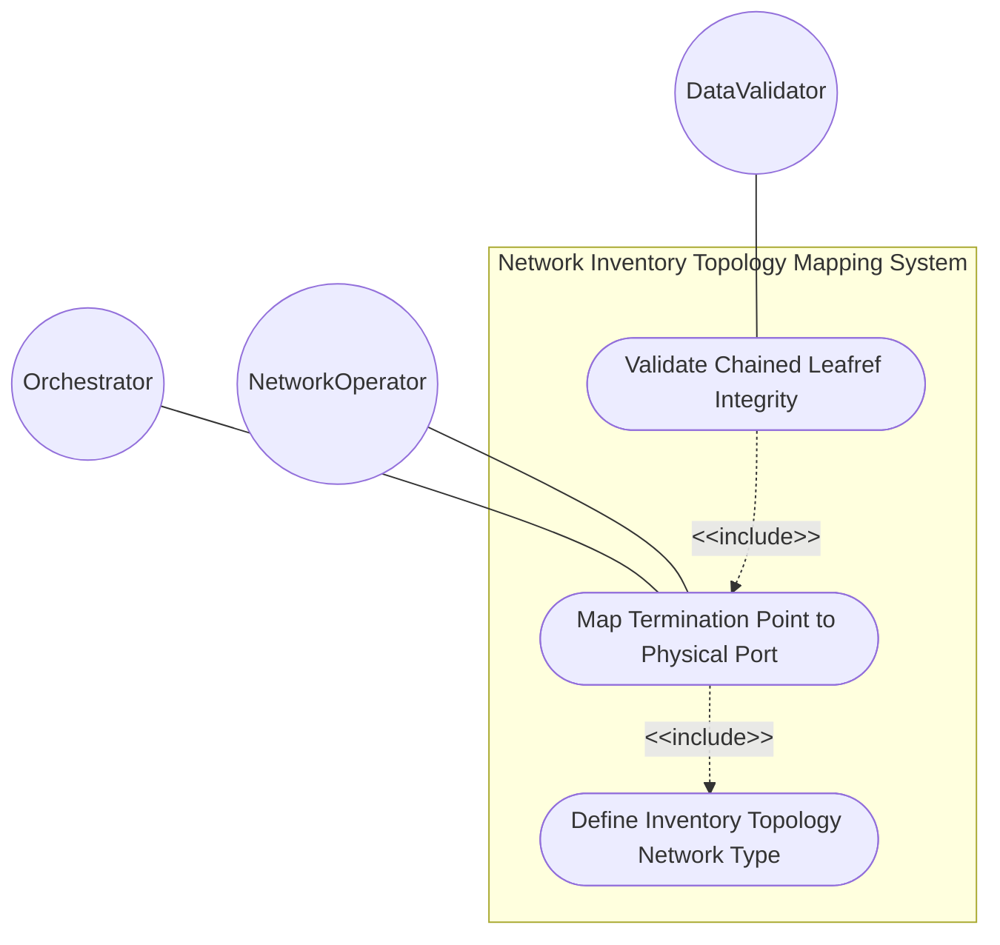
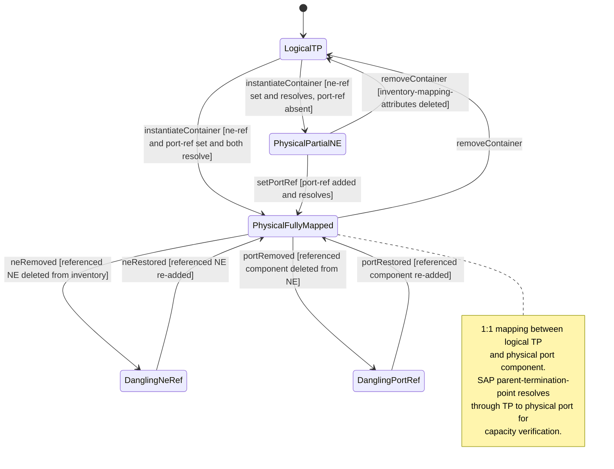

# Use Case: Map Termination Point to Physical Port Component

## Parent Epic
- [ ] #86 - [ietf-network-inventory-topology: Network Inventory Topology Mapping](https://github.com/gintatkinson/3dgs-033/blob/main/docs/epics/epic-06-ietf-network-inventory-topology.md) (presence container augmenting termination point with ne-ref and port-ref leafrefs for 1:1 TP-to-physical-port mapping, draft Section 5)

## 1. Actors
- **Primary Actor:** Orchestrator — the service orchestration system that resolves Service Attachment Points through topology TPs to physical port components during service provisioning
- **Secondary Actors:** NetworkOperator — the human operator who manually populates TP inventory mapping for ports outside automated discovery; DataValidator — the validation engine that verifies chained leafref integrity at commit time

## 2. Preconditions
- The parent network carries `nwit:inventory-topology` under its `network-types` (the when-guard `../../nw:network-types/nwit:inventory-topology` is satisfied)
- The parent node exists under `/nw:networks/nw:network/nw:node` with a `node-id` assigned
- The termination point exists under the node's `nt:termination-point` list with a `tp-id` assigned
- The network element identified by `ne-ref` exists in `/nwi:network-inventory/nwi:network-elements`
- The port component identified by `port-ref` exists within the referenced NE's `nwi:components` list

## 3. Trigger
An orchestrator queries a Service Attachment Point (SAP) and needs to resolve its `parent-termination-point` to the underlying physical port component to verify capacity before committing a service provisioning request.

## 4. Main Success Scenario (Basic Flow)
1. The Orchestrator queries a list of candidate SAPs and identifies each SAP's `parent-termination-point` referencing a topology TP.
2. The Orchestrator navigates to the referenced TP and queries its `nwit:inventory-mapping-attributes` container.
3. The Orchestrator reads the `ne-ref` leafref, resolving it to the network element in the inventory that hosts the port.
4. The Orchestrator reads the `port-ref` leafref, resolving it to the specific port component within that NE's components list.
5. The Orchestrator consults capacity models (e.g., TE topology) to verify whether the identified physical port has adequate resources for the requested service.
6. The Orchestrator commits the service provisioning request against the validated physical port, or selects an alternate SAP if capacity is insufficient.

## 5. Alternate and Exception Flows
- **5a. When-guard fails — inventory-topology network type absent (Branches from Basic Flow step 2):**
  1. The grandparent network does not carry `nwit:inventory-topology` under its `network-types`.
  2. The `nwit:inventory-mapping-attributes` container is not valid on the TP because the `when '../../nw:network-types/nwit:inventory-topology'` condition evaluates to false.
  3. The TP is treated as a logical TP with no inventory correlation. The SAP-to-port resolution chain terminates at the logical layer — the Orchestrator cannot locate a physical port and must flag the service request for manual operator assessment.

- **5b. TP is logical with no inventory-mapping-attributes container (Branches from Basic Flow step 2):**
  1. The `nwit:inventory-mapping-attributes` container is absent from the TP.
  2. The TP is classified as Logical — it has no physical port correlation (e.g., a VLAN sub-interface or virtual interface).
  3. The Orchestrator cannot resolve a physical port for this TP. If this TP is the parent-termination-point of a candidate SAP, the SAP is excluded from automatic capacity verification.

- **5c. ne-ref leafref is dangling — referenced NE does not exist (Branches from Basic Flow step 3):**
  1. The `ne-ref` leafref targets a `ne-id` that is not present in the network inventory's network-elements list.
  2. The leafref constraint fails at validation or query time.
  3. The management plane surfaces a referential integrity error identifying the TP `tp-id`, the unresolvable `ne-ref` value, and the inventory path where resolution failed. The Orchestrator cannot complete the SAP-to-port resolution and flags the request for operator investigation.

- **5d. port-ref leafref is dangling — port component does not exist within the referenced NE (Branches from Basic Flow step 4):**
  1. The `ne-ref` resolves successfully to a network element, but the `port-ref` leafref targets a `component-id` that does not exist within that NE's components list.
  2. The management plane reports a chained reference failure — the NE was found but the port component is missing.
  3. The Orchestrator cannot complete the physical port resolution and flags the request with the specific chained-failure details for operator remediation.

- **5e. Physical port has insufficient capacity for the requested service (Branches from Basic Flow step 5):**
  1. The Orchestrator resolves the TP to the physical port component successfully but the TE topology capacity check reveals the port's speed is fully utilized.
  2. The Orchestrator selects an alternate SAP from the candidate list that maps to a different port with adequate capacity and retries the resolution chain.
  3. If no alternate SAP with adequate capacity is available, the Orchestrator flags the request for manual operator intervention, providing precise inventory bottleneck information.

- **5f. Partial mapping — ne-ref set but port-ref absent (Branches from Basic Flow step 3):**
  1. The `inventory-mapping-attributes` container is present, `ne-ref` is set and resolves, but `port-ref` is omitted (both leaves are optional per schema).
  2. The TP maps to an NE but not to a specific port component. This is a valid partial mapping — the TP is physical but lacks port-level granularity.
  3. The Orchestrator can identify the hosting NE but cannot resolve the exact physical port. The service request may proceed if NE-level capacity assessment is sufficient, or the Orchestrator escalates for port-ref population.

- **5g. Manual TP-to-port mapping for undiscovered port (Branches from Basic Flow step 1):**
  1. The automatic discovery system cannot discover a third-party transport resource port.
  2. The NetworkOperator manually instantiates `nwit:inventory-mapping-attributes` on the TP with `ne-ref` and `port-ref` pointing to manually-registered inventory entities.
  3. The management plane validates both leafrefs and commits the mapping. The TP is now correlated with its physical port for service provisioning purposes, indistinguishable from a discovered mapping.

## 6. Postconditions (Guarantees)
- **Success Guarantee:** The `nwit:inventory-mapping-attributes` container is present under the TP with valid `ne-ref` and `port-ref` leafrefs resolving to existing inventory entities. The TP is classified as a Physical TP with a 1:1 mapping to its port component. The Orchestrator has resolved the SAP through the TP to the physical port and verified capacity. The service provisioning request is committed against the validated physical resource.
- **Failure Guarantee:** The TP retains its prior mapping state. Any failed write is rolled back atomically. The Orchestrator receives a failed resolution signal with specific error details (dangling reference, insufficient capacity, logicallogical TP) and can escalate to manual operator intervention with precise inventory bottleneck information.

## UML Diagrams
### Use Case Diagram

### State Machine Diagram

## 7. Operational Context

From draft-ietf-ivy-network-inventory-topology-08, Section 3.1:

> The inventory topology data model provides a physical port reference (port-ref) that enables correlation between logical topology entities and physical inventory components. During service provisioning, the SAP's parent-termination-point can be associated with the inventory topology's port-ref to locate the underlying physical resource.
>
> The orchestrator can then consult other relevant topology models to verify whether the identified port has adequate capacity for the requested service. If the physical port underlying a candidate SAP has insufficient resources (e.g., port speed fully utilized), the orchestrator can select an alternate SAP that maps to a different port with adequate capacity. If no alternative SAP is available, the orchestrator flags the request for manual intervention.

From the YANG module TP augment description:

> "Augments the TP with inventory mapping and port breakout."

From the YANG module presence statement and refined port-ref description:

> "If present, it indicates this is a physical termination point (TP), which maps to a port component. If not present, it indicates it is a logical TP."
>
> "Reference to the physical port component in the network inventory. This reference establishes a 1:1 mapping between the logical TP and its physical port component."

## 8. Realization Matrix
### Required User Stories
- [ ] #87 - [Resolve Service Attachment Point to Physical Port via Inventory Topology](https://github.com/gintatkinson/3dgs-033/blob/main/docs/user-stories/us-36-resolve-sap-to-physical-port.md) (port-ref leafref provides the link from logical TP to physical port component, enabling the SAP-to-port resolution chain)
- [ ] #88 - [Navigate Multi-Layer Network Topology to Underlying Physical Inventory](https://github.com/gintatkinson/3dgs-033/blob/main/docs/user-stories/us-37-multilayer-topology-to-inventory-navigation.md) (port-ref provides the mapping from physical TP to port component for cross-layer resource tracing)
- [ ] #89 - [Execute What-If Scenario Analysis Using Topology-to-Inventory Mapping](https://github.com/gintatkinson/3dgs-033/blob/main/docs/user-stories/us-38-whatif-scenario-analysis.md) (port-ref enables enumeration of all physical ports and their mapped TPs for capacity-based path re-optimization)
- [ ] #90 - [Configure Manual Inventory-Topology Mapping for Undiscovered Resources](https://github.com/gintatkinson/3dgs-033/blob/main/docs/user-stories/us-39-manual-inventory-topology-mapping.md) (read-write port-ref mapping enables manual TP-to-port component correlation)
- [ ] #92 - [Configure Port as Trunk or Breakout from Breakout-Capable Hardware](https://github.com/gintatkinson/3dgs-033/blob/main/docs/user-stories/us-41-trunk-breakout-port-reconfiguration.md) (the inventory mapping on the TP identifies which physical port component provides the breakout capability)
- [ ] #94 - [Validate Chained Leafref Referential Integrity from TP to Port Component](https://github.com/gintatkinson/3dgs-033/blob/main/docs/user-stories/us-43-chained-leafref-referential-integrity.md) (the ne-ref and port-ref leafrefs are defined here and the chained reference path originates from these two leaves)

### Required Features
- [ ] #84 - [Define Termination Point Inventory Mapping](https://github.com/gintatkinson/3dgs-033/blob/main/docs/features/feat-28-tp-inventory-mapping.md) (the inventory-mapping-attributes presence container with nwi:port-ref grouping providing ne-ref and port-ref leafrefs)

## Source References
Structural Schema: [ietf-network-inventory-topology.yang](https://github.com/ietf-ivy-wg/network-inventory-topology/blob/main/yang/ietf-network-inventory-topology.yang) (Clause: augment /nw:networks/nw:network/nw:node/nt:termination-point, lines 222-242)
Normative Specification: [draft-ietf-ivy-network-inventory-topology-08](https://datatracker.ietf.org/doc/html/draft-ietf-ivy-network-inventory-topology) (Section 3.1, Section 4, Section 5)
