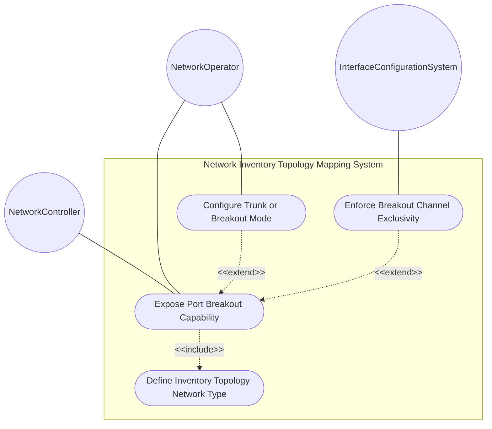
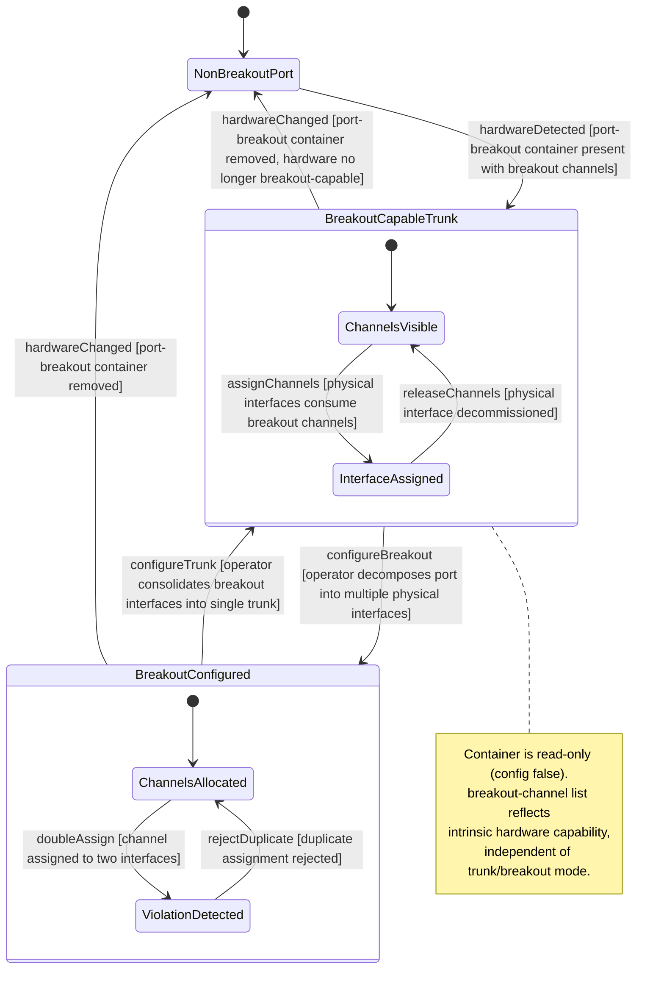

# Use Case: Expose Port Breakout Capability on Termination Point

## Parent Epic
- [ ] #86 - [ietf-network-inventory-topology: Network Inventory Topology Mapping](https://github.com/gintatkinson/3dgs-033/blob/main/docs/epics/epic-06-ietf-network-inventory-topology.md) (read-only presence container listing breakout-channel hardware capability, draft Section 4.2)

## 1. Actors
- **Primary Actor:** NetworkController — the network controller that discovers hardware port characteristics and exposes breakout channel topology as read-only operational state
- **Secondary Actors:** NetworkOperator — the human operator who configures breakout-capable ports as trunk or breakout interfaces based on exposed channel topology; InterfaceConfigurationSystem — the system that assigns physical interfaces to breakout channels under the exclusive-assignment constraint

## 2. Preconditions
- The parent network carries `nwit:inventory-topology` under its `network-types` (the when-guard `../../nw:network-types/nwit:inventory-topology` is satisfied)
- A termination point exists under the node's `nt:termination-point` list representing a physical port
- The underlying hardware port supports channel breakout (e.g., a 400 Gb/s DR4 port with 4 independent 100 Gb/s lanes)
- The hardware discovery subsystem has enumerated the breakout channels and their `channel-id` values

## 3. Trigger
A network controller discovers a high-density Ethernet port whose hardware supports partitioning into multiple independent channels, or an operator queries a TP to inspect its breakout capability before configuring the port as trunk or breakout.

## 4. Main Success Scenario (Basic Flow)
1. The NetworkController discovers a 400 Gb/s DR4 port and queries its hardware capability via the port's management interface.
2. The NetworkController instantiates the `nwit:port-breakout` presence container on the TP representing that port.
3. The NetworkController populates the `breakout-channel` list with entries — one per independent lane — assigning each a unique `channel-id` (e.g., 1, 2, 3, 4).
4. The management plane validates the data: the container is `config false`, the list is keyed by `channel-id` (type `uint16`), and each `channel-id` must be unique within the parent port scope. The data is committed as read-only operational state.
5. Downstream systems (operator, interface configuration system, what-if analysis engine) can query the breakout-channel list to understand the port's intrinsic partitioning capability, independently of whether the port is currently configured as a trunk or as breakout interfaces.

## 5. Alternate and Exception Flows
- **5a. When-guard fails — inventory-topology network type absent (Branches from Basic Flow step 2):**
  1. The grandparent network does not carry `nwit:inventory-topology` under its `network-types`.
  2. The `nwit:port-breakout` container is not valid on the TP because the `when '../../nw:network-types/nwit:inventory-topology'` condition evaluates to false.
  3. No breakout capability data is exposed. The TP is treated as a non-breakout port with no channel partitioning information.

- **5b. Port is not breakout-capable — container omitted (Branches from Basic Flow step 1):**
  1. The discovered port (e.g., a standard 10 Gb/s SFP+ port) does not support channel breakout at the hardware level.
  2. The `nwit:port-breakout` container is not instantiated — it is omitted entirely per the schema design principle of keeping the topology model minimal.
  3. The operator cannot configure the port as breakout because no breakout capability data exists. The port operates only as a single, non-partitionable physical port.

- **5c. Client attempts to modify read-only container (Branches from Basic Flow step 4):**
  1. A client (operator or automated system) attempts to create, modify, or delete a `breakout-channel` entry or the `port-breakout` container itself via the configuration datastore.
  2. The management plane rejects the operation because `port-breakout` is `config false` — the data represents hardware-determined state that can only be updated by hardware discovery.
  3. An error response is returned indicating the node is read-only operational state and cannot be altered via configuration.

- **5d. Channel-id collision within breakout-channel list (Branches from Basic Flow step 3):**
  1. The NetworkController or discovery subsystem attempts to add a `breakout-channel` entry with a `channel-id` that already exists in the list.
  2. The management plane rejects the entry because `channel-id` is the list key and must be unique within the scope of the parent port.
  3. The duplicate entry is discarded; the existing channel with that `channel-id` remains unchanged.

- **5e. Port currently configured as trunk — breakout channels still listed (Branches from Basic Flow step 5):**
  1. A breakout-capable port is currently configured as a single trunk interface (one physical interface consuming all breakout channels).
  2. The `port-breakout` container and its `breakout-channel` list remain visible because they represent intrinsic hardware capability, not current configuration.
  3. The operator inspects the channel list to understand how many breakout interfaces could be created, then reconfigures the port from trunk to breakout mode. The `breakout-channel` list itself does not change — the hardware capability is immutable.
  4. The operator decomposes the port into multiple physical interfaces (e.g., four 100G interfaces), each consuming breakout channels per the exclusive-assignment constraint.

- **5f. Breakout channel double-assignment violation (Branches from Basic Flow step 5):**
  1. The InterfaceConfigurationSystem attempts to assign breakout channel 1 to physical interface "if-100G-1" when channel 1 is already allocated to physical interface "if-100G-5".
  2. The assignment is rejected. A breakout channel MUST NOT be associated with more than one physical interface — it is an atomic resource element obtained by partitioning the port.
  3. The InterfaceConfigurationSystem receives a violation report and must either assign a different, unallocated channel or decommission the existing interface holding channel 1 before reassignment.

- **5g. Breakout-channel list is present but empty (Branches from Basic Flow step 3):**
  1. The `port-breakout` container is present (the hardware supports partitioning), but the `breakout-channel` list contains no entries.
  2. The port is breakout-capable but no lanes are currently provisioned or exposed by the hardware discovery layer.
  3. Downstream systems recognize the port as breakout-capable but with no active channels, and the operator may need to reconfigure hardware channel provisioning before breakout interfaces can be assigned.

- **5h. Channel-id value exceeds uint16 range (Branches from Basic Flow step 3):**
  1. The discovery subsystem reports a `channel-id` value outside the `uint16` range (0 to 65535).
  2. The management plane rejects the entry with a type-range validation error. The value is truncated or the entire `breakout-channel` entry is rejected.
  3. The discovery subsystem must remap the channel identifier to a valid uint16 value before retrying.

## 6. Postconditions (Guarantees)
- **Success Guarantee:** The `nwit:port-breakout` container is present on the TP with a `breakout-channel` list containing one entry per independent hardware lane, each keyed by a unique `channel-id`. The operator can inspect the breakout capability independently of current trunk/breakout configuration. The InterfaceConfigurationSystem can assign physical interfaces to breakout channels under the exclusive-assignment constraint. The what-if analysis engine can evaluate fine-grained resource reallocation scenarios.
- **Failure Guarantee:** The TP retains its prior state — either non-breakout (container absent) or with a previously valid breakout channel list. Any failed write to the read-only operational state is rejected atomically. No invalid channel data or configuration mutation is committed.

## UML Diagrams
### Use Case Diagram

### State Machine Diagram

## 7. Operational Context

From draft-ietf-ivy-network-inventory-topology-08, Section 4.2 (Port-Breakout Capability):

> High-density Ethernet ports (e.g., 400 Gb/s DR4) can be split into multiple independent lower-speed channels. The breakout channels represent the intrinsic capability of the port to be partitioned, regardless of whether the port is currently configured as a trunk or as a breakout port.
>
> A trunk port is associated with exactly one physical interface. A breakout port is a port that is decomposed into two or more physical interfaces; those interfaces may run at the same or different speeds and may consume the same or a different number of breakout channels.
>
> The container "port-breakout" is added under the termination-point augmentation. It lists the logical channels into which the single physical port can be divided. Only termination-points whose parent port is breakout-capable need to instantiate the container; otherwise the container is omitted.
>
> Breakout channel is an atomic resource element obtained by partitioning a breakout port. One physical interface may be associated with one or more breakout channels, but one breakout channel MUST NOT be associated with more than one physical interface.

From draft-ietf-ivy-network-inventory-topology-08, Section 6 (Operational Considerations):

> port-breakout: Hardware capability determined by physical port characteristics (config false)

From the YANG module port-breakout description:

> "Breakout capability of the physical port represented by this TP. One TP maps to one physical port; channels are listed here. This container is present only when the underlying hardware supports partitioning the port into multiple independent channels (e.g., 400G to 4x100G)."

## 8. Realization Matrix
### Required User Stories
- [ ] #87 - [Resolve Service Attachment Point to Physical Port via Inventory Topology](https://github.com/gintatkinson/3dgs-033/blob/main/docs/user-stories/us-36-resolve-sap-to-physical-port.md) (breakout channel capacity must be accounted for when verifying port resource adequacy for a service request)
- [ ] #89 - [Execute What-If Scenario Analysis Using Topology-to-Inventory Mapping](https://github.com/gintatkinson/3dgs-033/blob/main/docs/user-stories/us-38-whatif-scenario-analysis.md) (breakout channel enumeration provides physical resource granularity for fine-grained re-optimization analysis)
- [ ] #92 - [Configure Port as Trunk or Breakout from Breakout-Capable Hardware](https://github.com/gintatkinson/3dgs-033/blob/main/docs/user-stories/us-41-trunk-breakout-port-reconfiguration.md) (the read-only port-breakout container and breakout-channel list expose the hardware capability that drives the trunk-or-breakout configuration decision)
- [ ] #93 - [Enforce Breakout-Channel Exclusive Assignment Constraint](https://github.com/gintatkinson/3dgs-033/blob/main/docs/user-stories/us-42-breakout-channel-exclusive-assignment.md) (the breakout-channel list keyed by channel-id provides the atomic resource elements for which exclusivity must be enforced)

### Required Features
- [ ] #85 - [Define Port Breakout Capability](https://github.com/gintatkinson/3dgs-033/blob/main/docs/features/feat-29-port-breakout-capability.md) (the read-only port-breakout presence container with breakout-channel list keyed by channel-id exposing hardware port partitioning capability)

## Source References
Structural Schema: [ietf-network-inventory-topology.yang](https://github.com/ietf-ivy-wg/network-inventory-topology/blob/main/yang/ietf-network-inventory-topology.yang) (Clause: container port-breakout and list breakout-channel, lines 244-266)
Normative Specification: [draft-ietf-ivy-network-inventory-topology-08](https://datatracker.ietf.org/doc/html/draft-ietf-ivy-network-inventory-topology) (Section 4.2, Section 5, Section 6, Appendix B)
