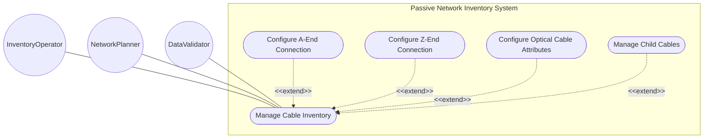
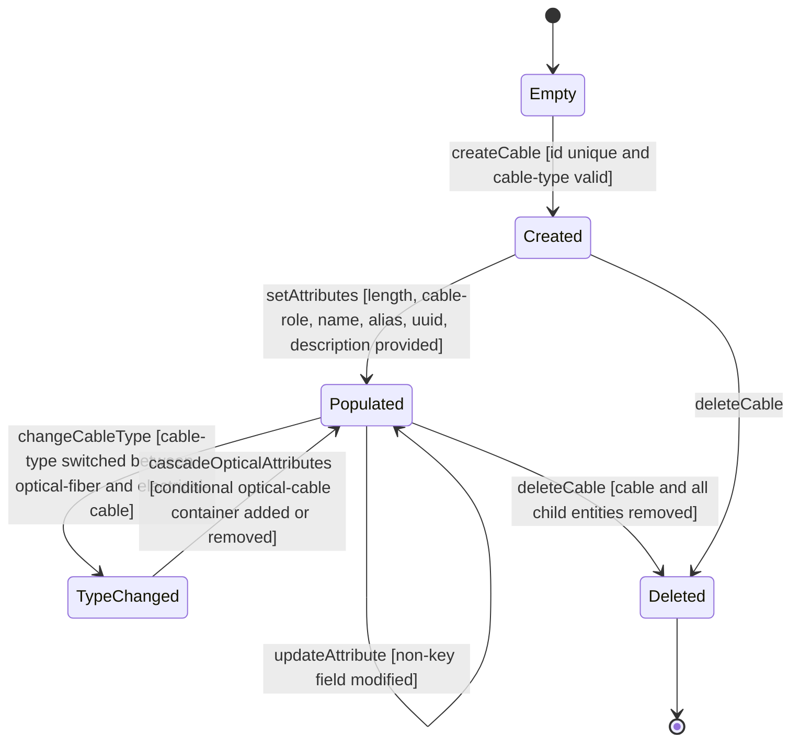

# Use Case: Manage Cable Inventory

## Parent Epic
- [ ] #108 - [ietf-nwi-passive-inventory: Passive Network Inventory Data Model](https://github.com/gintatkinson/3dgs-033/blob/main/docs/epics/epic-07-ietf-nwi-passive-inventory.md) (the cable list is the primary guiding-media entity augmented under the network inventory root, Section 5)

## 1. Actors
- **Primary Actor:** InventoryOperator — the domain controller or human operator that creates, reads, updates, and deletes cable entities in the passive network inventory
- **Secondary Actors:** NetworkPlanner — the operator designing physical cable routes across network infrastructure; DataValidator — the validation engine enforcing schema constraints on cable attributes at commit time

## 2. Preconditions
- The `ietf-network-inventory` base module is deployed with the network inventory root container instantiated
- The `ietf-nwi-passive-inventory` module augments `/nwi:network-inventory` and the `cables` grouping is available
- The identity hierarchies (`cable-type`, `cable-role`) are registered and resolvable by the system

## 3. Trigger
An InventoryOperator provisions a new passive cable entity in the network inventory by specifying a cable identifier, type classification, and physical characteristics, or queries existing cables for topology planning.

## 4. Main Success Scenario (Basic Flow)
1. The InventoryOperator issues a request to create a cable entry under the `/nwi:network-inventory/nwi-passive:cables` container with a unique `id`, a valid `cable-type` identityref, an optional `cable-role`, and physical attributes including `length` in meters.
2. The system validates the cable `id` for uniqueness within the cable list, verifies the `cable-type` resolves to a descendant of the `cable-type` base identity (`optical-fiber`, `electrical-cable`, or `coaxial-cable`), and confirms `cable-role` resolves to a valid `cable-role` identity if present.
3. The system inherits `basic-common-entity-attributes` from the base module (`uuid`, `name`, `alias`, `description`) and initializes them as optional fields.
4. The system commits the cable entity to the data store, making it available as a container for downstream connection endpoints (a-end, z-end), conditional optical attributes, and concatenated child cable segments.
5. The InventoryOperator can subsequently read, update non-key attributes, or delete the cable. The cable entity appears in the inventory table view with its classification and physical characteristics.

## 5. Alternate and Exception Flows
- **5a. Missing mandatory cable identifier (Branches from Basic Flow step 1):**
  1. The InventoryOperator attempts to create a cable without specifying the `id` field.
  2. The system rejects the operation because `id` is the mandatory list key with no default value.
  3. The InventoryOperator receives a validation error message and must retry with a unique string identifier.

- **5b. Duplicate cable identifier (Branches from Basic Flow step 2):**
  1. The InventoryOperator attempts to create a cable with an `id` that already exists in the cable list.
  2. The system detects the duplicate key and rejects the operation.
  3. The InventoryOperator must choose a different unique identifier and resubmit.

- **5c. Invalid cable-type identity value (Branches from Basic Flow step 2):**
  1. The InventoryOperator sets `cable-type` to a value not derived from the `cable-type` base identity hierarchy.
  2. The system's identityref type resolution fails — the value does not match `optical-fiber`, `electrical-cable`, or `coaxial-cable`.
  3. The operation is rejected with a type validation error. The InventoryOperator must select a valid cable-type identity.

- **5d. Invalid cable-role identity value (Branches from Basic Flow step 2):**
  1. The InventoryOperator attempts to set `cable-role` to a value not derived from the `cable-role` base identity (`backbone`, `aggregation`, `access`, `trunk`, `distribution`, `branch`).
  2. The identityref validation fails. The system rejects the value.
  3. The InventoryOperator must either omit the cable-role or provide a valid identity reference.

- **5e. Negative cable length value (Branches from Basic Flow step 1):**
  1. The InventoryOperator attempts to set the `length` attribute to a negative integer value.
  2. The system detects the type violation — `length` is `uint32` which only accepts non-negative integers.
  3. The operation is rejected. The length field must be a non-negative integer representing meters.

- **5f. Cable-type switched from optical-fiber to electrical-cable (Branches from Basic Flow step 5):**
  1. The InventoryOperator modifies the `cable-type` of an existing cable from `optical-fiber` to `electrical-cable`.
  2. The system evaluates the `when` expression on the `optical-cable` container — `derived-from-or-self(../cable-type, 'optical-fiber')` now evaluates to `false`.
  3. The conditional `optical-cable` container is discarded along with its `fiber-core-num`, `fiber-type`, and `attenuation` values.
  4. The cable entity is updated with the new type, and the optical attributes section is removed from the view.

- **5g. Cable deletion with associated child entities (Branches from Basic Flow step 5):**
  1. The InventoryOperator attempts to delete a cable that has associated a-end, z-end, optical-cable, or child-cable data.
  2. The system cascades the deletion to all associated child containers and list entries, or raises a referential integrity warning if downstream references would be broken.
  3. The cable and all its descendant data are removed from the inventory.

- **5h. Cable query against empty inventory (Branches from Basic Flow step 5):**
  1. The NetworkPlanner queries the cable list when no cables have been provisioned.
  2. The system returns an empty list indicating no cables are defined.
  3. The empty-state placeholder "No cables defined" is displayed in the table view component.

- **5i. Update optional inherited entity attributes (Branches from Basic Flow step 5):**
  1. The InventoryOperator edits an existing cable and sets optional fields: `uuid` to an RFC 9562 UUID, `name` to a human-readable name, `alias` to a short display string, and `description` to free-text notes.
  2. The system validates each field against its type — all are optional string types with no additional pattern or length constraints per the schema.
  3. The updated attributes are persisted. The cable entity now carries both mandatory core fields and the populated optional common entity attributes.

- **5j. Create an electrical coaxial cable entity (Branches from Basic Flow step 1):**
  1. The InventoryOperator creates a new cable with cable-type `electrical-cable` (descendant: `coaxial-cable`) and assigns cable-role `access`.
  2. The system validates that `electrical-cable` and `coaxial-cable` are valid descendants of the `cable-type` base identity representing metal-conductor guiding media.
  3. Unlike optical-fiber cables, the `when` expression on the `optical-cable` container evaluates to false — no optical attributes are permitted for this cable.
  4. The cable is persisted as an electrical guiding medium with length and connection endpoints, representing a copper or coaxial physical transmission pathway.

- **5k. Update cable with no optional inherited attributes (Branches from Basic Flow step 3):**
  1. The InventoryOperator creates a cable specifying only the mandatory fields: unique `id` and valid `cable-type`. The `cable-role`, `length`, `uuid`, `name`, `alias`, and `description` are all omitted.
  2. The system accepts the minimal cable entity because all inherited `basic-common-entity-attributes` carry no additional constraints beyond their optional type definitions.
  3. The cable is persisted with only its key and type classification. No optional leaf attributes are populated, which is schema-conformant.

## 6. Postconditions (Guarantees)
- **Success Guarantee:** The cable entity is persisted with a unique `id`, a valid `cable-type` identity, and any supplied optional attributes (`length`, `cable-role`, `uuid`, `name`, `alias`, `description`). The entity serves as the structural anchor for connection endpoints and concatenated child segments. The cable is visible in the inventory table view and available for topology planning.
- **Failure Guarantee:** No partial cable entity is committed. On any validation failure (duplicate id, invalid identity, type violation), the creation or update is rolled back atomically. Existing cables in the list are unaffected. The prior valid state of the edited cable is preserved.

## UML Diagrams
### Use Case Diagram

### State Machine Diagram

## 7. Operational Context

From draft-ygb-ivy-passive-network-inventory-05, Section 5 (YANG Model Overview):

> "The YANG data model in this draft augments the model defined in [I-D.ietf-ivy-network-inventory-yang] with the following information:
> * Cables: a list of cables with each containing an optional list of child cables."

From Section 3.1 (Terminology):

> "Guiding media: refers to physical transmission pathways - such as optical fiber cables, electrical cables, and coaxial cables - that direct and confine electromagnetic signals along a specific route. These media provide a bounded channel for data transmission, ensuring signal integrity, minimizing interference, and enabling high-speed communication over varying distances."

## 8. Realization Matrix
### Required User Stories
- [ ] #109 - [Concatenate Child Cable Segments into Ordered Composite Cable](https://github.com/gintatkinson/3dgs-033/blob/main/docs/user-stories/us-44-concatenate-child-cables.md) (the parent cable entity provides the structural container for concatenated child cable segments)
- [ ] #112 - [Conditionally Activate Optical Cable Attributes Based on Cable Type](https://github.com/gintatkinson/3dgs-033/blob/main/docs/user-stories/us-47-conditionally-activate-optical-cable-attributes.md) (the cable-type leaf on the parent cable drives the when-expression evaluation for optical-cable container visibility)
- [ ] #114 - [Model PON ODN Feeder-Distribution-Drop Cable Topology](https://github.com/gintatkinson/3dgs-033/blob/main/docs/user-stories/us-49-model-pon-odn-feeder-distribution-drop-topology.md) (cable entities with cable-role classification form the feeder, distribution, and drop segments of ODN topology models)

### Required Features
- [ ] #100 - [Define Cable Entity](https://github.com/gintatkinson/3dgs-033/blob/main/docs/features/feat-30-cable-entity.md) (the cable list with id key, cable-type identityref, cable-role identityref, length, and inherited basic-common-entity-attributes defines the structural model for this use case, the sole primary model container for cable inventory management)

## Source References
Structural Schema: [ietf-nwi-passive-inventory.yang](https://github.com/aguoietf/draft-ygb-ivy-passive-network-inventory/blob/main/yang/ietf-nwi-passive-inventory.yang) (Clause: grouping cables, list cable, grouping cable-attributes, grouping common-cable-attributes, lines 348-448)
Normative Specification: [draft-ygb-ivy-passive-network-inventory-05](https://datatracker.ietf.org/doc/draft-ygb-ivy-passive-network-inventory/) (Clause: Section 3.1, Section 5)
