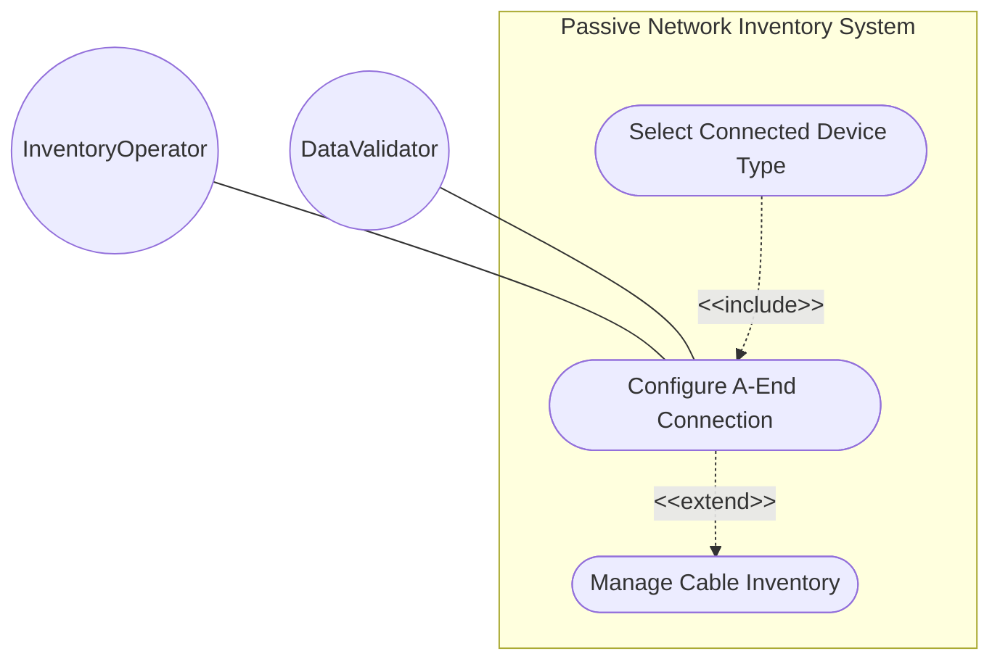
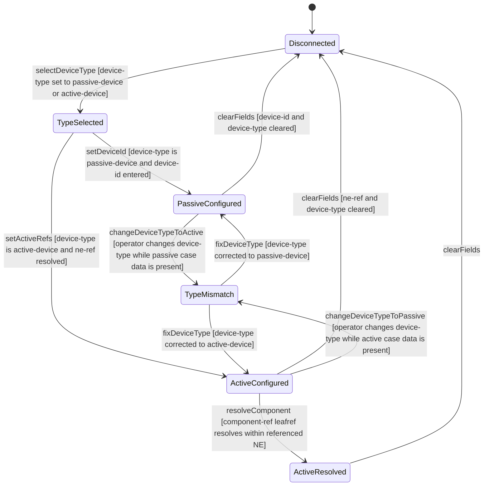

# Use Case: Configure Cable A-End Connection

## Parent Epic
- [ ] #108 - [ietf-nwi-passive-inventory: Passive Network Inventory Data Model](https://github.com/gintatkinson/3dgs-033/blob/main/docs/epics/epic-07-ietf-nwi-passive-inventory.md) (the a-end container defines cable source-end device references via the connected-device-ref grouping, Section 6.1)

## 1. Actors
- **Primary Actor:** InventoryOperator — the operator provisioning cable end-to-end connectivity by configuring the A-end (source) device connection point
- **Secondary Actors:** DataValidator — the validation engine enforcing device-type must-constraint consistency and leafref resolution

## 2. Preconditions
- A parent cable entity exists in the inventory with a valid `id`
- The `connected-device-type` base identity hierarchy (`passive-device`, `active-device`) is registered
- For active device connections, the referenced network element must exist in the network inventory base module

## 3. Trigger
An InventoryOperator opens a cable detail view and configures the A-end connection by selecting the device type classification and providing the corresponding device reference.

## 4. Main Success Scenario (Basic Flow)
1. The InventoryOperator selects a cable from the inventory table and opens its detail panel, exposing the A-End Connection section.
2. The InventoryOperator selects a `device-type` from the connected-device-type identity hierarchy: either `passive-device` or `active-device`.
3. If `passive-device` is selected, the operator enters a `device-id` string identifying the connected passive device.
4. If `active-device` is selected, the operator enters `ne-ref` referencing an existing network element and optionally `component-ref` referencing a component within that NE.
5. The DataValidator verifies cross-consistency via `must` constraints: when device-type is `passive-device`, only `device-id` is valid; when device-type is `active-device`, only `ne-ref` and `component-ref` are valid.
6. For active device connections with component-ref set, the leafref path resolves through `current()/../ne-ref` to validate component existence within the referenced NE.
7. The A-end connection is persisted, and the connection topology is recorded.

## 5. Alternate and Exception Flows
- **5a. Device-type not selected (Branches from Basic Flow step 3):**
  1. The InventoryOperator attempts to enter a `device-id` or `ne-ref` without first setting the `device-type` classification.
  2. The `must` constraint on the choice case fails because `derived-from-or-self` cannot match an absent device-type against either identity.
  3. The operation is rejected. The operator must set device-type before entering case-specific fields.

- **5b. Passive device-id entered under active device-type (Branches from Basic Flow step 5):**
  1. The InventoryOperator has device-type set to `active-device` but enters a `device-id` in the passive case fields.
  2. The passive case `must` constraint `derived-from-or-self(../device-type, 'nwi-passive:passive-device')` fails because device-type is not passive-device.
  3. The entry is rejected with a cross-validation error indicating the type mismatch.

- **5c. Active ne-ref entered under passive device-type (Branches from Basic Flow step 5):**
  1. The InventoryOperator has device-type set to `passive-device` but enters `ne-ref` in the active case fields.
  2. The active case `must` constraint `derived-from-or-self(../device-type, 'nwi-passive:active-device')` fails.
  3. The entry is rejected with a cross-validation error.

- **5d. Invalid network element leafref (Branches from Basic Flow step 6):**
  1. The InventoryOperator sets device-type to `active-device` and enters an `ne-ref` value that does not correspond to any existing network element in the inventory.
  2. The leafref resolution fails — the path `/nwi:network-inventory/nwi:network-elements/nwi:network-element/nwi:ne-id` returns no match.
  3. The operation is rejected. The operator must reference a valid, deployed network element.

- **5e. Invalid component leafref within valid NE (Branches from Basic Flow step 6):**
  1. The InventoryOperator sets a valid `ne-ref` but enters a `component-ref` that does not exist in the referenced NEs component list.
  2. The chained leafref path resolves `ne-ref` successfully but fails to find the component within the NEs component list.
  3. The operation is rejected with a component resolution error.

- **5f. Operator clears all A-end fields (Branches from Basic Flow step 7):**
  1. The InventoryOperator clears the device-type, device-id, ne-ref, and component-ref fields from a previously configured A-end.
  2. The A-end container data is removed from the cable entity because the container is optional.
  3. The cable reverts to having no A-end connection, and the section collapses to its default empty state.

- **5g. Changing device-type from passive to active (Branches from Basic Flow step 2):**
  1. The InventoryOperator changes the A-end device-type from `passive-device` to `active-device`.
  2. The system clears the previously stored `device-id` because the passive case is no longer valid under the new device-type.
  3. The active case fields (ne-ref, component-ref) become available for input. The passive case data is discarded.

## 6. Postconditions (Guarantees)
- **Success Guarantee:** The A-end container is present on the cable with a valid `device-type` classification. The active choice case contains a consistent device reference: a `device-id` for passive connections, or a resolved `ne-ref` and optional `component-ref` for active connections. The `must` constraints on both cases are satisfied. The connection topology from the cable source end is recorded.
- **Failure Guarantee:** No partial connection data is committed. On any must-constraint violation, leafref resolution failure, or type mismatch, the operation is rejected atomically. The A-end container retains its prior valid state or remains absent if previously unconfigured.

## UML Diagrams
### Use Case Diagram

### State Machine Diagram

## 7. Operational Context

From draft-ygb-ivy-passive-network-inventory-05, Section 3.1 (Terminology):

> "Active device: refers to a physical device that contains hardware and software and is manageable through communication interfaces. Network elements defined by [I-D.ietf-ivy-network-inventory-yang] are examples of active device."

> "Passive device: refers to a physical device within a network that does not require external power to function, and simply manipulates signals through processes like transmission, reflection, splitting, filtering, or attenuation without actively amplifying or generating the signal."

## 8. Realization Matrix
### Required User Stories
- [ ] #110 - [Resolve Cascading Leafref Path for Active Device Component Reference](https://github.com/gintatkinson/3dgs-033/blob/main/docs/user-stories/us-45-resolve-active-device-component-leafref.md) (the A-end container hosts the active case where the chained leafref path through ne-ref to component-ref is resolved)
- [ ] #111 - [Connect Cable End to Passive Device by Device Identifier](https://github.com/gintatkinson/3dgs-033/blob/main/docs/user-stories/us-46-connect-cable-end-to-passive-device.md) (the A-end container provides one of the two cable ends where passive device-id connections are configured)
- [ ] #113 - [Cross-Validate Connected Device Type with Choice Case Selection](https://github.com/gintatkinson/3dgs-033/blob/main/docs/user-stories/us-48-cross-validate-device-type-choice-consistency.md) (the A-end container's device-type leaf and connected-device-type choice are the context for must-constraint cross-validation)

### Required Features
- [ ] #101 - [Define Cable A-End Connection](https://github.com/gintatkinson/3dgs-033/blob/main/docs/features/feat-31-cable-a-end-connection.md) (the a-end container with device-type classification and connected-device-type choice defines the structural model for the source-end connection, the sole primary model container for cable A-end connectivity)

## Source References
Structural Schema: [ietf-nwi-passive-inventory.yang](https://github.com/aguoietf/draft-ygb-ivy-passive-network-inventory/blob/main/yang/ietf-nwi-passive-inventory.yang) (Clause: grouping connected-device-ref, container a-end, grouping connected-device-end, lines 283-346)
Normative Specification: [draft-ygb-ivy-passive-network-inventory-05](https://datatracker.ietf.org/doc/draft-ygb-ivy-passive-network-inventory/) (Clause: Section 3.1)
