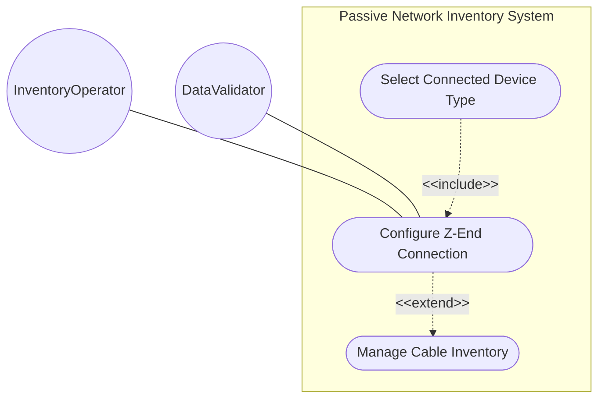
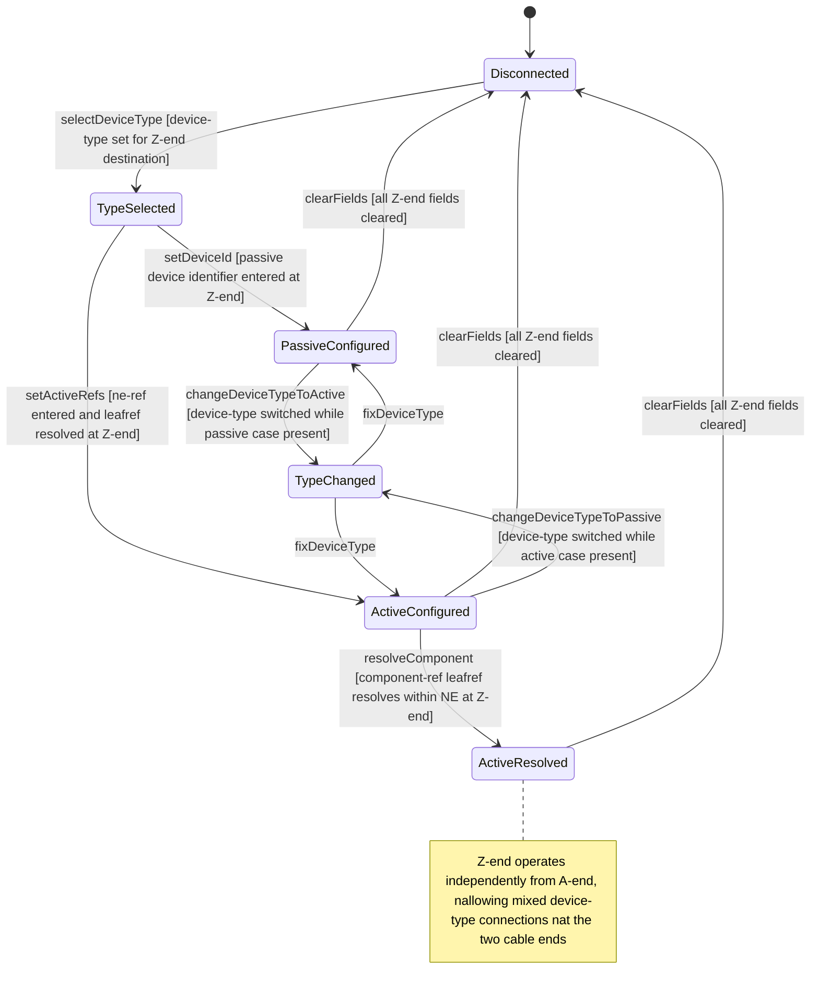

# Use Case: Configure Cable Z-End Connection

## Parent Epic
- [ ] #108 - [ietf-nwi-passive-inventory: Passive Network Inventory Data Model](https://github.com/gintatkinson/3dgs-033/blob/main/docs/epics/epic-07-ietf-nwi-passive-inventory.md) (the z-end container defines cable destination-end device references via the connected-device-ref grouping, Section 6.1)

## 1. Actors
- **Primary Actor:** InventoryOperator — the operator provisioning cable end-to-end connectivity by configuring the Z-end (destination) device connection point
- **Secondary Actors:** DataValidator — the validation engine enforcing device-type must-constraint consistency and leafref resolution

## 2. Preconditions
- A parent cable entity exists in the inventory with a valid `id`
- The `connected-device-type` base identity hierarchy (`passive-device`, `active-device`) is registered
- For active device connections, the referenced network element must exist in the network inventory base module
- The Z-end operates independently from the A-end; both ends may connect to the same or different device types

## 3. Trigger
An InventoryOperator opens a cable detail view after configuring the A-end connection and proceeds to configure the Z-end connection to complete the end-to-end device topology for the cable.

## 4. Main Success Scenario (Basic Flow)
1. The InventoryOperator selects a cable from the inventory table and navigates to the Z-End Connection section below the A-end section.
2. The operator selects a `device-type` from the connected-device-type identity hierarchy: either `passive-device` or `active-device`.
3. If `passive-device` is selected, the operator enters a `device-id` string identifying the connected passive device at the destination end.
4. If `active-device` is selected, the operator enters `ne-ref` referencing an existing network element and optionally `component-ref` referencing a specific component within that NE.
5. The DataValidator verifies cross-consistency via `must` constraints on the choice cases and resolves any leafref paths for active device references.
6. The Z-end connection is persisted. The cable now has both ends configured, completing the end-to-end connection topology — for example, A-end connected to an active NE and Z-end connected to a passive splitter.

## 5. Alternate and Exception Flows
- **5a. Missing device-type classification (Branches from Basic Flow step 2):**
  1. The InventoryOperator attempts to enter Z-end connection references without first selecting a device-type.
  2. The `must` constraint `derived-from-or-self` fails against an absent device-type leaf.
  3. The operation is rejected. The operator must set device-type before entering any case-specific reference data.

- **5b. Passive device-id under active device-type at Z-end (Branches from Basic Flow step 5):**
  1. The InventoryOperator has Z-end device-type set to `active-device` but populates the passive case `device-id` field with a value.
  2. The passive case `must` constraint `derived-from-or-self(../device-type, 'nwi-passive:passive-device')` evaluates to false.
  3. The device-id entry is rejected with a type-mismatch cross-validation error.

- **5c. Active ne-ref under passive device-type at Z-end (Branches from Basic Flow step 5):**
  1. The InventoryOperator has Z-end device-type set to `passive-device` but enters `ne-ref` in the active case fields.
  2. The active case `must` constraint `derived-from-or-self(../device-type, 'nwi-passive:active-device')` evaluates to false.
  3. The ne-ref entry is rejected with a type-mismatch error.

- **5d. Leafref resolution failure for ne-ref at Z-end (Branches from Basic Flow step 5):**
  1. The InventoryOperator enters an `ne-ref` value that does not match any network element in the inventory.
  2. The leafref path `/nwi:network-inventory/nwi:network-elements/nwi:network-element/nwi:ne-id` returns no match.
  3. The operation is rejected. The operator must reference a valid, deployed network element.

- **5e. Component-ref leafref resolution failure at Z-end (Branches from Basic Flow step 5):**
  1. The InventoryOperator sets a valid `ne-ref` but a `component-ref` that does not exist within the referenced NEs component list.
  2. The chained leafref path through `current()/../ne-ref` cannot resolve to the specified component.
  3. The operation is rejected with a component not found error within the referenced NE.

- **5f. Mixed device types at A-end and Z-end (Branches from Basic Flow step 6):**
  1. The InventoryOperator configures the A-end with device-type `active-device` referencing ne-core-01 and the Z-end with device-type `passive-device` referencing splitter-03.
  2. Both ends are independently evaluated against their respective must constraints.
  3. The system accepts the mixed-type configuration — a cable can connect an active NE at one end to a passive device at the other.
  4. Both ends are displayed correctly in the PropertyGrid under their respective collapsible sections.

- **5g. Operator clears Z-end connection fields (Branches from Basic Flow step 6):**
  1. The InventoryOperator clears the device-type and all reference fields from a configured Z-end.
  2. The Z-end container data is removed from the cable entity because the container is optional.
  3. The cable retains the A-end connection but has no Z-end destination. The Z-end section collapses to its default empty state.

## 6. Postconditions (Guarantees)
- **Success Guarantee:** The Z-end container is present on the cable with a valid `device-type` classification matching the chosen case reference data. The cable end-to-end connection topology is complete: A-end specifies the source device and Z-end specifies the destination device, which may be of the same or different device types. All must constraints and leafref integrity checks pass.
- **Failure Guarantee:** No partial data is committed to the Z-end container. On any validation failure, the operation is rejected atomically. The Z-end retains its prior valid state or remains absent if previously unconfigured. The A-end configuration is unaffected by Z-end validation failures.

## UML Diagrams
### Use Case Diagram

### State Machine Diagram

## 7. Operational Context

From draft-ygb-ivy-passive-network-inventory-05, Section 2.1 (Passive Infrastructure in Optical Transport Networks):

> "Passive infrastructure in optical transport networks serves as the backbone for high-capacity data transmission. Key components include fiber optic cables, which act as the primary medium of long distance transmission. Optical connectors, patch panels, and splice enclosures are crucial for joining and managing fiber links."

From Section 1 (Introduction):

> "Passive infrastructure serves as physical connections between active network devices, forming the backbone for network topology."

## 8. Realization Matrix
### Required User Stories
- [ ] #110 - [Resolve Cascading Leafref Path for Active Device Component Reference](https://github.com/gintatkinson/3dgs-033/blob/main/docs/user-stories/us-45-resolve-active-device-component-leafref.md) (the Z-end container hosts the active case where the identical cascading leafref path resolution applies at the destination end)
- [ ] #111 - [Connect Cable End to Passive Device by Device Identifier](https://github.com/gintatkinson/3dgs-033/blob/main/docs/user-stories/us-46-connect-cable-end-to-passive-device.md) (the Z-end container provides the destination cable end where passive device-id connections are configured)
- [ ] #113 - [Cross-Validate Connected Device Type with Choice Case Selection](https://github.com/gintatkinson/3dgs-033/blob/main/docs/user-stories/us-48-cross-validate-device-type-choice-consistency.md) (the Z-end container's device-type leaf and connected-device-type choice mirror the A-end cross-validation context at the destination)

### Required Features
- [ ] #102 - [Define Cable Z-End Connection](https://github.com/gintatkinson/3dgs-033/blob/main/docs/features/feat-32-cable-z-end-connection.md) (the z-end container with device-type classification and connected-device-type choice defines the structural model for the destination-end connection, the sole primary model container for cable Z-end connectivity)

## Source References
Structural Schema: [ietf-nwi-passive-inventory.yang](https://github.com/aguoietf/draft-ygb-ivy-passive-network-inventory/blob/main/yang/ietf-nwi-passive-inventory.yang) (Clause: grouping connected-device-ref, container z-end, lines 333-346)
Normative Specification: [draft-ygb-ivy-passive-network-inventory-05](https://datatracker.ietf.org/doc/draft-ygb-ivy-passive-network-inventory/) (Clause: Section 1, Section 2.1, Section 3.1)
