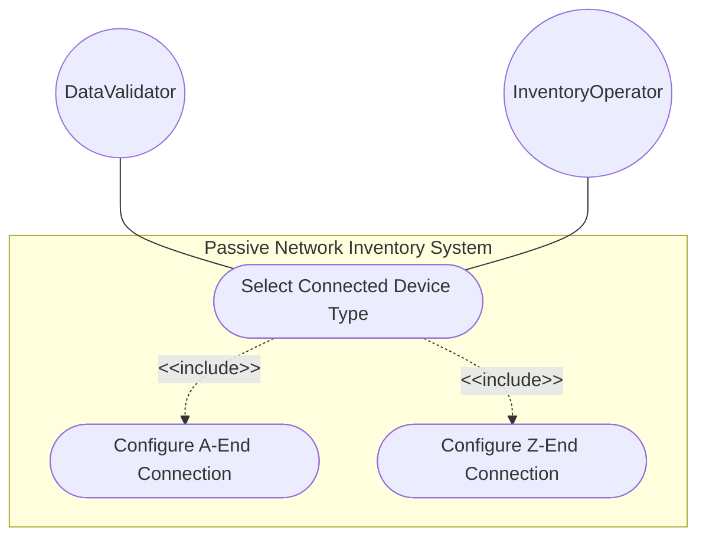
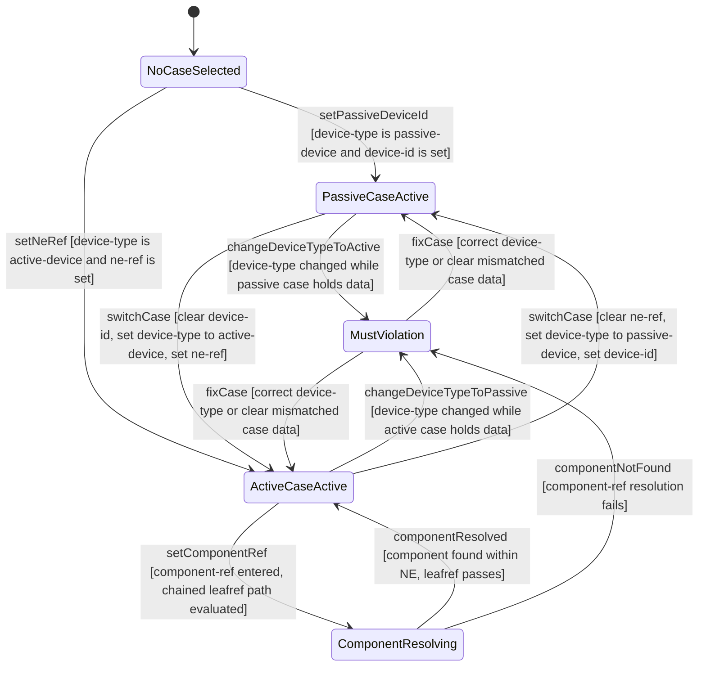

# Use Case: Select Connected Device Type

## Parent Epic
- [ ] #108 - [ietf-nwi-passive-inventory: Passive Network Inventory Data Model](https://github.com/gintatkinson/3dgs-033/blob/main/docs/epics/epic-07-ietf-nwi-passive-inventory.md) (the connected-device-type choice enforces mutually exclusive passive or active device references at cable end connections, Section 6.1)

## 1. Actors
- **Primary Actor:** DataValidator — the validation engine that enforces the choice-case must constraints cross-referencing the parent device-type leaf and resolves leafref paths for active device references
- **Secondary Actors:** InventoryOperator — the human operator who selects between passive and active device reference cases at a cable end; DomainController — the automated system populating connection topology from network discovery

## 2. Preconditions
- A parent A-end or Z-end container exists on a cable with a `device-type` leaf set to either `passive-device` or `active-device`
- The `connected-device-type` base identity hierarchy is registered
- For the active case, the referenced network element must exist in the network inventory base module

## 3. Trigger
An InventoryOperator or DomainController selects a connection case at a cable end: either a passive device reference (device-id) or an active device reference (ne-ref with optional component-ref).

## 4. Main Success Scenario (Basic Flow)
1. The cable end has its `device-type` leaf set. The system presents the `connected-device-type` choice with two mutually exclusive cases.
2. **Case passive:** The operator enters a `device-id` free-form string for the connected passive device. The must constraint `derived-from-or-self(../device-type, 'nwi-passive:passive-device')` is evaluated and passes.
3. **Case active:** The operator enters `ne-ref` as a leafref to an existing network element. The must constraint `derived-from-or-self(../device-type, 'nwi-passive:active-device')` is evaluated and passes.
4. Optionally, the operator enters `component-ref` as a chained leafref navigating through `current()/../ne-ref` to locate the component within the referenced NE. Both leafref resolutions succeed.
5. The system commits the chosen case data. Exactly one case is active — YANG choice semantics prohibit both cases from being active simultaneously.

## 5. Alternate and Exception Flows
- **5a. Must constraint violation: passive case active under active-device type (Branches from Basic Flow step 2):**
  1. The parent device-type is `active-device`. The operator populates the passive case with `device-id`.
  2. The must constraint `derived-from-or-self(../device-type, 'nwi-passive:passive-device')` evaluates to false because device-type derives from active-device, not passive-device.
  3. The passive case data is rejected. The operator must either fix the device-type to passive-device or switch to the active case.

- **5b. Must constraint violation: active case active under passive-device type (Branches from Basic Flow step 3):**
  1. The parent device-type is `passive-device`. The operator populates the active case with `ne-ref`.
  2. The must constraint `derived-from-or-self(../device-type, 'nwi-passive:active-device')` evaluates to false.
  3. The active case data is rejected. The operator must correct the device-type or use the passive case.

- **5c. Leafref resolution failure for ne-ref (Branches from Basic Flow step 3):**
  1. The operator enters an `ne-ref` value that does not match any `/nwi:network-inventory/nwi:network-elements/nwi:network-element/nwi:ne-id`.
  2. The leafref resolution fails — no network element with the given identifier exists.
  3. The operation is rejected. The operator must reference a valid deployed network element.

- **5d. Chained leafref resolution failure for component-ref (Branches from Basic Flow step 4):**
  1. The operator sets a valid `ne-ref` but a `component-ref` that does not exist in the referenced NEs `/nwi:components/nwi:component/nwi:component-id` list.
  2. The chained path `current()/../ne-ref` resolves the NE, but the component is not found.
  3. The operation is rejected. The component-ref must reference an existing component within the correct NE.

- **5e. Both choice cases populated simultaneously (Branches from Basic Flow step 5):**
  1. The operator or automated system attempts to set data in both the passive case (device-id) and the active case (ne-ref, component-ref) at the same cable end.
  2. The YANG choice constraint prohibits more than one case from being active. The system detects the violation.
  3. The operation is rejected. Only one case may be populated at a time per choice semantics.

- **5f. Operator switches from passive to active case (Branches from Basic Flow step 2):**
  1. The passive case is active with `device-id` "splitter-01". The operator changes the parent device-type to `active-device`.
  2. The passive case must constraint re-evaluates to false. The `device-id` value is invalidated.
  3. The system clears the passive case data and activates the active case fields for ne-ref and component-ref entry.
  4. The previously stored `device-id` is discarded.

- **5g. Operator changes device-type while active case is populated (Branches from Basic Flow step 3):**
  1. The active case is populated with ne-ref "ne-core-01" and component-ref "port-1-1-1". The operator changes device-type to `passive-device`.
  2. The active case must constraint re-evaluates to false. Both ne-ref and component-ref are invalidated.
  3. The system clears the active case data. The passive case device-id field becomes available.

- **5h. Choice left unselected while parent container is configured (Branches from Basic Flow step 1):**
  1. The parent a-end or z-end container has its device-type set but neither the passive nor the active case is populated with reference data.
  2. The system accepts this state because the connected-device-type choice is itself optional — a cable end may have a device-type classification without selecting a specific reference case.
  3. The cable end records a device-type intent without concrete reference data. The connected-device-type choice remains in its default unselected state, which is schema-conformant.

- **5i. All case leaves are individually optional (Branches from Basic Flow step 3):**
  1. The operator selects the active case and enters only `ne-ref` "ne-core-01" without entering `component-ref`.
  2. The system accepts the partial active case because each leaf within the case is individually optional — `component-ref` may be absent while `ne-ref` is present.
  3. The cable end references the network element but not a specific component. This is schema-conformant and valid for scenarios where component-level granularity is not required.

- **5j. Chained leafref path construction on component-ref (Branches from Basic Flow step 4):**
  1. The operator sets `ne-ref` to "ne-core-01" and then enters `component-ref` "port-1-1-1". The system resolves the chained path: `current()/../ne-ref` reads the sibling ne-ref value, navigates to the network element, and checks the component list.
  2. The chained leafref path requires that the NE reference is set before component-ref can be validated — the path expression depends on the sibling `ne-ref` being populated.
  3. If `ne-ref` is absent when `component-ref` is entered, the chained path cannot resolve and the component-ref validation is deferred or rejected.

- **5k. Changing ne-ref triggers cascading component-ref re-validation (Branches from Basic Flow step 4):**
  1. The active case has `ne-ref` "ne-core-01" and `component-ref` "port-1-1-1" both valid. The operator changes `ne-ref` to "ne-edge-02".
  2. The system detects the ne-ref change and triggers re-validation of `component-ref` against the new NEs component list.
  3. If "port-1-1-1" does not exist under "ne-edge-02", the `component-ref` becomes dangling and the operation is rejected. The operator must update `component-ref` to a valid component within the newly referenced NE.

- **5l. Loading-state validation for leafref fields during backend lookup (Branches from Basic Flow step 3):**
  1. The operator enters an `ne-ref` value and the system initiates a backend lookup to validate the leafref against the inventory's network element list.
  2. While the lookup is in progress, the ne-ref field displays a loading indicator. The component-ref field remains disabled until ne-ref is validated.
  3. If the lookup succeeds and the NE is found, the ne-ref field shows a valid-state indicator. If the lookup fails, an error state is displayed. In both cases the transient loading state transitions to the resolved outcome.

## 6. Postconditions (Guarantees)
- **Success Guarantee:** Exactly one choice case is active and consistent with the parent device-type classification. The must constraints on both cases evaluate correctly: the active case is satisfied only under active-device type, the passive case only under passive-device type. Leafref paths for active device references resolve fully. The cable end connection topology is valid and consistent.
- **Failure Guarantee:** No inconsistent case data is committed. Any must-constraint violation, leafref resolution failure, or dual-case attempt is rejected atomically. The choice reverts to its prior valid state or remains unpopulated.

## UML Diagrams
### Use Case Diagram

### State Machine Diagram

## 7. Operational Context

From draft-ygb-ivy-passive-network-inventory-05, Section 1 (Introduction):

> "[I-D.ietf-ivy-network-inventory-yang] incorporates the component concept from [RFC8348] to detail the equipment and holder information of a NE. ... the passive devices that cannot be discovered by the NE are thus not included in the modeling and needs to be addressed."

The `must` constraints in the YANG choice cases enforce that the device-type classification and the selected reference case are always consistent.

## 8. Realization Matrix
### Required User Stories
- [ ] #110 - [Resolve Cascading Leafref Path for Active Device Component Reference](https://github.com/gintatkinson/3dgs-033/blob/main/docs/user-stories/us-45-resolve-active-device-component-leafref.md) (the active case within this choice defines the ne-ref and component-ref leafref paths whose cascading resolution this story validates)
- [ ] #111 - [Connect Cable End to Passive Device by Device Identifier](https://github.com/gintatkinson/3dgs-033/blob/main/docs/user-stories/us-46-connect-cable-end-to-passive-device.md) (the passive case within this choice provides the device-id field for passive device connection reference)
- [ ] #113 - [Cross-Validate Connected Device Type with Choice Case Selection](https://github.com/gintatkinson/3dgs-033/blob/main/docs/user-stories/us-48-cross-validate-device-type-choice-consistency.md) (the must constraints on both choice cases enforce the device-type-to-case consistency that this story's cross-validation behavior defines)

### Required Features
- [ ] #103 - [Define Connected Device Type Selector](https://github.com/gintatkinson/3dgs-033/blob/main/docs/features/feat-33-connected-device-type-selector.md) (the connected-device-type choice with passive and active cases and their must constraints defines the sole primary model container for device type selection)

## Source References
Structural Schema: [ietf-nwi-passive-inventory.yang](https://github.com/aguoietf/draft-ygb-ivy-passive-network-inventory/blob/main/yang/ietf-nwi-passive-inventory.yang) (Clause: grouping connected-device-end, choice connected-device-type, case passive, case active, must constraints, lines 283-331)
Normative Specification: [draft-ygb-ivy-passive-network-inventory-05](https://datatracker.ietf.org/doc/draft-ygb-ivy-passive-network-inventory/) (Clause: Section 1, Section 3.1)
