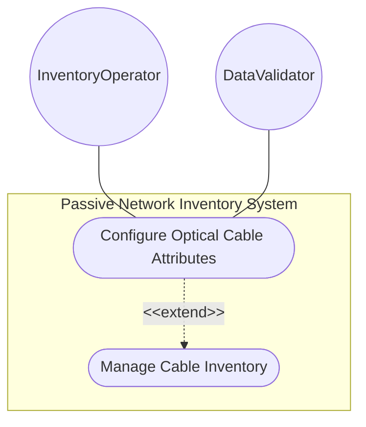
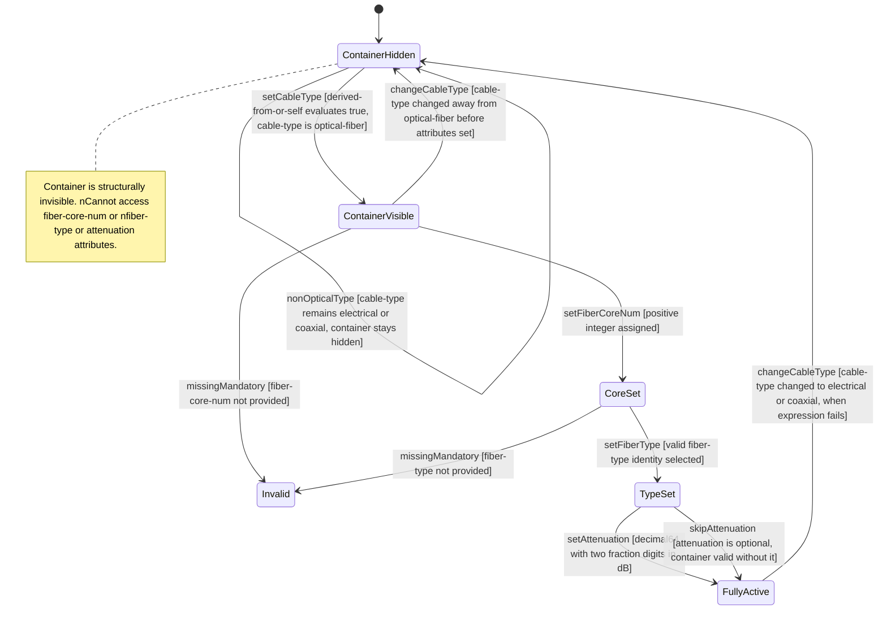

# Use Case: Configure Optical Cable Attributes

## Parent Epic
- [ ] #108 - [ietf-nwi-passive-inventory: Passive Network Inventory Data Model](https://github.com/gintatkinson/3dgs-033/blob/main/docs/epics/epic-07-ietf-nwi-passive-inventory.md) (the optical-cable container with when-expression conditional activation defines fiber-specific attributes for optical-fiber cables, Section 6.1)

## 1. Actors
- **Primary Actor:** InventoryOperator — the operator provisioning fiber optic cables with optical transmission characteristics
- **Secondary Actors:** DataValidator — the validation engine that evaluates the when expression and enforces type constraints on fiber-core-num, fiber-type, and attenuation

## 2. Preconditions
- A parent cable entity exists in the inventory
- The parent cable's `cable-type` is set to `optical-fiber` (the `when "derived-from-or-self(../cable-type, 'optical-fiber')"` expression evaluates to true)
- The `fiber-type` identity hierarchy (G652A through G657B and other) is registered and resolvable

## 3. Trigger
An InventoryOperator provisions optical fiber attributes for a cable identified as an optical-fiber type and enters the fiber core count, fiber standard type, and optionally the attenuation coefficient.

## 4. Main Success Scenario (Basic Flow)
1. The InventoryOperator selects an optical-fiber cable from the inventory table. The `optical-cable` container is visible because the when expression evaluates to true for the `optical-fiber` cable-type.
2. The operator enters `fiber-core-num` — a mandatory positive integer specifying the number of individual fiber cores or strands within the cable.
3. The operator selects `fiber-type` from the `fiber-type` identity hierarchy (e.g., G652D for standard single-mode fiber).
4. Optionally, the operator enters `attenuation` as a decimal64 value with two fractional digits in decibels representing the fiber attenuation coefficient.
5. The DataValidator validates all entries: fiber-core-num is a positive uint32 integer, fiber-type resolves to a valid fiber-type identity, and attenuation conforms to the decimal64 fraction-digits 2 precision.
6. The optical-cable container is persisted with all three attributes. The operator can use these values for optical link budgeting and network planning.

## 5. Alternate and Exception Flows
- **5a. When expression evaluates to false — non-optical cable (Branches from Basic Flow step 1):**
  1. The InventoryOperator selects a cable with cable-type set to `electrical-cable` or `coaxial-cable`.
  2. The `when "derived-from-or-self(../cable-type, 'optical-fiber')"` expression evaluates to false.
  3. The `optical-cable` container is structurally invalid and invisible. No fiber-core-num, fiber-type, or attenuation fields are presented.
  4. The operator cannot populate optical attributes for non-optical cables.

- **5b. Missing mandatory fiber-core-num (Branches from Basic Flow step 2):**
  1. The operator enters fiber-type "G652D" but omits the mandatory `fiber-core-num` value.
  2. The system detects the missing mandatory attribute within the container.
  3. The operation is rejected. The operator must supply a fiber core count before the container can be persisted.

- **5c. Invalid fiber-type identity (Branches from Basic Flow step 3):**
  1. The operator enters a fiber-type value that is not a descendant of the `fiber-type` base identity.
  2. The identityref type validation fails — the value does not match any recognized optical fiber standard (G652A through G657B or other).
  3. The operation is rejected with a type validation error. The operator must select a valid fiber-type identity.

- **5d. Attenuation exceeds decimal precision (Branches from Basic Flow step 4):**
  1. The operator enters an attenuation value with more than two decimal places (e.g., 0.225).
  2. The decimal64 fraction-digits 2 constraint is enforced. The system either rounds the value to 0.23 or rejects the entry.
  3. The operator receives feedback about the precision constraint and may adjust the value.

- **5e. Cable-type changed from optical-fiber to electrical-cable (Branches from Basic Flow step 6):**
  1. After optical-cable attributes are configured (fiber-core-num 48, fiber-type G657A1), the InventoryOperator changes the parent cable's cable-type to `electrical-cable`.
  2. The `when` expression re-evaluates to false because `derived-from-or-self` no longer matches `optical-fiber`.
  3. The optical-cable container is removed from the data tree. All previously stored optical attributes (fiber-core-num, fiber-type, attenuation) are discarded.
  4. The cable entity remains but without optical fiber-specific data.

- **5f. Cable-type changed to optical-fiber from non-optical (Branches from Basic Flow step 1):**
  1. A cable was originally created with cable-type `electrical-cable` and has no optical-cable container.
  2. The InventoryOperator changes the cable-type to `optical-fiber`.
  3. The `when` expression re-evaluates to true. The optical-cable container becomes structurally valid and available for data entry.
  4. The operator can now populate fiber-core-num, fiber-type, and attenuation.

## 6. Postconditions (Guarantees)
- **Success Guarantee:** For optical-fiber cables, the `optical-cable` container is instantiated with a valid `fiber-core-num` (positive integer), a recognized `fiber-type` identity, and an optional `attenuation` value with two-decimal precision. The optical transmission characteristics are available for link budget calculations and network topology planning.
- **Failure Guarantee:** No partial optical attribute data is committed. On any validation failure (missing mandatory fields, invalid identity, incorrect type), the operation is rejected atomically. For non-optical cables, the container never appears. If the cable-type changes away from optical-fiber, all optical attribute data is discarded.

## UML Diagrams
### Use Case Diagram

### State Machine Diagram

## 7. Operational Context

From draft-ygb-ivy-passive-network-inventory-05, Section 3.1 (Terminology):

> "Optical Cable: refers to a type of guiding media that uses optical fiber as media to transmit optical signals. An optical cable can contain one or multiple fiber cores, also known as fiber strands, each serving as an independent guiding media for data transmission."

From Section 2.1 (Passive Infrastructure in Optical Transport Networks):

> "Passive infrastructure in optical transport networks serves as the backbone for high-capacity data transmission. Key components include fiber optic cables, which act as the primary medium of long distance transmission."

> "Attenuators, on the other hand, are placed at places through connectors or built-in modules for reducing optical power."

## 8. Realization Matrix
### Required User Stories
- [ ] #112 - [Conditionally Activate Optical Cable Attributes Based on Cable Type](https://github.com/gintatkinson/3dgs-033/blob/main/docs/user-stories/us-47-conditionally-activate-optical-cable-attributes.md) (the when expression on the optical-cable container drives the conditional activation behavior that this story defines — attributes are only valid for optical-fiber cables)
- [ ] #114 - [Model PON ODN Feeder-Distribution-Drop Cable Topology](https://github.com/gintatkinson/3dgs-033/blob/main/docs/user-stories/us-49-model-pon-odn-feeder-distribution-drop-topology.md) (each PON ODN segment is an optical-fiber cable that carries fiber-type, core count, and attenuation for optical link characterization)

### Required Features
- [ ] #104 - [Define Optical Cable Attributes](https://github.com/gintatkinson/3dgs-033/blob/main/docs/features/feat-34-optical-cable-attributes.md) (the optical-cable container with when-expression, fiber-core-num, fiber-type identityref, and attenuation decimal64 defines the sole primary model container for this use case)

## Source References
Structural Schema: [ietf-nwi-passive-inventory.yang](https://github.com/aguoietf/draft-ygb-ivy-passive-network-inventory/blob/main/yang/ietf-nwi-passive-inventory.yang) (Clause: grouping optical-cable-attributes, container optical-cable, when expression, lines 366-395)
Normative Specification: [draft-ygb-ivy-passive-network-inventory-05](https://datatracker.ietf.org/doc/draft-ygb-ivy-passive-network-inventory/) (Clause: Section 2.1, Section 3.1)
