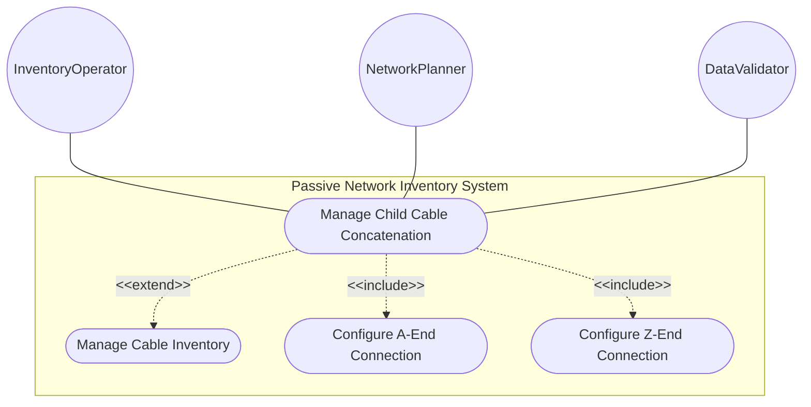
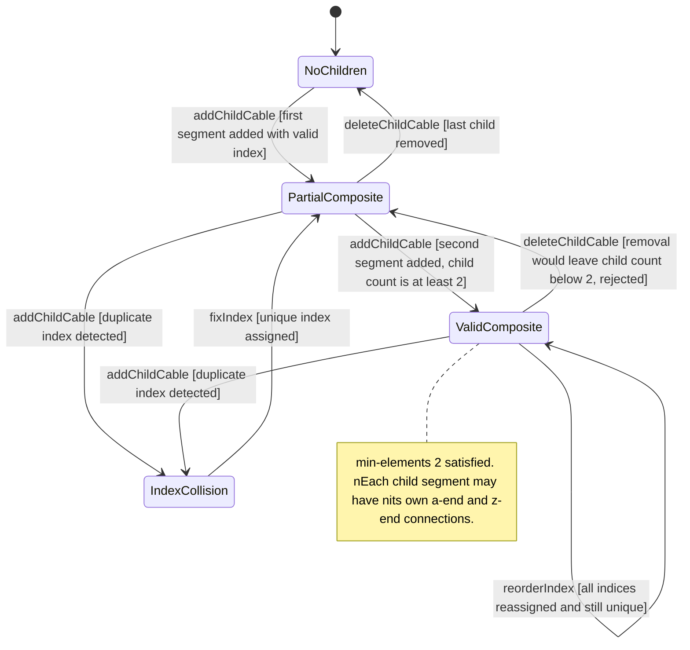

# Use Case: Manage Child Cable Concatenation

## Parent Epic
- [ ] #108 - [ietf-nwi-passive-inventory: Passive Network Inventory Data Model](https://github.com/gintatkinson/3dgs-033/blob/main/docs/epics/epic-07-ietf-nwi-passive-inventory.md) (the child-cable list with min-elements 2 and ordered index key realizes the guiding media concatenation concept defined in Section 3.1)

## 1. Actors
- **Primary Actor:** InventoryOperator — the operator modeling composite cables that span multiple physical infrastructure segments requiring concatenation of child cable segments
- **Secondary Actors:** NetworkPlanner — the operator tracing physical cable paths through joint boxes, splice points, and intermediate infrastructure; DataValidator — the validation engine enforcing min-elements 2 and index uniqueness constraints

## 2. Preconditions
- A parent cable entity exists in the inventory with a valid `id`
- The `child-cable` list is empty or partially populated with fewer than 2 entries, awaiting completion to satisfy min-elements 2
- The `common-cable-attributes` grouping is available for child segments (id, length, a-end, z-end)

## 3. Trigger
An InventoryOperator initiates concatenated cable modeling by adding child cable segments to a parent cable to represent a composite cable that passes through intermediate infrastructure such as joint boxes or splice enclosures.

## 4. Main Success Scenario (Basic Flow)
1. The InventoryOperator selects a parent cable and opens the "Concatenated Segments" section. The operator adds a first child cable with `index` 1, a unique `id`, optional `length`, and end-to-end connection references (a-end and z-end).
2. The operator adds a second child cable with `index` 2, connecting its a-end to the z-end device of the first child cable (e.g., joint-box "jb-street-5").
3. The DataValidator checks that the child-cable list now contains at least 2 entries, satisfying the `min-elements 2` constraint.
4. The DataValidator verifies index uniqueness — both indices 1 and 2 are unique within the list.
5. The operator continues adding additional segments as needed, each with a unique index value within the uint8 range (0 to 255).
6. The composite cable is persisted. The concatenation order defined by the ascending index values represents the physical cable path from the first segment to the last.

## 5. Alternate and Exception Flows
- **5a. Fewer than 2 child cables (min-elements violation) (Branches from Basic Flow step 3):**
  1. The parent cable has only one child cable segment configured.
  2. The system evaluates the `min-elements 2` constraint on the child-cable list and detects the violation.
  3. The list is flagged as invalid. A composite cable must have at least two concatenated segments per schema constraint.
  4. The operator must add at least one more child cable before the parent cable is considered a valid composite cable.

- **5b. Duplicate child cable index (Branches from Basic Flow step 4):**
  1. The operator attempts to add a child cable with index 1 when a child cable with index 1 already exists in the list.
  2. The system detects the duplicate key — `index` is the list key and must be unique.
  3. The operation is rejected. The operator must assign a different, unused index value.

- **5c. Index value exceeds uint8 range (Branches from Basic Flow step 5):**
  1. The operator attempts to assign a child cable index value of 256 or higher.
  2. The system detects the type violation — `index` is `uint8` with a maximum value of 255.
  3. The operation is rejected with a range validation error. The index must be within 0 to 255.

- **5d. Attempt to delete a child segment violating min-elements (Branches from Basic Flow step 6):**
  1. The parent cable has exactly 2 child cables (indices 1 and 2).
  2. The operator attempts to delete child cable index 2.
  3. The system rejects the deletion because removing the segment would leave only 1 child cable, violating `min-elements 2`.
  4. The child-cable list remains at 2 entries. The operator must add a third child cable before being able to remove any segment.

- **5e. Reordering child cable index values (Branches from Basic Flow step 6):**
  1. The operator reassigns index values to change the concatenation order: segment originally at index 3 is moved to index 2, and the segment at index 2 is moved to index 3.
  2. The system validates that after reordering, all indices remain unique within the list.
  3. If any duplicate arises during the reorder, the operation is rejected and the previous index assignments are preserved.
  4. When all indices are unique, the reordering succeeds and the new concatenation order reflects the updated physical path sequence.

- **5f. Child cable with invalid A-end or Z-end device references (Branches from Basic Flow step 1):**
  1. The operator configures a child cable A-end with device-type `active-device` and ne-ref "ne-nonexistent" which does not correspond to a deployed NE.
  2. The leafref resolution fails at the child cable level because child segments inherit the same `connected-device-end` structure as the parent.
  3. The child cable addition is rejected. The operator must reference valid devices at each child cable end.

- **5g. Empty child-cable list on composite cable query (Branches from Basic Flow step 1):**
  1. The Operator or NetworkPlanner queries the child-cable list of a parent cable that has no child segments defined.
  2. The system returns an empty list but indicates the `min-elements 2` constraint has not been satisfied.
  3. The operator receives a validation hint that at least 2 concatenated child cables are required.

- **5h. Child cable inherits common attributes including optional length field (Branches from Basic Flow step 1):**
  1. The operator adds a child cable with index 3, a unique id, but omits the optional `length` field.
  2. The system accepts the child cable with length absent because `length` is optional within the `common-cable-attributes` grouping.
  3. The child segment is added to the composite cable. The parent cable's concatenation list now includes a segment without explicit length, which is schema-conformant.

## 6. Postconditions (Guarantees)
- **Success Guarantee:** The child-cable list contains at least 2 entries (min-elements 2 satisfied), each keyed by a unique `index` within the uint8 range. The concatenation order defined by ascending index values represents a valid continuous physical cable path. Each child segment carries its own `id`, `length`, and end-to-end connection references, forming a composite cable that spans multiple infrastructure segments.
- **Failure Guarantee:** No invalid composite cable is committed. If the list has fewer than 2 entries, the min-elements constraint prevents validation. Duplicate indices are rejected. Out-of-range indices are rejected. Invalid child cable end references are rejected at the segment level. The composite cable either satisfies all constraints as a complete entity or is flagged as incomplete.

## UML Diagrams
### Use Case Diagram

### State Machine Diagram

## 7. Operational Context

From draft-ygb-ivy-passive-network-inventory-05, Section 3.1 (Terminology):

> "Guiding media: refers to physical transmission pathways - such as optical fiber cables, electrical cables, and coaxial cables - that direct and confine electromagnetic signals along a specific route. ... Guiding media can be concatenated to form longer guiding media."

From Section 5 (YANG Model Overview):

> "Cables: a list of cables with each containing an optional list of child cables."

## 8. Realization Matrix
### Required User Stories
- [ ] #109 - [Concatenate Child Cable Segments into Ordered Composite Cable](https://github.com/gintatkinson/3dgs-033/blob/main/docs/user-stories/us-44-concatenate-child-cables.md) (the child-cable list with min-elements 2, index key, and ordering semantics is the structural container for the concatenation behavior this story defines)
- [ ] #114 - [Model PON ODN Feeder-Distribution-Drop Cable Topology](https://github.com/gintatkinson/3dgs-033/blob/main/docs/user-stories/us-49-model-pon-odn-feeder-distribution-drop-topology.md) (child cable concatenation supports modeling of feeder, distribution, and drop cables that span joint boxes, splice enclosures, and intermediate cabinets in PON ODN topologies)

### Required Features
- [ ] #105 - [Define Child Cables](https://github.com/gintatkinson/3dgs-033/blob/main/docs/features/feat-35-child-cables.md) (the child-cable list with min-elements 2 constraint, index key as uint8, and common-cable-attributes inheritance defines the sole primary model container for cable concatenation)

## Source References
Structural Schema: [ietf-nwi-passive-inventory.yang](https://github.com/aguoietf/draft-ygb-ivy-passive-network-inventory/blob/main/yang/ietf-nwi-passive-inventory.yang) (Clause: grouping child-cables, list child-cable, min-elements 2, index key, lines 419-436)
Normative Specification: [draft-ygb-ivy-passive-network-inventory-05](https://datatracker.ietf.org/doc/draft-ygb-ivy-passive-network-inventory/) (Clause: Section 3.1, Section 5)
