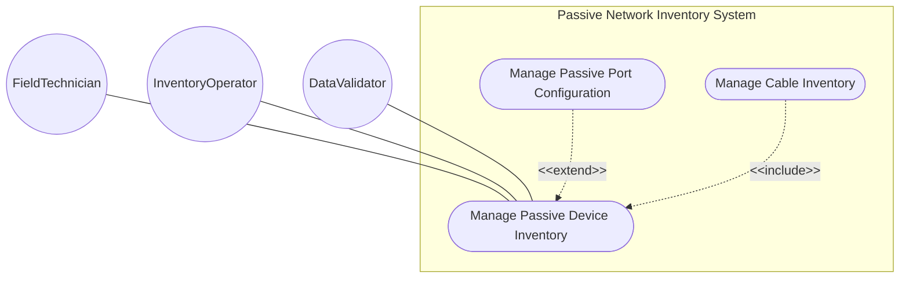
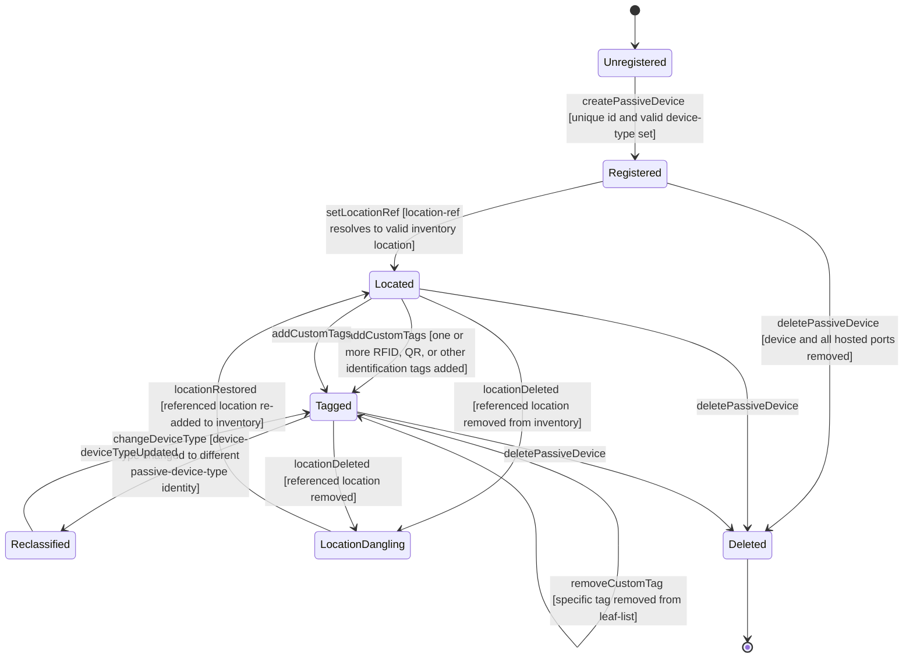

# Use Case: Manage Passive Device Inventory

## Parent Epic
- [ ] #108 - [ietf-nwi-passive-inventory: Passive Network Inventory Data Model](https://github.com/gintatkinson/3dgs-033/blob/main/docs/epics/epic-07-ietf-nwi-passive-inventory.md) (the passive-device list defines non-powered physical infrastructure devices augmented under the network inventory root, Section 5)

## 1. Actors
- **Primary Actor:** FieldTechnician — the operator performing physical site surveys and registering passive devices found at deployment locations
- **Secondary Actors:** InventoryOperator — the operator managing the passive device inventory; DataValidator — the validation engine enforcing device-type identityref, location-ref leafref referential integrity, and custom-tags leaf-list constraints

## 2. Preconditions
- The `ietf-network-inventory` base module is deployed with the network inventory root container
- The `ietf-ni-location` module (Epic #49) is deployed for `nil:ni-location-ref` leafref resolution
- The `passive-device-type` identity hierarchy (`ODF`, `WDM`, `FAT`, `FDT`, `ATB`) is registered

## 3. Trigger
A FieldTechnician completes a physical site survey and registers a newly discovered or relocated passive device in the inventory with its device type classification, custom identification tags, and physical deployment location reference.

## 4. Main Success Scenario (Basic Flow)
1. The FieldTechnician creates a new passive device entry with a unique `id`, selects a `device-type` from the passive-device-type identity hierarchy (e.g., `ODF` for an optical distribution frame), and enters optional `custom-tags` such as RFID or QR code identifiers.
2. The technician sets the `location-ref` to reference a valid entity in the network inventory location model via the `nil:ni-location-ref` leafref.
3. The DataValidator validates that `device-type` is a valid identityref descendant of `passive-device-type` and that `location-ref` resolves to an existing location.
4. The system inherits `basic-common-entity-attributes` (`uuid`, `name`, `alias`, `description`) and initializes them as optional fields.
5. The passive device is persisted. It appears in the inventory table view with its type classification, location reference hyperlink, and custom-tags count badge.

## 5. Alternate and Exception Flows
- **5a. Missing mandatory device identifier (Branches from Basic Flow step 1):**
  1. The FieldTechnician attempts to save a passive device without specifying an `id`.
  2. The system rejects the operation because `id` is the mandatory list key.
  3. The technician is prompted to enter a unique string identifier before retrying.

- **5b. Duplicate passive device identifier (Branches from Basic Flow step 1):**
  1. The FieldTechnician creates a passive device with an `id` that already exists in the passive-device list.
  2. The system detects the duplicate key and rejects the creation.
  3. The technician must use a different, unique identifier.

- **5c. Invalid device-type identity (Branches from Basic Flow step 1):**
  1. The operator sets `device-type` to a value not derived from the `passive-device-type` base identity (e.g., an undefined device classification).
  2. The identityref type resolution fails — the value does not match `ODF`, `WDM`, `FAT`, `FDT`, or `ATB`.
  3. The operation is rejected with a type validation error.

- **5d. Location leafref resolution failure (Branches from Basic Flow step 2):**
  1. The FieldTechnician sets `location-ref` to a value that does not exist in the network inventory location model.
  2. The `nil:ni-location-ref` leafref fails to resolve the target location.
  3. The operation is rejected with a referential integrity error. The technician must reference a valid, registered location.

- **5e. Referenced location deleted from inventory (Branches from Basic Flow step 5):**
  1. A passive device references location "loc-equipment-room-3a" via its `location-ref` leafref.
  2. An operator deletes the location "loc-equipment-room-3a" from the location inventory module.
  3. The `location-ref` leafref on the passive device becomes dangling — it can no longer resolve.
  4. The next validation cycle detects the referential integrity failure and raises an alert. The passive device remains but its location reference is invalid.

- **5f. Adding multiple custom identification tags (Branches from Basic Flow step 1):**
  1. The FieldTechnician adds successive `custom-tags` entries: "RFID-001", "QR-ODF-BAY1", "ASSET-9921".
  2. Each tag is appended to the `leaf-list` of strings. The system accepts zero, one, or many tags.
  3. The device carries all three tags, displayed as chip badges in the inventory view.

- **5g. Removing a specific custom tag (Branches from Basic Flow step 5):**
  1. A passive device has `custom-tags` ["RFID-001", "QR-001"]. The technician removes "RFID-001" from the leaf-list.
  2. The tag is removed from the list. Only "QR-001" remains.
  3. The update is persisted atomically with no effect on other device attributes.

- **5h. Updating device-type classification (Branches from Basic Flow step 5):**
  1. A passive device is registered with device-type `ODF`. The operator reclassifies it to `FDT`.
  2. The new device-type is validated against the passive-device-type identity hierarchy and passes.
  3. The device is updated. The table view reflects the new classification.

- **5i. Query passive device list when empty (Branches from Basic Flow step 1):**
  1. The InventoryOperator queries the passive-device list when no devices have been provisioned.
  2. The system returns an empty list. There is no explicit cardinality constraint beyond schema structure — the list may legitimately be empty.
  3. The empty-state placeholder "No passive devices defined" is displayed. The operator can proceed to create the first device.

- **5j. Referential integrity enforcement on location deletion (Branches from Basic Flow step 5):**
  1. A passive device "fdt-cabinet-12" has location-ref pointing to "loc-street-corner-5". An operator attempts to delete the location "loc-street-corner-5" from the location inventory.
  2. The system detects that the location is referenced by passive device "fdt-cabinet-12" via the `nil:ni-location-ref` leafref.
  3. The deletion is either prevented with a referential integrity violation warning, or the leafref is cascade-nulled. The system guarantees that no dangling leafref survives a committed transaction.

## 6. Postconditions (Guarantees)
- **Success Guarantee:** The passive device is persisted with a unique `id`, a valid `device-type` classification, an optional resolved `location-ref` pointing to a registered location, and a leaf-list of `custom-tags`. The device carries inherited common entity attributes. It serves as the structural container for hosted passive ports and can be referenced as a connection endpoint from cable A-end/Z-end device-id references.
- **Failure Guarantee:** No partially configured passive device is committed. Duplicate ids, invalid device-type identities, and unresolvable location references cause atomic rejection. Existing passive devices in the list are unaffected by failed creations or updates.

## UML Diagrams
### Use Case Diagram

### State Machine Diagram

## 7. Operational Context

From draft-ygb-ivy-passive-network-inventory-05, Section 1 (Introduction):

> "Passive infrastructure refers to the underlying infrastructure of a telecommunication network that is not actively detectable or manageable. It typically includes non-powered, non-communicating devices and components, such as cabinets, cables, connectors, splitters, antennas, distribution frames, etc., that are either hosted within an actively managed device or deployed along the physical pathway between active devices."

> "[I-D.ietf-ivy-network-inventory-location] emphasizes the relative and geographic location, e.g. equipment room, geo-loation for NE. A passive device is deployed in a certain location visible by the operator, and thus can reference the location defined by [I-D.ietf-ivy-network-inventory-location]."

From Section 5 (YANG Model Overview):

> "Passive devices: a list of passive devices with extended attributed reported by the domain controller."

From Section 3.1 (Terminology):

> "Passive device: refers to a physical device within a network that does not require external power to function, and simply manipulates signals through processes like transmission, reflection, splitting, filtering, or attenuation without actively amplifying or generating the signal. ... A passive device typically does not have management interfaces and is typically deployed in a location tracked by the network operator."

## 8. Realization Matrix
### Required User Stories
- [ ] #115 - [Inventory Passive Device with Identification Tags and Location Reference](https://github.com/gintatkinson/3dgs-033/blob/main/docs/user-stories/us-50-inventory-passive-device-location-tags.md) (the passive-device list with custom-tags leaf-list and location-ref leafref provides the physical identification and placement capabilities this story defines)
- [ ] #114 - [Model PON ODN Feeder-Distribution-Drop Cable Topology](https://github.com/gintatkinson/3dgs-033/blob/main/docs/user-stories/us-49-model-pon-odn-feeder-distribution-drop-topology.md) (passive devices such as splitters, FDTs, and FATs serve as interconnection points between ODN cable segments in the PON topology)

### Required Features
- [ ] #106 - [Define Passive Device Entity](https://github.com/gintatkinson/3dgs-033/blob/main/docs/features/feat-36-passive-device-entity.md) (the passive-device list with id key, device-type identityref, custom-tags leaf-list, and location-ref leafref defines the sole primary model container for passive device inventory management)

## Source References
Structural Schema: [ietf-nwi-passive-inventory.yang](https://github.com/aguoietf/draft-ygb-ivy-passive-network-inventory/blob/main/yang/ietf-nwi-passive-inventory.yang) (Clause: grouping passive-devices, list passive-device, leaf-list custom-tags, leaf location-ref, grouping passive-device-ports, lines 478-511)
Normative Specification: [draft-ygb-ivy-passive-network-inventory-05](https://datatracker.ietf.org/doc/draft-ygb-ivy-passive-network-inventory/) (Clause: Section 1, Section 3.1, Section 5)
