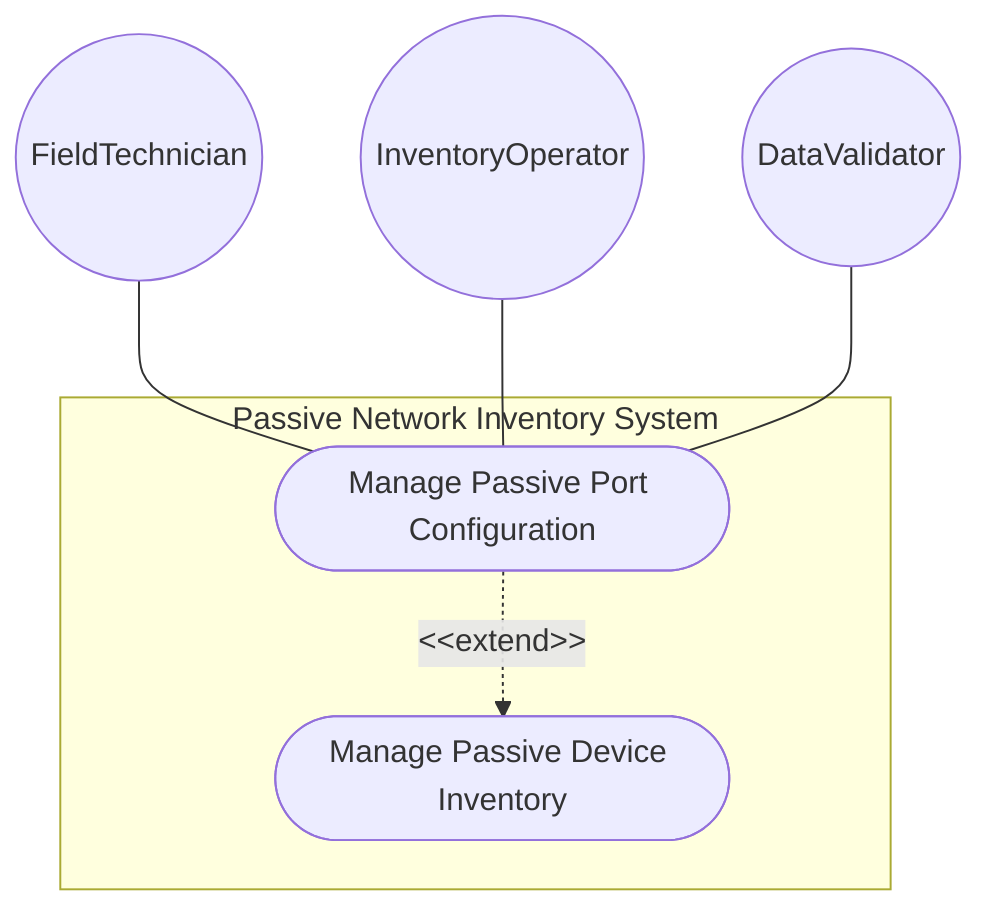
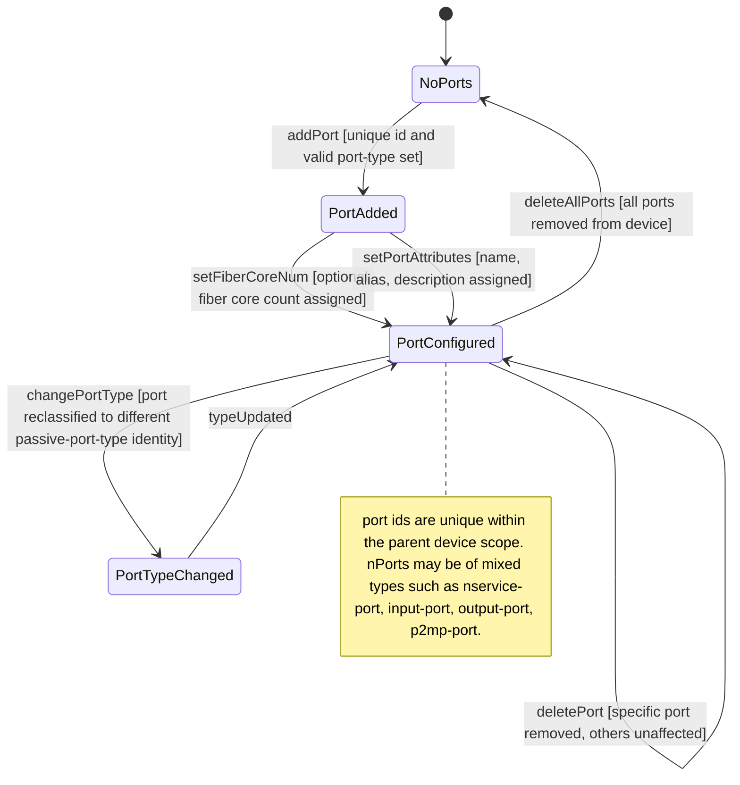

# Use Case: Manage Passive Port Configuration

## Parent Epic
- [ ] #108 - [ietf-nwi-passive-inventory: Passive Network Inventory Data Model](https://github.com/gintatkinson/3dgs-033/blob/main/docs/epics/epic-07-ietf-nwi-passive-inventory.md) (the passive-port list defines physical interface points hosted on passive devices, Section 6.1)

## 1. Actors
- **Primary Actor:** FieldTechnician — the operator documenting physical port configuration on installed passive devices such as ODFs, splitters, and fiber distribution terminals
- **Secondary Actors:** InventoryOperator — the operator managing port-level details for service provisioning and cable termination planning; DataValidator — the validation engine enforcing port-type identityref and port-id uniqueness within the parent device scope

## 2. Preconditions
- A parent passive device exists in the inventory with a valid `id`
- The `passive-port-type` identity hierarchy (`service-port`, `input-port`, `output-port`, `p2mp-port`) is registered
- The parent device represents a physical infrastructure component capable of hosting ports (ODF, WDM, FAT, FDT, ATB)

## 3. Trigger
A FieldTechnician documents the physical port layout of a passive device after installation, assigning port identifiers, type classifications, and fiber core counts to each physical interface point.

## 4. Main Success Scenario (Basic Flow)
1. The FieldTechnician selects a passive device from the inventory and opens the "Ports" sub-section within the device detail panel.
2. The technician adds a port entry with a unique `id` (e.g., "port-1-1"), selects a `port-type` from the passive-port-type identity hierarchy (e.g., `service-port` for customer-facing connections), and enters an optional `fiber-core-num` for the port.
3. The system inherits `basic-common-entity-attributes` (`uuid`, `name`, `alias`, `description`) as optional fields for each port.
4. The DataValidator checks that `port-id` is unique within the parent device's port list, that `port-type` resolves to a valid identityref under `passive-port-type`, and that `fiber-core-num` is a valid uint32.
5. The technician adds additional ports as needed — input ports, output ports, service ports, or p2mp ports — each with their own type classification and core counts.
6. The port entries are persisted under the parent device. They are displayed as a sub-table within the device detail view, available for cable termination planning.

## 5. Alternate and Exception Flows
- **5a. Missing mandatory port identifier (Branches from Basic Flow step 2):**
  1. The FieldTechnician attempts to save a port without specifying an `id`.
  2. The system rejects the operation because `id` is the mandatory list key.
  3. The technician is prompted to enter a unique string identifier before retrying.

- **5b. Duplicate port id within the same device (Branches from Basic Flow step 4):**
  1. The FieldTechnician adds a port with `id` "port-1-1" when another port with the same id already exists on the same parent device.
  2. The system detects the duplicate list key — port ids must be unique within the parent device's port list scope.
  3. The operation is rejected. The technician must use a different identifier.

- **5c. Duplicate port id across different devices (Branches from Basic Flow step 4):**
  1. Passive device "odf-co-01" has port "port-1-1". The technician adds port "port-1-1" to a different device "odf-co-02".
  2. The system validates uniqueness scoped to the parent device. Since the duplicate is on a different parent, uniqueness is not violated.
  3. The operation succeeds. Port id uniqueness is per-device, not global.

- **5d. Invalid port-type identity (Branches from Basic Flow step 2):**
  1. The technician sets `port-type` to a value not derived from the `passive-port-type` base identity.
  2. The identityref type validation fails — the value does not match `service-port`, `input-port`, `output-port`, or `p2mp-port`.
  3. The operation is rejected with a type validation error. The technician must select a recognized port type.

- **5e. P2MP port configuration on a splitter device (Branches from Basic Flow step 2):**
  1. The FieldTechnician configures a passive splitter (device-type `WDM`) with one `p2mp-port` as the input side and multiple `output-port` entries as the split output sides.
  2. The system accepts the configuration. The `p2mp-port` type indicates the point-to-multipoint input side of the optical splitter.
  3. The splitter topology is recorded: one input feeding multiple outputs, representing the physical optical splitting ratio.

- **5f. Updating port type of an existing port (Branches from Basic Flow step 6):**
  1. A port "port-1-1" was configured as `service-port`. The operator reclassifies it to `output-port`.
  2. The new port-type is validated against the passive-port-type identity hierarchy and passes.
  3. The port entry is updated. The sub-table reflects the new port type classification.

- **5g. Deleting a port from a device (Branches from Basic Flow step 6):**
  1. A passive device has three ports. The operator deletes port "port-1-2".
  2. The port is removed from the list. The remaining two ports are unaffected.
  3. The sub-table updates to reflect the current port count.

- **5h. Empty port configuration on existing device (Branches from Basic Flow step 1):**
  1. The operator opens the port sub-section of a passive device that has no ports configured.
  2. The system displays an empty-state placeholder: "No ports configured" for the parent device.
  3. The `passive-port` list is optional — a device may legitimately have zero ports.

- **5i. Assign fiber core count to a service port (Branches from Basic Flow step 2):**
  1. The FieldTechnician adds a `service-port` with id "svc-1-1" and sets `fiber-core-num` to 1, representing a single-fiber customer drop connection.
  2. The system validates that `fiber-core-num` is a valid uint32 integer and accepts the value.
  3. The port is persisted with its fiber core count. The operator may query ports by fiber-core-num to identify multi-core vs single-core terminations on the passive device.

- **5j. Port list not semantically ordered (Branches from Basic Flow step 4):**
  1. The FieldTechnician adds ports in sequence: port "out-1" (output-port), port "in-1" (input-port), port "svc-1" (service-port).
  2. The system stores the ports in insertion order but does not enforce any semantic ordering constraint — the list is not an `ordered-by user` list.
  3. Ports displayed in the sub-table may appear in any order. The insertion sequence carries no topological significance for the passive device model.

## 6. Postconditions (Guarantees)
- **Success Guarantee:** The passive port list under the parent device contains zero or more port entries, each with a unique `id` within the device scope, a valid `port-type` identityref classification, and optional `fiber-core-num`. Each port carries inherited common entity attributes. The port entries represent the physical interface points available for cable termination and are visible in the device detail sub-table.
- **Failure Guarantee:** No invalid port entry is committed. Duplicate ids within the same device, invalid port-type identities, and type violations are rejected atomically. Existing ports on the device remain unaffected. The parent device's other attributes are unchanged.

## UML Diagrams
### Use Case Diagram

### State Machine Diagram

## 7. Operational Context

From draft-ygb-ivy-passive-network-inventory-05, Section 2.1 (Passive Infrastructure in Optical Transport Networks):

> "Within a physical network element (NE) there are also presence of passive components. For example, fiber optic cables are used to connect the ports of different modules within the same or between different chassis."

From Section 2.2 (Passive Infrastructure in Optical Access Networks):

> "Passive Optical Networks (PONs) are a typical type of optical access network with significant passive infrastructure. ... The ODN is equipped with one or multiple cascaded passive optical splitter thus creating a physical point-to-multipoint fiber network between an OLT port and the multiple connected ONU/ONTs."

## 8. Realization Matrix
### Required User Stories
- [ ] #115 - [Inventory Passive Device with Identification Tags and Location Reference](https://github.com/gintatkinson/3dgs-033/blob/main/docs/user-stories/us-50-inventory-passive-device-location-tags.md) (after registering a passive device, the technician configures its hosted passive ports as the physical interface points for cable terminations)
- [ ] #114 - [Model PON ODN Feeder-Distribution-Drop Cable Topology](https://github.com/gintatkinson/3dgs-033/blob/main/docs/user-stories/us-49-model-pon-odn-feeder-distribution-drop-topology.md) (splitter passive-port entries with p2mp-port input and output-ports model the point-to-multipoint optical splitting topology used in PON ODN segments)

### Required Features
- [ ] #107 - [Define Passive Port](https://github.com/gintatkinson/3dgs-033/blob/main/docs/features/feat-37-passive-port.md) (the passive-port list with id key, port-type identityref, and fiber-core-num defines the sole primary model container for passive port configuration)

## Source References
Structural Schema: [ietf-nwi-passive-inventory.yang](https://github.com/aguoietf/draft-ygb-ivy-passive-network-inventory/blob/main/yang/ietf-nwi-passive-inventory.yang) (Clause: grouping passive-device-ports, list passive-port, lines 450-476)
Normative Specification: [draft-ygb-ivy-passive-network-inventory-05](https://datatracker.ietf.org/doc/draft-ygb-ivy-passive-network-inventory/) (Clause: Section 2.1, Section 2.2)
