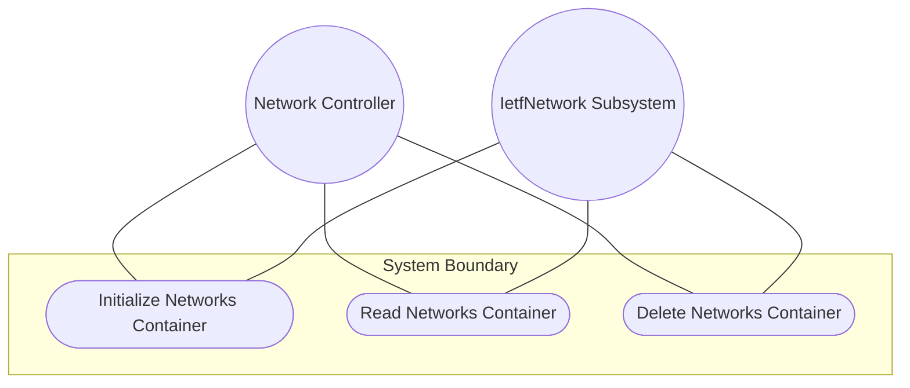
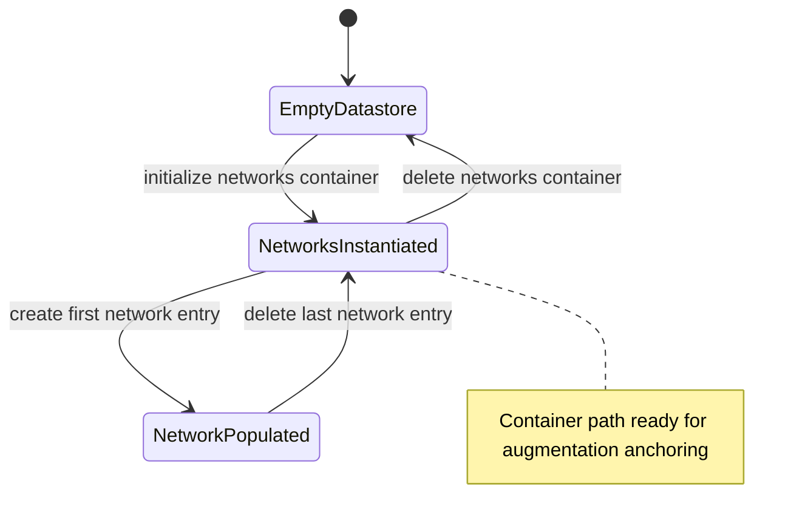

# Use Case: Manage Networks Root Container Lifecycle

## Parent Epic
- [ ] #124 - [ietf-network: Base Network Data Model](https://github.com/gintatkinson/3dgs-033/blob/main/docs/epics/epic-08-ietf-network.md) (top-level container anchoring the network list, the primary entry point for all network instances per clause 4.1)

## 1. Actors
- **Primary Actor:** Network Controller
- **Secondary Actors:** IetfNetwork Subsystem

## 2. Preconditions
- The `ietf-network` YANG module is loaded and initialized in the datastore.
- The system supports NMDA datastores (intended and operational) per RFC 8342.
- No existing `networks` container is present in the intended datastore (for creation flows).

## 3. Trigger
A Network Controller issues a request to create, read, or remove the `networks` root container, or a downstream augmentation module queries the container path for structural context.

## 4. Main Success Scenario (Basic Flow)
1. Network Controller sends an initialize request to the IetfNetwork Subsystem to establish the `networks` container as the data tree root.
2. IetfNetwork Subsystem validates that the `ietf-network` module is loaded.
3. IetfNetwork Subsystem creates the `networks` container at the top-level namespace root.
4. IetfNetwork Subsystem confirms the container path `/nw:networks` is available as a structural root.
5. Network Controller verifies the container is visible in both the intended and operational state datastores.
6. Network Controller proceeds to create child `network` list entries under the container.

## 5. Alternate and Exception Flows
- **5a. Empty Container Read (Branches from Basic Flow step 4):**
  1. Network Controller queries the `networks` container with a depth-limited retrieval.
  2. IetfNetwork Subsystem returns the container metadata with no `network` list children, confirming a structurally valid empty root.

- **5b. Downstream Augmentation Dependency Check (Branches from Basic Flow step 4):**
  1. An augmenting module such as `ietf-network-topology` queries the container path for augmentation anchoring.
  2. IetfNetwork Subsystem confirms the container exists and the augmentation target path is resolvable.

- **5c. Container Deletion (Branches from Basic Flow step 5):**
  1. Network Controller sends a deletion request to remove the `networks` container.
  2. IetfNetwork Subsystem deletes the container and all child `network` entries from the intended datastore.
  3. IetfNetwork Subsystem removes the container and all system-controlled entries from the operational state datastore.

- **5d. Augmentation Reference With Absent Container (Branches from Basic Flow step 2):**
  1. A downstream augmentation module references the container path while the `networks` container has not yet been created.
  2. IetfNetwork Subsystem excludes the augmenting module's entries from operational state, preserving referential integrity boundaries.

## 6. Postconditions (Guarantees)
- **Success Guarantee:** The `networks` container is instantiated at `/nw:networks`, visible in both datastores, and ready to host `network` list entries and augmentations.
- **Failure Guarantee:** If initialization fails, the container is not created and the datastore remains unchanged; downstream augmentations that reference this path are excluded from operational state until the container is available.

## UML Diagrams
### Use Case Diagram

### State Machine Diagram

## 7. Operational Context
From the IETF Network Topologies YANG Data Model specification, Section 4.1 (Base Network Model):

"The data model contains a container with a list of networks. Each network is captured in its own list entry, distinguished via a network-id."

From the IETF Network Topologies YANG Data Model specification, Section 4.4.1 (Container Structure):

"Rather than maintaining lists in separate containers, the data model is kept relatively flat in terms of its containment structure."

## 8. Realization Matrix
### Required User Stories
- [ ] #138 - [Configure Underlay-Overlay Network Stacking via Supporting-Network Chain](https://github.com/gintatkinson/3dgs-033/blob/main/docs/user-stories/us-51-configure-underlay-overlay-network-layering.md) (the networks container is the mandatory structural root under which all layered network instances are anchored)

### Required Features
- [ ] #126 - [Define Networks Root Container](https://github.com/gintatkinson/3dgs-033/blob/main/docs/features/feat-38-networks-container.md) (the networks container is the structural definition this use case manages, providing the data tree root for all network instances)

## Source References
Structural Schema: [ietf-network@2018-02-26.yang](https://github.com/YangModels/yang/blob/main/standard/ietf/RFC/ietf-network%402018-02-26.yang) (Clause: 6.1, lines 119-121)
Normative Specification: [the IETF Network Topologies YANG Data Model specification](https://datatracker.ietf.org/doc/rfc8345/) (Clause: 4.1)
