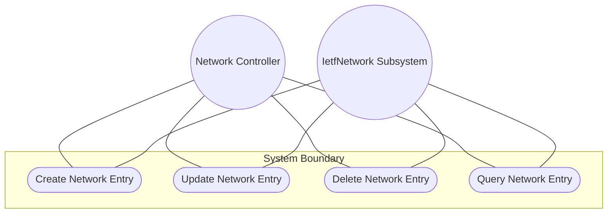
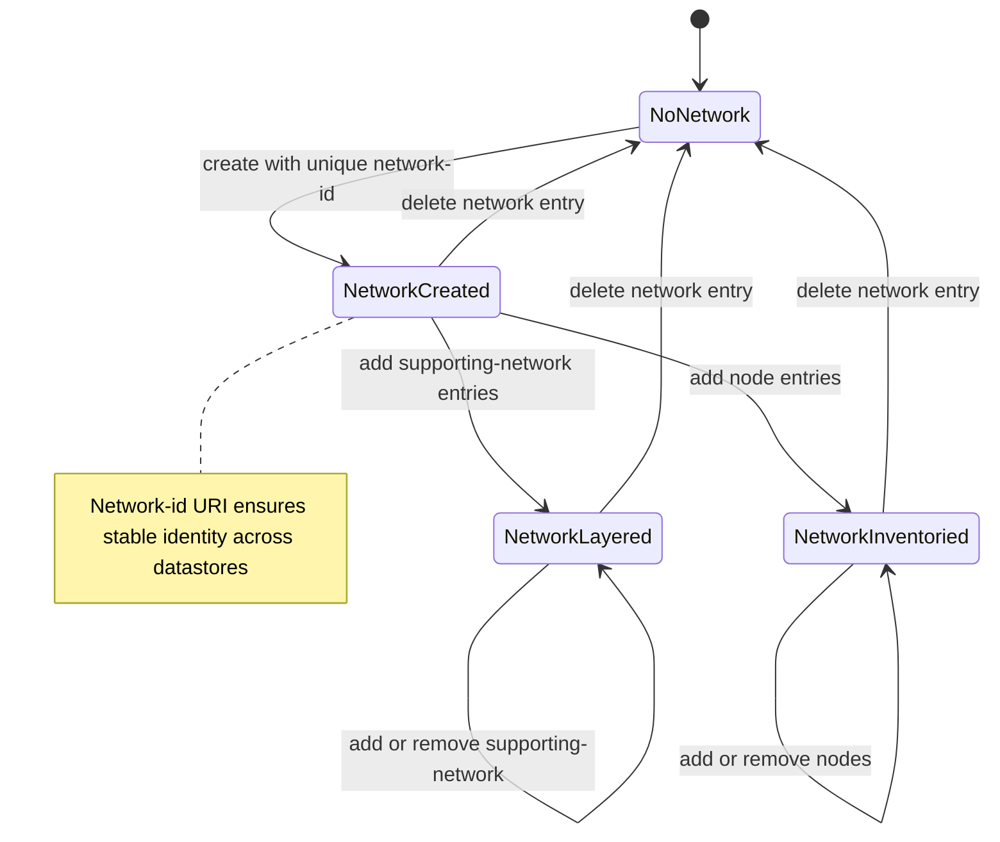

# Use Case: Manage Network List Entry Lifecycle

## Parent Epic
- [ ] #124 - [ietf-network: Base Network Data Model](https://github.com/gintatkinson/3dgs-033/blob/main/docs/epics/epic-08-ietf-network.md) (list of abstract networks keyed by network-id, clause 4.1)

## 1. Actors
- **Primary Actor:** Network Controller
- **Secondary Actors:** IetfNetwork Subsystem, TopologyReconciler

## 2. Preconditions
- The `networks` root container is instantiated in the datastore.
- The `ietf-network` YANG module is loaded and operational.
- The controller has authorization to create and modify network configurations.

## 3. Trigger
A Network Controller issues a request to create, read, update, or delete a network list entry within the `networks` container.

## 4. Main Success Scenario (Basic Flow)
1. Network Controller sends a creation request with a unique `network-id` value to the IetfNetwork Subsystem.
2. IetfNetwork Subsystem validates that the `network-id` is a valid URI and is not already in use within the `networks` container.
3. IetfNetwork Subsystem creates the `network` list entry with the specified `network-id`, an empty `network-types` container, and empty `supporting-network` and `node` lists.
4. IetfNetwork Subsystem confirms the new network entry is visible in the intended datastore at `/nw:networks/nw:network/{network-id}`.
5. IetfNetwork Subsystem resolves the network entry in the operational state datastore, provided all leafref references are satisfied.
6. Network Controller verifies the network appears with its network-id as the list key and the default child containers initialized.

## 5. Alternate and Exception Flows
- **5a. Duplicate network-id Rejection (Branches from Basic Flow step 2):**
  1. Network Controller attempts to create a network with a `network-id` that already exists in the `networks` container.
  2. IetfNetwork Subsystem detects the duplicate key and rejects the operation with a data-exists error.
  3. IetfNetwork Subsystem notifies the controller with the conflicting network-id value.

- **5b. Missing network-id Key (Branches from Basic Flow step 2):**
  1. Network Controller sends a creation request without a `network-id` value.
  2. IetfNetwork Subsystem detects the missing mandatory key and rejects the operation as invalid input.
  3. IetfNetwork Subsystem returns an error indicating the network-id key is required.

- **5c. Dangling Supporting-Network Reference (Branches from Basic Flow step 5):**
  1. Network Controller creates a network with a `supporting-network/network-ref` that references a non-existent underlay network.
  2. IetfNetwork Subsystem accepts the configuration in the intended datastore due to `require-instance false` semantics.
  3. IetfNetwork Subsystem excludes the network from the operational state datastore until the referenced underlay network is created.

- **5d. Network Deletion Cascade (Branches from Basic Flow step 5):**
  1. Network Controller issues a deletion request for an existing network entry.
  2. IetfNetwork Subsystem removes the network and all child nodes, supporting-network entries, and augmented topology data from both datastores.
  3. IetfNetwork Subsystem notifies any dependents that the network and its inventory are no longer available.

- **5e. Standalone Root Network Query (Branches from Basic Flow step 6):**
  1. Network Controller queries a network that has no `supporting-network` entries.
  2. IetfNetwork Subsystem returns the network structure with an empty supporting-network list, identifying it as a root-level standalone network.

- **5f. Multi-Network Identity Stability (Branches from Basic Flow step 4):**
  1. Network Controller uses the same `network-id` across separate datastore instantiations for the same logical network.
  2. IetfNetwork Subsystem consistently identifies the network by its stable URI-based network-id, ensuring cross-datastore referential integrity.

## 6. Postconditions (Guarantees)
- **Success Guarantee:** The network list entry exists with its unique `network-id` as the key, all child containers initialized, and the entry is visible in both intended and operational state datastores.
- **Failure Guarantee:** If creation fails due to duplicate key or missing identifier, no partial state is persisted; the `networks` container state remains unchanged.

## UML Diagrams
### Use Case Diagram

### State Machine Diagram

## 7. Operational Context
From the IETF Network Topologies YANG Data Model specification, Section 4.1 (Base Network Model):

"A network has a certain type, such as L2, L3, OSPF, or IS-IS. A network can even have multiple types simultaneously."

"A network can in turn be part of a hierarchy of networks, building on top of other networks. Any such networks are captured in the list 'supporting-network'. A supporting network is, in effect, an underlay network."

## 8. Realization Matrix
### Required User Stories
- [ ] #138 - [Configure Underlay-Overlay Network Stacking via Supporting-Network Chain](https://github.com/gintatkinson/3dgs-033/blob/main/docs/user-stories/us-51-configure-underlay-overlay-network-layering.md) (network list entries are the containers for overlay-underlay layering configuration)
- [ ] #142 - [Reconcile Overlay Topology When Underlay Network Is Deleted](https://github.com/gintatkinson/3dgs-033/blob/main/docs/user-stories/us-55-reconcile-overlay-topology-on-underlay-network-deletion.md) (network deletion is the trigger for cascading reconciliation of overlay dependencies)
- [ ] #145 - [Classify Network by Type for Conditional Augmentation Dispatch](https://github.com/gintatkinson/3dgs-033/blob/main/docs/user-stories/us-58-classify-network-by-type-for-conditional-augmentation.md) (each network entry carries a network-types container for type-based augmentation dispatch)
- [ ] #146 - [Compose Multi-Domain Topology with Shared Devices Across Networks](https://github.com/gintatkinson/3dgs-033/blob/main/docs/user-stories/us-59-compose-multi-domain-topology-with-shared-devices.md) (independent network list entries in separate networks provide scoped identity spaces for shared devices)

### Required Features
- [ ] #127 - [Define Network List Entry](https://github.com/gintatkinson/3dgs-033/blob/main/docs/features/feat-39-network-list.md) (the network list entry is the structural entity this use case creates, reads, updates, and deletes)

## Source References
Structural Schema: [ietf-network@2018-02-26.yang](https://github.com/YangModels/yang/blob/main/standard/ietf/RFC/ietf-network%402018-02-26.yang) (Clause: 6.1, lines 122-153)
Normative Specification: [the IETF Network Topologies YANG Data Model specification](https://datatracker.ietf.org/doc/rfc8345/) (Clause: 4.1)
