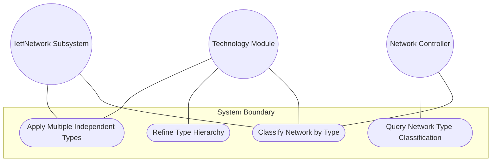
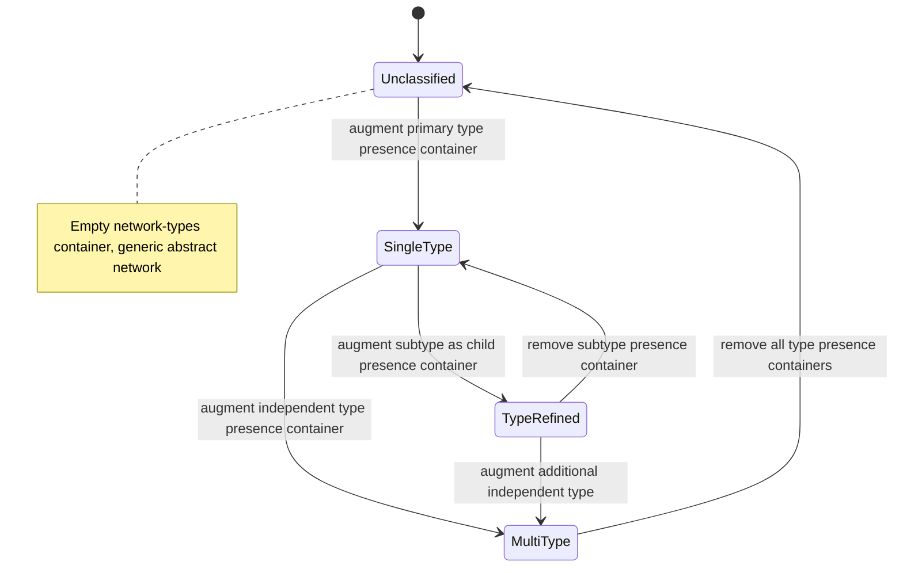

# Use Case: Classify Network Instance by Topology Type

## Parent Epic
- [ ] #124 - [ietf-network: Base Network Data Model](https://github.com/gintatkinson/3dgs-033/blob/main/docs/epics/epic-08-ietf-network.md) (network-types container as augmentation target for network type classification, clause 4.1)

## 1. Actors
- **Primary Actor:** Network Controller
- **Secondary Actors:** Technology-Specific Augmentation Modules, IetfNetwork Subsystem

## 2. Preconditions
- A `network` list entry exists within the `networks` container with a valid `network-id`.
- The `network-types` container is initialized as an empty child of the network entry.
- One or more technology-specific augmentation modules (e.g., L3 unicast IGP, OSPF) are loaded and registered.

## 3. Trigger
A Network Controller or technology-specific augmentation module inserts a presence container representing a network type into the `network-types` container, classifying the network instance.

## 4. Main Success Scenario (Basic Flow)
1. Network Controller identifies the target network entry by its `network-id`.
2. A technology-specific augmentation module registers a presence container (e.g., `l3-unicast-igp-network`) under the `network-types` container via YANG augmentation.
3. IetfNetwork Subsystem validates the augmentation target path and accepts the presence container insertion.
4. IetfNetwork Subsystem records the network as being of the declared type.
5. All conditional augmentations and behaviors that depend on the presence of this network type become active for this network instance.
6. Network Controller queries the network and retrieves the full type classification.

## 5. Alternate and Exception Flows
- **5a. Empty Network Types Query (Branches from Basic Flow step 4):**
  1. Network Controller queries a network that has no type classifications applied.
  2. IetfNetwork Subsystem returns an empty `network-types` container with no children.
  3. The network is treated as a generic abstract network with only base model attributes.

- **5b. Hierarchical Type Refinement (Branches from Basic Flow step 3):**
  1. An OSPF augmentation module inserts `ospf-network` as a child presence container within the existing `l3-unicast-igp-network` container.
  2. IetfNetwork Subsystem accepts the nested presence container.
  3. The network is classified as both an L3 unicast IGP network and an OSPF network, with the subtype hierarchy preserved.

- **5c. Multiple Independent Type Classifications (Branches from Basic Flow step 3):**
  1. Two independent augmentation modules insert presence containers at the same level under `network-types` (e.g., `l3-unicast-igp-network` and `l2-network`).
  2. IetfNetwork Subsystem accepts both presence containers simultaneously.
  3. The network carries the union of all type-specific attributes from both augmentation modules.

- **5d. Conditional When Constraint Rejection (Branches from Basic Flow step 5):**
  1. A dependent augmentation module declares a `when` constraint requiring a specific network type presence container.
  2. Network Controller attempts an operation that triggers the conditional augmentation without the prerequisite network type being present.
  3. IetfNetwork Subsystem rejects the operation because the conditional constraint is not satisfied.

- **5e. Conflicting Type Classification (Branches from Basic Flow step 3):**
  1. Two augmentation modules insert mutually incompatible presence containers under `network-types`.
  2. IetfNetwork Subsystem accepts both at the schema level but notes the logical conflict.
  3. Downstream consumers are warned that the classification may be logically inconsistent.

## 6. Postconditions (Guarantees)
- **Success Guarantee:** The network instance is classified under one or more network types, the relevant presence containers are present in `network-types`, and all conditional augmentations are active.
- **Failure Guarantee:** If the augmentation insertion fails or a conditional constraint is violated, the `network-types` container retains its previous state and no partial classification is persisted.

## UML Diagrams
### Use Case Diagram

### State Machine Diagram

## 7. Operational Context
From the IETF Network Topologies YANG Data Model specification, Section 4.1 (Base Network Model):

"In this model, it serves merely as an augmentation target; network-specific modules will later introduce new data nodes to represent new network types below this target."

"When a network is of a certain type, it will contain a corresponding data node. Network types SHOULD always be represented using presence containers, not leafs of type 'empty'. This allows the representation of hierarchies of network subtypes within the instance information."

From the IETF Network Topologies YANG Data Model specification, Section 4.3 (Extending the Data Model):

"First, a new network type needs to be defined; this is done by defining a presence container that represents the new network type. The new network type is inserted, by means of augmentation, below the network-types container."

## 8. Realization Matrix
### Required User Stories
- [ ] #145 - [Classify Network by Type for Conditional Augmentation Dispatch](https://github.com/gintatkinson/3dgs-033/blob/main/docs/user-stories/us-58-classify-network-by-type-for-conditional-augmentation.md) (network type classification via presence containers is the primary mechanism for conditional augmentation dispatch)

### Required Features
- [ ] #128 - [Define Network Types Container](https://github.com/gintatkinson/3dgs-033/blob/main/docs/features/feat-40-network-types.md) (the network-types container is the augmentation target this use case populates with presence containers representing network type identities)

## Source References
Structural Schema: [ietf-network@2018-02-26.yang](https://github.com/YangModels/yang/blob/main/standard/ietf/RFC/ietf-network%402018-02-26.yang) (Clause: 6.1, lines 134-139)
Normative Specification: [the IETF Network Topologies YANG Data Model specification](https://datatracker.ietf.org/doc/rfc8345/) (Clause: 4.1, 4.3)
