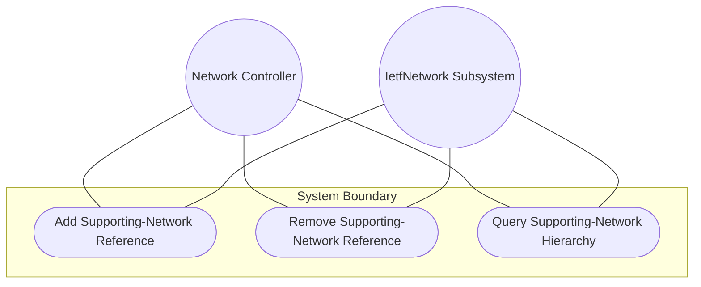
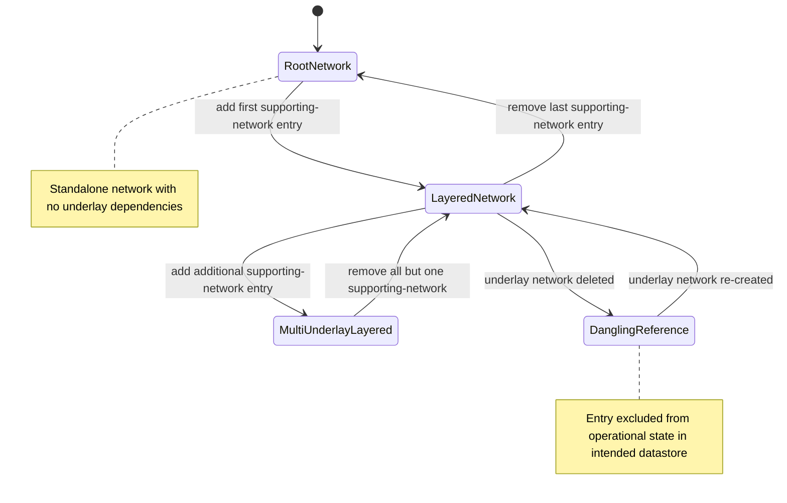

# Use Case: Configure Network Layering via Supporting-Network Chain

## Parent Epic
- [ ] #124 - [ietf-network: Base Network Data Model](https://github.com/gintatkinson/3dgs-033/blob/main/docs/epics/epic-08-ietf-network.md) (supporting-network list for underlay-overlay network stacking, clause 4.1)

## 1. Actors
- **Primary Actor:** Network Controller
- **Secondary Actors:** IetfNetwork Subsystem, TopologyReconciler

## 2. Preconditions
- An overlay `network` list entry exists with a valid `network-id`.
- One or more underlay `network` list entries exist with their own `network-id` values.
- The `supporting-network` list is initialized (possibly empty) as a child of the overlay network.

## 3. Trigger
A Network Controller adds a `supporting-network` entry referencing an underlay network, establishing a hierarchical dependency in the network stack.

## 4. Main Success Scenario (Basic Flow)
1. Network Controller selects the overlay network and identifies the underlay network to declare as a supporting network.
2. Network Controller sends a creation request adding a `supporting-network` entry with `network-ref` set to the underlay network's `network-id`.
3. IetfNetwork Subsystem validates that the `network-ref` is a valid URI and is not already present in the overlay's `supporting-network` list.
4. IetfNetwork Subsystem creates the entry in the intended datastore.
5. IetfNetwork Subsystem resolves the `network-ref` leafref against the underlay network in the operational state datastore.
6. IetfNetwork Subsystem confirms the layering relationship is established and both networks are visible in the hierarchy, with the underlay serving as a supporting network.

## 5. Alternate and Exception Flows
- **5a. Duplicate network-ref Rejection (Branches from Basic Flow step 3):**
  1. Network Controller attempts to add a `supporting-network` entry with a `network-ref` that already exists in the list.
  2. IetfNetwork Subsystem detects the duplicate key and rejects the operation with a data-exists error.

- **5b. Dangling Reference in Operational State (Branches from Basic Flow step 5):**
  1. The `network-ref` references an underlay network that does not exist in the operational state datastore.
  2. IetfNetwork Subsystem accepts the configuration in the intended datastore due to `require-instance false`.
  3. The entry is excluded from the operational state datastore until the underlay network is created.

- **5c. Underlay Network Deletion Reconciliation (Branches from Basic Flow step 6):**
  1. An underlay network referenced by the `supporting-network` entry is deleted from the network list.
  2. IetfNetwork Subsystem removes the `supporting-network` entry from the operational state datastore.
  3. The entry persists in the intended datastore as a dangling reference.
  4. All dependent `supporting-node` entries that chain through this network-ref are also excluded from operational state.

- **5d. Self-Referencing Circular Dependency (Branches from Basic Flow step 2):**
  1. Network Controller attempts to configure a network's `supporting-network` entry to reference its own `network-id`.
  2. IetfNetwork Subsystem accepts the configuration at the schema level but flags the circular dependency as logically invalid.
  3. The self-referencing entry creates a degenerate layering relationship that downstream tools must detect and handle.

- **5e. Multiple Underlay Dependencies (Branches from Basic Flow step 2):**
  1. Network Controller adds multiple `supporting-network` entries referencing two or more distinct underlay networks.
  2. IetfNetwork Subsystem validates each entry independently.
  3. The overlay network is established as depending on multiple underlay networks simultaneously, forming a multi-rooted hierarchy.

- **5f. Root Network With No Underlay Dependencies (Branches from Basic Flow step 1):**
  1. Network Controller queries a network with an empty `supporting-network` list.
  2. IetfNetwork Subsystem returns no entries.
  3. The network is identified as a root-level standalone network with no underlay dependencies.

## 6. Postconditions (Guarantees)
- **Success Guarantee:** The `supporting-network` entry references a valid underlay network, the layering relationship is established in both datastores, and the network hierarchy is visible to queries.
- **Failure Guarantee:** If the reference is a duplicate or the operation fails, no entry is created; dangling references are accepted in intended but excluded from operational state until resolved.

## UML Diagrams
### Use Case Diagram

### State Machine Diagram

## 7. Operational Context
From the IETF Network Topologies YANG Data Model specification, Section 4.1 (Base Network Model):

"A network can in turn be part of a hierarchy of networks, building on top of other networks. Any such networks are captured in the list 'supporting-network'. A supporting network is, in effect, an underlay network."

From the IETF Network Topologies YANG Data Model specification, Section 4.4.3 (Dealing with Changes in Underlay Networks):

"It is possible for a network to undergo churn even as other networks are layered on top of it. When a supporting node, link, or termination point is deleted, the supporting leafrefs in the overlay will be left dangling. To allow for this possibility, the data model makes use of the 'require-instance' construct of YANG 1.1."

## 8. Realization Matrix
### Required User Stories
- [ ] #138 - [Configure Underlay-Overlay Network Stacking via Supporting-Network Chain](https://github.com/gintatkinson/3dgs-033/blob/main/docs/user-stories/us-51-configure-underlay-overlay-network-layering.md) (the supporting-network list is the direct mechanism for configuring underlay-overlay stacking)
- [ ] #142 - [Reconcile Overlay Topology When Underlay Network Is Deleted](https://github.com/gintatkinson/3dgs-033/blob/main/docs/user-stories/us-55-reconcile-overlay-topology-on-underlay-network-deletion.md) (supporting-network entries are the primary targets of reconciliation when underlay networks are deleted)

### Required Features
- [ ] #129 - [Define Supporting Network List](https://github.com/gintatkinson/3dgs-033/blob/main/docs/features/feat-41-supporting-network-list.md) (the supporting-network list is the structural entity this use case manages for network layering configuration)

## Source References
Structural Schema: [ietf-network@2018-02-26.yang](https://github.com/YangModels/yang/blob/main/standard/ietf/RFC/ietf-network%402018-02-26.yang) (Clause: 6.1, lines 140-153)
Normative Specification: [the IETF Network Topologies YANG Data Model specification](https://datatracker.ietf.org/doc/rfc8345/) (Clause: 4.1, 4.4.2, 4.4.3)
