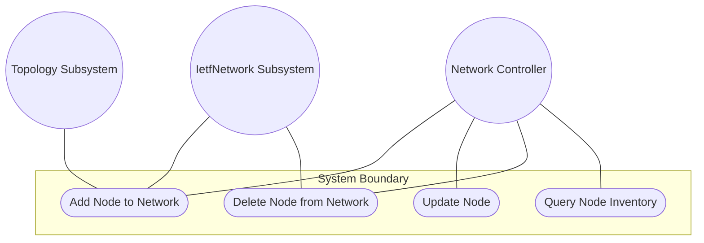
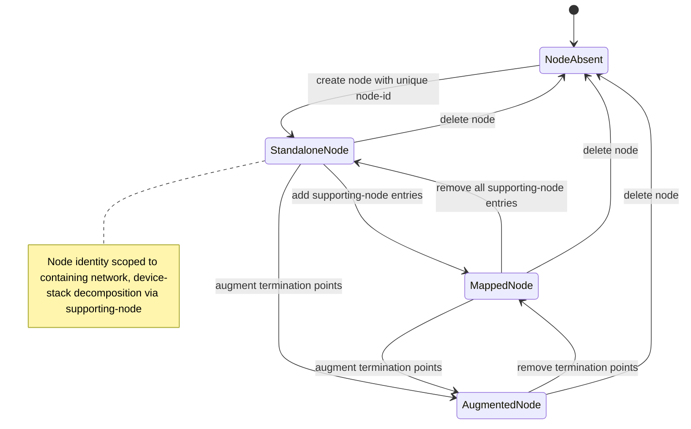

# Use Case: Manage Node Inventory Within a Network

## Parent Epic
- [ ] #124 - [ietf-network: Base Network Data Model](https://github.com/gintatkinson/3dgs-033/blob/main/docs/epics/epic-08-ietf-network.md) (node inventory list keyed by node-id, clause 4.1)

## 1. Actors
- **Primary Actor:** Network Controller
- **Secondary Actors:** IetfNetwork Subsystem, IetfNetworkTopology Subsystem

## 2. Preconditions
- A `network` list entry exists within the `networks` container with a valid `network-id`.
- The `node` list is initialized (possibly empty) as a child of the network.
- The controller has authorization to create nodes within the target network.

## 3. Trigger
A Network Controller sends a request to create, read, update, or delete a node entry within a network's node inventory.

## 4. Main Success Scenario (Basic Flow)
1. Network Controller identifies the target network by its `network-id` and sends a creation request with a unique `node-id`.
2. IetfNetwork Subsystem validates that the `node-id` is a valid URI and is not already in use within the target network.
3. IetfNetwork Subsystem creates the `node` list entry with the specified `node-id` and an empty `supporting-node` list.
4. IetfNetwork Subsystem confirms the node entry is visible at `/nw:networks/nw:network/{network-id}/nw:node/{node-id}` in the intended datastore.
5. IetfNetwork Subsystem resolves the node entry in the operational state datastore.
6. Network Controller verifies the node appears with its node-id as the list key.

## 5. Alternate and Exception Flows
- **5a. Duplicate node-id Within Same Network Rejection (Branches from Basic Flow step 2):**
  1. Network Controller attempts to create a node with a `node-id` already in use within the target network.
  2. IetfNetwork Subsystem detects the duplicate key and rejects the operation with a data-exists error.

- **5b. Same node-id Across Different Networks Permitted (Branches from Basic Flow step 2):**
  1. Network Controller creates a node with the same `node-id` used in a different network.
  2. IetfNetwork Subsystem accepts the creation since node identity is scoped to the containing network.

- **5c. Dangling Supporting-Node Reference (Branches from Basic Flow step 5):**
  1. Network Controller creates a node with a `supporting-node` entry referencing a non-existent underlay node.
  2. IetfNetwork Subsystem accepts the configuration in the intended datastore.
  3. The `supporting-node` entry is excluded from the operational state datastore until referential integrity is satisfied.

- **5d. Node Deletion Cascade (Branches from Basic Flow step 6):**
  1. Network Controller deletes a node from the network.
  2. IetfNetwork Subsystem removes the node entry.
  3. IetfNetwork Topology Subsystem removes all termination points contained within the deleted node.
  4. All links referencing the node's termination points are excluded from operational state due to dangling leafrefs.

- **5e. Node Augmented With Termination Points (Branches from Basic Flow step 5):**
  1. IetfNetwork Topology Subsystem augments termination points into the node.
  2. The node now supports link termination through the augmented termination points.
  3. Network Controller verifies the node carries both base attributes and topology-augmented data.

## 6. Postconditions (Guarantees)
- **Success Guarantee:** The node entry exists with its unique `node-id` scoped to the containing network, is visible in both datastores, and is ready to be augmented with termination points and supporting-node mappings.
- **Failure Guarantee:** If creation fails, no partial node state is persisted; the network's node list remains unchanged.

## UML Diagrams
### Use Case Diagram

### State Machine Diagram

## 7. Operational Context
From the IETF Network Topologies YANG Data Model specification, Section 4.1 (Base Network Model):

"Furthermore, a network contains an inventory of nodes that are part of the network. The nodes of a network are captured in their own list. Each node is identified relative to its containing network by a node-id."

"It should be noted that a node does not exist independently of a network; instead, it is a part of the network that contains it. In cases where the same device or entity takes part in multiple networks, or at multiple layers of a networking stack, the same device or entity will be represented by multiple nodes, one for each network."

## 8. Realization Matrix
### Required User Stories
- [ ] #139 - [Map Overlay Nodes to Supporting Nodes Across Layered Networks](https://github.com/gintatkinson/3dgs-033/blob/main/docs/user-stories/us-52-map-overlay-nodes-to-supporting-underlay-nodes.md) (nodes are the entities being mapped via supporting-node entries for device-stack and layering relationships)
- [ ] #143 - [Reconcile Overlay Topology When Underlay Nodes or Links Change](https://github.com/gintatkinson/3dgs-033/blob/main/docs/user-stories/us-56-reconcile-overlay-topology-on-underlay-entity-churn.md) (node deletion in the underlay triggers supporting-node reconciliation at the overlay)
- [ ] #146 - [Compose Multi-Domain Topology with Shared Devices Across Networks](https://github.com/gintatkinson/3dgs-033/blob/main/docs/user-stories/us-59-compose-multi-domain-topology-with-shared-devices.md) (node instances are scoped to their containing network, enabling independent representation of shared devices across network domains)

### Required Features
- [ ] #130 - [Define Node List](https://github.com/gintatkinson/3dgs-033/blob/main/docs/features/feat-42-node-list.md) (the node list is the structural entity this use case creates and manages as the vertex inventory of a network)

## Source References
Structural Schema: [ietf-network@2018-02-26.yang](https://github.com/YangModels/yang/blob/main/standard/ietf/RFC/ietf-network%402018-02-26.yang) (Clause: 6.1, lines 155-189)
Normative Specification: [the IETF Network Topologies YANG Data Model specification](https://datatracker.ietf.org/doc/rfc8345/) (Clause: 4.1)
