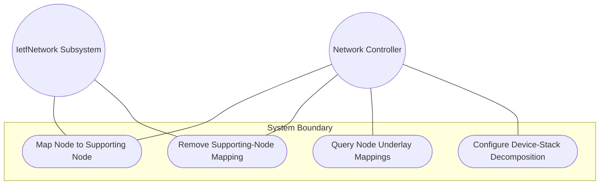
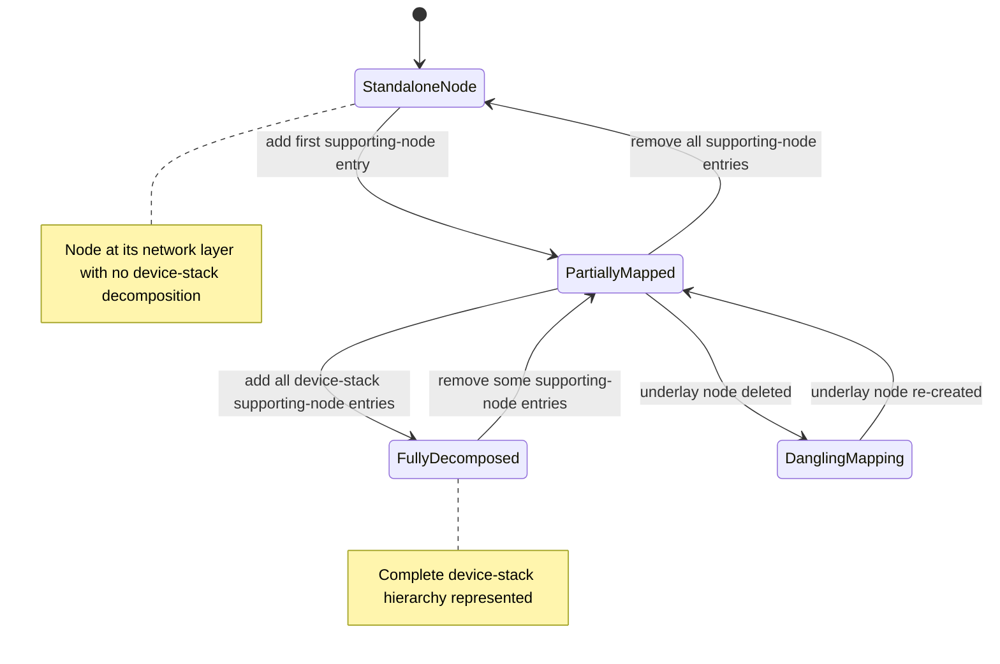

# Use Case: Map Node to Supporting Nodes Across Network Layers

## Parent Epic
- [ ] #124 - [ietf-network: Base Network Data Model](https://github.com/gintatkinson/3dgs-033/blob/main/docs/epics/epic-08-ietf-network.md) (supporting-node list for device-stack and node-level underlay mapping, clause 4.1)

## 1. Actors
- **Primary Actor:** Network Controller
- **Secondary Actors:** IetfNetwork Subsystem, TopologyReconciler

## 2. Preconditions
- An overlay `node` list entry exists within its containing network.
- The containing network has at least one `supporting-network` entry referencing an underlay network.
- The underlay network contains at least one node that can serve as a supporting node.

## 3. Trigger
A Network Controller adds a `supporting-node` entry referencing a node in an underlay network, establishing a device-stack or node-level layering relationship.

## 4. Main Success Scenario (Basic Flow)
1. Network Controller selects the overlay node and identifies an underlay node to declare as a supporting node.
2. Network Controller sends a creation request with the composite key of `network-ref` (underlay network) and `node-ref` (underlay node).
3. IetfNetwork Subsystem validates that `network-ref` resolves through the containing network's `supporting-network` chain and that the composite key is unique within the list.
4. IetfNetwork Subsystem creates the `supporting-node` entry in the intended datastore.
5. IetfNetwork Subsystem resolves both leafrefs: `network-ref` against the network-level supporting-network chain, and `node-ref` against the underlay network's node list.
6. IetfNetwork Subsystem confirms the node-level layering relationship is established, with the overlay node mapped to its supporting underlay node.

## 5. Alternate and Exception Flows
- **5a. Duplicate Composite Key Rejection (Branches from Basic Flow step 3):**
  1. Network Controller attempts to add a `supporting-node` entry with an existing `network-ref` and `node-ref` pair.
  2. IetfNetwork Subsystem detects the duplicate composite key and rejects the operation.

- **5b. Dangling Underlay Node Reference (Branches from Basic Flow step 5):**
  1. The `node-ref` references an underlay node that has been deleted from the underlay network.
  2. IetfNetwork Subsystem accepts the configuration in the intended datastore due to `require-instance false`.
  3. The entry is excluded from the operational state datastore until the underlay node is re-created.

- **5c. Inconsistent Underlay Network Chain (Branches from Basic Flow step 3):**
  1. The `network-ref` in the supporting-node entry does not match any entry in the containing network's `supporting-network` list.
  2. IetfNetwork Subsystem detects the inconsistent reference chain, since the `network-ref` leafref is relative to the containing network's own `supporting-network` entries.
  3. The reference cannot resolve and the supporting-node entry is excluded from operational state.

- **5d. Device-Stack Decomposition (Branches from Basic Flow step 2):**
  1. Network Controller adds multiple `supporting-node` entries mapping a single overlay node (e.g., a virtual router) onto multiple underlay nodes (e.g., a route processor and several line cards).
  2. IetfNetwork Subsystem validates each entry independently.
  3. The overlay node is associated with all specified underlay nodes, representing a complete device-stack decomposition.

- **5e. Standalone Node With No Underlay Mapping (Branches from Basic Flow step 1):**
  1. Network Controller queries a node with an empty `supporting-node` list.
  2. IetfNetwork Subsystem returns no supporting-node entries.
  3. The node is identified as a standalone node at its network layer with no device-stack decomposition.

- **5f. Missing Network-Level Supporting-Network Prerequisite (Branches from Basic Flow step 2):**
  1. Network Controller attempts to add a supporting-node entry but the containing network has no `supporting-network` entries.
  2. The `network-ref` leafref path `../../../nw:supporting-network/nw:network-ref` cannot resolve because no supporting-network declarations exist at the network level.
  3. IetfNetwork Subsystem accepts the configuration in the intended datastore but excludes the entry from operational state due to an inconsistent reference chain.

## 6. Postconditions (Guarantees)
- **Success Guarantee:** The supporting-node entry is created with a valid composite key, both leafrefs resolve to existing underlay entities, and the node-level layering relationship is operational.
- **Failure Guarantee:** If the composite key is a duplicate or the network-ref chain is inconsistent, no entry is created; the overlay node's supporting-node list remains unchanged.

## UML Diagrams
### Use Case Diagram

### State Machine Diagram

## 7. Operational Context
From the IETF Network Topologies YANG Data Model specification, Section 4.1 (Base Network Model):

"Similar to a network, a node can be supported by other nodes and map onto one or more other nodes in an underlay network. This is captured in the list 'supporting-node'. The resulting hierarchy of nodes also allows for the representation of device stacks, where a node at one level is supported by a set of nodes at an underlying level. For example: a 'router' node might be supported by a node representing a route processor and separate nodes for various line cards and service modules, a virtual router might be supported or hosted on a physical device represented by a separate node."

From the IETF Network Topologies YANG Data Model specification, Section 4.4.3 (Dealing with Changes in Underlay Networks):

"A dangling leafref of a configured object leaves the corresponding instance in a state in which it lacks referential integrity, effectively rendering it nonoperational. Any corresponding object instance is therefore removed from the operational state datastore until the situation has been resolved."

## 8. Realization Matrix
### Required User Stories
- [ ] #139 - [Map Overlay Nodes to Supporting Nodes Across Layered Networks](https://github.com/gintatkinson/3dgs-033/blob/main/docs/user-stories/us-52-map-overlay-nodes-to-supporting-underlay-nodes.md) (the supporting-node list is the direct mechanism for mapping overlay nodes to underlay node counterparts)
- [ ] #141 - [Resolve Supporting Termination Point Mappings via Transitive Closure](https://github.com/gintatkinson/3dgs-033/blob/main/docs/user-stories/us-54-resolve-supporting-termination-point-via-transitive-closure.md) (supporting-node entries provide the node context needed for supporting-TP chain resolution)
- [ ] #142 - [Reconcile Overlay Topology When Underlay Network Is Deleted](https://github.com/gintatkinson/3dgs-033/blob/main/docs/user-stories/us-55-reconcile-overlay-topology-on-underlay-network-deletion.md) (supporting-node entries cascade into operational exclusion when their network-ref becomes unresolvable)
- [ ] #143 - [Reconcile Overlay Topology When Underlay Nodes or Links Change](https://github.com/gintatkinson/3dgs-033/blob/main/docs/user-stories/us-56-reconcile-overlay-topology-on-underlay-entity-churn.md) (supporting-node entries are surgically excluded when their referenced underlay node is deleted)

### Required Features
- [ ] #131 - [Define Supporting Node List](https://github.com/gintatkinson/3dgs-033/blob/main/docs/features/feat-43-supporting-node-list.md) (the supporting-node list is the structural entity this use case manages for node-level underlay mapping)

## Source References
Structural Schema: [ietf-network@2018-02-26.yang](https://github.com/YangModels/yang/blob/main/standard/ietf/RFC/ietf-network%402018-02-26.yang) (Clause: 6.1, lines 165-188)
Normative Specification: [the IETF Network Topologies YANG Data Model specification](https://datatracker.ietf.org/doc/rfc8345/) (Clause: 4.1, 4.4.3)
