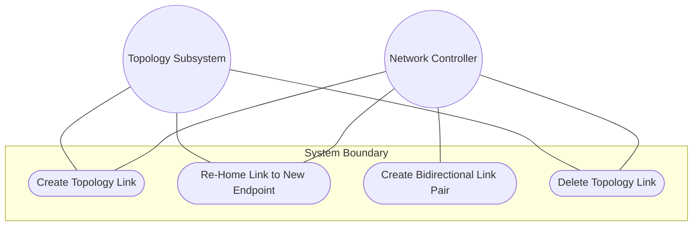
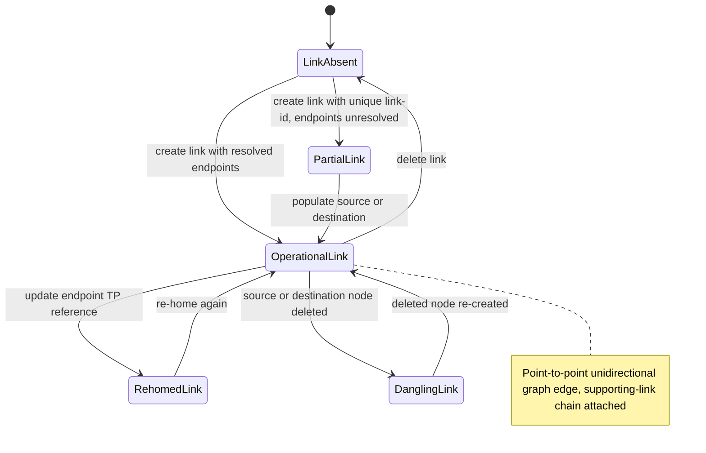

# Use Case: Manage Topology Link Lifecycle

## Parent Epic
- [ ] #125 - [ietf-network-topology: Base Network Topology Augmentation](https://github.com/gintatkinson/3dgs-033/blob/main/docs/epics/epic-09-ietf-network-topology.md) (augmented topology link list keyed by link-id, clause 4.2)

## 1. Actors
- **Primary Actor:** Network Controller
- **Secondary Actors:** IetfNetworkTopology Subsystem, TopologyReconciler

## 2. Preconditions
- A `network` list entry exists with at least two nodes, each augmented with termination points.
- The `ietf-network-topology` module is loaded and has augmented the link list into the network.
- Source and destination nodes are present in the same network with valid termination points.

## 3. Trigger
A Network Controller creates a point-to-point unidirectional link between a source node's termination point and a destination node's termination point within the same network.

## 4. Main Success Scenario (Basic Flow)
1. Network Controller identifies the source and destination nodes and their respective termination points within the same network.
2. Network Controller sends a creation request with a unique `link-id`, a `source` container with `source-node` and `source-tp`, and a `destination` container with `dest-node` and `dest-tp`.
3. IetfNetworkTopology Subsystem validates that `link-id` is a valid URI and is not already in use within the network's link list.
4. IetfNetworkTopology Subsystem creates the `link` entry augmented into the network with the specified endpoints and an empty `supporting-link` list.
5. IetfNetworkTopology Subsystem resolves all endpoint leafrefs against the operational state datastore.
6. IetfNetworkTopology Subsystem confirms the link is operational and visible in the topology graph.

## 5. Alternate and Exception Flows
- **5a. Duplicate link-id Rejection (Branches from Basic Flow step 3):**
  1. Network Controller attempts to create a link with a `link-id` already in use within the same network.
  2. IetfNetworkTopology Subsystem detects the duplicate key and rejects the operation with a data-exists error.

- **5b. Missing Source or Destination Container (Branches from Basic Flow step 2):**
  1. Network Controller creates a link without providing the `source` or `destination` container.
  2. IetfNetworkTopology Subsystem creates the link but the endpoint leafrefs remain unresolved.
  3. The link is excluded from operational state until both source and destination references are populated.

- **5c. Cross-Network Node Reference (Branches from Basic Flow step 4):**
  1. Network Controller creates a link where `source-node` or `dest-node` references a node in a different network.
  2. IetfNetworkTopology Subsystem cannot resolve the leafref because the relative path only searches within the containing network.
  3. The link is excluded from operational state due to unresolvable references.

- **5d. Link Re-Homing (Branches from Basic Flow step 6):**
  1. Network Controller updates the `source-tp` or `dest-tp` of an existing link to reference a different termination point on the same or a different node.
  2. IetfNetworkTopology Subsystem updates the leafref values.
  3. The link is re-homed in the topology graph to the new endpoint, reflecting the updated connectivity.

- **5e. Link Deletion on Source Node Removal (Branches from Basic Flow step 6):**
  1. The source node of an operational link is deleted from the network.
  2. IetfNetworkTopology Subsystem detects the dangling `source-node` leafref.
  3. The link is excluded from the operational state datastore along with its `supporting-link` entries.

- **5f. Link Deletion on Destination Node Removal (Branches from Basic Flow step 6):**
  1. The destination node of an operational link is deleted from the network.
  2. IetfNetworkTopology Subsystem detects the dangling `dest-node` leafref.
  3. The link is excluded from the operational state datastore.

- **5g. Bidirectional Connection Via Link Pair (Branches from Basic Flow step 1):**
  1. Network Controller creates a second unidirectional link in the reverse direction between the same node pair.
  2. The pair of unidirectional links represents a bidirectional connection.
  3. Each direction is independently identifiable and manageable by its own link-id.

## 6. Postconditions (Guarantees)
- **Success Guarantee:** The link is created with a unique link-id, both source and destination endpoints resolve, and the link is operational in the topology graph connecting the specified nodes.
- **Failure Guarantee:** If creation fails due to duplicate ID or unresolved endpoints, no partial link state is persisted; the network's link list remains unchanged.

## UML Diagrams
### Use Case Diagram

### State Machine Diagram

## 7. Operational Context
From the IETF Network Topologies YANG Data Model specification, Section 4.2 (Base Network Topology Data Model):

"A link is identified by a link-id that uniquely identifies the link within a given topology. Links are point-to-point and unidirectional. Accordingly, a link contains a source and a destination. Both source and destination reference a corresponding node, as well as a termination point on that node."

From the IETF Network Topologies YANG Data Model specification, Section 4.4.5 (Cardinality and Directionality of Links):

"The topology data model includes links that are point-to-point and unidirectional. It does not directly support multipoint and bidirectional links. Bidirectional connections can be represented through pairs of unidirectional links."

## 8. Realization Matrix
### Required User Stories
- [ ] #140 - [Map Overlay Links to Supporting Links Across Layered Topologies](https://github.com/gintatkinson/3dgs-033/blob/main/docs/user-stories/us-53-map-overlay-links-to-supporting-underlay-links.md) (links are the overlay entities that map onto chains of underlay links via the supporting-link list)
- [ ] #143 - [Reconcile Overlay Topology When Underlay Nodes or Links Change](https://github.com/gintatkinson/3dgs-033/blob/main/docs/user-stories/us-56-reconcile-overlay-topology-on-underlay-entity-churn.md) (link deletion triggers cascading supporting-link exclusion, links are the referenced underlay entities)
- [ ] #144 - [Handle Link Reference Integrity on Termination Point Deletion Cascade](https://github.com/gintatkinson/3dgs-033/blob/main/docs/user-stories/us-57-handle-link-reference-integrity-on-termination-point-deletion.md) (links are the targets of the cascade when their endpoint termination points are deleted)

### Required Features
- [ ] #132 - [Define Link List](https://github.com/gintatkinson/3dgs-033/blob/main/docs/features/feat-44-link-list.md) (the link list is the structural entity this use case creates and manages as graph edges in the topology)

## Source References
Structural Schema: [ietf-network-topology@2018-02-26.yang](https://github.com/YangModels/yang/blob/main/standard/ietf/RFC/ietf-network-topology%402018-02-26.yang) (Clause: 6.2, lines 136-233)
Normative Specification: [the IETF Network Topologies YANG Data Model specification](https://datatracker.ietf.org/doc/rfc8345/) (Clause: 4.2, 4.4.5)
