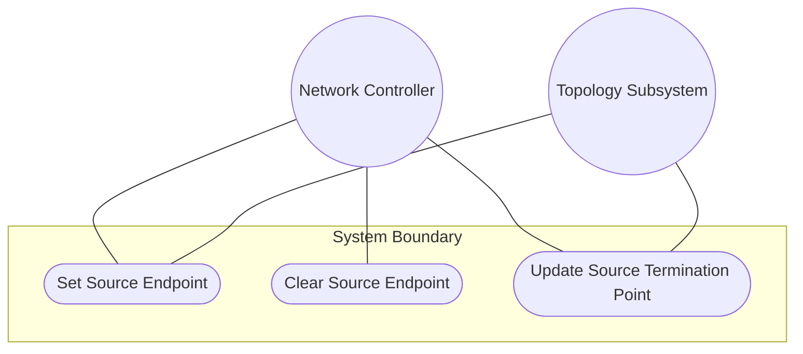
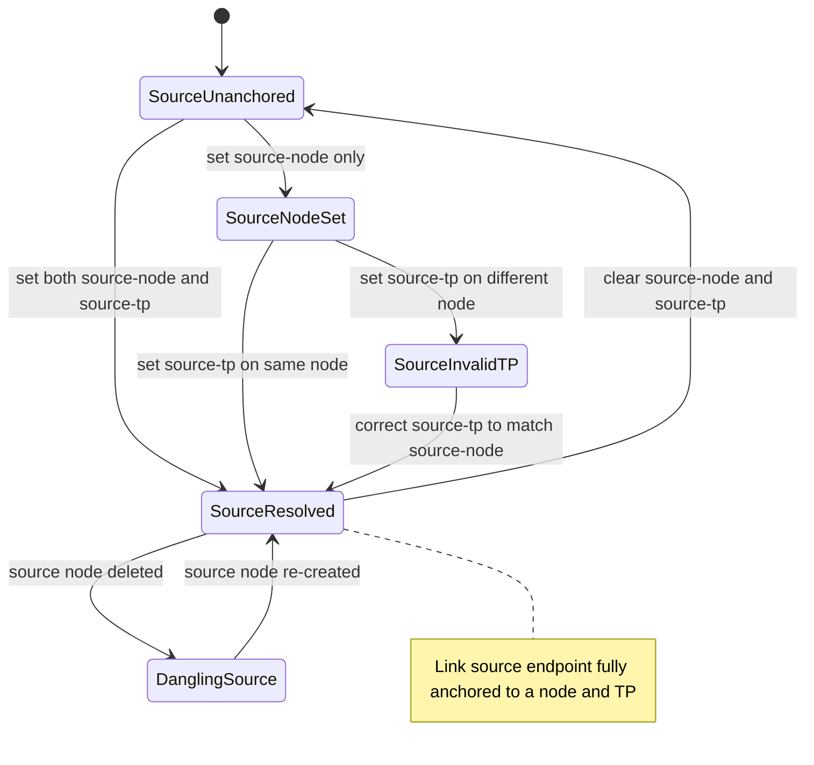

# Use Case: Configure Link Source Endpoint

## Parent Epic
- [ ] #125 - [ietf-network-topology: Base Network Topology Augmentation](https://github.com/gintatkinson/3dgs-033/blob/main/docs/epics/epic-09-ietf-network-topology.md) (source endpoint of a point-to-point link, clause 4.2)

## 1. Actors
- **Primary Actor:** Network Controller
- **Secondary Actors:** IetfNetworkTopology Subsystem

## 2. Preconditions
- A `link` list entry exists within a network with a valid `link-id`.
- At least one node with at least one termination point exists in the same network.
- The source container is present (possibly with empty leaf values).

## 3. Trigger
A Network Controller sets or updates the `source-node` and `source-tp` leafrefs to anchor a link's origination endpoint to a specific node and termination point.

## 4. Main Success Scenario (Basic Flow)
1. Network Controller identifies the link and the desired source node and its termination point within the same network.
2. Network Controller sends an update request setting `source-node` to the target node's `node-id` and `source-tp` to a termination point `tp-id` on that node.
3. IetfNetworkTopology Subsystem validates that `source-node` references a node within the same network via the leafref path.
4. IetfNetworkTopology Subsystem validates that `source-tp` references a termination point on the node identified by `source-node`.
5. IetfNetworkTopology Subsystem writes the source endpoint values to the intended datastore.
6. IetfNetworkTopology Subsystem resolves the references in the operational state datastore, making the link's source endpoint fully resolved.

## 5. Alternate and Exception Flows
- **5a. Dangling Source-Node Reference (Branches from Basic Flow step 6):**
  1. The `source-node` leafref references a node that does not exist in the operational state datastore.
  2. IetfNetworkTopology Subsystem accepts the configuration in the intended datastore due to `require-instance false`.
  3. The link is excluded from operational state until the referenced node is created.

- **5b. Invalid Source-TP Chain (Branches from Basic Flow step 4):**
  1. Network Controller sets `source-tp` to a termination point that belongs to a different node than the one specified in `source-node`.
  2. IetfNetworkTopology Subsystem cannot resolve the leafref because the path expression constrains the termination point to the node identified by `source-node`.
  3. The `source-tp` reference is unresolvable and the link is nonoperational.

- **5c. Missing Source-TP With Valid Source-Node (Branches from Basic Flow step 2):**
  1. Network Controller sets `source-node` to a valid node but does not specify a `source-tp`.
  2. IetfNetworkTopology Subsystem accepts the configuration as it is valid per schema.
  3. The link has a source node but no specific termination point, remaining semantically ambiguous.

- **5d. Clearing Source Endpoint (Branches from Basic Flow step 2):**
  1. Network Controller removes the `source-node` and `source-tp` values from the source container.
  2. IetfNetworkTopology Subsystem clears the endpoint references.
  3. The link becomes unanchored at its source end.

- **5e. Source Endpoint Populated After Partial Creation (Branches from Basic Flow step 2):**
  1. Network Controller creates a link with no source endpoint configured initially.
  2. IetfNetworkTopology Subsystem creates the link with an empty source container.
  3. Network Controller subsequently populates `source-node` and `source-tp` with valid references.
  4. IetfNetworkTopology Subsystem resolves the references and the link becomes operational.

## 6. Postconditions (Guarantees)
- **Success Guarantee:** The source container is populated with valid `source-node` and `source-tp` leafrefs that resolve to an existing node and termination point, anchoring the link's origin in the topology graph.
- **Failure Guarantee:** If the leafref resolution fails, the configured values persist in the intended datastore but the link remains excluded from operational state until references resolve.

## UML Diagrams
### Use Case Diagram

### State Machine Diagram

## 7. Operational Context
From the IETF Network Topologies YANG Data Model specification, Section 4.2 (Base Network Topology Data Model):

"Both source and destination reference a corresponding node, as well as a termination point on that node."

From the ietf-network-topology YANG module (lines 158-159): "This container holds the logical source of a particular link." From the source-node description (line 167): "Source node identifier. Must be in the same topology." From the source-tp description (line 178): "This termination point is located within the source node and terminates the link."

## 8. Realization Matrix
### Required User Stories
- [ ] #143 - [Reconcile Overlay Topology When Underlay Nodes or Links Change](https://github.com/gintatkinson/3dgs-033/blob/main/docs/user-stories/us-56-reconcile-overlay-topology-on-underlay-entity-churn.md) (source-node leafref becomes dangling when the source underlay node is deleted, contributing to link-level operational exclusion)
- [ ] #144 - [Handle Link Reference Integrity on Termination Point Deletion Cascade](https://github.com/gintatkinson/3dgs-033/blob/main/docs/user-stories/us-57-handle-link-reference-integrity-on-termination-point-deletion.md) (source-tp leafref is the reference that becomes dangling when the source termination point is deleted)

### Required Features
- [ ] #133 - [Define Link Source Container](https://github.com/gintatkinson/3dgs-033/blob/main/docs/features/feat-45-link-source.md) (the source container is the structural entity this use case configures to anchor the link's origin endpoint)

## Source References
Structural Schema: [ietf-network-topology@2018-02-26.yang](https://github.com/YangModels/yang/blob/main/standard/ietf/RFC/ietf-network-topology%402018-02-26.yang) (Clause: 6.2, lines 157-179)
Normative Specification: [the IETF Network Topologies YANG Data Model specification](https://datatracker.ietf.org/doc/rfc8345/) (Clause: 4.2)
