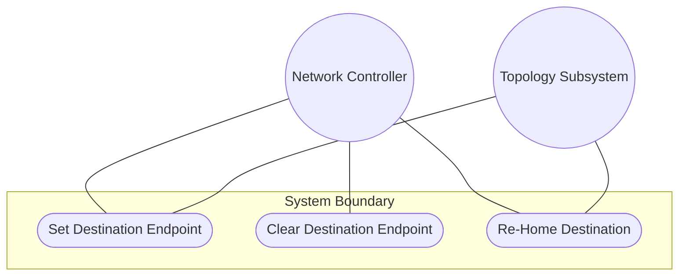
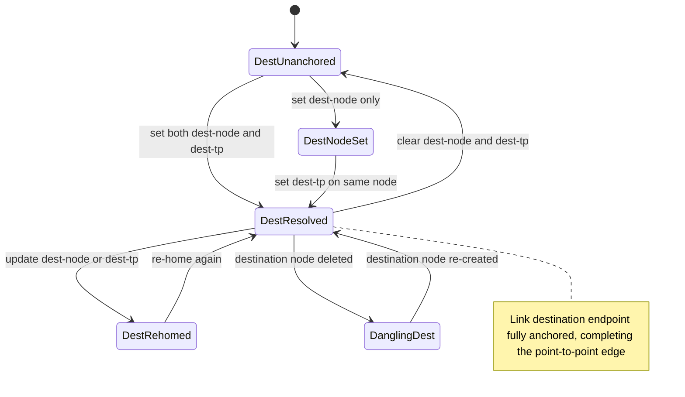

# Use Case: Configure Link Destination Endpoint

## Parent Epic
- [ ] #125 - [ietf-network-topology: Base Network Topology Augmentation](https://github.com/gintatkinson/3dgs-033/blob/main/docs/epics/epic-09-ietf-network-topology.md) (destination endpoint of a point-to-point link, clause 4.2)

## 1. Actors
- **Primary Actor:** Network Controller
- **Secondary Actors:** IetfNetworkTopology Subsystem

## 2. Preconditions
- A `link` list entry exists within a network with a valid `link-id`.
- At least one node with at least one termination point exists in the same network.
- The destination container is present (possibly with empty leaf values).

## 3. Trigger
A Network Controller sets or updates the `dest-node` and `dest-tp` leafrefs to anchor a link's destination endpoint to a specific node and termination point.

## 4. Main Success Scenario (Basic Flow)
1. Network Controller identifies the link and the desired destination node and its termination point within the same network.
2. Network Controller sends an update request setting `dest-node` to the target node's `node-id` and `dest-tp` to a termination point `tp-id` on that node.
3. IetfNetworkTopology Subsystem validates that `dest-node` references a node within the same network via the leafref path.
4. IetfNetworkTopology Subsystem validates that `dest-tp` references a termination point on the node identified by `dest-node`.
5. IetfNetworkTopology Subsystem writes the destination endpoint values to the intended datastore.
6. IetfNetworkTopology Subsystem resolves the references in the operational state datastore, making the link's destination endpoint fully resolved.

## 5. Alternate and Exception Flows
- **5a. Dangling Dest-Node Reference (Branches from Basic Flow step 6):**
  1. The `dest-node` leafref references a node that does not exist in the operational state datastore.
  2. IetfNetworkTopology Subsystem accepts the configuration in the intended datastore due to `require-instance false`.
  3. The link is excluded from operational state until the referenced node is created.

- **5b. Self-Loop Link (Branches from Basic Flow step 2):**
  1. Network Controller configures `source-node` equal to `dest-node` and `source-tp` equal to `dest-tp`.
  2. IetfNetworkTopology Subsystem accepts the configuration at the schema level.
  3. The link forms a self-loop, which is logically permitted but topologically degenerate.

- **5c. Re-Home Destination Endpoint (Branches from Basic Flow step 6):**
  1. Network Controller updates `dest-node` or `dest-tp` to reference a different node or termination point.
  2. IetfNetworkTopology Subsystem updates the leafref values.
  3. The topology reflects the new destination connectivity.

- **5d. Identical Source and Destination With Different TPs (Branches from Basic Flow step 2):**
  1. Network Controller configures a link between two different termination points on the same node as both source and destination.
  2. IetfNetworkTopology Subsystem accepts the configuration.
  3. The link represents intra-node connectivity through distinct termination points.

- **5e. Destination Endpoint Populated After Partial Creation (Branches from Basic Flow step 2):**
  1. Network Controller creates a link with no destination endpoint configured initially.
  2. IetfNetworkTopology Subsystem creates the link with an empty destination container.
  3. Network Controller subsequently populates `dest-node` and `dest-tp` with valid references.
  4. IetfNetworkTopology Subsystem resolves the references and the link becomes operational.

## 6. Postconditions (Guarantees)
- **Success Guarantee:** The destination container is populated with valid `dest-node` and `dest-tp` leafrefs that resolve to an existing node and termination point, anchoring the link's termination in the topology graph.
- **Failure Guarantee:** If the leafref resolution fails, the configured values persist in the intended datastore but the link remains excluded from operational state until references resolve.

## UML Diagrams
### Use Case Diagram

### State Machine Diagram

## 7. Operational Context
From the IETF Network Topologies YANG Data Model specification, Section 4.2 (Base Network Topology Data Model):

"Both source and destination reference a corresponding node, as well as a termination point on that node."

From the ietf-network-topology YANG module (line 181-183): "This container holds the logical destination of a particular link." From the dest-node description (line 191): "Destination node identifier. Must be in the same network." From the dest-tp description (line 203): "This termination point is located within the destination node and terminates the link."

## 8. Realization Matrix
### Required User Stories
- [ ] #143 - [Reconcile Overlay Topology When Underlay Nodes or Links Change](https://github.com/gintatkinson/3dgs-033/blob/main/docs/user-stories/us-56-reconcile-overlay-topology-on-underlay-entity-churn.md) (dest-node leafref becomes dangling when the destination underlay node is deleted)
- [ ] #144 - [Handle Link Reference Integrity on Termination Point Deletion Cascade](https://github.com/gintatkinson/3dgs-033/blob/main/docs/user-stories/us-57-handle-link-reference-integrity-on-termination-point-deletion.md) (dest-tp leafref is the reference that becomes dangling when the destination termination point is deleted)

### Required Features
- [ ] #134 - [Define Link Destination Container](https://github.com/gintatkinson/3dgs-033/blob/main/docs/features/feat-46-link-destination.md) (the destination container is the structural entity this use case configures to anchor the link's destination endpoint)

## Source References
Structural Schema: [ietf-network-topology@2018-02-26.yang](https://github.com/YangModels/yang/blob/main/standard/ietf/RFC/ietf-network-topology%402018-02-26.yang) (Clause: 6.2, lines 181-204)
Normative Specification: [the IETF Network Topologies YANG Data Model specification](https://datatracker.ietf.org/doc/rfc8345/) (Clause: 4.2)
