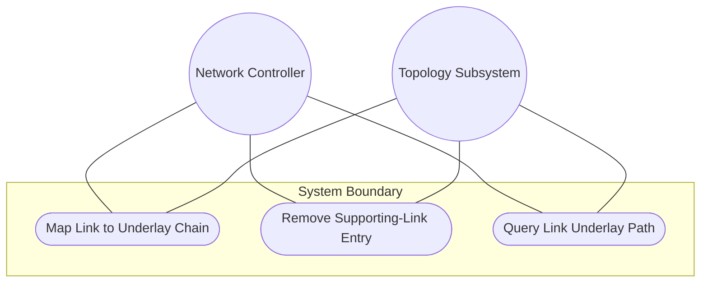
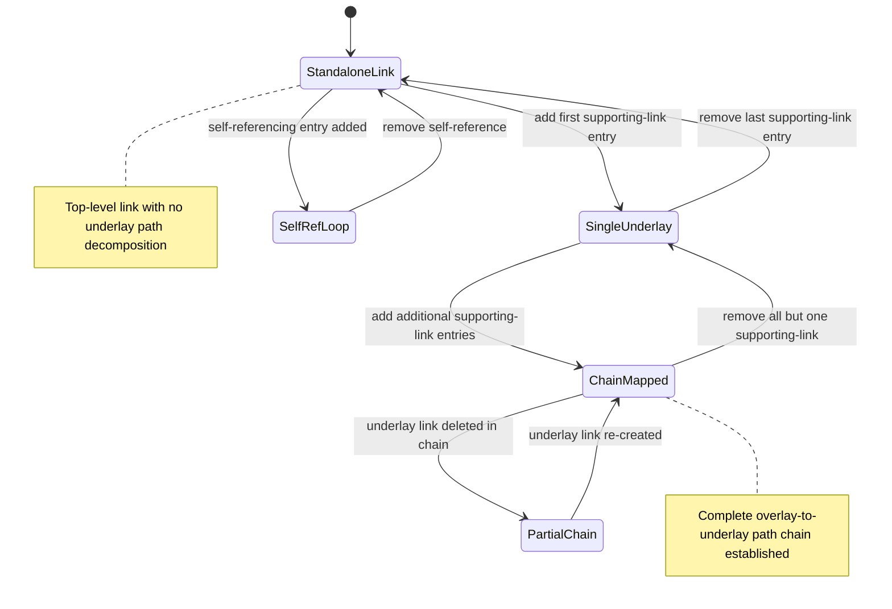

# Use Case: Map Overlay Link to Supporting Underlay Link Chain

## Parent Epic
- [ ] #125 - [ietf-network-topology: Base Network Topology Augmentation](https://github.com/gintatkinson/3dgs-033/blob/main/docs/epics/epic-09-ietf-network-topology.md) (supporting-link list for overlay-underlay link dependency chains, clause 4.2)

## 1. Actors
- **Primary Actor:** Network Controller
- **Secondary Actors:** IetfNetworkTopology Subsystem, TopologyReconciler

## 2. Preconditions
- An overlay `link` entry exists within a network with a valid `link-id`.
- The containing network has at least one `supporting-network` entry referencing an underlay network.
- The underlay network contains at least one link that can serve as a supporting link.

## 3. Trigger
A Network Controller adds a `supporting-link` entry mapping the overlay link onto one or more links in an underlay topology, representing a path-level layer dependency chain.

## 4. Main Success Scenario (Basic Flow)
1. Network Controller selects the overlay link and identifies the chain of underlay links that constitute the physical path.
2. Network Controller sends creation requests for each underlay link in the chain, each with the composite key of `network-ref` (underlay network) and `link-ref` (underlay link).
3. IetfNetworkTopology Subsystem validates that each `network-ref` resolves through the containing network's `supporting-network` chain and that composite keys are unique within the list.
4. IetfNetworkTopology Subsystem creates each `supporting-link` entry in the intended datastore.
5. IetfNetworkTopology Subsystem resolves all leafrefs: `network-ref` against the network-level supporting-network chain, and `link-ref` against the underlay network's link list.
6. IetfNetworkTopology Subsystem confirms the transitive closure from overlay link to the full underlay link chain is established.

## 5. Alternate and Exception Flows
- **5a. Duplicate Composite Key Rejection (Branches from Basic Flow step 3):**
  1. Network Controller attempts to add a `supporting-link` entry with an existing `network-ref` and `link-ref` pair.
  2. IetfNetworkTopology Subsystem detects the duplicate composite key and rejects the operation.

- **5b. Dangling Underlay Link Reference (Branches from Basic Flow step 5):**
  1. One of the `link-ref` values references an underlay link that has been deleted.
  2. IetfNetworkTopology Subsystem accepts the configuration in the intended datastore due to `require-instance false`.
  3. The affected entry is excluded from the operational state datastore until the underlay link is re-created.

- **5c. Self-Reference Loop Detection (Branches from Basic Flow step 2):**
  1. Network Controller attempts to add a `supporting-link` entry where `link-ref` equals the overlay link's own `link-id`.
  2. IetfNetworkTopology Subsystem accepts the configuration at the schema level.
  3. The self-referencing supporting-link is flagged as logically invalid, creating a reference loop in the layering hierarchy.

- **5d. Partial Underlay Chain Deletion (Branches from Basic Flow step 6):**
  1. One link in the underlay chain is deleted due to topology churn.
  2. IetfNetworkTopology Subsystem excludes only the supporting-link entry referencing the deleted link from operational state.
  3. The remaining supporting-link entries in the chain stay operational.
  4. The overlay link is partially supported with a gap in its underlay chain.

- **5e. Multiple Supporting-Link Chains (Branches from Basic Flow step 2):**
  1. Network Controller adds multiple `supporting-link` entries from different underlay networks.
  2. IetfNetworkTopology Subsystem validates each entry separately against its respective underlay network.
  3. The overlay link maps onto links in multiple underlay topologies simultaneously.

- **5f. Standalone Link With No Underlay Dependencies (Branches from Basic Flow step 1):**
  1. Network Controller queries a link with an empty `supporting-link` list.
  2. IetfNetworkTopology Subsystem returns no entries.
  3. The link is identified as a top-level link with no underlay path decomposition.

## 6. Postconditions (Guarantees)
- **Success Guarantee:** The overlay link maps onto one or more underlay links via the supporting-link chain, all references resolve in both datastores, and transitive closure is established.
- **Failure Guarantee:** If any entry is a duplicate or the network-ref chain is inconsistent, no entry is created; the overlay link's supporting-link list retains its previous state.

## UML Diagrams
### Use Case Diagram

### State Machine Diagram

## 7. Operational Context
From the IETF Network Topologies YANG Data Model specification, Section 4.2 (Base Network Topology Data Model):

"Similar to a node, a link can map onto one or more links (which are terminated by the corresponding underlay termination points) in an underlay topology. This is captured in the list 'supporting-link'."

From the IETF Network Topologies YANG Data Model specification, Section 4.4.2 (Underlay Hierarchies and Mappings):

"It is possible for links at one level of a hierarchy to map to multiple links at another level of the hierarchy. For example, a VPN topology might model VPN tunnels as links. Where a VPN tunnel maps to a path that is composed of a chain of several links, the link will contain a list of those supporting links."

From the ietf-network-topology YANG module, link-ref description (line 229): "Reference loops in which a link identifies itself as its underlay, either directly or transitively, are not allowed."

## 8. Realization Matrix
### Required User Stories
- [ ] #140 - [Map Overlay Links to Supporting Links Across Layered Topologies](https://github.com/gintatkinson/3dgs-033/blob/main/docs/user-stories/us-53-map-overlay-links-to-supporting-underlay-links.md) (the supporting-link list is the direct mechanism for mapping overlay links onto underlay link chains)
- [ ] #141 - [Resolve Supporting Termination Point Mappings via Transitive Closure](https://github.com/gintatkinson/3dgs-033/blob/main/docs/user-stories/us-54-resolve-supporting-termination-point-via-transitive-closure.md) (the supporting-link chain is the primary source for transitive termination point mapping inference)
- [ ] #142 - [Reconcile Overlay Topology When Underlay Network Is Deleted](https://github.com/gintatkinson/3dgs-033/blob/main/docs/user-stories/us-55-reconcile-overlay-topology-on-underlay-network-deletion.md) (supporting-link entries are excluded when the underlay network containing the referenced link is deleted)
- [ ] #143 - [Reconcile Overlay Topology When Underlay Nodes or Links Change](https://github.com/gintatkinson/3dgs-033/blob/main/docs/user-stories/us-56-reconcile-overlay-topology-on-underlay-entity-churn.md) (supporting-link entries are surgically excluded when their referenced underlay link entity is deleted)

### Required Features
- [ ] #135 - [Define Supporting Link List](https://github.com/gintatkinson/3dgs-033/blob/main/docs/features/feat-47-supporting-link-list.md) (the supporting-link list is the structural entity this use case manages for link-level underlay chain mapping)

## Source References
Structural Schema: [ietf-network-topology@2018-02-26.yang](https://github.com/YangModels/yang/blob/main/standard/ietf/RFC/ietf-network-topology%402018-02-26.yang) (Clause: 6.2, lines 205-231)
Normative Specification: [the IETF Network Topologies YANG Data Model specification](https://datatracker.ietf.org/doc/rfc8345/) (Clause: 4.2, 4.4.2)
