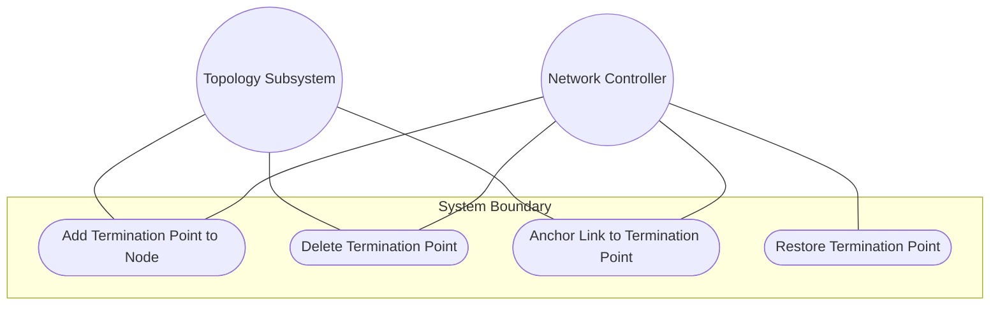
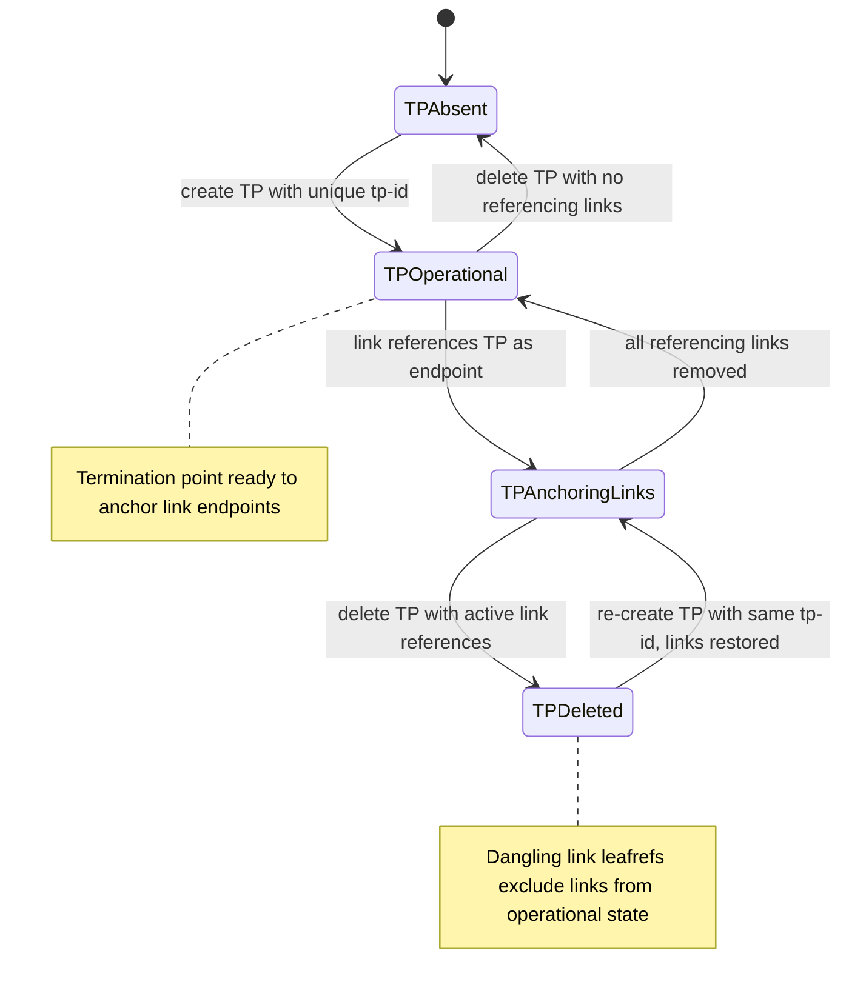

# Use Case: Manage Termination Point Lifecycle on a Node

## Parent Epic
- [ ] #125 - [ietf-network-topology: Base Network Topology Augmentation](https://github.com/gintatkinson/3dgs-033/blob/main/docs/epics/epic-09-ietf-network-topology.md) (augmented node termination points for link anchoring, clause 4.2)

## 1. Actors
- **Primary Actor:** Network Controller
- **Secondary Actors:** IetfNetworkTopology Subsystem, TopologyReconciler

## 2. Preconditions
- A `node` list entry exists within a network with a valid `node-id`.
- The `ietf-network-topology` module is loaded and has augmented the termination-point list into the node.
- The controller has authorization to create termination points on the target node.

## 3. Trigger
A Network Controller creates a termination point on a node to serve as an anchor for link endpoints, or deletes a termination point that is no longer needed.

## 4. Main Success Scenario (Basic Flow)
1. Network Controller identifies the target node by its `node-id` and sends a creation request with a unique `tp-id`.
2. IetfNetworkTopology Subsystem validates that `tp-id` is a valid URI and is not already in use within the target node.
3. IetfNetworkTopology Subsystem creates the `termination-point` entry augmented into the node with an empty `supporting-termination-point` list.
4. IetfNetworkTopology Subsystem confirms the termination point is visible at the augmented path in the intended datastore.
5. IetfNetworkTopology Subsystem resolves the entry in the operational state datastore.
6. Network Controller verifies the termination point appears with its tp-id and is ready to anchor link endpoints.

## 5. Alternate and Exception Flows
- **5a. Duplicate tp-id Within Same Node Rejection (Branches from Basic Flow step 2):**
  1. Network Controller attempts to create a termination point with a `tp-id` already in use within the target node.
  2. IetfNetworkTopology Subsystem detects the duplicate key and rejects the operation with a data-exists error.

- **5b. Same tp-id Across Different Nodes Permitted (Branches from Basic Flow step 2):**
  1. Network Controller creates a termination point with the same `tp-id` used in a different node.
  2. IetfNetworkTopology Subsystem accepts the creation since termination point identity is scoped to the containing node.

- **5c. Termination Point Deletion With Active Links (Branches from Basic Flow step 6):**
  1. Network Controller deletes a termination point that is referenced as `source-tp` or `dest-tp` by one or more links.
  2. IetfNetworkTopology Subsystem removes the termination point from the node.
  3. All links whose `source-tp` or `dest-tp` leafrefs pointed at the deleted termination point have dangling references.
  4. IetfNetworkTopology Subsystem excludes all affected links from the operational state datastore.

- **5d. Link Anchoring to Termination Point (Branches from Basic Flow step 6):**
  1. Network Controller creates a link and references the termination point as a `source-tp` or `dest-tp`.
  2. IetfNetworkTopology Subsystem resolves the leafref.
  3. The link is anchored to the termination point, connecting the topology graph edge to the node's connection point.

- **5e. Termination Point Re-Creation Restoring Links (Branches from Basic Flow step 5):**
  1. A termination point that was previously deleted and caused link exclusions is re-created with the same `tp-id`.
  2. IetfNetworkTopology Subsystem resolves the previously dangling leafrefs.
  3. All affected links are restored to the operational state datastore with their endpoint references resolved.

- **5f. Supporting-TP List Population (Branches from Basic Flow step 5):**
  1. IetfNetworkTopology Subsystem identifies overlay underlay dependencies at the link and node levels.
  2. IetfNetworkTopology Subsystem populates the `supporting-termination-point` list of the termination point via transitive closure from the supporting-link chain.
  3. Network Controller verifies the termination point carries both base attributes and inferred underlay TP mappings.

## 6. Postconditions (Guarantees)
- **Success Guarantee:** The termination point is created with a unique `tp-id` scoped to the node, is visible in both datastores, and is ready to serve as a link endpoint anchor.
- **Failure Guarantee:** If creation fails, no partial termination point state is persisted; if deletion causes link reference cascades, affected links are excluded from operational state but preserved in intended.

## UML Diagrams
### Use Case Diagram

### State Machine Diagram

## 7. Operational Context
From the IETF Network Topologies YANG Data Model specification, Section 4.2 (Base Network Topology Data Model):

"A node has a list of termination points that are used to terminate links. An example of a termination point might be a physical or logical port or, more generally, an interface."

"Like a node, a termination point can in turn be supported by an underlying termination point, contained in the supporting node of the underlay network."

From the ietf-network-topology YANG module (lines 239-243): "A termination point can terminate a link. Depending on the type of topology, a termination point could, for example, refer to a port or an interface."

## 8. Realization Matrix
### Required User Stories
- [ ] #141 - [Resolve Supporting Termination Point Mappings via Transitive Closure](https://github.com/gintatkinson/3dgs-033/blob/main/docs/user-stories/us-54-resolve-supporting-termination-point-via-transitive-closure.md) (termination points anchor link endpoints and their underlay mappings are the target of transitive closure computation)
- [ ] #144 - [Handle Link Reference Integrity on Termination Point Deletion Cascade](https://github.com/gintatkinson/3dgs-033/blob/main/docs/user-stories/us-57-handle-link-reference-integrity-on-termination-point-deletion.md) (termination points anchor links and their deletion triggers the cascade that excludes dependent links from operational state)

### Required Features
- [ ] #136 - [Define Termination Point List](https://github.com/gintatkinson/3dgs-033/blob/main/docs/features/feat-48-termination-point-list.md) (the termination-point list is the structural entity this use case creates and manages as link anchoring points on nodes)

## Source References
Structural Schema: [ietf-network-topology@2018-02-26.yang](https://github.com/YangModels/yang/blob/main/standard/ietf/RFC/ietf-network-topology%402018-02-26.yang) (Clause: 6.2, lines 234-293)
Normative Specification: [the IETF Network Topologies YANG Data Model specification](https://datatracker.ietf.org/doc/rfc8345/) (Clause: 4.2, 4.4.2)
