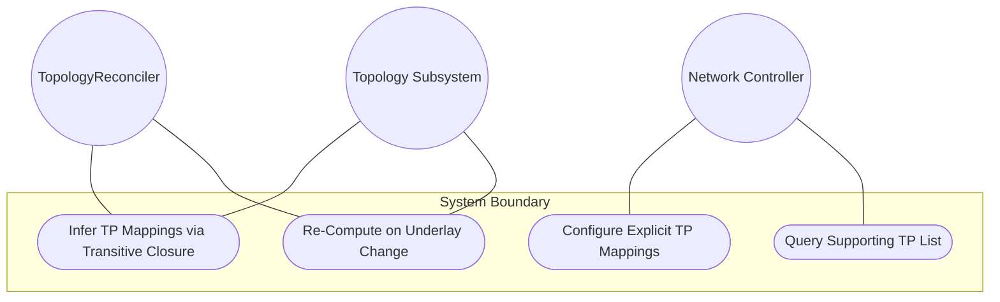
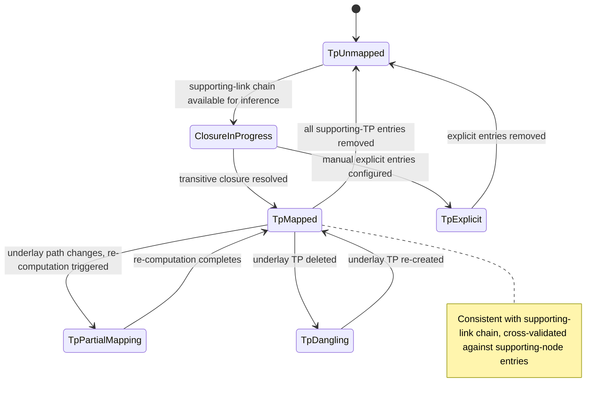

# Use Case: Resolve Supporting Termination Point Underlay Mappings

## Parent Epic
- [ ] #125 - [ietf-network-topology: Base Network Topology Augmentation](https://github.com/gintatkinson/3dgs-033/blob/main/docs/epics/epic-09-ietf-network-topology.md) (supporting-termination-point transitive dependency mapping, clause 4.2, 4.4.7)

## 1. Actors
- **Primary Actor:** TopologyReconciler
- **Secondary Actors:** IetfNetworkTopology Subsystem, Network Controller

## 2. Preconditions
- A `termination-point` entry exists on a node with a valid `tp-id`.
- The parent node has at least one `supporting-node` entry referencing an underlay node.
- The containing network has established supporting-link and supporting-node chains to an underlay topology.

## 3. Trigger
The IetfNetworkTopology Subsystem computes transitive closure from the supporting-link chain and supporting-node references to infer or directly populate the `supporting-termination-point` list for a termination point.

## 4. Main Success Scenario (Basic Flow)
1. TopologyReconciler identifies a termination point on an overlay node that anchors a link with a supporting-link chain.
2. IetfNetworkTopology Subsystem traverses the supporting-link chain to identify all underlay links in the path.
3. IetfNetworkTopology Subsystem for each underlay link end, identifies the underlay termination point that anchors the link in the underlay topology.
4. IetfNetworkTopology Subsystem cross-references the underlay termination point against the overlay node's supporting-node entries to validate the node-level mapping.
5. IetfNetworkTopology Subsystem populates the `supporting-termination-point` list with entries for each underlay termination point, using `network-ref`, `node-ref`, and `tp-ref` as the composite key.
6. TopologyReconciler verifies the supporting-termination-point list is consistent with the transitive closure derived from the link chain.

## 5. Alternate and Exception Flows
- **5a. Duplicate Composite Key Rejection (Branches from Basic Flow step 5):**
  1. The system attempts to add a `supporting-termination-point` entry with an existing `network-ref`, `node-ref`, and `tp-ref` triplet.
  2. IetfNetworkTopology Subsystem detects the duplicate composite key and rejects the addition.

- **5b. Dangling Underlay Termination Point Reference (Branches from Basic Flow step 6):**
  1. The referenced underlay termination point is deleted while the supporting-termination-point entry exists.
  2. IetfNetworkTopology Subsystem excludes the entry from the operational state datastore.
  3. The entry persists in the intended datastore until referential integrity is re-established.

- **5c. Inconsistent Mapping Chain (Branches from Basic Flow step 4):**
  1. The `network-ref` or `node-ref` in the supporting-termination-point entry does not resolve through the node-level supporting-node chain.
  2. IetfNetworkTopology Subsystem detects the broken reference hierarchy.
  3. The entry is excluded from operational state due to inconsistent cross-layer mapping.

- **5d. Transitive Closure Re-Computation on Underlay Path Change (Branches from Basic Flow step 6):**
  1. The underlay link chain supporting the overlay link changes due to topology reconfiguration.
  2. IetfNetworkTopology Subsystem re-computes the transitive closure from the updated supporting-link chain.
  3. Previously inferred supporting-termination-point entries that are no longer valid are removed.
  4. New supporting-termination-point entries for the updated underlay path are inferred and added.

- **5e. Explicit Manual Mapping Override (Branches from Basic Flow step 2):**
  1. Network Controller explicitly configures supporting-termination-point entries manually when no link chain is available for inference.
  2. IetfNetworkTopology Subsystem accepts the explicit entries.
  3. Any subsequently inferred mappings do not override the explicitly configured entries.

- **5f. Empty Supporting-Termination-Point List (Branches from Basic Flow step 1):**
  1. TopologyReconciler queries a termination point with no underlay dependencies.
  2. IetfNetworkTopology Subsystem returns an empty supporting-termination-point list.
  3. The termination point is identified as having no underlay TP mappings.

## 6. Postconditions (Guarantees)
- **Success Guarantee:** The supporting-termination-point list contains entries derived from transitive closure that are consistent with the link-level and node-level underlay dependencies, and all references resolve in both datastores.
- **Failure Guarantee:** If transitive closure cannot be computed or references are inconsistent, entries are excluded from operational state until the underlay topology is reconciled.

## UML Diagrams
### Use Case Diagram

### State Machine Diagram

## 7. Operational Context
From the IETF Network Topologies YANG Data Model specification, Section 4.4.7 (Mapping Redundancy):

"In a hierarchy of networks, there are nodes mapping to nodes, links mapping to links, and termination points mapping to termination points. Some of this information is redundant. Specifically, if the mapping of a link to one or more other links is known and the termination points of each link are known, the mapping information for the termination points can be derived via transitive closure and does not have to be explicitly configured."

From the ietf-network-topology YANG module (lines 249-260): "This list identifies any termination points on which a given termination point depends or onto which it maps. Those termination points will themselves be contained in a supporting node. This dependency information can be inferred from the dependencies between links. Therefore, this item is not separately configurable. Hence, no corresponding constraint needs to be articulated. The corresponding information is simply provided by the implementing system."

## 8. Realization Matrix
### Required User Stories
- [ ] #141 - [Resolve Supporting Termination Point Mappings via Transitive Closure](https://github.com/gintatkinson/3dgs-033/blob/main/docs/user-stories/us-54-resolve-supporting-termination-point-via-transitive-closure.md) (the supporting-termination-point list receives the inferred or explicitly configured underlay TP references from transitive closure computation)
- [ ] #142 - [Reconcile Overlay Topology When Underlay Network Is Deleted](https://github.com/gintatkinson/3dgs-033/blob/main/docs/user-stories/us-55-reconcile-overlay-topology-on-underlay-network-deletion.md) (supporting-TP entries are excluded when the chained underlay network reference becomes unresolvable)
- [ ] #143 - [Reconcile Overlay Topology When Underlay Nodes or Links Change](https://github.com/gintatkinson/3dgs-033/blob/main/docs/user-stories/us-56-reconcile-overlay-topology-on-underlay-entity-churn.md) (supporting-TP entries are surgically excluded when their referenced underlay termination point is deleted)

### Required Features
- [ ] #137 - [Define Supporting Termination Point List](https://github.com/gintatkinson/3dgs-033/blob/main/docs/features/feat-49-supporting-termination-point-list.md) (the supporting-termination-point list is the structural entity this use case populates via transitive closure or explicit configuration)

## Source References
Structural Schema: [ietf-network-topology@2018-02-26.yang](https://github.com/YangModels/yang/blob/main/standard/ietf/RFC/ietf-network-topology%402018-02-26.yang) (Clause: 6.2, lines 249-291)
Normative Specification: [the IETF Network Topologies YANG Data Model specification](https://datatracker.ietf.org/doc/rfc8345/) (Clause: 4.4.7)
