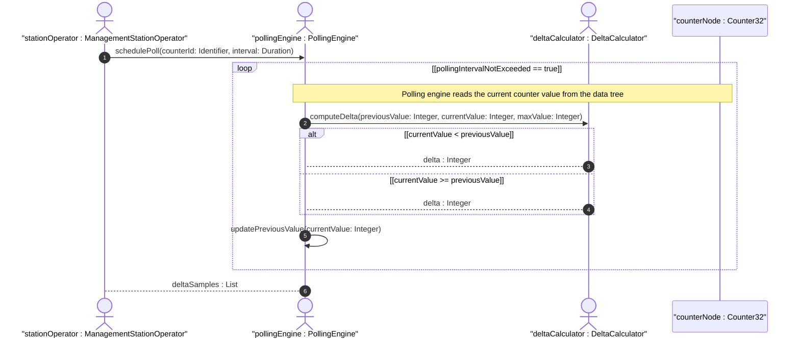

# User Story: Counter Wrap-Aware Delta Calculation Across Discontinuity Boundaries

## Parent Epic
- [ ] #11 - [ietf-yang-types: Core YANG Data Types](https://github.com/gintatkinson/3dgs-033/blob/main/docs/epics/epic-01-ietf-yang-types.md) (counters are core types within the ietf-yang-types module)

## Domain Object Mapping
- **Primary Domain Objects:** Counter32, Counter64, ZeroBasedCounter32, ZeroBasedCounter64
- **Actor/Role:** ManagementStationOperator — the entity polling counter values and computing deltas

## BDD Scenario (OOA/OOD Realization)
**As a** ManagementStationOperator
**I want to** compute the correct delta between two consecutive counter readings even when the counter has wrapped past its maximum value
**So that** the actual number of events recorded since the last poll is accurately derived from raw counter samples

**Given** a counter32 was read at time T1 with value 4294967290
**And** the same counter32 is read at time T2 with value 5
**When** the delta-calculation algorithm computes the difference
**Then** the correct delta is returned as 11 (accounting for the wrap at 4294967295)
**And** the wrap was detected because the current reading is strictly less than the previous reading

**Given** a zero-based-counter64 node was created at time T0 with initial value 0
**And** the application discovered the node within the minimum time-to-wrap
**When** the first sample is read at time T1 with value 5000
**Then** the initial value 0 can be used as the baseline delta
**And** the effective event count is 5000

**Given** a counter64 is polled and the time between polls exceeds the minimum time to wrap
**When** the delta-calculation cannot confirm whether zero, one, or multiple wraps occurred
**Then** the delta value is discarded as unreliable
**And** the management station logs a data-integrity warning

**Given** a counter32 that wraps multiple times between two polls
**When** the delta is computed without the minimum polling interval guarantee
**Then** the result is ambiguous and flagged as potentially unreliable

**Given** a zero-based-counter32 with a known creation time and polling interval
**When** the minimum wrap time for uint32 at the known increment rate is calculated and the polling interval is shorter than that minimum
**Then** the management station can reliably detect single-wrap boundaries

## UML Sequence Diagram


## Operational Context
> Counters have no defined 'initial' value, and thus, a single value of a counter has (in general) no information content. Discontinuities in the monotonically increasing value normally occur at re-initialization of the management system. (RFC 9911, Section 3)

> Provided that an application discovers a new data tree node using this type within the minimum time to wrap, it can use the 'initial' value as a delta. It is important for a management station to be aware of this minimum time and the actual time between polls, and to discard data if the actual time is too long or there is no defined minimum time. (RFC 9911, Section 3, zero-based-counter32)

## Required Features Matrix
- [ ] #1 - [Define Counter and Gauge Integer Types](https://github.com/gintatkinson/3dgs-033/blob/main/docs/features/feat-01-counter-gauge-types.md) (provides the counter32, counter64, zero-based-counter32, and zero-based-counter64 type definitions upon which delta calculation depends)
- [ ] #5 - [Define Time Tracking Types](https://github.com/gintatkinson/3dgs-033/blob/main/docs/features/feat-05-time-tracking-types.md) (timeticks type provides an alternative time-based counter with identical wrap arithmetic semantics)

## Source References
Structural Schema: [ietf-yang-types@2025-12-22.yang](https://github.com/YangModels/yang/blob/main/standard/ietf/RFC/ietf-yang-types%402025-12-22.yang) (Clause: typedef counter32, zero-based-counter32, counter64, zero-based-counter64)
Normative Specification: [RFC 9911](https://datatracker.ietf.org/doc/rfc9911/) (Clause: Section 3, counter types and zero-based-counter32 operational notes)

> [!WARNING]
> **Mermaid Block Closing Constraints & Code Fence Integrity:**
> - Every Mermaid diagram MUST be strictly closed with ``` ``` ``` on a new line. Leaking Mermaid blocks (e.g. having headings like `##` inside an unclosed diagram) or stray/unclosed code fences will fail downstream validation checks.
> - Ensure there are no stray backticks or unmatched code fences in the document.
> - **All Mermaid syntax constraints are defined in `rules/platform-independence.md` and MUST be observed in full** — including the prohibition on semicolons in `Note` and message text, colons in class members and note strings, stereotypes on relationship lines, and curly braces in class member lines. Do not maintain a local subset here; subsets drift (issue #289).
