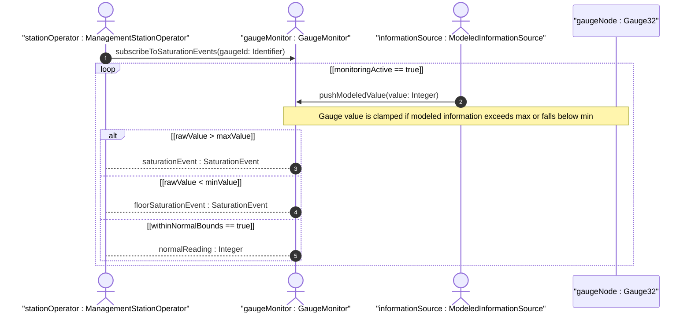

# User Story: Gauge Value Saturation Monitoring and Recovery from Boundary Clamping

## Parent Epic
- [ ] #11 - [ietf-yang-types: Core YANG Data Types](https://github.com/gintatkinson/3dgs-033/blob/main/docs/epics/epic-01-ietf-yang-types.md) (gauge types are core types within the ietf-yang-types module)

## Domain Object Mapping
- **Primary Domain Objects:** Gauge32, Gauge64
- **Actor/Role:** ManagementStationOperator — the entity monitoring gauge values for saturation conditions

## BDD Scenario (OOA/OOD Realization)
**As a** ManagementStationOperator
**I want to** detect when a gauge value has reached its saturation limit and when it has recovered back within the measurable range
**So that** I can distinguish between a true ceiling measurement and a measurement that has exceeded the gauge's dynamic range

**Given** a gauge32 with current value 75 and a modeled-information reading of 90
**When** the gauge32 is updated with the new information
**Then** the gauge value becomes 90 (normal range, no saturation)

**Given** a gauge32 with current value 4294967294 and a modeled-information reading exceeding 4294967295
**When** the gauge32 is updated with the new information
**Then** the gauge value is clamped at 4294967295 (maximum saturation)
**And** a saturation-flag is set to indicate the value has reached its ceiling

**Given** a gauge32 that is saturated at 4294967295 and the modeled information subsequently decreases to 4294967290
**When** the gauge32 is updated with the decreased reading
**Then** the gauge value recovers to 4294967290
**And** the saturation-flag is cleared

**Given** a gauge64 with current value 5 and a modeled-information reading dropping below 0
**When** the gauge64 is updated with the new information
**Then** the gauge value is clamped at 0 (minimum saturation)
**And** a floor-saturation-flag is set

**Given** a gauge32 that is saturated at minimum (0) and the modeled information subsequently increases to 10
**When** the gauge32 is updated with the increased reading
**Then** the gauge value recovers to 10
**And** the floor-saturation-flag is cleared

**Given** a gauge32 with current value 100 and the modeled information value of 200 (both within range)
**When** a management station polls the gauge
**Then** the gauge is reported as within-range with no saturation event

## UML Sequence Diagram


## Operational Context
> The gauge32 type represents a non-negative integer, which may increase or decrease, but shall never exceed a maximum value, nor fall below a minimum value. The maximum value cannot be greater than 2^32-1 (4294967295 decimal), and the minimum value cannot be smaller than 0. The value of a gauge32 has its maximum value whenever the information being modeled is greater than or equal to its maximum value, and has its minimum value whenever the information being modeled is smaller than or equal to its minimum value. If the information being modeled subsequently decreases below the maximum value, the gauge32 also decreases; likewise, if the information increases above the minimum value, the gauge32 also increases. (RFC 9911, Section 3)

## Required Features Matrix
- [ ] #1 - [Define Counter and Gauge Integer Types](https://github.com/gintatkinson/3dgs-033/blob/main/docs/features/feat-01-counter-gauge-types.md) (provides the Gauge32 and Gauge64 type definitions with their saturation semantics)

## Source References
Structural Schema: [ietf-yang-types@2025-12-22.yang](https://github.com/YangModels/yang/blob/main/standard/ietf/RFC/ietf-yang-types%402025-12-22.yang) (Clause: typedef gauge32, gauge64)
Normative Specification: [RFC 9911](https://datatracker.ietf.org/doc/rfc9911/) (Clause: Section 3, gauge32 and gauge64 typedefs)

> [!WARNING]
> **Mermaid Block Closing Constraints & Code Fence Integrity:**
> - Every Mermaid diagram MUST be strictly closed with ``` ``` ``` on a new line. Leaking Mermaid blocks (e.g. having headings like `##` inside an unclosed diagram) or stray/unclosed code fences will fail downstream validation checks.
> - Ensure there are no stray backticks or unmatched code fences in the document.
> - **All Mermaid syntax constraints are defined in `rules/platform-independence.md` and MUST be observed in full** — including the prohibition on semicolons in `Note` and message text, colons in class members and note strings, stereotypes on relationship lines, and curly braces in class member lines. Do not maintain a local subset here; subsets drift (issue #289).
